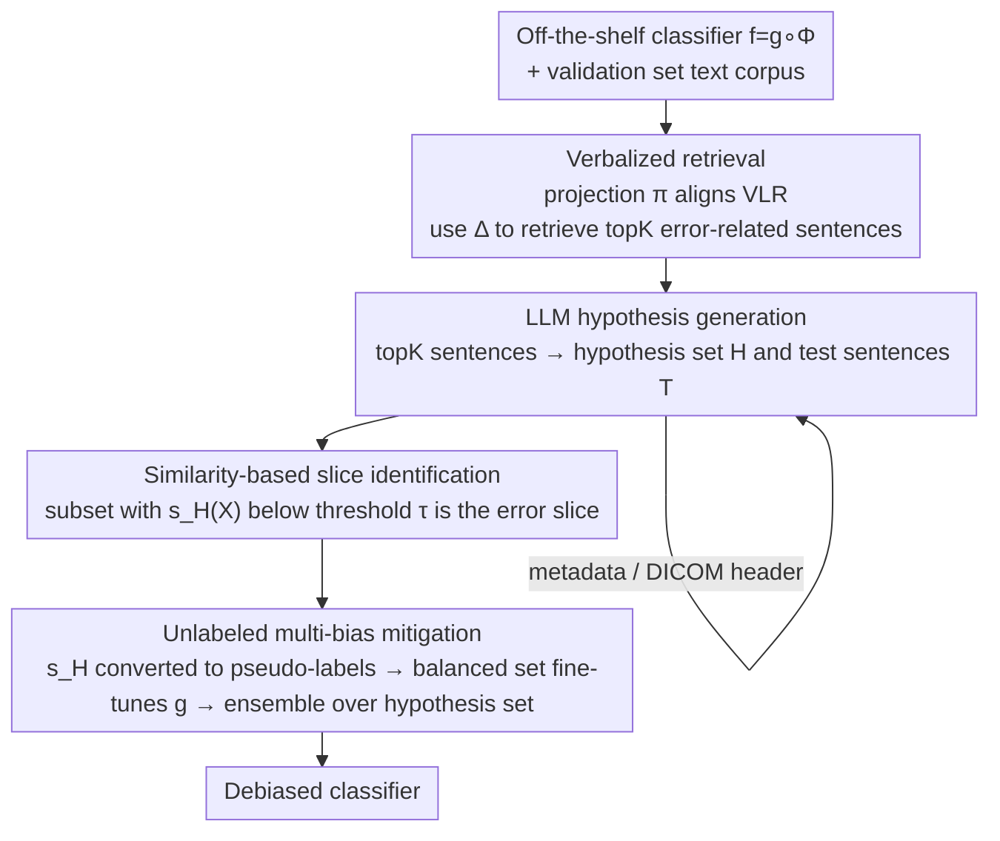

# LADDER: Language Driven Slice Discovery and Error Rectification in Vision Classifiers

**Conference**: ACL 2025  
**arXiv**: [2408.07832](https://arxiv.org/abs/2408.07832)  
**Code**: https://github.com/batmanlab/Ladder  
**Area**: Interpretability / Model Bias & Debiasing  
**Keywords**: Error slice discovery, bias mitigation, LLM reasoning, vision classifiers, pseudo-labeling

## TL;DR
LADDER "translates" the internal activations of pre-trained vision classifiers into natural language, retrieves error-related sentences, and leverages LLMs to reason out testable hypotheses regarding "which missing attributes cause the model to fail." This enables the discovery and mitigation of multiple biases in any off-the-shelf classifier without requiring any attribute annotations. It consistently outperforms baselines like Domino, Facts, and DFR across 6 natural/medical datasets and over 200 classifiers.

## Background & Motivation

**Background**: The goal of error slice discovery is to identify subsets of data (error slices) where pre-trained vision models systematically fail, thereby locating the shortcut biases the models rely on. Current mainstream methods (e.g., Domino, Facts, DrML, PRIME) first map images to a set of predefined attributes, or directly project images into a Vision-Language Representation (VLR) space for unsupervised clustering, and then test which attribute configurations correspond to high error rates.

**Limitations of Prior Work**: This paradigm has three key vulnerabilities. First, it is limited by a **predefined attribute vocabulary**, making it impossible to detect biases absent from the vocabulary. Second, it lacks **common-sense reasoning and domain knowledge**, rendering it virtually powerless in specialized fields like radiology—a simple tagging model cannot articulate fine-grained clinical biases such as "whether a pneumothorax patient has a chest tube." Third, they can only identify biases in image attributes, **completely ignoring biases introduced during preprocessing/data preparation stages** (such as photometric interpretation in DICOM headers). Additionally, DrML is restricted to probing CLIP-like multimodal models, and Facts relies on increasing weight decay to amplify spurious correlations (which deviates from standard training), meaning both impose specific training requirements on the model being probed.

**Key Challenge**: Biases are ubiquitous and often hidden in **unstructured text** (captions, metadata, radiology reports, DICOM headers). However, fixed attribute vocabularies and clustering lack the reasoning capabilities and domain knowledge required to capture these subtle and professional biases. Meanwhile, existing mitigation methods (GroupDRO, JTT, DFR) require expensive group annotations and focus solely on optimizing the worst-performing group, which can amplify errors in other groups.

**Goal**: To develop an automated framework starting from **any off-the-shelf pre-trained classifier** that, without requiring attribute annotations or prior knowledge of the types and quantities of biases, can: (1) discover coherent error slices, and (2) simultaneously mitigate multiple biases.

**Key Insight**: The authors hypothesize that **bias-inducing variables leave traces in linguistic forms** (e.g., logs, reports, metadata), and this unstructured text can be captured. LLMs happen to excel at complex relational reasoning over free-form text and possess latent domain knowledge.

**Core Idea**: Project the classifier's internal activations into the VLR space, retrieve sentences that distinguish "correctly classified vs. incorrectly classified" samples, and feed them to an LLM to reason and generate testable bias hypotheses. Then, use similarity scoring to map these hypotheses to specific image subsets. Essentially, **replace fixed attribute vocabularies and unsupervised clustering with language and LLM reasoning** to discover and rectify error slices.

## Method

### Overall Architecture
The input to LADDER is a **vision classifier pre-trained via ERM** $f = g \circ \Phi$ (where $\Phi$ is the representation layer and $g$ is the classification head) and a validation set text corpus $t_{val}$ (image captions or radiology reports). The output consists of a set of bias hypotheses and a debiased classifier. The entire pipeline is divided into three main stages: first, "verbalizing" model activations and retrieving error-related sentences; next, leveraging an LLM to summarize these sentences into testable hypotheses and mapping these hypotheses to concrete error slices using similarity scoring; finally, generating pseudo-labels for each hypothesis and applying ensemble fine-tuning to correct the corresponding biases. The entire process **requires no sample-level paired annotations, no manual prompts, and no prior knowledge of bias types or quantities**.

### Key Designs

**1. Verbalizing Model Activations: Retrieving "Error-Related Sentences" Using Representation Differences**

To leverage LLMs for reasoning about biases, the first step is to transform the internal states of the classifier into text that the LLM can comprehend, rather than having it guess out of thin air (e.g., HiBug prompts LLMs to guess without context, resulting in superficial keywords). LADDER first learns a projection function $\pi: \Phi \to \Psi^I$ to align the classifier representations with the image representations in the VLR space. Then, for a given class $Y$, it computes the **difference between the mean projected representations of correctly and incorrectly classified samples**:

$$\Delta^I = \mathbb{E}_{X,Y|f(X)=Y}[\pi(\Phi(X))] - \mathbb{E}_{X,Y|f(X)\neq Y}[\pi(\Phi(X))]$$

This difference vector approximately captures the key visual attributes that "correct classification depends on, but are missing or incorrectly represented in erroneous samples." A text encoder is then used to encode the corpus $t_{val}$ into $\Psi^T(t_{val})$, and the top-K sentences are retrieved based on their similarity to $\Delta^I$: $\texttt{topK} = \mathscr{R}(\langle \Delta^I, \Psi^T(t_{val})\rangle, t_{val})$. The beauty of this step is that it first projects the **classifier's own features** into the VLR space (preserving semantics from the classifier's perspective), unlike Domino/Facts, which directly project raw images for clustering—the latter discards classifier-specific semantics, leading to incoherent intra-slice attributes.

**2. LLM-Generated Testable Hypotheses and Similarity-Based Mapping to Error Slices**

Upon obtaining the top-K sentences, LADDER calls the LLM to output $\{\mathcal{H}, \mathcal{T}\} = \texttt{LLM}(\texttt{topK})$: $\mathcal{H}$ is a set of hypotheses regarding "attributes $f$ might rely on," and $\mathcal{T}$ is a validation set of sentences to test each hypothesis. Each hypothesis $H$ is paired with a set of validation sentences $\mathcal{T}_H$, which describe how the attribute manifests across various images from multiple perspectives. This step elevates "sentences" to "falsifiable bias propositions," which is precisely what fixed attribute vocabularies and clustering fail to achieve—LLM reasoning combined with latent domain knowledge can generate specialized biases like "loculated pneumothorax" or "calcification subtypes."

To implement this, LADDER computes the mean text embedding of validation sentences for each hypothesis: $\Psi^T(\mathcal{T}_H) = \frac{1}{|\mathcal{T}_H|}\sum_{t\in\mathcal{T}_H}\Psi^T(t)$. Then, for each image in class $Y$, a similarity score is computed: $s_H(X) = \langle \pi(\Phi(X)), \Psi^T(\mathcal{T}_H)\rangle$. Images with **scores below a threshold $\tau$** form the subset $\mathcal{S}_{Y,\neg H} = \{X \in \mathcal{X}_Y \mid s_H(X) < \tau\}$ (i.e., images "lacking this attribute"). If the error rate of this subset is significantly higher than the overall error rate of the class, it is identified as an error slice:

$$\hat{\mathbb{S}}_Y = \{\mathcal{S}_{Y,\neg H} \subseteq \mathcal{X}_Y \mid e(\mathcal{S}_{Y,\neg H}) \gg e(\mathcal{X}_Y),\ \exists H \in \mathcal{H}\}$$

In experiments, the criterion for an error slice is that the subset's error rate is at least 10% higher than the overall class error rate.

**3. Unsupervised Multi-Bias Mitigation: Pseudo-Labeling and Ensemble Debiasing**

Discovering biases is only half the battle; the key is to mitigate them without any manual attribute annotations. LADDER treats the similarity $s_H$ as a logit and converts it into a probability. A pseudo-label of 1 is assigned if the probability exceeds 0.5, and 0 otherwise. Thus, **each hypothesis automatically obtains a set of pseudo-labels**, eliminating the need for expensive manual annotation. Borrowing from DFR, a held-out validation set is then used to construct an **attribute-balanced dataset** for each pseudo-labeled attribute. Only the classification head $g$ is fine-tuned (while freezing the representation layer), yielding "one debiased model per hypothesis." During inference, $s_H(X)$ is recomputed, and the classification head corresponding to the hypothesis with the highest similarity is selected: $H^* = \arg\max_{H\in\mathcal{H}} s_H(X)$. This **ensemble-based** strategy allows it to correct multiple biases simultaneously, rather than focusing solely on the worst-performing group like GroupDRO/JTT/DFR, which often degrades other groups while fixing one.

**4. Going Beyond Captions: Metadata/DICOM Reasoning and Instruction-Tuned Models**

Many biases do not reside within the image content itself, but rather in the preprocessing or data preparation stages. LADDER formats each sample's metadata (e.g., age, acquisition view, presence of implants) and DICOM headers (e.g., photometric interpretation, VOI LUT) into a Python dictionary. It feeds this dictionary to the same LLM pipeline to generate hypotheses, which are then tested using ground-truth metadata. This detects biases completely absent from captions (e.g., a 19.5% accuracy gap between patients aged 70+ vs. others on RSNA, and a 10% gap across different photometric interpretations). On the other hand, to reduce reliance on human captions/reports, LADDER can leverage instruction-tuned models (e.g., LLaVA-1.5 7B for natural images, RaDialog/CheXagent for CXR) to automatically generate descriptions for correctly classified samples before feeding them into the same LLM pipeline.

### An Example: The "Chest Tube" Bias in NIH Pneumothorax Detection
Taking the pneumothorax class in NIH Chest-X-ray as an example: the classifier learns a shortcut of "predicting pneumothorax when seeing a chest tube," because pneumothorax patients in the training set are often already intubated with a chest tube. LADDER first uses $\Delta^I$ to retrieve sentences in reports where "chest tube" repeatedly appears. Based on this, the LLM proposes the hypothesis that "the model relies on the chest tube attribute." After scoring each image with $s_H$, it reveals that pneumothorax patients with a chest tube achieve ~98% accuracy, whereas **pneumothorax patients without a chest tube have an accuracy of only 31%**—the latter is automatically identified as the error slice. Subsequently, pseudo-labels are assigned for the presence/absence of a chest tube, and an attribute-balanced dataset is constructed to fine-tune the classification head, effectively removing this shortcut.

## Key Experimental Results

Datasets: 3 natural image datasets (Waterbirds, CelebA, MetaShift) + 3 medical imaging datasets (NIH Chest-X-ray, RSNA-Mammo, VinDr-Mammo). Probed models $f$: ResNet50 initialized with ImageNet1k for natural images/CXR, and EfficientNet-B5 for mammography. VLR: CLIP / CXR-CLIP / Mammo-CLIP. LLM: GPT-4o is used for main experiments. In total, the evaluation covers over 200 classifiers and 4 LLMs.

### Main Results: Bias Mitigation WGA (Worst Group Accuracy)
EN-B5 is used for mammography; RN Sup IN1k is used for the rest. Values represent the average of 3 random seeds.

| Method | Waterbirds | CelebA | NIH | RSNA | VinDr |
|------|-----------|--------|-----|------|-------|
| ERM | 69.1 | 62.2 | 60.3 | 69.8 | 45.6 |
| JTT | 84.5 | 87.2 | 70.4 | 68.5 | 66.1 |
| GroupDRO | 87.1 | 88.1 | 71.1 | 72.3 | 67.1 |
| CVaRDRO | 85.4 | 83.1 | 71.3 | 71.7 | 67.1 |
| LfF | 75.2 | 63.0 | 61.6 | 66.4 | 64.5 |
| DFR | 88.2 | 87.1 | 70.5 | 71.2 | 68.1 |
| **LADDER** | **91.4** | **88.9** | **76.2** | **76.4** | **82.5** |

LADDER achieves the highest WGA across all datasets: compared to DFR, it achieves improvements of 3.6% / 7.3% / 21.1% on Waterbirds / RSNA / VinDr respectively; on NIH, it outperforms JTT / DFR by 8.2% / 7.4%. Crucially, it does so **without requiring any expensive ground-truth shortcut attribute annotations**. In terms of the slice discovery metric Precision@10 on medical imaging datasets, LADDER outperforms baselines by approximately 50%.

### Ablation Study: Impact of Caption Generator on Performance (RN Sup IN1k)
Evaluating the final mitigation performance when feeding different caption sources into the pipeline.

| Caption Source | Waterbirds Mean Acc | Waterbirds WGA | CelebA Mean Acc | CelebA WGA |
|-------------|--------------------|----------------|-----------------|------------|
| BLIP | 93.1 | 91.4 | 89.8 | 88.9 |
| BLIP2 | 93.3 | 91.6 | 89.8 | 89.2 |
| ClipCap | 93.7 | 91.8 | 88.3 | 87.4 |
| **GPT-4o** | **94.2** | **93.1** | **91.4** | **90.3** |

Although GPT-4o is costly, it provides the best caption quality and achieves the highest WGA. However, even when replaced with open-source alternatives like BLIP/BLIP2/ClipCap, the performance degradation is remarkably limited, indicating the pipeline is not overly sensitive to the caption source.

### Key Findings
- **Slice coherence is the source of performance**: Domino/Facts directly project raw images into the VLR space for clustering, resulting in incoherent intra-slice attributes and inaccurate pseudo-labels. LADDER projects classifier representations first and then leverages LLMs to extract coherent attributes from reports, yielding more accurate pseudo-labels and superior mitigation.
- **Domain knowledge is crucial for medical imaging**: LADDER can discover fine-grained biases that require clinical expertise to identify, such as "loculated pneumothorax" and calcification subtypes. On CXR, retrieval-based pipelines utilizing real radiology reports outperform those using descriptions generated by CheXagent/RaDialog, demonstrating that professional reports are irreplaceable.
- **Cross-architecture and pre-training consistency**: LADDER consistently uncovers similar types of biases (e.g., repeatedly identifying water-related concepts like "ocean/lake/beach" on Waterbirds) across various architectures (ResNet50 vs. ViT) and pre-training schemes (SimCLR/Barlow Twins/DINO/CLIP). This confirms that ERM classifiers learn similar biases regardless of their underlying architecture.
- **Going beyond captions**: It uncovers age bias (a 19.5% gap between 70+ vs. others) and photometric interpretation bias (a 10% gap) directly from metadata/DICOM headers—biases completely absent from text captions.
- **Flying vs. non-flying**: Birds that fly vs. non-flying birds in Waterbirds exhibit an accuracy of 97.3% vs. 68.6%, intuitively demonstrating that LLM hypotheses successfully pinpoint authentic bias dimensions.

## Highlights & Insights
- **Bridging "Activations -> Text -> Hypotheses"**: Using the representation mean difference $\Delta^I$ between correct/incorrect samples to retrieve sentences translates uninterpretable internal activations into natural language that an LLM can reason over. This interface of "translating vision models for LLM consumption" is highly reusable and transferable to any scenario requiring LLM-based interpretation of black-box models.
- **Hypotheses as pseudo-labels**: Treating the similarity score $s_H$ directly as a logit to generate pseudo-labels elegantly bridges the gap between "bias discovery" and "bias mitigation," bypassing the annotation bottleneck. This trick can be applied to any debiasing pipeline that involves "subgroup discovery followed by balanced fine-tuning."
- **Zero intrusion to probed models**: It requires no specific training protocol (unlike Facts, which requires increased weight decay, or DrML, which is limited to CLIP). Any off-the-shelf ERM classifier can be audited. The authors position it as a "continuously running bias auditor"—as long as biases leave linguistic traces, they can be captured.
- **Surprisingly low costs**: Since the entire LLM pipeline only processes text instead of images, the total cost for the natural image experiments was only around $28.

## Limitations & Future Work
- **Dependency on captions/text**: It is difficult to apply in domains with sparse or missing textual descriptions (e.g., 2D mammography, dermatological imaging). Instruction-tuned models offer a workaround but remain limited in areas lacking robust VLMs.
- **Inheriting base model biases**: CLIP and LLMs inherently carry biases from their training data, which may affect the discovery process or even compromise fairness objectives—using biased tools to audit biases is inherently risky.
- **Unsupervised discovery phase**: To prevent introducing additional biases, the discovery phase is fully automated. However, handing off the validation stage to domain experts (e.g., clinicians) introduces subjectivity, and the standardization of validation workflows remains unresolved.
- **Personal observation**: The paper does not fully expand on the robustness regarding hyperparameters such as the error slice criterion (error rate > 10% higher), pseudo-labeling threshold (0.5), and similarity threshold $\tau$. The differing optimal top-K (200 for natural vs. 100 for medical) also suggests that this pipeline requires domain-specific tuning.

## Related Work & Insights
- **vs. Domino / Facts**: These works project **raw images** into the VLR space and perform clustering to find slices, which often results in incoherent intra-slice attributes. Furthermore, Facts relies on increasing weight decay, departing from standard training. LADDER projects the **classifier representations** and leverages LLMs to reason about coherent attributes, making the slices more reliable with zero requirements on the training protocol.
- **vs. DrML**: DrML utilizes modality gap geometry alongside user-defined prompts, making it applicable only to CLIP-like models while introducing human bias. LADDER is compatible with arbitrary architectures and eliminates the need for manual prompts.
- **vs. PRIME / B2T / HiBug**: PRIME relies on expensive tagging models and can only check for the presence of fixed attributes. B2T solely extracts keywords from captions. HiBug prompts LLMs to guess without data context, yielding only superficial keywords. LADDER leverages authentic textual contexts paired with LLM domain reasoning, successfully uncovering professional, fine-grained biases.
- **vs. GroupDRO / JTT / DFR**: These mitigation methods require group annotations and only optimize the worst group, which can amplify errors in other groups. LADDER uses pseudo-labels combined with ensemble debiasing, mitigating multiple biases simultaneously without annotations.

## Rating
- Novelty: ⭐⭐⭐⭐⭐ Reconceptualizes error slice discovery using "LLM reasoning + linguistic traces" and completely connects it to unsupervised multi-bias mitigation. The approach is both novel and self-consistent.
- Experimental Thoroughness: ⭐⭐⭐⭐⭐ Evaluated across 6 datasets, over 200 classifiers, 4 LLMs, and multiple architectures/pre-training schemes. It covers both natural and medical imaging with complete ablation studies.
- Writing Quality: ⭐⭐⭐⭐ Methods and motivations are clear, and mathematical formulations are well-standardized; some details (such as threshold/hyperparameter sensitivity) being relegated to the appendix slightly affects self-contained reading.
- Value: ⭐⭐⭐⭐⭐ Provides a low-cost, sustainable bias auditing and debiasing tool for any off-the-shelf model, showing high practical value in medical imaging scenarios.

<!-- RELATED:START -->

## Related Papers

- [\[NeurIPS 2025\] scPilot: Large Language Model Reasoning Toward Automated Single-Cell Analysis and Discovery](../../NeurIPS2025/computational_biology/scpilot_large_language_model_reasoning_toward_automated_single-cell_analysis_and.md)
- [\[ACL 2025\] Retrieve to Explain: Evidence-driven Predictions for Explainable Drug Target Identification](retrieve_to_explain_drug_target_identification.md)
- [\[ICML 2026\] Influence-Guided Symbolic Regression: Scientific Discovery via LLM-Driven Equation Search with Granular Feedback](../../ICML2026/computational_biology/influence-guided_symbolic_regression_scientific_discovery_via_llm-driven_equatio.md)
- [\[ACL 2025\] Concept Bottleneck Language Models For Protein Design](concept_bottleneck_language_models_for_protein_design.md)
- [\[ICML 2025\] GenMol: A Drug Discovery Generalist with Discrete Diffusion](../../ICML2025/computational_biology/genmol_a_drug_discovery_generalist_with_discrete_diffusion.md)

<!-- RELATED:END -->
