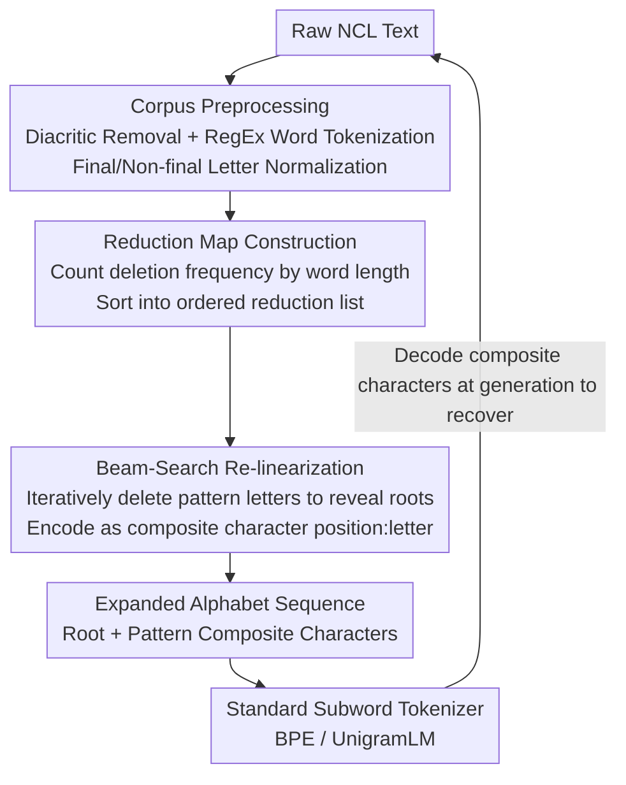

# Splintering Nonconcatenative Languages for Better Tokenization

**Conference**: ACL 2025  
**arXiv**: [2503.14433](https://arxiv.org/abs/2503.14433)  
**Code**: https://github.com/MeLeLBGU/Splintering  
**Area**: Pre-training / NLP  
**Keywords**: Subword Tokenization, Nonconcatenative Morphology, Hebrew, Root-and-Pattern, Pre-tokenization

## TL;DR
This paper proposes **Splinter**—a "pre-tokenization" step added prior to BPE/UnigramLM. By iteratively deleting characters, it rearranges words from languages with "root-in-template" structures like Hebrew, Arabic, and Malay into linearly splittable sequences. This enables standard tokenizers to segment roots into contiguous tokens, leading to improvements in both intrinsic metrics and downstream Hebrew tasks.

## Background & Motivation

**Background**: Inputs to modern LLMs still rely on subword tokenization (BPE, WordPiece, UnigramLM). These algorithms share a common assumption—that a word can be segmented into meaningful units (sequentially arranged prefixes, roots, and suffixes) via **contiguous linear splitting**. This assumption largely holds for "concatenative" languages like English.

**Limitations of Prior Work**: However, languages like Hebrew and Arabic are classic **nonconcatenative languages (NCLs)**, where meaningful units are interwoven. For instance, the root of the Hebrew verb $\langle l\text{'}bwd\rangle$ (la'avod, "to work") consists of the three consonants $\langle\text{'}bd\rangle$. Yet, they are **not contiguous** in the word—the pattern letters $\langle l\rangle$ and $\langle w\rangle$ are interspersed in between, splitting the root apart. When faced with such words, linear tokenizers can only perform rigid cuts. As a result, the same root (lemma) is segmented into completely distinct and morphologically incoherent tokens across different word forms, preventing the model from learning that "these words share a common origin." This degrades performance in downstream generation, translation, and QA. Malay and Georgian represent another form of disruption: **circumfixes or infixes** split the stem or the affix itself.

**Key Challenge**: Tokenizers require "meaningful units to be contiguous in the character string," whereas the morphology of NCLs is inherently "discontinuous." The issue lies not in the merging strategy of the tokenization algorithm itself, but rather in the **incorrect layout of the character sequences fed into it**.

**Goal**: To "re-linearize" NCL text so that roots occupy contiguous positions, without modifying any existing tokenizer implementations. Concurrently, several hard constraints must be met—the transformation must be **reversible** (reconstructible to the original text), applicable only to the target language, and effective for both large vocabularies (e.g., the monolingual DictaBERT 128K) and small vocabularies (e.g., multilingual models allocating only ~2.3K tokens to Hebrew, such as GPT-4o).

**Key Insight**: A key statistical regularity observed is that **patterns are far less numerous than roots**, meaning pattern letters tend to appear with high frequency at fixed positions. Empirically, for Hebrew and Arabic words of length > 3, there almost always exists a character deletion operation that transforms the current word into another **existing** word that retains the same root.

**Core Idea**: Constructing "pattern character deletion" as a series of reversible single-character deletions to iteratively strip a word down to its root, and then encoding each deletion as a **composite character** (letter + deleted index) to expand the alphabet. The word is thus rewritten into a linear sequence of "root + a set of pattern composite characters," enabling standard BPE to segment the root as a complete, contiguous token.

## Method

### Overall Architecture
Splinter is a **pre-tokenization** module that sits between the "raw text" and the "standard subword tokenizer." The entire pipeline consists of two phases: **offline map construction** and **online re-linearization**.

In the offline phase, a "**reduction map**" is compiled based on statistics from the target language corpus. Grouped by word length, the map records how many real, existing words can be generated by deleting a specific character at a certain index, sorted from highest to lowest frequency. During the online phase, each new word is processed by querying this map. Using a beam-search-style scoring tree, the algorithm iteratively selects the current optimal character deletion operation until the word is stripped down to 3 characters (≈ root). Each deletion is encoded as a composite character `position:letter`, converting the word into a new sequence of "root characters + several composite characters." This sequence, represented using the **expanded alphabet**, is fed directly into SentencePiece's BPE/UnigramLM. Tokenizer training and inference are performed entirely on this re-linearized sequence. During generation, the composite characters are decoded back into deletion operations to step-by-step reconstruct the original word, ensuring the entire process is **fully reversible**.

### Key Designs

**1. Single-Letter Reduction + Composite Character Encoding: Rearranging "Discontinuous Roots" into "Contiguous Roots"**

This serves as the foundation of the work, directly addressing the pain point where roots are fragmented by pattern letters, preventing linear tokenizers from contiguously segmenting them. The authors restrict the transformation to **single-letter reduction**: only one character is deleted at a time. The key insight is that pattern letters are more frequent and appear in more fixed positions than roots, meaning they are prioritized for deletion, eventually stripping the word down to its root. For example, deleting the $\langle w\rangle$ at index 3 of $\langle l\text{'}bwd\rangle$ yields the existing word $\langle l\text{'}bd\rangle$, and subsequently deleting $\langle l\rangle$ converges to the root $\langle\text{'}bd\rangle$.

To ensure **reversibility**, each deletion is not simply discarded but encoded as a composite character—the letter paired with its deleted index (e.g., deleting $\langle l\rangle$ at index 0 is recorded as `0:l`). These composite characters are added to the native alphabet of the language, rewriting the word into "remaining root characters + a set of composite characters." For example, $\langle l\text{'}bwd\rangle$ is eventually segmented by Splinter+BPE into two tokens: the pattern token `3:w,0:l` and the root token $\langle\text{'}bd\rangle$—the root becomes a complete, contiguous token for the first time. As an engineering detail, **negative indexing** is applied to characters in the second half of the word, which aligns well with suffix-based morphology and reduces the size of the expanded alphabet by approximately 15%.

**2. Reduction Map Construction: Deciding "Which Letter to Delete First" via Corpus Frequency**

Merely knowing "to delete letters" is insufficient; the question of "which index to delete at each step" must be addressed. This design scans the corpus offline to generate a sorted reduction map. Preprocessing is first performed: Hebrew diacritics are removed; words are segmented using the regular expression `\.|\s|\n|-|,|:|"|\(|\)`; words appearing fewer than 10 times or containing foreign characters are discarded; and final/non-final Hebrew letters are normalized to each other (e.g., normalizing the singular "to walk" $\langle hwlK\rangle$ and plural $\langle hwlkyM\rangle$ into a form that clearly preserves the root $\langle hlk\rangle$). This normalization step both strengthens root grouping and guarantees reversibility. Having obtained a "word $\rightarrow$ frequency" unigram dictionary, for each word $w_i$ of length $k \ge 4$ (4 is selected because Semitic roots typically consist of 3 consonants), all single-letter deletions $\{r_0,\dots,r_{k-1}\}$ are enumerated. Each deletion is scored based on the corpus frequency of the resulting word $w_i^{r_j}$ (scored 0 if the word does not exist). The scores are aggregated by word length $k$ and deletion operation $r$, and finally sorted into an ordered list of deletion operations ranked from highest to lowest frequency for each word length.

Afterward, the corpus is scanned once more for **calibration**: for each word, operations from the reduction map are attempted in descending order of frequency. Only the **first deletion that yields a real word** is recorded in a new frequency counter, while others are ignored. This step ensures that the highest-frequency deletions are prioritized, aligned with the goal of "deleting pattern letters first"—as pattern letters are high-frequency deletions that repeatedly occur at fixed positions.

**3. Beam-Search Re-linearization: Selecting the Optimal Deletion Path for Each Word During Inference**

Equipped with the sorted reduction map, a simple heuristic inspired by beam search is employed to process each word online. A scoring selection tree is constructed: the root is the complete word with a score of 1.0; each node selects the top-$b$ **highest-scoring available deletions** based on the reduction map. The score of a child node is the product of the deletion scores along its path. When the word length reaches a minimum value of 3 or the tree depth reaches $d$, the **first deletion of the highest-scoring path** is applied, and the entire process restarts with the new (shorter) word as the root until it is stripped to the root. The paper sets $b=d=3$. This prevents a purely greedy approach from getting stuck while producing high-quality re-linearization within a very small search budget. The resulting token sequence is completely transparent to the tokenizer and language model—they only see sequences over the expanded alphabet, treating training and inference identically.

### An Example: $\langle l\text{'}bwd\rangle$ "to work"
Take the word $\langle l\text{'}bwd\rangle$ (root $\langle\text{'}bd\rangle$, pattern $\langle l\_\_w\_\rangle$). Since word length 5 > 3, it enters the pipeline. Querying the reduction map, the beam tree finds that deleting $\langle w\rangle$ at index 3 yields the high-frequency real word $\langle l\text{'}bd\rangle$, which achieves the highest score $\rightarrow$ encoded as `3:w` and applied. The new word $\langle l\text{'}bd\rangle$ has length 4; deleting $\langle l\rangle$ at index 0 $\rightarrow$ encoded as `0:l`, yielding $\langle\text{'}bd\rangle$ of length 3, at which point the process terminates. The final sequence is `3:w` `0:l` + root $\langle\text{'}bd\rangle$. When fed into BPE with a vocabulary of 2K:

| Tokenizer | Segmentation Result | Root Intactness |
|--------|----------|--------------|
| Vanilla BPE | $\langle l\text{'}\rangle$ + $\langle bwd\rangle$ | No, root $\langle\text{'}bd\rangle$ is split in half |
| Splinter + BPE | Pattern `3:w,0:l` + Root $\langle\text{'}bd\rangle$ | Yes, root is isolated as a single token |

Similarly, the noun $\langle\text{.hy/swb}\rangle$ ("computation") is segmented by Vanilla BPE into $\langle\text{.h}\rangle$ + $\langle y/swb\rangle$, whereas Splinter segments it into the pattern `1:y,3:w` + the root $\langle\text{.h/sb}\rangle$. Once roots are contiguous, the model can generalize the same lemma across various morphological variants.

## Key Experimental Results

### Main Results

**Downstream Tasks (Hebrew BERT)**: Using the current SOTA DictaBERT as a baseline, a BERT-base model in which only the Splinter pre-tokenization was substituted is retrained using **identical corpora and training parameters**, followed by comparison under fine-tuning on three tasks. Note that the authors emphasize this serves as a **lower-bound estimate** (only pre-tokenization was modified, without tuning LM hyperparameters).

| Task | Metric | DictaBERT | Splinter | Change |
|------|------|-----------|----------|------|
| Question Answering (QA) | F1 | 72.9 | **74.4** | +1.5 |
| Question Answering (QA) | EM | 63.6 | **65.4** | +1.8 |
| Syntactic Parsing | LAS | 89.0 | 89.0 | No change |
| Prefix Segmentation | Acc | 99.1 | **99.3** | +0.2 (Error rate ↓ >20%) |

The improvement in QA is the most pronounced—Splinter enables the model to comprehend that "excavation (xafirato)" with a suffix variant and "excavations (xafirot)" in the question share the same root, thereby correctly answering questions that DictaBERT failed. Although prefix segmentation is nearly saturated (99%+), the error rate decreases by over 20%, demonstrating that the data-driven pattern-finding algorithm is highly effective at the character level. Syntactic parsing remains unchanged, suggesting that sentence-level tasks are less sensitive to character-level rearrangment.

**Intrinsic Metrics (Hebrew, Vocab 128K, HeDC4 Corpus)**: Cognitive plausibility (higher is closer to human judgment) and context coherence (Distinct Neighbors, lower is better) are key. Splinter outperforms vanilla methods across both tokenization algorithms.

| Tokenizer | Type | Cognitive Plausibility ↑ | Rényi Efficiency | Tokens/Word | Distinct Neighbors ↓ |
|--------|------|-------------|-----------|-----------|---------------------|
| BPE | Vanilla | 0.157 | 0.524 | 1.146 | 2674 |
| BPE | **Ours (Splinter)** | **0.179** | 0.527 | 1.165 | **2640** |
| UnigramLM | Vanilla | 0.151 | 0.505 | 1.162 | 2440 |
| UnigramLM | **Ours (Splinter)** | **0.171** | 0.485 | 1.176 | **2308** |

### Ablation Study

**Vocabulary Size Sensitivity (Hebrew BPE, HeDC4)**: The advantage in cognitive plausibility is particularly massive under **small vocabularies** (which corresponds to multilingual LLM scenarios where limited token budgets are allocated to NCLs), though compression efficiency (tokens/word, proportion of words with 4+ tokens, single-character token proportion) is consistently lowered by Splinter.

| Vocab | Type | Cognitive Plausibility ↑ | Tokens/Word ↓ | 4+ Token Words ↓ | Single-char Tokens ↓ |
|------|------|-------------|-----------|--------------|----------------|
| 128K | Vanilla | 0.157 | 1.146 | 0.53% | 6.00% |
| 128K | Ours (Splinter) | **0.179** | 1.165 | 0.98% | 6.81% |
| 2K | Vanilla | 0.149 | 2.137 | 7.44% | 25.90% |
| 2K | Ours (Splinter) | **0.207** | 2.270 | 11.57% | 33.32% |
| 800 | Vanilla | 0.102 | 2.543 | 16.03% | 37.70% |
| 800 | Ours (Splinter) | **0.182** | 2.890 | 28.70% | 54.37% |

**Cross-lingual Generalization (BPE, Wikipedia Corpora for each language)**: Splinter's cognitive and coherence advantages hold across Hebrew, Arabic, and Malay at a 2K vocabulary size, though also at the expense of compression efficiency.

| Language | Vocab | Type | Tokens/Word ↓ | 4+ Token Words ↓ | Distinct Neighbors ↓ |
|------|------|------|-----------|--------------|---------------------|
| Hebrew | 2K | Vanilla | 2.149 | 9.22% | 1853 |
| Hebrew | 2K | Ours (Splinter) | 2.306 | 13.65% | **1805** |
| Arabic | 2K | Vanilla | 2.117 | 11.25% | 1824 |
| Arabic | 2K | Ours (Splinter) | 2.276 | 16.70% | **1784** |
| Malay | 2K | Vanilla | 2.150 | 14.65% | 1215 |
| Malay | 2K | Ours (Splinter) | 2.724 | 28.79% | 1055 |

### Key Findings
- **The smaller the vocabulary, the larger Splinter's advantage**: The gap in cognitive plausibility between Splinter and Vanilla peaks at vocabularies of 800/1K/2K (e.g., 0.182 vs. 0.102 at vocab 800). This perfectly aligns with the real-world scenario where multilingual LLMs allocate only ~1K–2K tokens to NCLs. Conversely, under a large 128K vocabulary, the advantage in contextual coherence on Wikipedia almost vanishes or is even slightly surpassed by the baseline.
- **Compression efficiency is the trade-off**: Across all corpora, algorithms, vocabulary sizes, and languages, Splinter consistently **reduces** compression efficiency (leading to higher tokens/word, higher ratio of 4+ token words, and higher ratio of single-character tokens). This implies that a generative LM must perform more decoding iterations to output the same text, raising computational costs—a trade-off that must be weighed in deployment.
- **Significant vocabulary divergence**: Even at the maximum 128K vocabulary size, the intersection rate between Splinter and Vanilla vocabularies remains under 75%. Linear extrapolation suggests a vocabulary size of ~780K is required to exceed an 85% overlap, proving that Splinter produces a fundamentally different vocabulary rather than merely handling outlier cases.
- **Almost identical Rényi efficiency**: The authors explicitly note that Rényi efficiency can be inflated and does not necessarily correlate with downstream performance. They emphasize the necessity of evaluating via comprehensive multi-metrics rather than over-relying on a single compression metric.

## Highlights & Insights
- **Transforming morphological issues into "alphabet engineering"**: Without changing the tokenizer or model architecture, adding a single layer of reversible character rearrangement at the input pushes the nonconcatenative bottleneck back into standard BPE pipelines. This plug-and-play preprocessing paradigm is highly transferable to any existing tokenizer ecosystem.
- **Clever encoding with the `position:letter` composite character**: It simultaneously addresses three challenges—ensuring reversibility, making pattern information explicit, and placing roots in contiguous slots. The negative indexing trick further shaves off ~15% of the alphabet size, demonstrating solid engineering design.
- **Targeting small-vocabulary scenarios**: The authors astutely point out that multilingual LLMs allot only ~1–2K tokens to low-resource NCLs, which is precisely where Splinter yields the most substantial gains, marking a highly spot-on positioning.
- **Honest acknowledgment of trade-offs**: Explicitly stating that compression efficiency deteriorates, syntactic tasks show no improvement, and the coherence advantage fades at large vocabularies. Such scientific restraint renders the conclusions far more credible.

## Limitations & Future Work
- **Degraded compression efficiency** is a critical drawback, making it less friendly to the inference cost of generative LLMs. Downstream tasks were evaluated only on BERT (an encoder-only model), missing end-to-end cost evaluation on generative models.
- Downstream tasks **only evaluated Hebrew**, whereas Arabic and Malay only have intrinsic metrics without downstream verification. Evaluated tasks focus on QA, syntax, and segmentation, lacking coverage of translation or long-text generation.
- The performance advantage depends heavily on vocabulary size. The weak or even reversed intrinsic gains on large vocabularies (128K) indicate this method is better suited for a "small vocabulary + single NCL" setting.
- The reduction map heavily relies on corpus frequencies. Robustness on low-resource, colloquial, or historical texts (characterized by massive variations and sparse frequencies) remains unverified. Extensive Hebrew-specific preprocessing rules (such as final letter normalization) also constrain out-of-the-box generalizability.
- Future Directions: Joint tuning of LM hyperparameters + Splinter on generative LLMs (as the current results are deemed a lower bound), adaptive selection of beam parameters $b$ and $d$, expanding to more nonconcatenative languages, and completing downstream evaluations.

## Related Work & Insights
- **vs. Vanilla BPE / UnigramLM**: Standard subword tokenization assumes contiguous linear segmentation, leaving roots split open by patterns in NCLs. Splinter does not replace them but inserts a re-linearization layer ahead, enabling standard tokenizers to work as usual but with the "correct" input layout.
- **vs. Morphological Tokenizers (Rule-based Root-and-Pattern segmentation)**: Traditional approaches often require linguistic rules or morphological analyzers, are not always reversible, and struggle to integrate with off-the-shelf tokenizers. Splinter is **data-driven, fully reversible, and plug-and-play**, independent of manual morphological annotations.
- **vs. Directly Expanding Vocabulary Size**: The authors use vocabulary intersection experiments to demonstrate that inflating vocabulary size (requiring ~780K to reach 85% overlap) is far less cost-effective than rearranging input characters, fundamentally questioning the assumption that "large vocabularies automatically solve NCL issues."

## Rating
- Novelty: ⭐⭐⭐⭐⭐ Elegant and novel approach that rearranges nonconcatenative morphology into standard tokenization workflows using reversible single-character deletion + composite characters.
- Experimental Thoroughness: ⭐⭐⭐⭐ Highly comprehensive intrinsic metrics covering 3 languages × 2 algorithms × 7 vocabularies, but downstream tasks are limited to Hebrew BERT and lack generative model validation.
- Writing Quality: ⭐⭐⭐⭐⭐ Examples are well-integrated throughout, trade-offs are candidly addressed, and metric explanations are clear, allowing readers to fully reproduce the methodology.
- Value: ⭐⭐⭐⭐ Yields substantial, plug-and-play value for low-resource nonconcatenative languages, especially within the constrained token budget of multilingual LLMs.

<!-- RELATED:START -->

## Related Papers

- [\[ACL 2025\] Adversarial Tokenization](adversarial_tokenization.md)
- [\[ACL 2025\] Incorporating Domain Knowledge into Materials Tokenization](incorporating_domain_knowledge_into_materials_tokenization.md)
- [\[ACL 2025\] Between Circuits and Chomsky: Pre-pretraining on Formal Languages Imparts Linguistic Biases](between_circuits_chomsky.md)
- [\[ACL 2025\] Retrofitting Large Language Models with Dynamic Tokenization](retrofitting_large_language_models_with_dynamic_tokenization.md)
- [\[ACL 2025\] Byte Latent Transformer: Patches Scale Better Than Tokens](byte_latent_transformer.md)

<!-- RELATED:END -->
