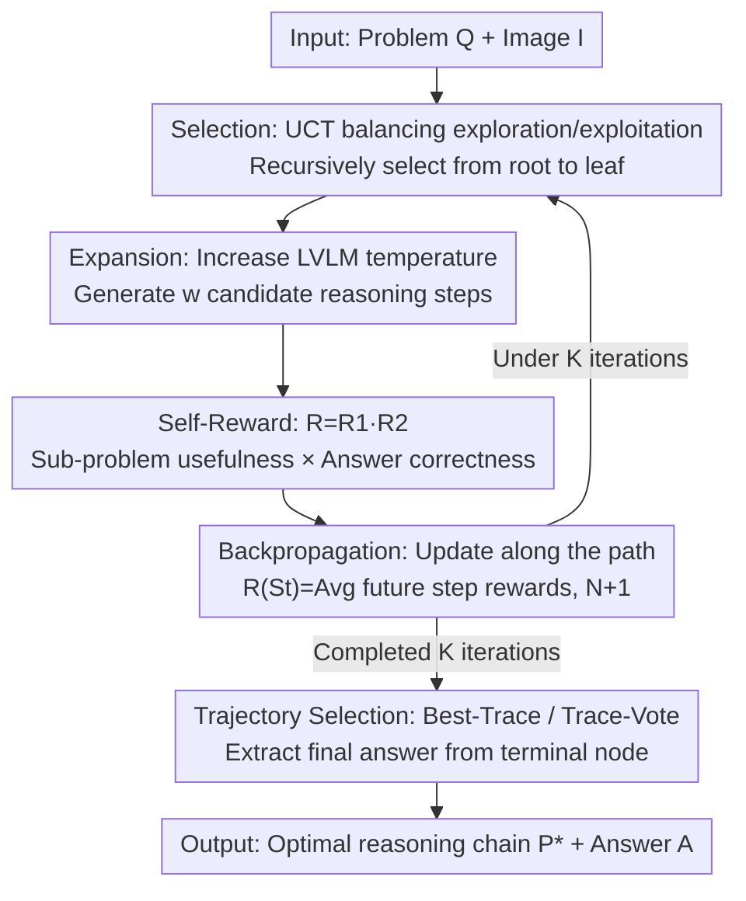

# VReST: Enhancing Reasoning in Large Vision-Language Models through Tree Search and Self-Reward Mechanism

**Conference**: ACL 2025  
**arXiv**: [2506.08691](https://arxiv.org/abs/2506.08691)  
**Code**: https://github.com/GaryJiajia/VReST  
**Area**: Multimodal VLM  
**Keywords**: Vision-Language Models, Multimodal Reasoning, Monte Carlo Tree Search, Self-Reward, Test-Time Scaling

## TL;DR
VReST applies Monte Carlo Tree Search (MCTS) to Large Vision-Language Models (LVLMs) for multimodal mathematical reasoning: each tree node represents a reasoning step, each path represents a complete reasoning chain, and a multimodal self-reward mechanism that **does not introduce any additional models** is used to score each step. This systematically explores the reasoning space without training, achieving SOTA on three multimodal mathematical reasoning benchmarks and validating that the test-time scaling law also holds for multimodal tasks.

## Background & Motivation

**Background**: Chain-of-Thought (CoT) prompting has been proven to significantly improve the performance of Large Language Models (LLMs) on complex reasoning, with OpenAI o1 further demonstrating the potential of "ultra-long CoT + inference-time scaling." Many works have migrated the CoT paradigm to LVLMs to enhance their multimodal reasoning capabilities, using methods such as adding scene graphs, key image regions, decomposing problems into sub-problems (DDCoT), or treating LVLMs as multi-expert agents (Cantor).

**Limitations of Prior Work**: These multimodal CoT methods are essentially **greedy** generators of a single reasoning chain—with a limited number of intermediate steps and no assessment or correction mechanisms after generation. Consequently, they yield minimal improvement on truly difficult visual math problems, even leading to an embarrassing phenomenon: on complex visual math tasks like MathVista / MathVision / CharXiv, **multimodal CoT actually underperforms Direct Query-Answering (Direct QA)** (e.g., on MathVista, CoT 54.60% < QA 55.70%).

**Key Challenge**: To improve LVLM reasoning, one path is to construct large-scale LVLM reasoning datasets and train models, which is expensive and hard to scale; the other path (proven effective in text-only LLMs) is to use MCTS to expand the reasoning space **without training**. However, the soul of MCTS is its reward function—to ensure a "fair comparison with baselines without introducing extra models," one cannot simply plug in a pre-trained reward model as in text-only domains. Meanwhile, under multimodal scenarios, the reward must incorporate **visual information**; otherwise, the model's judgment on charts or geometry diagrams becomes baseless.

**Goal**: (1) Extend MCTS to LVLMs to automatically generate deeper, higher-quality reasoning chains; (2) Design a self-reward mechanism that **uses only the LVLM itself, without introducing extra reward models**, and integrates visual information; (3) Validate the test-time scaling law on multimodal tasks.

**Key Insight**: The authors noticed that since the LVLM itself can judge whether "sub-problems are useful" or whether "answers are correct," it can **serve as its own reward model**. The probability of the first token being "Yes" can be used as the scoring signal, which maintains the fairness of the training-free comparison while naturally conditioning on the image.

**Core Idea**: Replace "single-chain greedy CoT" with "MCTS tree search + LVLM self-reward" to solve multimodal reasoning, upgrading local optimal reasoning to a systematic exploration of the entire reasoning space.

## Method

### Overall Architecture
Given a problem $Q$ and an image $I$, the goal is to find an optimal reasoning chain $\mathcal{P}^{*}$ leading to the correct answer $A$. A reasoning chain is denoted as $\{Q, S_1, S_2, \dots, S_n\}$, where each step $S_i$ contains a sub-problem $Q_i$ and a corresponding sub-answer $A_i$. VReST models the search for this chain as a tree: **the root node is the original problem $Q$, each node is a reasoning step $S_i$, each edge represents the transition between steps, and each path from root to leaf represents a complete reasoning chain**.

The overall process is a standard MCTS rollout iteration, repeated $K$ times: **Selection → Expansion → Rewarding → Backpropagation**. During the expansion phase, the LVLM is called to generate new reasoning steps; during the rewarding phase, the self-reward mechanism scores the new steps; after $K$ rollouts, a trajectory selection strategy (Best-Trace / Trace-Vote) is used to select the final reasoning chain from the entire tree, and the final answer is extracted from its terminal node. The entire process does not train any parameters, only calling the same LVLM repeatedly at inference time.

### Key Designs

**1. MCTS Four-Step Iteration: Upgrading single-chain greedy to systematic search of reasoning space**

Addressing the limitation where "existing multimodal CoT greedily generates a single chain with limited steps and cannot be corrected," VReST models reasoning as a tree and runs the four-step MCTS loop. In the **Selection** phase, starting from the root node, it recursively selects down to the leaf node using the UCT formula:

$$UCT(v) = R(v) + c\sqrt{\frac{\ln N(p(v))}{N(v)}}$$

Where $R(v)$ is the node reward, $N(v)$ is the visit count, $p(v)$ is the parent node, and $c$ is the exploration constant. The first term favors known high-scoring nodes (exploitation), and the second term favors less-visited nodes (exploration). In the **Expansion** phase, with $\mathcal{P}_{t-1}=[Q, S_1, \dots, S_{t-1}]$ as the prompt, the temperature of the LVLM is set higher to generate $w$ distinct candidate steps $\{S_{t,j}\}$, and the highest-scoring step $S_{t,\text{selected}}=\arg\max_j R(S_{t,j})$ is chosen via self-reward to continue expanding downward until a terminal node is met or the maximum depth $D_{\max}$ is reached. The termination condition is straightforward: when the sub-problem generated by the LVLM contains the phrase "Now we can answer the question", it is regarded as a terminal node. This loop allows the model to repeatedly return to high-potential nodes to explore again, rather than blindly following a single path to the end.

**2. Multimodal Self-Reward: Scoring itself with the LVLM, without introducing any external models**

This is the most critical innovation of the paper, directly resolving the conflict between "MCTS requiring a reward function, but not being able to introduce an external reward model for fair comparison, while still needing to incorporate visual information." VReST uses the LVLM itself to make judgments on two aspects, constructing the Rewarding prompt $\mathcal{P}_t=[Q, S_1, \dots, S_t]$ and calculating:

$$R_1 = P(\text{"Yes"} \mid [\mathcal{P}_t, \mathcal{P}_Q], I), \quad R_2 = P(\text{"Yes"} \mid [\mathcal{P}_t, \mathcal{P}_A], I), \quad R = \sqrt{R_1 R_2}$$

Where $\mathcal{P}_Q$ is the question "Are questions $Q_1,\dots,Q_t$ useful?" (**sub-problem usefulness**), $\mathcal{P}_A$ is "Is the answer $A_t$ correct?" (**final answer correctness**), and $P(\text{"Yes"}\mid\cdot)$ is the **probability of the first token being "Yes"** generated by the LVLM. Note that both judgments input the image $I$ as a condition, so the reward signal naturally integrates visual clues. The final reward is the **geometric mean** $\sqrt{R_1 R_2}$—if either term is low, the overall reward is significantly dragged down. This is more "rigorous" than the arithmetic mean, preventing a chain from getting a high score just because "the sub-problems look useful" while yielding an incorrect answer. This entire mechanism requires no training and no external reward model, keeping comparisons with baselines fair.

**3. Reward Backpropagation + Best-Trace/Trace-Vote Trajectory Selection: Aggregating the optimal chain from the entire tree**

Upon reaching a terminal node $S_T$, **backpropagation** is executed: for each node $S_t$ along the path, its own statistical value is updated by averaging the rewards of all its "future steps", and its visit count is incremented by one:

$$R(S_t) = Avg(\{R(S_i)\}_{i=t}^{T}), \quad N(S_t) = N(S_t) + 1$$

This allows later crucial steps to feed back signals to earlier steps, making UCT more accurate in the next round of selection. After running $K$ iterations, a 3-in-1 strategy is used to pick the final chain: **Greedy-Trace** (greedily selecting the highest-reward node step-by-step from the root), **Best-Trace** (calculating the average reward $R(\mathcal{P})=Avg(\{R(S_t)\})$ for each chain, choosing $\mathcal{P}^*=\arg\max_{\mathcal{P}} R(\mathcal{P})$; "VReST" in the main table refers to this strategy), and **Trace-Vote** (taking the top $n$ highest-reward chains and performing a majority vote on their answers; "VReST-Vote" in the main table refers to this strategy). Experiments prove that Best-Trace and Trace-Vote significantly outperform Greedy-Trace, showing that simple greedy selection is prone to local optima, whereas aggregating multiple high-reward chains is more robust.

### Loss & Training
VReST is a **completely training-free** inference-time method with no training loss. All "model" calls use the same off-the-shelf LVLM (Qwen2-VL-7B-Instruct), which is reused in three places: generating reasoning steps in the expansion phase, calculating $R_1$, and calculating $R_2$; temperature is set to 0.7, top_p is 0.95. A text-only LLM (Qwen2.5-7B-Instruct) is used to evaluate whether the final answer matches the ground truth and to replace the LVLM in the ablation studies. Key hyperparameters: max depth $D_{\max}=8$, iterations $K=10$, exploration constant $c=1$, tree width $w=5$, number of voting chains $n=K$.

## Key Experimental Results

### Main Results
On three visual mathematical reasoning benchmarks (MathVista, MathVision, and CharXiv), using Qwen2-VL-7B-Instruct, VReST is compared fairly against six baselines: QA, CoT, CoT-Vote, Best-of-N, Cantor, and ToT (overall accuracy ALL, %):

| Dataset | QA | CoT | CoT-Vote | ToT (Second Best) | VReST | VReST-Vote |
|--------|------|------|----------|------|-------|------------|
| MathVista | 55.70 | 54.60 | 62.30 | 60.20 | 64.50 | **65.40** |
| MathVision | 18.42 | 14.47 | 21.71 | 20.39 | 26.64 | **28.29** |
| CharXiv | 29.50 | 27.30 | 30.90 | 32.10 | 33.10 | **38.10** |

An interesting phenomenon is observed: CoT actually **performs worse than direct QA** on MathVista (54.60 < 55.70) and MathVision (14.47 < 18.42), which validates the motivation that "greedy single-chain CoT fails on hard visual problems." Meanwhile, VReST-Vote consistently leads on all three benchmarks, outperforming the strongest baseline by +3.1 / +6.6 / +6.0 points respectively. In breakdown tasks, VReST-Vote achieves 75.81% on MWP in MathVista, 61.62% on "Text in General" in CharXiv, and leads by a large margin on hard geometry tasks like Topology (Topo) in MathVision.

### Ablation Study
Performance of different final trajectory selection strategies (Table 4, ALL accuracy %):

| Configuration | MathVista | MathVision | CharXiv | Description |
|------|-----------|-----------|---------|------|
| Trace-Vote | **65.40** | **28.29** | **38.10** | High-reward multi-chain voting, optimal |
| Best-Trace | 64.50 | 26.64 | 33.10 | Selects the single chain with the highest average reward |
| Greedy-Trace | 60.00 | 23.03 | 31.30 | Greedy step-by-step, highest performance drop |

Two other graphical ablation studies are shown (Figure 3): (a) Replacing the LVLM in the three components (reasoning generation / $R_1$ / $R_2$) with a text-only LLM one by one shows that using LVLM for all three (V, V, V configuration) achieves the highest scores on all three datasets, and replacing any part with a text-only LLM significantly degrades performance, indicating that **visual information is indispensable**; (b) Ablations on the reward mechanism show that removing the sub-problem usefulness or answer correctness terms (`w/o R1`, `w/o R2`) or not giving process rewards to non-terminal nodes (`w/o PRM`, which sets them to 0.5 and relies solely on backpropagation updates) all cause clear drops in accuracy.

### Key Findings
- **Trajectory selection strategy has the biggest impact**: Moving from Greedy-Trace to Trace-Vote improves MathVista from 60.00 to 65.40 and MathVision from 23.03 to 28.29. Simple greedy selection easily falls into local optima, whereas aggregating multiple high-reward chains is the most robust.
- **Visual info is the bottleneck**: Substituting the LVLM in the reward component with a text-only LLM results in a sharp performance drop, especially on tasks heavily reliant on charts and geometry (like MathVision / CharXiv), proving that the self-reward mechanism truly utilizes visual conditions rather than just acting as a placeholder.
- **Multimodal test-time scaling law holds**: As the number of sample steps / MCTS iterations increases, VReST-Vote consistently outperforms CoT-Vote, Best-of-N, and ToT across all settings, and the lead widens with more iterations. This shows it can efficiently use extra compute to iterate and refine reasoning chains continuously.

<h2>Highlights & Insights</h2>

- **"First token Yes probability" as reward**: Without training a reward model or introducing external models, directly using the probability of the LVLM answering "Yes" to "Is this sub-problem useful? / Is the answer correct?" as a continuous reward signal. This preserves fair comparisons with baselines while naturally conditioning the reward on the image. This trick can be transferred to any multimodal search scenario requiring training-free scoring.
- **Geometric mean instead of arithmetic mean**: $R = \sqrt{R_1 R_2}$ ensures that chains with "useful sub-problems but wrong answers" (or vice versa) do not receive high scores, which pushes the model to find paths that are both correct in direction and output, acting as a small yet elegant design.
- **First to apply MCTS to multimodal CoT**: The authors claim to be the first to introduce MCTS to multimodal reasoning, transferring the test-time scaling law validated in text-only LLMs to multimodal tasks, offering empirical evidence for "trading inference compute for accuracy" in visual reasoning.

## Limitations & Future Work
- **Self-reward depends on the model's own judgment**: Since rewards come entirely from the LVLM itself, model biases or errors might propagate through the rewarding process, affecting reasoning reliability; the authors suggest training an extra reward model in the future to assist and alleviate bias.
- **High computational overhead**: MCTS requires multiple iterations and extensive tree exploration, incurring significant overhead compared to ordinary prompting, which limits large-scale applications. Pruning or early-stopping strategies can be introduced in the future to reduce costs.
- **Model dependency**: The effectiveness of the method is highly correlated with the capability of the base LVLM (as mentioned in the Limitations of the paper). Using a weaker base model will degrade the quality of the self-reward signals.
- *Self-addition*: The experiments only utilized a single 7B base model (Qwen2-VL-7B) and did not verify generalization to larger/smaller or different families of LVLMs. The three benchmarks are biased towards mathematical/chart reasoning, and applicability to open-domain commonsense multimodal reasoning remains unknown.

## Related Work & Insights
- **vs CoT / CoT-Vote**: They greedily generate one (or a few for voting) reasoning chains without intermediate evaluation; VReST employs systematic tree search exploration + step-by-step scoring via self-reward. On hard visual problems, CoT even underperforms direct QA, while VReST maintains a stable lead.
- **vs ToT (Tree of Thoughts)**: ToT also constructs trees but uses heuristic step selection, making it prone to local optima without quantified reward backpropagation. VReST utilizes the UCT + backpropagation mechanism of MCTS to quantify each chain across multiple iterations, integrating visual information into the reward, thoroughly outperforming ToT on the three benchmarks.
- **vs Cantor / DDCoT**: They decompose problems into sub-problems or treat LVLMs as multi-expert agents to expand reasoning, but still rely on a single chain and lack feedback. The core increment of VReST is the "searchable + scorable + backpropagating" closed loop.
- **vs Text-only MCTS reasoning (e.g., RAP / Hao et al.)**: Borrowing the MCTS + process reward concepts, the key difference lies in turning reward calculation into a **visually-conditioned** multimodal self-reward, making it the first MCTS method designed for multimodal CoT.

## Rating
- Novelty: ⭐⭐⭐⭐ First to introduce MCTS to multimodal CoT; the "first token Yes probability + geometric mean" self-reward design is clever.
- Experimental Thoroughness: ⭐⭐⭐⭐ Three benchmarks + six baselines + three sets of ablation studies + scaling law validation, though only tested on a single 7B base model.
- Writing Quality: ⭐⭐⭐⭐ Formulas are clear, and diagrams are complete; the motivation is convincingly presented using the "CoT underperforms QA" contrast.
- Value: ⭐⭐⭐⭐ training-free and plug-and-play, validating the multimodal test-time scaling law. The direction is promising, although computational overhead is a barrier to real-world deployment.

<!-- RELATED:START -->

## Related Papers

- [\[ACL 2025\] VisuoThink: Empowering LVLM Reasoning with Multimodal Tree Search](visuothink_empowering_lvlm_reasoning_with_multimodal_tree_search.md)
- [\[ICML 2025\] Re-ranking Reasoning Context with Tree Search Makes Large Vision-Language Models Stronger](../../ICML2025/vlm_reasoning/re-ranking_reasoning_context_with_tree_search_makes_large_vision-language_models.md)
- [\[ACL 2025\] SpaRE: Enhancing Spatial Reasoning in Vision-Language Models with Synthetic Data](spare_enhancing_spatial_reasoning_in_vision-language_models_with_synthetic_data.md)
- [\[NeurIPS 2025\] Enhancing Outcome Reward-Based RL Training of MLLMs with Self-Consistency Sampling](../../NeurIPS2025/vlm_reasoning/enhancing_the_outcome_reward-based_rl_training_of_mllms_with_self-consistency_sa.md)
- [\[ACL 2025\] Benchmarking and Improving Large Vision-Language Models for Fundamental Visual Graph Understanding and Reasoning](benchmarking_and_improving_large_vision-language_models_for_fundamental_visual_g.md)

<!-- RELATED:END -->
