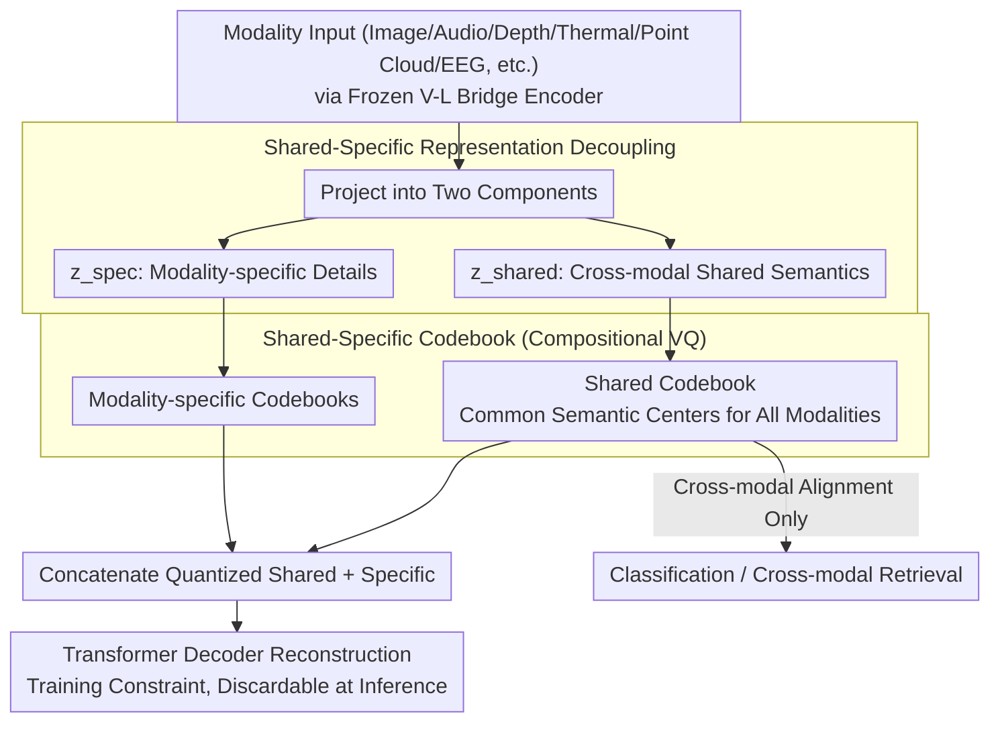

# CodeBind: Decoupled Representation Learning for Multimodal Alignment with Unified Compositional Codebook

**Conference**: ACL2026 Findings  
**arXiv**: [2605.18257](https://arxiv.org/abs/2605.18257)  
**Code**: https://visual-ai.github.io/codebind  
**Area**: Multimodal Alignment / 3D Vision  
**Keywords**: Multimodal Representation, Compositional Vector Quantization, shared-specific Decoupling, Codebook, Cross-modal Retrieval

## TL;DR
CodeBind transforms ImageBind/ViT-Lens style multimodal alignment using shared-specific representation decoupling and a compositional VQ codebook, simultaneously enhancing cross-modal classification and retrieval across nine modalities while preserving stronger mode-specific fine-grained information.

## Background & Motivation
**Background**: Multimodal representation alignment is key to connecting LLMs, robotics, and perception systems to multi-sensor inputs such as images, videos, audio, depth, thermal, tactile, point clouds, and EEG. Current mainstream practices typically align specialized modalities to a mature vision-language space, using models like OpenCLIP, ImageBind, or ViT-Lens as bridges.

**Limitations of Prior Work**: First, "hard alignment" forces all modalities into a single shared space, often leading to a "lowest common denominator" effect: while cross-modal semantic consistency is achieved, modality-unique information such as color, texture, tactile pressure, or thermal signals is suppressed. Second, specialized modality data is much scarcer than image-text data; during training, dominant modalities can overwhelm the space, suppressing low-resource or rare modalities. Third, existing methods often rely on large-scale paired data, synthetic data, or unified encoders, making expansion to new modalities costly.

**Key Challenge**: Cross-modal tasks require a shared semantic space, but fine-grained tasks and robotic perception require the preservation of modality-private details. Complete sharing results in over-compression; complete separation prevents cross-modal retrieval and interaction.

**Goal**: The authors aim to achieve two objectives through "partial alignment": placing cross-modally consistent semantics into a shared space for classification and retrieval, and placing modality-unique details into a specific space for fine-grained recognition, reconstruction, and fusion.

**Key Insight**: This paper treats the VQ codebook as a distribution-agnostic discrete semantic substrate. The shared embeddings of different modalities utilize the same codebook to ensure consistent semantic centers, while each modality maintains its own specific codebook to prevent private information from being swallowed by the shared space.

**Core Idea**: By using shared-specific representation decoupling combined with a compositional VQ codebook, the model expands representation capacity, reduces modality bias, and protects fine-grained features within a compact parameter size.

## Method

### Overall Architecture
CodeBind uses a frozen vision-language foundation model as a bridging space to gradually align target modalities with text/image semantic spaces. Each modality encoder's output is first projected into two components: $z^{\mathcal{M}}_{shared}$ handles cross-modal shared semantics, and $z^{\mathcal{M}}_{spec}$ handles modality-specific information. The shared component enters a universal codebook shared by all modalities, while the specific component enters a modality-specific codebook. The quantized shared and specific embeddings are concatenated and fed into a Transformer decoder for reconstruction to ensure no information loss. During inference, if only cross-modal alignment is required, the reconstruction module can be discarded to reduce costs, retaining only the shared embedding.

### Key Designs

**1. Shared-specific Representation Decoupling: Separating Cross-modal Semantics and Modality-private Details**

Traditional alignment directly maximizes the mutual information of the complete embeddings of two modalities, which forces private features like color, texture, and thermal patterns into the same space along with noise. Consequently, while the shared concept of a "cat" is achieved, fur color and tactile pressure are smoothed out. CodeBind splits the output of each modality encoder into two paths: $z^{\mathcal{M}}_{shared}$ participates only in cross-modal alignment, while $z^{\mathcal{M}}_{spec}$ captures modality-specific information. The two paths are separated using an orthogonal constraint $\mathcal{L}_{orth}$ and a uniform constraint $\mathcal{L}_{uni}$, with a reconstruction loss $\mathcal{L}_{recon}$ forcing the specific component to retain non-redundant details. Thus, classification and retrieval use the shared component for concepts like "cat," while fine-grained retrieval can access fur color or thermal details.

**2. Modality-shared-specific Codebook: Discrete Codevectors as Universal Semantic Substrates and Modality-exclusive Spaces**

If all modalities are crammed into a single continuous space, dominant image-text modalities will dictate the coordinate system, and low-resource modalities (Depth, Thermal, EEG) will be forced to follow. CodeBind treats the VQ codebook as distribution-agnostic discrete semantic centers: shared embeddings are quantized to a universal codebook $\mathcal{C}_{shared}$ to ensure semantic anchor alignment across modalities, while each modality is assigned its own specific codebook $\mathcal{C}^{\mathcal{M}}_{spec}$. For example, "striking" in the shared space represents a general semantic of "hitting," but in the specific spaces of audio/video/tactile, it maps to distinct sound, motion, and pressure patterns respectively.

**3. Compositional Vector Quantization: Building Large Capacity from Small Codebooks**

The most direct way to increase expressiveness is to enlarge the codebook, but large codebooks introduce computational overhead, codebook collapse, and low utilization. CodeBind adopts compositional quantization: a $d$-dimensional embedding is sliced into $m$ sub-vectors, and each sub-vector independently selects a codevector from its own low-dimensional sub-codebook. If each sub-codebook has $K$ codevectors, the total compositional space reaches $K^m$. This achieves an exponential increase in discrete combinations with minimal parameter growth, making it ideal for multimodal scenarios where new sensors are frequently added.

### Loss & Training
The training objective comprises multiple loss types. Cross-modal semantic alignment utilizes InfoNCE $\mathcal{L}_{align}$; representation decoupling is enforced via orthogonal loss $\mathcal{L}_{orth}$, uniform loss $\mathcal{L}_{uni}$, and reconstruction loss $\mathcal{L}_{recon}$. Codebook stability is maintained through EMA updates, commitment loss, dynamic re-initialization, and codevector regularization ($\mathcal{L}_{cctr}$, $\mathcal{L}_{cuni}$). Cross-modal matching in the shared codebook is constrained by a Cross-Modal Code Matching loss $\mathcal{L}_{cm}$. To reduce manual tuning, the authors designed adaptive loss balancing using EMA to estimate the magnitude of each loss and dynamically scale weights relative to $\mathcal{L}_{align}$.

In implementation, CodeBind is integrated into ImageBind and ViT-Lens, resulting in CodeBind-IB and CodeBind-VL. Experiments use 1024 shared codevectors and 256 specific codevectors, with a codevector dimension of 8. Models are initialized from ImageBind/ViT-Lens and trained on 8 NVIDIA RTX 3090 GPUs with a learning rate of $5\times10^{-4}$. Target modality encoders can be fine-tuned via LoRA; adding a new modality only requires training a new codebook and its corresponding path.

## Key Experimental Results

### Main Results
The paper evaluates across 9 modalities and multiple classification/retrieval datasets. The table below highlights representative improvements of CodeBind-IB relative to ImageBind; classification is reported as Acc@1, AudioSet as mAP, and Clotho/AudioCaps as Recall@1/Recall@10.

| Modality/Dataset | ImageBind | CodeBind-IB | Gain |
|-------------|----------:|------------:|-----:|
| NYU-D Depth Class. | 54.0 | 59.3 | +5.3 |
| SUN-D Depth Class. | 35.1 | 45.7 | +10.6 |
| AudioSet Audio Class. | 17.6 | 21.1 | +3.5 |
| VGGSound Audio Class. | 27.8 | 30.5 | +2.7 |
| ESC Audio Class. | 66.9 | 71.0 | +4.1 |
| LLVIP Thermal Class. | 63.4 | 95.5 | +32.1 |
| FLIR_v2 Thermal Class. | 46.6 | 97.2 | +50.6 |
| MSR-VTT Video Retr. | 36.1 | 37.8 | +1.7 |
| AudioCaps Audio Retr. | 9.3/42.3 | 13.3/53.8 | +4.0/+11.5 |

CodeBind-VL also consistently outperforms ViT-Lens, e.g., ModelNet40 point cloud classification improved from 70.6/94.4 to 78.3/96.5, and IN-EEG from 41.8/42.7 to 54.5/54.1.

### Ablation Study
| Config | NYU-D | SUN-D | FLIR_v2 | Description |
|------|------:|------:|--------:|------|
| w/o codebook / w/o decoupling / w/o reconstruction | 54.0 | 35.1 | 46.6 | ImageBind Baseline |
| only decoupling + reconstruction | 54.1 | 39.7 | 94.5 | Decoupling significantly helps low-resource modalities |
| only codebook | 57.6 | 46.9 | 80.5 | Discrete substrate improves shared space |
| codebook + decoupling | 56.7 | 45.3 | 97.7 | Near optimal performance |
| codebook + decoupling + reconstruction | 59.3 | 45.7 | 97.2 | Full Method |

### Key Findings
- Low-resource datasets with strong modality differences, such as Thermal and Depth, show the largest gains, indicating that the codebook effectively counters modality bias.
- Specific embeddings are not merely reconstruction auxiliaries; they contribute usable details in fine-grained retrieval and multimodal fusion.
- Compositional VQ provides significant improvements over standard VQ (+10.8, +5.7, +16.1 across three ablation metrics) due to larger compositional representation capacity.
- The reconstruction module adds overhead during training but can be discarded during inference; its role is primarily a training constraint to ensure the specific component retains information.

## Highlights & Insights
- **Partial Alignment Over Hard Alignment**: In robotic or medical scenarios, total homogenization of modalities is undesirable. CodeBind's shared/specific division provides a clear modeling language for multi-sensor reality.
- **Codebook as Regulator**: The shared codebook extracts cross-modal invariants while the specific codebook captures mode-specific signals, offering more structural constraints than a simple projector.
- **Compositional VQ Efficiency**: Using low-dimensional sub-vector combinations expands the representation space elegantly, avoiding the need for excessively large codebooks.
- **Broad Coverage**: Spanning images, video, audio, depth, thermal, tactile, EEG, and point clouds, the framework demonstrates scalability rather than just standard image-text validation.

## Limitations & Future Work
- While visual embedding modality-specific info can be explained via VLM-generated text, explaining specific information for modalities lacking strong foundation spaces (e.g., tactile/EEG) remains a challenge.
- The main experiments primarily use category names for alignment; the authors note that dense descriptions generated by LLMs/VLMs might further unlock the potential of the decoupled space, though this introduces dependency on description quality.
- The method still relies on bridge modalities and existing foundation models; if a new modality has a weak semantic link to text/images, the transfer effect may diminish.
- Future work could integrate CodeBind into MLLMs for on-demand fusion, using gating to decide when to use shared concepts versus specific cues.

## Related Work & Insights
- **vs. ImageBind / ViT-Lens**: These methods aim to map multiple modalities to a unified space; CodeBind adds a shared-specific codebook to reduce detail loss caused by "hard alignment."
- **vs. LanguageBind / FreeBind / OmniBind**: These often rely on large-scale or pseudo-paired data for expansion; CodeBind emphasizes natural paired data and parameter-efficient codebook design.
- **vs. MoE Transformers**: MoE fuses modalities via routing but may collapse under data imbalance; CodeBind constrains representation structure directly through discrete codebooks and decoupling.

## Rating
- Novelty: ⭐⭐⭐⭐⭐ The combination of shared-specific decoupling and compositional codebooks is highly structural and addresses core issues in multimodal hard alignment.
- Experimental Thoroughness: ⭐⭐⭐⭐⭐ Coverage of 9 modalities, multiple baselines, and layered ablations provides solid evidence.
- Writing Quality: ⭐⭐⭐⭐☆ High density but logical; some table layouts are complex and require background knowledge of multimodal baselines.
- Value: ⭐⭐⭐⭐⭐ Directly inspiring for robotics, multi-sensor perception, and integrating new modalities into MLLMs.

<!-- RELATED:START -->

## Related Papers

- [\[AAAI 2026\] Point-SRA: Self-Representation Alignment for 3D Representation Learning](../../AAAI2026/3d_vision/point-sra_self-representation_alignment_for_3d_representation_learning.md)
- [\[ICLR 2026\] Learning Unified Representation of 3D Gaussian Splatting](../../ICLR2026/3d_vision/learning_unified_representation_of_3d_gaussian_splatting.md)
- [\[CVPR 2026\] UniLight: A Unified Representation for Lighting](../../CVPR2026/3d_vision/unilight_a_unified_representation_for_lighting.md)
- [\[CVPR 2026\] Improving Human Image Animation via Semantic Representation Alignment](../../CVPR2026/3d_vision/improving_human_image_animation_via_semantic_representation_alignment.md)
- [\[ICCV 2025\] REPARO: Compositional 3D Assets Generation with Differentiable 3D Layout Alignment](../../ICCV2025/3d_vision/reparo_compositional_3d_assets_generation_with_differentiable_3d_layout_alignmen.md)

<!-- RELATED:END -->
