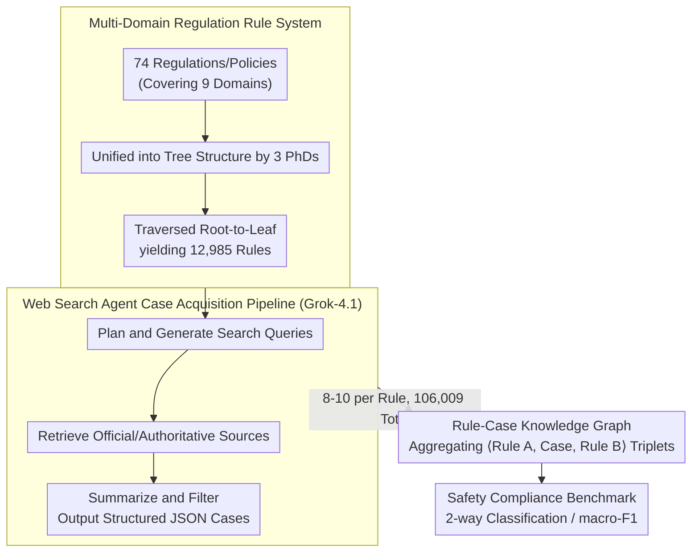

# OmniCompliance-100K: A Multi-Domain Rule-Grounded Real-World Safety Compliance Dataset

**Conference**: ACL 2026 Findings  
**arXiv**: [2603.13933](https://arxiv.org/abs/2603.13933)  
**Code**: [GitHub](https://github.com/HKUST-KnowComp/OmniCompliance-100K)  
**Area**: Medical Imaging  
**Keywords**: Safety Compliance, Real-world Case Dataset, Multi-domain Regulations, Web Search Agent, LLM Benchmark

## TL;DR

This paper constructs OmniCompliance-100K, the first large-scale, multi-domain, real-world case-based LLM safety compliance dataset. It contains 12,985 human-organized regulatory/policy rules and 106,009 real-world compliance cases collected via web search agents across 9 domains, including AI safety, data privacy, finance, and healthcare. Extensive benchmarking reveals systematic weaknesses in current LLMs regarding safety compliance.

## Background & Motivation

**Background**: With the widespread deployment of LLMs across industries, safety risks have become prominent—ranging from generating harmful content and leaking private information to violating financial compliance requirements. Existing LLM safety datasets (e.g., ToxicChat, WildGuard, HarmBench) are primarily based on researcher-defined taxonomies and synthesized by LLMs.

**Limitations of Prior Work**: (1) Existing safety datasets lack a systematic legal basis and use ad-hoc taxonomies, failing to provide rigorous compliance protection; (2) Even works that introduce regulatory frameworks (e.g., Air-Bench, GuardSet-X) still rely on LLM-synthesized cases, which lack real-world diversity; (3) Real-world compliance cases are scattered across various websites in diverse formats (PDF, HTML, JSON), making large-scale collection and alignment difficult.

**Key Challenge**: While legal regulations provide comprehensive safety guidelines and numerous real-world enforcement cases exist, current datasets fail to utilize these resources. This results in LLM safety alignment being limited to synthetic scenarios, leading to poor generalization in real-world applications.

**Goal**: (1) Construct the first large-scale, rule-grounded safety compliance dataset containing real-world cases; (2) Develop an automated web search agent pipeline for large-scale acquisition of rule-aligned real cases; (3) Conduct a comprehensive benchmark of current LLM safety compliance capabilities.

**Key Insight**: Utilize modern web search agents (based on Grok-4.1) to automatically plan queries, retrieve results, filter noise, and summarize cases, thereby addressing the three major challenges of real-world case collection: scattered sources, diverse formats, and information noise.

**Core Idea**: Safety issues should be approached from a compliance perspective—using authoritative regulations as the basis and real-world cases as training and evaluation materials, rather than relying on researcher-defined categories and LLM-synthesized scenarios.

## Method

### Overall Architecture

The dataset construction consists of two stages: (1) Rule Collection—three PhDs in computational linguistics spent one month manually organizing a tree-structured rule system from 74 regulations/policies, yielding 12,985 rules through tree traversal; (2) Case Acquisition—a web search agent pipeline based on Grok-4.1 was developed to automatically search, filter, and summarize 8-10 real-world cases for each rule. Finally, cases were mapped back to the rules they triggered to build a rule-case knowledge graph for analyzing rule correlations.

### Key Designs

**1. Multi-Domain Regulation Rule System: Unifying scattered clauses from 74 regulations into a traversable tree-structured rule library to provide an authoritative basis for safety assessment.**

Most existing safety datasets use ad-hoc taxonomies that lack legal authority. Instead, this work is directly rooted in real regulations, covering 9 major domains: AI Safety (EU AI Act, SB 53), Data Privacy (GDPR, CCPA, HIPAA), China-related regulations (PIPL, DSL), Platform Policies (X, Reddit, GitHub, Google, OpenAI, WeChat), Educational Integrity, Financial Regulations (AML, cross-border payments, cryptocurrency), Medical Device Regulations, Cybersecurity (MITRE ATT&CK), and Fundamental Rights. To handle varying hierarchical formats across regulations, three PhDs spent a month unifying them into a tree structure, traversing every path from root to leaf to generate operational rule samples.

**2. Web Search Agent Case Acquisition Pipeline: Using Grok-4.1 agents to automatically collect rule-aligned real cases, bypassing the limitations of traditional crawlers in adapting to diverse websites.**

Manually collecting 100,000 cases is impractical, and real compliance cases are scattered in various formats (PDF, HTML, JSON) across websites that fixed-rule crawlers cannot handle. This work employs a Grok-4.1 based agent to execute three steps for each rule: analyzing rule content to plan and generate multiple search queries; focusing on official/authoritative sources via search engine tools; and summarizing the collected information while filtering irrelevant cases. This results in structured JSON containing case background, compliance outcome, involved parties, applicable regulations, and reference links. This flexibility naturally resolves challenges regarding scattered sources and noise.

**3. Rule-Case Knowledge Graph: Linking cases back to multiple triggered rules to reveal correlations between regulatory clauses for multi-hop compliance reasoning.**

Regulatory clauses are rarely isolated; a real-world compliance judgment often requires synthesizing multiple clauses. By leveraging the fact that each searched case references source rules, the authors construct <Rule A, Search Case, Rule B> triplets to form a knowledge graph. For instance, analysis in GDPR shows that Articles 5-11 (Principles), Article 32 (Security of processing), Article 33 (Breach notification), and Article 44 (Cross-border transfer) are highly correlated with almost all other clauses. This structure explicates implicit clause relationships, providing a foundation for future compliance tasks requiring multi-hop reasoning.

### Loss & Training

This work focuses on dataset construction and benchmarking and does not train a model. The evaluation task is set as a 2-way classification (permitted/prohibited) using macro-F1 as the metric. The dataset contains 40,385 permitted samples and 65,624 prohibited samples.

## Key Experimental Results

### Main Results

**Closed-source Model Benchmark (Avg. Macro-F1 %)**

| Model | Avg Score | Platform Policy | Main Regulations | Education Bias |
|------|-----------|-----------------|------------------|----------------|
| GLM-4.5 | Highest | 89.61 | 93.65 | 83.91 |
| DeepSeek-V3.2 | 2nd Highest | — | — | 85.75 |
| Grok-4.1 | 85.60 | — | — | — |

**Open-source Model Comparison**

| Model | Avg Macro-F1 |
|------|-------------|
| Qwen2.5-14B-Instruct | High |
| Qwen2.5-7B-Instruct | 84.94 |
| Qwen2.5-3B-Instruct | **88.62** |
| Llama3.1-8B-Instruct | 76.02 |
| Llama3.2-3B-Instruct | 67.86 |
| Qwen2.5-1.5B-Instruct | 57.06 |
| WildGuard-7B | 38.41 |
| Llama-Guard-3-8B | 28.16 |

### Ablation Study

**Rule-Case Alignment Verification**

| Evaluator | Avg Alignment Score (Normalized %) |
|-----------|-------------------------------------|
| DeepSeek-V3.2 | 91.32 |
| GPT-4o-Mini | 92.51 |
| Gemini-2.5-Flash | 95.90 |
| Human Evaluation | 91.77 |

### Key Findings

- **Platform Policy vs. Regulation**: All models perform systematically worse on platform policies than on formal regulations (approx. 4% gap), as policies are more dynamic and context-dependent.
- **Bias and Discrimination**: The "Bias and Discrimination" category in the education domain is the worst-performing category for all models; even the strongest model achieves only ~84%, indicating that identifying subtle social biases remains a core challenge for LLMs.
- **Financial Regulations**: Models consistently perform excellently on financial regulations (95-97%), demonstrating the potential for LLMs in financial compliance automation.
- **Small Models are Competitive**: Qwen2.5-3B-Instruct (88.62%) outperforms Grok-4.1 (85.60%), but performance drops sharply below 1.5B—suggesting 3B is an empirical lower bound for "compliance capability."
- **Safety Guardrail Models Fail Significantly**: WildGuard-7B (38.41%) and Llama-Guard-3-8B (28.16%) perform extremely poorly in real-world compliance scenarios, indicating that existing safety alignment is too narrow.
- **Qwen Series >> Llama Series**: At the same parameter scale, Qwen consistently outperforms Llama on compliance tasks (e.g., 7B: 84.94% vs. 76.02%).
- **EU AI Act Title II (Prohibited AI Practices)**: All models show their worst performance (<80%) in areas involving high-risk domains like biometric identification and deceptive AI.

## Highlights & Insights

- The positioning that "safety issues should start from a compliance perspective" is highly valuable—authoritative regulations are more reliable and practically meaningful than researcher-defined taxonomies.
- The paradigm of using web search agents as data collection tools is noteworthy—it naturally solves the challenges of scattered sources, diverse formats, and noise faced by traditional crawlers.
- The finding that safety guardrail models (WildGuard, Llama-Guard) essentially fail in real compliance scenarios is critical—it suggests current safety alignment overfits to narrow safety categories, highlighting an urgent need for safety training based on compliance datasets.

## Limitations & Future Work

- Human evaluation covers only 2,220 samples (30 per regulation/policy), not the entire dataset.
- Cases may contain sensitive information (PII), requiring filtering and anonymization before release.
- Web searches may introduce temporal bias—older cases may no longer apply after regulatory updates.
- Only classification tasks were evaluated; the model's capability in compliance reasoning (requiring multi-hop inference) was not tested.

## Related Work & Insights

- **vs. Air-Bench (Zeng et al., 2024)**: The latter created a taxonomy based on regulations and then used LLMs to synthesize cases (5,694 items). Ours collects real-world cases directly from the web (106,009 items), offering a qualitative leap in scale and authenticity.
- **vs. GuardSet-X (Kang et al., 2025)**: The latter is larger (129,241 synthetic cases) but entirely LLM-generated, lacking real-world diversity. Ours compensates for this deficiency with real cases.
- **vs. PrivaCI-Bench (Li et al., 2025)**: The latter includes ~3,000 real court cases but is restricted to the privacy domain. Ours spans 9 domains with stricter rule alignment.

## Rating

- Novelty: ⭐⭐⭐⭐ First large-scale real-case safety compliance dataset; innovative web search agent pipeline.
- Experimental Thoroughness: ⭐⭐⭐⭐⭐ Comprehensive benchmark of 18 models, multi-dimensional analysis, and dual LLM+human verification of rule-case alignment.
- Writing Quality: ⭐⭐⭐⭐ Clear dataset construction process and well-organized experimental findings.
- Value: ⭐⭐⭐⭐⭐ Fills the gap in real-world safety compliance data; directly guides safety alignment research and practice.

<!-- RELATED:START -->

<!-- RELATED:END -->

## Related Papers

- [\[CVPR 2026\] A Sanity Check for Multi-In-Domain Face Forgery Detection in the Real World](../../CVPR2026/ai_safety/a_sanity_check_for_multi-in-domain_face_forgery_detection_in_the_real_world.md)
- [\[CVPR 2026\] DeepfakeImpact: A Two-Stage Benchmark with Real-World Impact in Deepfake Detection](../../CVPR2026/ai_safety/deepfakeimpact_a_two-stage_benchmark_with_real-world_impact_in_deepfake_detectio.md)
- [\[AAAI 2026\] Privacy Auditing of Multi-Domain Graph Pre-Trained Model under Membership Inference Attack](../../AAAI2026/ai_safety/privacy_auditing_of_multi-domain_graph_pre-trained_model_under_membership_infere.md)
- [\[CVPR 2026\] Fractal Camouflage: A Bio-Inspired Approach for Multi-Scale Adversarial Attacks in the Infrared Domain](../../CVPR2026/ai_safety/fractal_camouflage_a_bio-inspired_approach_for_multi-scale_adversarial_attacks_i.md)
- [\[ICML 2026\] Scaling Unsupervised Multi-Source Federated Domain Adaptation through Group-Wise Discrepancy Minimization](../../ICML2026/ai_safety/scaling_unsupervised_multi-source_federated_domain_adaptation_through_group-wise.md)

<!-- RELATED:END -->
