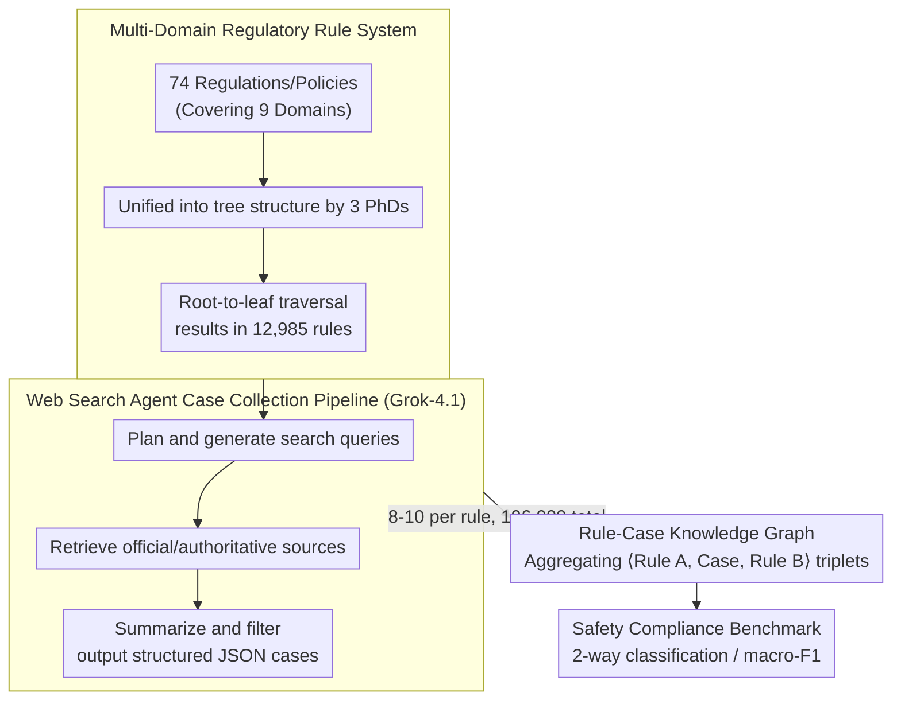

# OmniCompliance-100K: A Multi-Domain Rule-Grounded Real-World Safety Compliance Dataset

**Conference**: ACL 2026 Findings  
**arXiv**: [2603.13933](https://arxiv.org/abs/2603.13933)  
**Code**: [GitHub](https://github.com/HKUST-KnowComp/OmniCompliance-100K)  
**Area**: Medical Images  
**Keywords**: safety compliance, real-world case dataset, multi-domain regulations, Web search agent, LLM benchmark

## TL;DR

This paper constructs OmniCompliance-100K, the first large-scale, multi-domain safety compliance dataset grounded in real-world cases. It contains 12,985 human-curated regulatory/policy rules and 106,009 real-world compliance cases collected via web search agents, covering nine domains such as AI safety, data privacy, finance, and healthcare. Extensive benchmarking reveals systemic shortcomings in the safety compliance capabilities of current LLMs.

## Background & Motivation

**Background**: As LLMs are widely deployed across industries, safety risks have become increasingly prominent—ranging from generating harmful content and leaking private information to violating financial compliance requirements. Existing LLM safety datasets (e.g., ToxicChat, WildGuard, HarmBench) primarily rely on researcher-defined ad-hoc taxonomies and are synthetically generated by LLMs.

**Limitations of Prior Work**: (1) Existing datasets lack systematic regulatory grounds, using ad-hoc taxonomies that fail to provide rigorous compliance protection; (2) Even works that introduce regulatory/policy frameworks (e.g., Air-Bench, GuardSet-X) still rely on LLM-synthesized cases, lacking real-world diversity; (3) Real-world compliance cases are scattered across various websites in diverse formats (PDF, HTML, JSON), making large-scale collection and alignment difficult.

**Key Challenge**: While laws and regulations provide comprehensive safety guidelines and numerous real-world enforcement cases exist, current datasets fail to utilize these resources. This leads to LLM safety alignment being limited to synthetic scenarios, resulting in poor generalization in real-world applications.

**Goal**: (1) Build the first large-scale, rule-grounded safety compliance dataset containing real-world cases; (2) Develop an automated web search agent pipeline to collect rule-aligned real cases at scale; (3) Comprehensively benchmark the safety compliance capabilities of current LLMs.

**Key Insight**: Utilize modern web search agents (based on Grok-4.1) to automatically plan queries, retrieve results, filter noise, and summarize cases, thereby addressing the three challenges of case collection: scattered sources, diverse formats, and information noise.

**Core Idea**: Safety should be approached from a compliance perspective—using authoritative regulations as the foundation and real cases as training and evaluation materials, rather than relying on researcher-defined taxonomies and synthetic scenarios.

## Method

### Overall Architecture

The dataset construction consists of two stages: (1) Rule collection: Three PhDs in computational linguistics spent one month manually organizing a tree-structured rule system from 74 regulations/policies, resulting in 12,985 rules through tree traversal; (2) Case collection: A Grok-4.1-based web search agent pipeline was developed to automatically search, filter, and summarize 8–10 real cases for each rule. Finally, cases were mapped back to the rules they triggered to build a Rule-Case Knowledge Graph for analyzing inter-rule correlations.

### Key Designs

**1. Multi-Domain Regulatory Rule System: Unifying scattered clauses from 74 regulations into a traversable tree-based rule library to provide authoritative grounds for safety evaluation.**

Most existing safety datasets use ad-hoc taxonomies created by researchers, which lack legal authority. This work directly builds upon real-world regulations, covering AI safety laws (EU AI Act, SB 53), data privacy laws (GDPR, CCPA, HIPAA), Chinese regulations (PIPL, DSL), platform policies (X, Reddit, GitHub, Google, OpenAI, WeChat), educational integrity, financial regulations (AML, cross-border payments, cryptocurrency), medical device regulations, cybersecurity (MITRE ATT&CK), and fundamental rights across 9 major domains. Since different regulations have varied hierarchical formats, three PhDs unified them into a tree structure over one month. Each path from root to leaf represents an operational rule, totaling 12,985 rules. This multi-domain coverage ensures unbiased evaluation, while the tree structure allows each rule to serve as an independent test item.

**2. Web Search Agent Case Collection Pipeline: Using Grok-4.1 agents to automatically collect real-world cases aligned with rules, bypassing the limitations of traditional crawlers on diverse websites.**

Manually collecting 100,000 cases is impractical, and real compliance cases are dispersed across websites in formats like PDF, HTML, and JSON. This paper employs a Grok-4.1-based agent to perform a three-step process for each rule: first, analyzing rule content to plan and generate multiple search queries; second, invoking search engine tools to retrieve results with a focus on official/authoritative sources; and third, summarizing collected information, filtering irrelevant cases, and outputting structured JSON containing case background, compliance outcomes, involved parties, applicable regulations, and reference links. This process yielded 106,009 cases (8–10 per rule). The flexibility of the "plan-retrieve-summarize" agent naturally resolves the challenges of scattered sources, diverse formats, and information noise.

**3. Rule-Case Knowledge Graph: Linking cases back to multiple triggered rules to reveal inter-clause correlations and support multi-hop compliance reasoning.**

Regulatory clauses are rarely isolated; real-world compliance judgments intermediate multiple clauses. By leveraging the fact that each searched case references source rules, this work constructs $\langle \text{Rule A, Case, Rule B} \rangle$ triplets to form a knowledge graph. Analysis of GDPR shows that Articles 5-11 (principles), Article 32 (security of processing), Article 33 (breach notification), and Article 44 (transborder transfer) are highly correlated with nearly all other clauses. This structure explicates the implicit correlations between clauses found in cases, laying the foundation for compliance tasks requiring multi-hop reasoning.

### Loss & Training

This work focuses on dataset and benchmarking; no model training is performed. The evaluation task is set as a 2-way classification (permitted/prohibited), with macro-F1 as the metric. The dataset contains 40,385 permitted samples and 65,624 prohibited samples.

## Key Experimental Results

### Main Results

**Closed-Source Model Benchmark (Avg. Macro-F1 %)**

| Model | Avg. Score | Platform Policies | Major Regulations | Education Bias |
|------|--------|---------|---------|---------|
| GLM-4.5 | Highest | 89.61 | 93.65 | 83.91 |
| DeepSeek-V3.2 | Second Highest | — | — | 85.75 |
| Grok-4.1 | 85.60 | — | — | — |

**Open-Source Model Comparison**

| Model | Avg. Macro-F1 |
|------|-------------|
| Qwen2.5-14B-Instruct | High |
| Qwen2.5-7B-Instruct | 84.94 |
| Qwen2.5-3B-Instruct | **88.62** |
| Llama3.1-8B-Instruct | 76.02 |
| Llama3.2-3B-Instruct | 67.86 |
| Qwen2.5-1.5B-Instruct | 57.06 |
| WildGuard-7B | 38.41 |
| Llama-Guard-3-8B | 28.16 |

### Ablation Study

**Rule-Case Alignment Verification**

| Evaluator | Avg. Alignment Score (Normalized %) |
|--------|---------------------|
| DeepSeek-V3.2 | 91.32 |
| GPT-4o-Mini | 92.51 |
| Gemini-2.5-Flash | 95.90 |
| Human Evaluation | 91.77 |

### Key Findings

- **Platform Policies vs. Regulations**: All models systematically perform worse on platform policies than on formal regulations (~4% gap), as policies are more dynamic and context-dependent.
- **Bias & Discrimination**: The "Bias and Discrimination" category in the education domain is the worst-performing category across all models. Even the strongest models achieve only ~84%, indicating that identifying subtle social biases remains a core challenge for LLMs.
- **Financial Regulations**: Models consistently perform excellently on financial regulations (95-97%), demonstrating the potential of LLMs in automated financial compliance.
- **Competitiveness of Small Models**: Qwen2.5-3B-Instruct (88.62%) outperforms Grok-4.1 (85.60%), but performance drops sharply below 1.5B parameters—suggesting 3B is an empirical lower bound for "compliance capability."
- **Failure of Safety Guardrail Models**: WildGuard-7B (38.41%) and Llama-Guard-3-8B (28.16%) perform extremely poorly in real-world compliance scenarios, indicating that existing safety alignment is too narrow.
- **Qwen Series >> Llama Series**: At the same parameter count, Qwen consistently outperforms Llama on compliance tasks (e.g., 7B: 84.94% vs 76.02%).
- **EU AI Act Chapter II (Prohibited AI Practices)**: All models perform worst (<80%) in areas involving high-risk fields like biometrics and deceptive AI.

## Highlights & Insights

- Positioning safety from a "compliance perspective" is highly valuable—authoritative regulations are more reliable and practically meaningful than researcher-defined taxonomies.
- The paradigm of using web search agents as data collection tools is noteworthy, as it naturally handles distributed sources, diverse formats, and information noise that traditional crawlers struggle with.
- The failure of safety guardrail models (WildGuard, Llama-Guard) in real compliance scenarios is a critical finding—it shows that existing safety alignment methods overfit narrow safety categories and highlights the urgent need for safety training based on compliance datasets.

## Limitations & Future Work

- Human evaluation only covered 2,220 samples (30 per regulation/policy), not the entire dataset.
- Cases may contain Personally Identifiable Information (PII), requiring filtering and anonymization before release.
- Web searching may introduce recency bias—old cases might become inapplicable after regulatory updates.
- The evaluation focused only on classification tasks and did not test the models' compliance reasoning (multi-hop) capabilities.

## Related Work & Insights

- **vs. Air-Bench (Zeng et al., 2024)**: The latter creates a taxonomy based on regulations and then synthesizes cases via LLMs (5,694 cases). Ours collects real cases directly from the web (106,009 cases), offering a qualitative leap in scale and authenticity.
- **vs. GuardSet-X (Kang et al., 2025)**: The latter is larger (129,241 synthetic cases) but entirely LLM-generated, lacking real-world diversity. Ours fixes this with real-world cases.
- **vs. PrivaCI-Bench (Li et al., 2025)**: The latter includes ~3,000 real court cases but is restricted to the privacy domain. Ours spans 9 domains with stricter rule alignment.

## Rating

- Novelty: ⭐⭐⭐⭐ First large-scale real-case safety compliance dataset; innovative web search agent pipeline.
- Experimental Thoroughness: ⭐⭐⭐⭐⭐ Comprehensive benchmarking of 18 models; multi-dimensional analysis; dual verification via LLM and human evaluation for rule-case alignment.
- Writing Quality: ⭐⭐⭐⭐ Clear dataset construction process and well-organized experimental findings.
- Value: ⭐⭐⭐⭐⭐ Fills the gap in real-world safety compliance data, offering direct guidance for safety alignment research and practice.

<!-- RELATED:START -->

## Related Papers

- [\[CVPR 2026\] A Sanity Check for Multi-In-Domain Face Forgery Detection in the Real World](../../CVPR2026/ai_safety/a_sanity_check_for_multi-in-domain_face_forgery_detection_in_the_real_world.md)
- [\[ICLR 2026\] Comparing AI Agents to Cybersecurity Professionals in Real-World Penetration Testing](../../ICLR2026/ai_safety/comparing_ai_agents_to_cybersecurity_professionals_in_real-world_penetration_tes.md)
- [\[CVPR 2026\] DeepfakeImpact: A Two-Stage Benchmark with Real-World Impact in Deepfake Detection](../../CVPR2026/ai_safety/deepfakeimpact_a_two-stage_benchmark_with_real-world_impact_in_deepfake_detectio.md)
- [\[AAAI 2026\] Privacy Auditing of Multi-Domain Graph Pre-Trained Model under Membership Inference Attack](../../AAAI2026/ai_safety/privacy_auditing_of_multi-domain_graph_pre-trained_model_under_membership_infere.md)
- [\[CVPR 2026\] Fractal Camouflage: A Bio-Inspired Approach for Multi-Scale Adversarial Attacks in the Infrared Domain](../../CVPR2026/ai_safety/fractal_camouflage_a_bio-inspired_approach_for_multi-scale_adversarial_attacks_i.md)

<!-- RELATED:END -->
