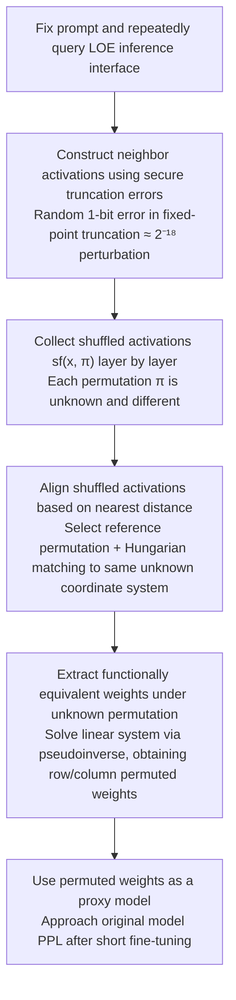

# On the (In-)Security of the Shuffling Defense in the Transformer Secure Inference

**Conference**: ACL 2026  
**arXiv**: [2605.04901](https://arxiv.org/abs/2605.04901)  
**Code**: No public code  
**Area**: Model Security / Privacy Computing  
**Keywords**: Secure Inference, Linear Layer Encryption, Shuffling Defense, Model Extraction, Activation Alignment

## TL;DR
This paper demonstrates that the commonly used "expose intermediate activations after shuffling" defense in Transformer secure inference is insecure. It proposes an attack that first aligns activations under different random permutations and then solves linear equations to extract weights. On Pythia-70m and GPT-2, it can recover approximately usable model weights with a query cost of about $1.

## Background & Motivation
**Background**: The goal of Transformer secure inference is to ensure that the client only receives the final output while the server does not see the user's input, and the server's model weights are not exposed to the client. Traditional full-model encryption inference places both linear and nonlinear layers within MPC or homomorphic encryption protocols, providing the cleanest privacy but incurring high costs in Transformers, especially for nonlinear layers like softmax, GELU, and LayerNorm.

**Limitations of Prior Work**: Numerous existing systems have found that the secure computation of nonlinear layers often requires multiple communication rounds, truncation, comparison, or polynomial approximation, with communication latency accounting for 75% to 90% of the total delay. To make secure inference practical, a class of Linear-Only Encryption (LOE) schemes encrypts only linear layers, delivering intermediate activations to the client to compute nonlinear layers in plaintext, and then re-sharing the results. While this LOE inference provides order-of-magnitude acceleration, it hands over part of the linear layer inputs and outputs to the client.

**Key Challenge**: If the client can see the activations before and after a linear layer, the weights satisfy an approximate linear relationship $X^{(l+1)} = X^{(l)}W^{(l)}$, allowing weights to be extracted by solving a linear system after collecting enough input-output pairs. Existing works use random shuffling to scramble activation positions, arguing that a vector of length $h$ has $h!$ permutations, making it nearly impossible for an attacker to guess the true permutation. However, this argument only excludes "direct guessing of the permutation" and does not exclude "aligning different shuffled results across queries."

**Goal**: The authors aim to answer a very specific question: when a client can only see activations after each random permutation and does not know any true permutations, can these activations still be restored to a common coordinate system to further recover linear layer weights?

**Key Insight**: The key observation is that an attacker does not need to know the original permutation but only needs to make the activation values obtained from different queries sufficiently close. Shuffling changes positions but not values; if two activation vectors themselves are very close, elements in the same dimension will still be close to each other, and matching elements across vectors can be converted into a minimum distance matching problem.

**Core Idea**: Use random 1-bit errors in secure truncation protocols to create "micro-disturbances in activations under the same prompt," then use Hungarian matching to align shuffled activations, and finally solve for weights equivalent to the original ones (up to row/column permutations) under an unknown common permutation.

## Method
This paper does not design a new secure inference system but analyzes what an LOE inference interface can leak from an attacker's perspective. The attacker is a semi-honest client: it follows the protocol and does not tamper with intermediate secret shares but can freely choose input prompts and observe the shuffled activations and final output probabilities that the protocol would naturally return.

### Overall Architecture
The attack process can be divided into four steps.

First, the attacker fixes an input sequence and repeatedly queries the LOE inference interface. Since secure inference encodes floating-point numbers as fixed-point numbers and performs truncation after multiplication, common protocols naturally introduce random 1-bit truncation errors; even with the same prompt, multiple executions will produce small disturbances in intermediate activations.

Second, for each layer, collect shuffled activations returned from multiple queries. For the $l$-th linear layer, the attacker receives $sf(x_i^{(l)}, \pi_i^{(l)})$ rather than $x_i^{(l)}$, where the permutation $\pi_i^{(l)}$ for each query may be different.

Third, select one shuffled vector within each layer as a reference permutation and align other shuffled vectors to this same unknown permutation. Restoration of the true permutation is not required; it is only necessary to ensure consistent internal coordinates for all samples.

Fourth, input the aligned input activation matrices and output activation matrices into a linear system to recover weights via the pseudoinverse. The resulting weights differ from the original weights by row and column permutations, but as long as permutations between consecutive layers are consistent, the forward propagation functionality remains equivalent.

### Key Designs

**1. Activation Alignment based on Nearest Distance: Instead of guessing the true permutation, use numerical proximity to align activations from different random permutations to the same coordinate system.**

The security argument for shuffling defense relies on the "attacker must guess the true permutation from $h!$ possibilities," but this attack does not guess the global permutation. The key observation is that shuffling only changes element positions, not values: if original vectors $x_a$ and $x_b$ are close enough, even though the coordinate order of shuffled $x_a'$ and $x_b'$ is scrambled, the numerical distance between elements corresponding to the same hidden dimension remains minimal. The authors formulate alignment as $\min_M \|x_a' - x_b'M\|_2$ (where $M$ is a permutation matrix), then convert it to a standard assignment problem by constructing a cost matrix $D[i,j]=(x_a'[i]-x_b'[j])^2$, solved using the Hungarian algorithm. As long as the disturbance is small enough not to scramble neighborhood relationships, the exponential permutation search space collapses into a polynomial-time solvable bipartite matching problem.

**2. Constructing Neighbor Activations using Secure Truncation Error: Under the constraint that token inputs are discrete, leverage the protocol's own fixed-point truncation errors to create activations that are very close to each other.**

The previous step requires a set of activations that are "nearly identical but with micro-differences," but Transformer inputs are discrete tokens, preventing the attacker from adding $\epsilon$ perturbations directly. This paper leverages implementation details of secure inference: floating-point values are typically encoded as $x=\lfloor x_f\cdot 2^p\rceil$, and truncation is required after multiplication to maintain precision. Protocols like ABY3, CrypTFlow2, and SecretFlow-SPU generate random 1-bit truncation errors. With a default 18-bit precision, this corresponds to a perturbation of approximately $2^{-18}$. By submitting the same prompt repeatedly, the attacker can collect a set of alignable neighbor activations. This step is crucial for the attack's feasibility—simply stating that neural networks are Lipschitz continuous is insufficient because GPT inputs are discrete; truncation error turns protocol implementation details into the required source of random perturbation.

**3. Extracting Functionally Equivalent Weights under Unknown Permutation: Although the solved weights are versioned by row/column permutations, they maintain forward functionality due to neural network permutation symmetry.**

For the $l$-th layer, the original relationship is $X^{(l+1)}=X^{(l)}W^{(l)}$. The attacker actually solves for $W'^{(l)} = \pi^{(l)^{-1}}W^{(l)}\pi^{(l+1)}$, meaning the original weight undergoes a row permutation of the input dimension and a column permutation of the output dimension. Since nonlinearities like GELU, softmax, and LayerNorm remain equivalent under permutations of their respective dimensions, as long as compatible permutations are used between consecutive layers, the entire forward pass will output intermediate representations transformed by the same coordinates, resulting in consistent final functionality. This directly addresses the concern of whether "stolen non-original matrices are useful": neural network weights inherently possess permutation symmetry, and permuted weights can still serve as proxy models for information analysis or as initialization for subsequent black-box attacks.

### Loss & Training
This paper does not train a new model or optimize a neural network loss; the core computation involves two numerical problems.

In the alignment phase, minimum cost matching is solved to minimize $\sum_{i,j}M[i,j]D[i,j]$ subject to $M$ having exactly one 1 per row and column. This is solved exactly by the Hungarian algorithm.

In the weight extraction phase, a linear system is solved. Theoretically, the number of samples must at least reach the rank of the weight input dimension; in experiments, to mitigate ill-conditioned matrices, the authors use 16 times the maximum dimension in queries. Due to the poor singular value distribution of the neighbor activation matrix, a condition number threshold $C$ is set when calculating the pseudoinverse, discarding singular values smaller than $\sigma_{max}/C$; $C=10^7$ was found most stable in most scenarios.

## Key Experimental Results

### Main Results
Experiments were verified on Pythia-70m and GPT-2, covering major linear layer types in Transformers, including $W_{qkv}$, $W_o$ in attention, and $W_{h1}$, $W_{h2}$ in FFN. Fixed-point precision was tested at 14, 16, and 18 bits, where 18 bits corresponds to common defaults in frameworks like SecretFlow-SPU.

| Model | Max Dim | Queries | Weight Recovery Error | Proxy Model Effect |
|-------|---------|---------|-----------------------|--------------------|
| Pythia-70m | 2048 | 32768 | L1 diff ~ $10^{-4}$ to $10^{-2}$ for most layers | Wikitext PPL: Original 31.81, Stolen 44.46, After fine-tuning 32.43 |
| GPT-2 | 3072 | 49512 | L1 diff ~ $10^{-4}$ to $10^{-2}$, harder for larger dims | Wikitext PPL: Original 21.11, Stolen 47.92, After fine-tuning 21.15 |

| Layer Dim | FXP Precision | Input Matches / Dim | Input MSE | Output Matches / Dim | Output MSE |
|-----------|---------------|---------------------|-----------|----------------------|------------|
| 512 -> 2048 | 14 | 508 / 512 | 9.4E-07 | 1996 / 2048 | 1.2E-06 |
| 512 -> 2048 | 18 | 512 / 512 | 0.0E+00 | 2046 / 2048 | 4.0E-08 |
| 2048 -> 512 | 14 | 2004 / 2048 | 3.0E-06 | 504 / 512 | 5.9E-06 |
| 2048 -> 512 | 18 | 2046 / 2048 | 5.5E-08 | 511 / 512 | 1.5E-08 |
| 768 -> 3072 | 14 | 756 / 768 | 6.0E-07 | 3052 / 3072 | 1.2E-07 |
| 768 -> 3072 | 18 | 766 / 768 | 2.5E-08 | 3070 / 3072 | 3.7E-09 |
| 3072 -> 768 | 14 | 3056 / 3072 | 2.5E-07 | 762 / 768 | 5.8E-08 |
| 3072 -> 768 | 18 | 3070 / 3072 | 1.2E-08 | 764 / 768 | 5.0E-09 |

### Ablation Study
The analysis centered on fixed-point precision, condition number thresholds, and model scale.

| Config | Key Metric | Description |
|--------|------------|-------------|
| FXP 18 bit | Alignment MSE can reach $10^{-9}$ to $10^{-8}$ | Higher precision means smaller truncation disturbances, making corresponding elements easier to match accurately. |
| FXP 14 bit | Alignment error generally larger, but some weight recovery is better | Low precision brings larger disturbances, hurting matching but increasing input matrix diversity, alleviating ill-conditioned pseudoinverse issues. |
| $C=10^7$ | Lowest weight L1 difference in most experiments | Too small a threshold loses useful singular values; too large a threshold amplifies numerical noise. |
| Pythia-70m vs GPT-2 | Pythia-70m weight recovery is more accurate | Attack difficulty increases with input dimension and model scale; layers like $W_{h2}$ with $4d_{model}$ are typically harder. |

### Key Findings
- Shuffling disrupts "single activation structure" but cannot prevent cross-query alignment; as long as the attacker can obtain neighbor activations, element correspondence can be recovered from numerical distance.
- Alignment quality is extremely high. In most configurations in Table 1, the mismatch rate is below 2%, with MSE between $10^{-9}$ and $10^{-6}$, indicating the linear system is not built on crude guesses.
- Query costs are not exaggerated. Using 16 times the maximum dimension in queries, Pythia-70m requires ~33k and GPT-2 ~50k queries; at standard short-answer API token rates, the cost is estimated at $1.
- Extracted weights are not just "numerically close." The stolen model's Wikitext PPL degrades significantly without fine-tuning, but after at most 6 minutes of short fine-tuning, both Pythia-70m and GPT-2 approach the original perplexity, proving utility as a proxy model.
- Fixed-point precision has a dual role: high precision aids alignment, while low precision sometimes aids matrix inversion stability. This suggests defense cannot rely solely on adjusting precision.

## Highlights & Insights
- The most valuable contribution of this paper is deconstructing the security intuition that "the permutation space is large." A real attack does not need to restore the server's original permutation, only to place samples in the same unknown coordinate system, turning factorial search into polynomial matching.
- Leveraging secure truncation error is ingenious. It is not an external malicious perturbation but a randomness naturally introduced by secure inference for fixed-point calculations, making the attack valid under a semi-honest model.
- The "row/column permutation equivalence" of weights makes the attack results more severe. Even if the recovered matrices are not in the original neuron order, as long as adjacent layers are consistent, functionality is preserved.
- This serves as a strong reminder for privacy computing systems: analyzing the entropy or correlation of a single output is insufficient. Once an interface supports repeated queries, cross-query correlation, numerical errors, and protocol randomness all become attack surfaces.

## Limitations & Future Work
- Experiments were only verified on relatively small models like Pythia-70m and GPT-2. The paper acknowledges that as model size grows, weight recovery fidelity decreases; whether large LLMs can be recovered at similar costs requires further evidence.
- The attack relies on observing shuffled activations across enough layers and the ability to query the same prompt repeatedly. If a system limits intermediate information or audits queries, the feasibility may change.
- Alignment relies on element intervals of neighbor activations being sufficiently separable. If defenses introduce additional noise or batch mixing, the mismatch rate might rise, though this would also impact efficiency and accuracy.
- The weight recovery phase has significant numerical ill-conditioning. While the authors use a condition number threshold, this remains empirical; future work could explore iterative solvers or regularization.
- For defense, simple shuffling should no longer be considered sufficient. More robust routes include reducing intermediate exposure or designing faster encrypted protocols for nonlinear layers.

## Related Work & Insights
- **vs Full-model encryption secure inference**: FME provides stronger privacy but is costly. This attack on the LOE shuffling route shows that optimization sacrifices actual weight leakage surfaces, not just abstract risks.
- **vs GELU-net / Bayhenn**: Earlier schemes used query limits or Bayesian networks to reduce leakage, but have been broken. This paper targets the more modern "shuffling defense," showing that hiding coordinate order is insufficient.
- **vs PermLLM, Centaur**: These systems rely on shuffling for efficiency. This paper proves attackers can restore a consistent coordinate system, necessitating a re-evaluation of their security claims.
- **vs Carlini/Jagielski Model Extraction**: Traditional extraction learns from black-box logits; this paper uses intermediate activations to reduce the problem to direct linear algebra recovery, showing that secure inference interfaces may expose stronger attack signals than standard APIs.

## Rating
- Novelty: ⭐⭐⭐⭐⭐ Targets the core assumption of shuffling defense rather than just reproducing model extraction.
- Experimental Thoroughness: ⭐⭐⭐⭐ Covers two Transformers, three precisions, and PPL effects, though lacks validation on massive models.
- Writing Quality: ⭐⭐⭐⭐ Clear structure and proof of equivalence; minor drawback is that some numerical details are not fully tabulated.
- Value: ⭐⭐⭐⭐⭐ Highly significant for secure Transformer inference, directly challenging common shuffling security claims.

<!-- RELATED:START -->

## Related Papers

- [\[AAAI 2026\] SecMoE: Communication-Efficient Secure MoE Inference via Select-Then-Compute](../../AAAI2026/ai_safety/secmoe_communication-efficient_secure_moe_inference_via_select-then-compute.md)
- [\[ACL 2025\] CENTAUR: Bridging the Impossible Trinity of Privacy, Efficiency, and Performance in Privacy-Preserving Transformer Inference](../../ACL2025/ai_safety/centaur_bridging_the_impossible_trinity_of.md)
- [\[ICCV 2025\] Find a Scapegoat: Poisoning Membership Inference Attack and Defense to Federated Learning](../../ICCV2025/ai_safety/find_a_scapegoat_poisoning_membership_inference_attack_and_defense_to_federated_.md)
- [\[ACL 2025\] Crafting Privacy-Preserving Adversarial Examples: A Defense Against Membership Inference](../../ACL2025/ai_safety/crafting_privacy-preserving_adversarial_examples_a_defense_against_membership_inf.md)
- [\[CVPR 2026\] Enhancing the Security of Visual Speaker Authentication Based on Dynamic Lip-Print Analysis](../../CVPR2026/ai_safety/enhancing_the_security_of_visual_speaker_authentication_based_on_dynamic_lip-pri.md)

<!-- RELATED:END -->
