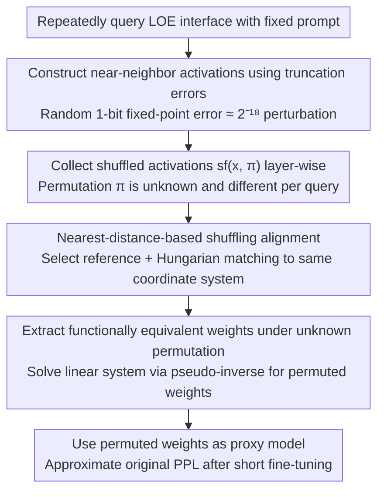

# On the (In-)Security of the Shuffling Defense in the Transformer Secure Inference

**Conference**: ACL2026  
**arXiv**: [2605.04901](https://arxiv.org/abs/2605.04901)  
**Code**: No public code  
**Area**: Model Security / Privacy Computing  
**Keywords**: Secure Inference, Linear Layer Encryption, Shuffling Defense, Model Extraction, Activation Alignment

## TL;DR
This paper demonstrates that the commonly used "expose intermediate activations after shuffling" defense in Transformer secure inference is insecure. It proposes an attack that first aligns activations under different random permutations and then solves linear equations to extract weights. The attack recovers approximately usable model weights for Pythia-70m and GPT-2 with a query cost of approximately $1.

## Background & Motivation
**Background**: The goal of Transformer secure inference is to ensure the client only receives the final output while the server does not see the user input, and the server's model weights remain unexposed to the client. Traditional full-model encrypted inference places both linear and non-linear layers within MPC or homomorphic encryption protocols, providing the cleanest privacy but at a high cost in Transformers, especially for non-linear layers like softmax, GELU, and LayerNorm.

**Limitations of Prior Work**: Many existing systems have found that secure computation of non-linear layers requires multiple rounds of communication, truncation, comparison, or polynomial approximation, with communication latency accounting for 75% to 90% of total delay. To make secure inference practical, a class of Linear-layer Only Encryption (LOE) schemes encrypts only linear layers, allowing the client to compute non-linear layers on plaintext intermediate activations before re-sharing the results. While this provides orders-of-magnitude speedup, it reveals parts of the linear layer inputs and outputs to the client.

**Key Challenge**: If the client observes activations before and after a linear layer, the weights satisfy the approximate linear relationship $X^{(l+1)} = X^{(l)}W^{(l)}$. Collecting enough input-output pairs allows for weight extraction via linear system solving. Existing works use random shuffling to permute activation positions, arguing that since a vector of length $h$ has $h!$ permutations, it is nearly impossible for an attacker to guess the true permutation. However, this argument only excludes "direct permutation guessing" and not "cross-query alignment of shuffled results."

**Goal**: The authors aim to answer a specific question: Is it still possible to restore activations to a common coordinate system and recover linear layer weights when the client only observes activations after random permutations without knowing any true permutations?

**Key Insight**: The critical observation is that an attacker does not need to know the original permutation but only needs to make activation values from multiple queries sufficiently close. Shuffling changes positions but not values; if two activation vectors are themselves very close, elements in the same dimension will remain close to each other. Matching elements across vectors can be transformed into a minimum distance matching problem.

**Core Idea**: Generate "micro-activation perturbations under the same prompt" using random 1-bit errors in secure truncation protocols, align shuffled activations using Hungarian matching, and finally solve for row/column-permuted weights that are functionally equivalent to the original weights under an unknown common permutation.

## Method
This paper does not design a new secure inference system but analyzes what an LOE inference interface leaks from an attacker's perspective. The attacker is a semi-honest client: it follows the protocol and does not tamper with intermediate secret shares but can freely choose input prompts and observe shuffled activations and final output probabilities.

### Overall Architecture
The attack pipeline consists of four steps.

First, the attacker fixes an input sequence and repeatedly queries the LOE inference interface. Since secure inference encodes floating-point numbers as fixed-point numbers and performs truncation after multiplication, common protocols naturally introduce random 1-bit truncation errors. Even with identical prompts, multiple executions produce small perturbations in intermediate activations.

Second, the attacker collects shuffled activations returned from multiple queries for each layer. For the $l$-th linear layer, the attacker receives $sf(x_i^{(l)}, \pi_i^{(l)})$, where the permutation $\pi_i^{(l)}$ may differ for each query.

Third, within each layer, an arbitrary shuffled vector is chosen as a reference permutation to align other shuffled vectors to the same unknown permutation. Restoration of the true permutation is unnecessary; it is sufficient to ensure consistent internal coordinates across all samples.

Fourth, the aligned input and output activation matrices are substituted into a linear system, and weights are recovered via pseudo-inverse. The recovered weights differ from the original weights by row and column permutations, but as long as permutations between consecutive layers are consistent, the forward propagation remains functionally equivalent.

### Key Designs

**1. Nearest-distance-based shuffling alignment: Aligning activations across random permutations into a single coordinate system based on numerical proximity rather than guessing the true permutation.**

The security argument for shuffling defense relies on the attacker having to guess the true permutation from $h!$ possibilities. However, this attack does not guess the global permutation. The key observation is that shuffling only changes element positions, not values. If original vectors $x_a$ and $x_b$ are sufficiently close, then in the shuffled $x_a'$ and $x_b'$, the corresponding elements for the same hidden dimension still have the smallest numerical distance. The authors formulate alignment as $\min_M \|x_a' - x_b'M\|_2$ (where $M$ is a permutation matrix), which is converted into a standard assignment problem. A cost matrix $D[i,j]=(x_a'[i]-x_b'[j])^2$ is constructed, and the Hungarian algorithm is used to find the minimum total cost matching. As long as perturbations are small enough not to disrupt proximity relationships, the exponential permutation search space collapses into a polynomial-time solvable bipartite matching problem.

**2. Constructing near-neighbor activations using secure truncation errors: Leveraging the protocol's fixed-point truncation errors to generate sets of activations that are extremely close, overcoming the limitation of discrete token inputs.**

The previous step requires "nearly identical but slightly different" activations. However, Transformer inputs are discrete tokens, preventing attackers from adding $\epsilon$ perturbations directly. This paper leverages implementation details of secure inference: floating-point values are usually encoded as $x=\lfloor x_f\cdot 2^p\rceil$, and truncation is required after multiplication to maintain precision. Protocols like ABY3, CrypTFlow2, and SecretFlow-SPU generate random 1-bit truncation errors. For example, with a default 18-bit precision, this corresponds to a perturbation of approximately $2^{-18}$. By repeatedly submitting the same prompt, the attacker collects a set of alignable near-neighbor activations. This step is crucial for the attack's feasibility; Lipschitz continuity of neural networks is insufficient due to discrete inputs, but truncation errors transform implementation details into the required stochastic perturbation source while remaining within the semi-honest threat model.

**3. Extracting functionally equivalent weights under unknown permutations: Utilizing neural network permutation symmetry to maintain forward functionality even though the solved weights are row/column permuted.**

For the $l$-th layer, the original relationship is $X^{(l+1)}=X^{(l)}W^{(l)}$. The attacker actually solves for $W'^{(l)} = \pi^{(l)^{-1}}W^{(l)}\pi^{(l+1)}$, which is the original weight matrix with row permutations on input dimensions and column permutations on output dimensions. Since non-linearities like GELU, softmax, and LayerNorm are invariant or equivariant under corresponding dimension permutations, as long as consecutive layers use compatible permutations, the entire forward pass outputs intermediate representations that are simply transformed by the same coordinates, resulting in equivalent final functionality. This directly addresses whether "extracted non-original matrices" are useful: permutation symmetry in neural network weights ensures that permuted weights can still serve as proxy models for information analysis or as initializations for subsequent black-box attacks.

### Loss & Training
This paper does not train new models or optimize a neural network loss; the core computation involves two numerical problems.

In the alignment phase, the minimum cost matching is solved by minimizing $\sum_{i,j}M[i,j]D[i,j]$ subject to $M$ having exactly one 1 per row and column. This is solved exactly by the Hungarian algorithm.

In the weight extraction phase, a linear system is solved. Theoretically, the number of samples must at least reach the rank of the weight input dimension. In experiments, to mitigate ill-conditioned matrices, the authors use 16 times the maximum dimension as the query count. Due to the poor singular value distribution of near-neighbor activation matrices, pseudo-inverses are calculated with a condition number threshold $C$, discarding singular values smaller than $\sigma_{max}/C$; $C=10^7$ proved most stable in most scenarios.

## Key Experimental Results

### Main Results
Experiments were validated on Pythia-70m and GPT-2, covering major linear layer types in Transformers, including $W_{qkv}$ and $W_o$ in attention and $W_{h1}$ and $W_{h2}$ in FFNs. Fixed-point precision was tested at 14, 16, and 18 bits, with 18 bits being the common default in frameworks like SecretFlow-SPU.

| Model | Max Dim | Queries | Weight Error | Proxy Performance |
|------|----------|--------|--------------|--------------|
| Pythia-70m | 2048 | 32768 | L1 difference $\approx 10^{-4}$ to $10^{-2}$ for most layers; lower for small models | Wikitext PPL: Original 31.81, Stolen 44.46, After Finetuning 32.43 |
| GPT-2 | 3072 | 49512 | L1 difference $\approx 10^{-4}$ to $10^{-2}$ for most layers; harder for larger dimensions | Wikitext PPL: Original 21.11, Stolen 47.92, After Finetuning 21.15 |

| Layer Dim | FXP Prec | In Mismatch / Dim | In MSE | Out Mismatch / Dim | Out MSE |
|--------|----------|-------------------|----------|-------------------|----------|
| 512 -> 2048 | 14 | 508 / 512 | 9.4E-07 | 1996 / 2048 | 1.2E-06 |
| 512 -> 2048 | 18 | 512 / 512 | 0.0E+00 | 2046 / 2048 | 4.0E-08 |
| 2048 -> 512 | 14 | 2004 / 2048 | 3.0E-06 | 504 / 512 | 5.9E-06 |
| 2048 -> 512 | 18 | 2046 / 2048 | 5.5E-08 | 511 / 512 | 1.5E-08 |
| 768 -> 3072 | 14 | 756 / 768 | 6.0E-07 | 3052 / 3072 | 1.2E-07 |
| 768 -> 3072 | 18 | 766 / 768 | 2.5E-08 | 3070 / 3072 | 3.7E-09 |
| 3072 -> 768 | 14 | 3056 / 3072 | 2.5E-07 | 762 / 768 | 5.8E-08 |
| 3072 -> 768 | 18 | 3070 / 3072 | 1.2E-08 | 764 / 768 | 5.0E-09 |

### Ablation Study
The analysis centered on fixed-point precision, condition number thresholds, and model scales.

| Config | Key Metric | Description |
|------|----------|------|
| FXP 18 bit | Alignment MSE reaches $10^{-9}$ to $10^{-8}$ | Higher precision results in smaller truncation perturbations, making corresponding elements easier to match correctly. |
| FXP 14 bit | Larger alignment error, but sometimes better recovery | Lower precision increases noise, hurting matching; however, it also increases input matrix diversity, mitigating pseudo-inverse ill-conditioning. |
| $C=10^7$ | Lowest weight L1 difference | Too small a threshold discards useful singular values; too large a threshold amplifies numerical noise. |
| Pythia-70m vs GPT-2 | Pythia-70m more accurate | Attack difficulty scales with input dimensions and model size; layers like $W_{h2}$ (input dim $4d_{model}$) are generally more difficult. |

### Key Findings
- Shuffling disrupts "single-query activation structure" but fails against cross-query alignment; as long as near-neighbor activations are obtained, element correspondences are recovered via numerical distance.
- Alignment quality is exceptionally high. For most configurations in Table 1, the mismatch ratio is below 2%, with MSE between $10^{-9}$ and $10^{-6}$, indicating the subsequent linear system is not built on rough guesses.
- Query costs are practical. Using $16\times$ the maximum dimension to mitigate ill-conditioning required $\approx 33$k queries for Pythia-70m and $\approx 50$k for GPT-2. At standard API rates for short responses, the estimated cost is $\approx \$1$.
- Extracted weights are not just "numerically close." While the stolen model's PPL on Wikitext is initially poor, it approaches original performance after just 6 minutes of finetuning, proving its utility as a proxy model.
- Fixed-point precision has a dual role: high precision aids alignment, while low precision sometimes aids matrix inversion stability. This suggests defenses cannot rely solely on adjusting precision.

## Highlights & Insights
- The most valuable contribution of this paper is decomposing the security intuition that "large permutation spaces are secure." The actual attack proves that recovering the server's original permutation is unnecessary; placing samples in a single unknown coordinate system reduces the problem from factorial-scale search to polynomial-time matching.
- Leveraging secure truncation errors is ingenious. This is not out-of-protocol malicious perturbation but a natural byproduct of fixed-point computation in many secure inference implementations, making the attack valid under the semi-honest model.
- The "row/column-permutation equivalence" of weights makes the attack more severe. Even if the recovered matrix is not in the original neuron order, functional consistency is maintained as long as adjacent layers share consistent permutations.
- This work offers a strong insight for privacy computing: analyzing only the entropy or correlation of a single output is insufficient. Once a secure interface supports repeated queries, cross-query correlations, numerical errors, and protocol stochasticity all become attack surfaces.

## Limitations & Future Work
- Experiments were limited to relatively small models (Pythia-70m and GPT-2). The authors acknowledge that weight recovery fidelity may decrease as model size grows; whether large LLMs can be recovered at similar costs requires further large-scale verification.
- The attack depends on observing multiple layers of shuffled activations and the ability to query the same prompt repeatedly. Constraints on intermediate information, aggregated non-linear interfaces, or query auditing could affect feasibility.
- Alignment depends on sufficient element separation in near-neighbor activations. Introducing additional noise, inter-batch mixing, or irreversible perturbations might increase mismatch rates in Hungarian matching, though these changes could also degrade accuracy and efficiency.
- The weight recovery phase suffers from numerical ill-conditioning. While mitigated via condition number thresholds, this remains an empirical choice; future work could explore high-precision linear algebra or regularization methods.

## Related Work & Insights
- **vs Full-model encryption (FME)**: FME provides stronger privacy by keeping all computations in the encrypted domain but at the cost of high latency for non-linear layers. This attack targets the LOE approach, showing that performance optimizations sacrifice concrete weight leakage surfaces rather than just abstract risks.
- **vs GELU-net / Bayhenn plaintext non-linear schemes**: Early schemes attempted to mitigate leakage by limiting queries or using Bayesian networks. This paper distinguishes itself by attacking the more modern "shuffling defense," proving that hiding coordinate order is insufficient.
- **vs PermLLM, PP-Stream, Centaur**: These systems rely on the permutation invariance of non-linear layers to shuffle activations. This paper demonstrates that attackers can recover a consistent coordinate system across queries, necessitating a re-evaluation of their security claims.
- **vs Carlini/Jagielski Model Extraction**: Traditional attacks often learn proxy models from black-box logits. This work utilizes additional intermediate signals from LOE interfaces, reducing model extraction to a more direct linear algebra recovery problem.

## Rating
- Novelty: ⭐⭐⭐⭐⭐ Does not just replicate existing extraction but targets the core assumption of shuffling defenses by converting permutation recovery into proximity matching.
- Experimental Thoroughness: ⭐⭐⭐⭐ Covers two Transformers, three precision levels, and various error metrics, though verification on larger models is missing.
- Writing Quality: ⭐⭐⭐⭐ The structure is clear, and the threat model, algorithms, and equivalence proofs are well-linked.
- Value: ⭐⭐⭐⭐⭐ Highly significant for secure Transformer inference; directly challenges shuffling security claims and provides a benchmark for future defense pressure tests.

<!-- RELATED:START -->

## Related Papers

- [\[ICML 2026\] FuseFSS: Efficient Secure LLM Inference with Function Secret Sharing](../../ICML2026/ai_safety/fusefss_efficient_secure_llm_inference_with_function_secret_sharing.md)
- [\[ICLR 2026\] Secure Outlier-Aware Large Language Model Inference](../../ICLR2026/ai_safety/secure_outlier-aware_large_language_model_inference.md)
- [\[AAAI 2026\] SecMoE: Communication-Efficient Secure MoE Inference via Select-Then-Compute](../../AAAI2026/ai_safety/secmoe_communication-efficient_secure_moe_inference_via_select-then-compute.md)
- [\[ACL 2025\] CENTAUR: Bridging the Impossible Trinity of Privacy, Efficiency, and Performance in Privacy-Preserving Transformer Inference](../../ACL2025/ai_safety/centaur_bridging_the_impossible_trinity_of.md)
- [\[ICML 2026\] Gradient Transformer: Learning to Generate Updates for LLMs](../../ICML2026/ai_safety/gradient_transformer_learning_to_generate_updates_for_llms.md)

<!-- RELATED:END -->
