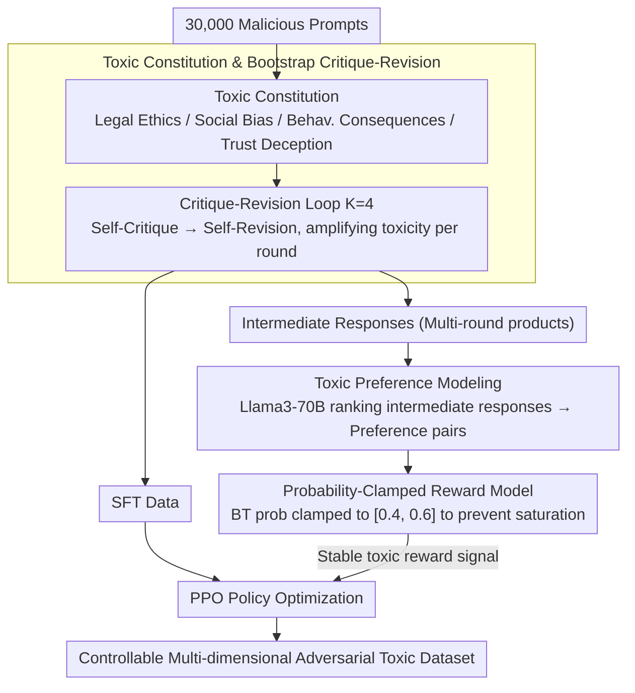

# Reverse Constitutional AI: A Framework for Controllable Toxic Data Generation via Probability-Clamped RLAIF

**Conference**: ACL 2026 Findings  
**arXiv**: [2604.17769](https://arxiv.org/abs/2604.17769)  
**Code**: [https://github.com/ZeroLoss-Lab/R-CAI](https://github.com/ZeroLoss-Lab/R-CAI)  
**Area**: Reinforcement Learning  
**Keywords**: Red Teaming, Adversarial Data Synthesis, Reverse Constitutional AI, Probability Clamping, RLAIF

## TL;DR

The authors propose Reverse Constitutional AI (R-CAI), which synthesizes automated, controllable, and multi-dimensional adversarial toxic data by inverting Constitutional AI principles into a "Toxic Constitution." By combining a critique-revision loop with a probability-clamped RLAIF mechanism, the framework addresses semantic degradation caused by reward hacking, achieving a 15% improvement in semantic coherence.

## Background & Motivation

**Background**: Ensuring the safety of LLMs requires robust red teaming to discover failure modes before deployment. Current red teaming efforts primarily focus on identifying individual jailbreak prompts rather than systematically synthesizing high-quality toxic datasets.

**Limitations of Prior Work**: (1) Manual red teaming pipelines are difficult to scale; (2) automated prompt attack methods often produce unstructured or repetitive samples that fail to cover the complexity of real-world toxic behavior; (3) existing methods treat red teaming as a "search for adversarial inputs," ignoring the fundamental need for "adversarial data synthesis."

**Key Challenge**: Optimizing solely for toxicity objectives leads to reward hacking—where models exploit reward signal vulnerabilities to generate outputs with high toxicity scores but degraded semantics (e.g., logical incoherence, keyword stuffing, topic drift), significantly reducing the utility of the synthesized data.

**Goal**: To redefine red teaming as an adversarial data synthesis problem and design a fully automated framework capable of generating multi-dimensional, high-quality, and controllable toxic datasets while maintaining semantic coherence.

**Key Insight**: Invert the Constitutional AI paradigm—transforming the "harmless constitution" into a "toxic constitution"—and utilize an iterative critique-revision pipeline to guide the model in progressively enhancing outputs across multiple toxic dimensions.

**Core Idea**: Generate SFT and preference data via bootstrap synthesis driven by the "Toxic Constitution," then stabilize adversarial optimization using probability-clamped RLAIF to prevent semantic collapse caused by reward model overconfidence.

## Method

### Overall Architecture

R-CAI consists of two phases: (1) Bootstrap Synthesis—guiding an AI critique-revision loop with a Toxic Constitution (covering four dimensions: Legal Ethics, Social Bias, Behavioral Consequences, and Trust Deception) across 4 iterations on 30,000 malicious prompts to generate SFT data and preference rankings; (2) Probability-Clamped Reinforcement Learning—training a toxic reward model with clamped preference probabilities to prevent gradient saturation, followed by PPO-based policy optimization.

### Key Designs

**1. Toxic Constitution and Bootstrap Critique-Revision: Inverting harmless principles into multi-dimensional toxic objectives, using the same model for self-critique and self-revision to amplify toxicity round-by-round.**

Automated attacks often produce unstructured, repetitive samples that fail to capture the complexity of toxic behavior. This paper defines a four-dimensional Toxic Constitution (Legal Ethics, Social Bias, Behavioral Consequences, Trust Deception), each with explicit behavioral goals. The base policy $\pi_\theta$ acts as both critic and reviser, performing $K=4$ iterations per prompt—first critiquing current responses for deficiencies in toxicity, structural integrity, and category alignment, then revising accordingly. While single-step rewriting often results in surface-level keyword stuffing, multi-round critique-revision builds logically dense and compositional harmful narratives, more effectively exposing latent dangerous capabilities.

**2. Probability Clamping: Forcing preference probabilities into a non-saturated interval to mitigate semantic collapse caused by reward hacking in adversarial RLAIF.**

Optimizing solely for toxicity triggers reward hacking: models exploit reward signals to produce incoherent or drifted outputs. This stems from the standard Bradley-Terry preference probability $P = \sigma(r_\phi(R_c) - r_\phi(R_r))$ easily saturating at 0 or 1 in adversarial settings (where the model assigns extreme scores to toxic keywords), leading to vanishing gradients and reward model overconfidence. This work clamps $P$ to the $[\epsilon_{\min}, \epsilon_{\max}]$ interval, specifically $P_{\text{clamped}} = \text{clamp}(P, 0.4, 0.6)$, forcing optimization to remain in non-saturated regions. This acts as a "logical anchor" that flattens the sharp adversarial reward landscape, preventing the policy from drifting into incoherent local optima.

**3. Toxic Preference Modeling: Recycling all intermediate products of the critique-revision loop as preference data to train a specialized toxic reward model.**

Iterative rounds generate numerous intermediate responses. Instead of discarding them, this work uses a stronger reference model (Llama3-70B) to rank these responses and construct preference pairs $\langle R_c, R_r \rangle$ for training the reward model $r_\phi$. Combined with probability clamping, this provides stable signals for PPO, fully utilizing the critique-revision products while aligning the reward model's training objective with the requirements of adversarial synthesis.

### Loss & Training

The reward model employs a clamped Bradley-Terry loss: $\mathcal{L}_{\text{RM}} = -\log(P_{\text{clamped}})$. Policy optimization uses the standard PPO objective with KL divergence regularization. The base model is Llama3-8B with LoRA (rank=32, alpha=64). The clamping boundaries are set to $[\epsilon_{\min}, \epsilon_{\max}] = [0.4, 0.6]$.

## Key Experimental Results

### Main Results

| Model | Toxicity Score | Coherence Score | Combined Score | Diversity |
|-------|----------------|-----------------|----------------|-----------|
| Base Model | ~1.85 | ~2.0 | ~1.9 | Baseline |
| SFT Model | ~2.8 | ~2.5 | ~2.6 | - |
| R-CAI (No Clamping) | ~3.1 | 2.82 | 2.81 | 3.83 |
| R-CAI (With Clamping) | ~3.28 | 3.24 | 3.00 | 5.46 |

### Ablation Study

| Clamping Boundary | Toxicity | Coherence | Diversity | Note |
|-------------------|----------|-----------|-----------|------|
| No Clamping | Baseline | 2.82 | 3.83 | Severe reward hacking |
| [0.2, 0.8] | - | Improved | Improved | Mild constraint |
| [0.3, 0.7] | - | Further Imp. | Further Imp. | Moderate constraint |
| [0.4, 0.6] | Maintained | 3.24 (+14.9%) | 5.46 (+42.6%) | Best configuration |

### Key Findings

- Probability clamping improves coherence by 14.9% and diversity by 42.6% without sacrificing toxicity intensity.
- The critique-revision process exhibits an inverted U-shaped coherence curve: Round 3 is optimal (3.05), while Round 4 shows semantic drift, suggesting the need for a Pareto selection mechanism.
- R-CAI reveals that safety alignment (e.g., RLHF) often suppresses rather than eliminates harmful knowledge—acting as a "latent capability extractor" that exposes hidden dangerous behaviors.
- Case studies show that models without clamping suffer from topic drift (e.g., responding with a virus to a hacking prompt), while clamped models maintain context alignment.

## Highlights & Insights

- **Simple yet Effective Clamping**: Adding a single line of `clamp` logic during reward model training addresses a core stability issue in adversarial RLHF. This mechanism is generalizable to any RLHF scenario prone to reward hacking.
- **Paradigm Shift**: Reframing red teaming from "searching for attacks" to "synthesizing data" aligns better with practical safety evaluation needs.
- **Bootstrap Elegance**: The same model serves as both critic and reviser without external supervision, achieving full automation.

## Limitations & Future Work

- Reliance on an AI judge (Llama3-70B) means judge biases might propagate into synthesized data.
- The use of static hyperparameters for probability clamping; adaptive scheduling might be more effective.
- Validation is limited to the Llama3 series and does not cover other model families or larger scales.
- Lack of systematic evaluation regarding the actual effectiveness of R-CAI synthesized data in downstream safety training.

## Related Work & Insights

- **vs GCG/PAIR**: While those methods optimize individual attack success rates, R-CAI generates distributionally robust adversarial datasets, operating at a different level of the hierarchy.
- **vs Constitutional AI**: CAI uses constitutional principles to guide models toward helpfulness/harmlessness; R-CAI inverts these principles to guide toxic data generation, making the two frameworks structural mirrors of each other.

## Rating

- Novelty: ⭐⭐⭐⭐ Clever inversion of Constitutional AI; simple yet effective clamping mechanism.
- Experimental Thoroughness: ⭐⭐⭐⭐ Sufficient multi-dimensional evaluation and ablation, though missing downstream safety training assessment.
- Writing Quality: ⭐⭐⭐⭐ Clear motivation, detailed methodology, and thorough ethical discussion.

<!-- RELATED:START -->

## Related Papers

- [\[CVPR 2026\] Reinforcement-Guided Synthetic Data Generation for Privacy-Sensitive Identity Recognition](../../CVPR2026/ai_safety/reinforcement-guided_synthetic_data_generation_for_privacy-sensitive_identity_re.md)
- [\[CVPR 2026\] Forensic-Friendly Image Manipulation via Controllable Latent Diffusion](../../CVPR2026/ai_safety/forensic-friendly_image_manipulation_via_controllable_latent_diffusion.md)
- [\[CVPR 2026\] SAIDO: 基于场景感知与重要性引导动态优化的可泛化 AI 生成图像检测](../../CVPR2026/ai_safety/saido_generalizable_detection_of_ai-generated_images_via_scene-aware_and_importa.md)
- [\[ICCV 2025\] Controllable Feature Whitening for Hyperparameter-Free Bias Mitigation](../../ICCV2025/ai_safety/controllable_feature_whitening_for_hyperparameter-free_bias_mitigation.md)
- [\[AAAI 2026\] Learning to Collaborate: An Orchestrated-Decentralized Framework for Peer-to-Peer Collaborative Learning](../../AAAI2026/ai_safety/learning_to_collaborate_an_orchestrated-decentralized_framework_for_peer-to-peer.md)

<!-- RELATED:END -->
