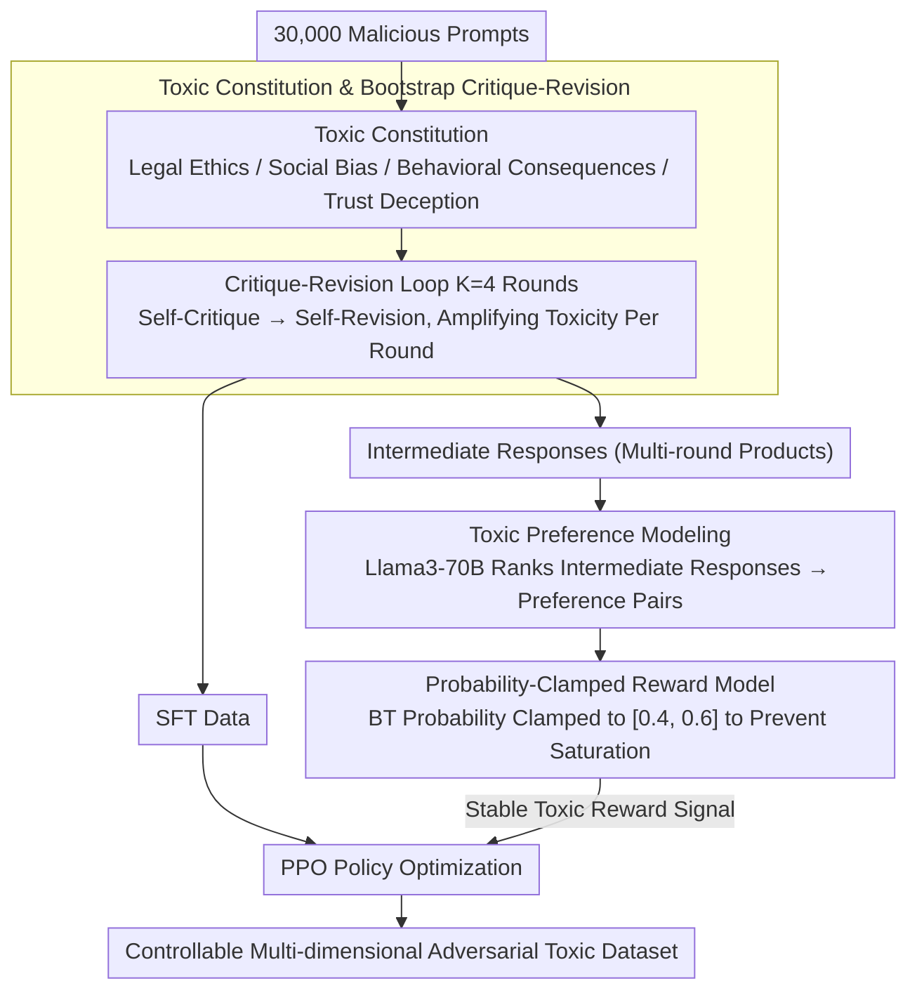

# Reverse Constitutional AI: A Framework for Controllable Toxic Data Generation via Probability-Clamped RLAIF

**Conference**: ACL 2026 Findings  
**arXiv**: [2604.17769](https://arxiv.org/abs/2604.17769)  
**Code**: [https://github.com/ZeroLoss-Lab/R-CAI](https://github.com/ZeroLoss-Lab/R-CAI)  
**Area**: Reinforcement Learning  
**Keywords**: Red Teaming, Adversarial Data Synthesis, Reverse Constitutional AI, Probability Clamping, RLAIF

## TL;DR

This paper proposes Reverse Constitutional AI (R-CAI), which synthesizes automated, controllable, and multi-dimensional adversarial toxic data by inverting the principles of Constitutional AI into a "Toxic Constitution." Combined with a critique-revision loop and a probability-clamped RLAIF mechanism, R-CAI effectively mitigates semantic degradation caused by reward hacking, achieving a 15% improvement in semantic coherence.

## Background & Motivation

**Background**: Ensuring the safety of LLMs requires robust red teaming to discover failure modes before deployment. Existing red teaming efforts primarily focus on discovering individual jailbreak prompts rather than systematically synthesizing high-quality toxic datasets.

**Limitations of Prior Work**: (1) Manual red teaming pipelines are difficult to scale; (2) automated prompt attack methods often produce unstructured or repetitive samples that fail to cover the complexity of real-world toxic behaviors; (3) current approaches treat red teaming as a "search for adversarial inputs" problem, ignoring the more fundamental need for "adversarial data synthesis."

**Key Challenge**: Optimizing solely for toxicity objectives leads to reward hacking—where models exploit reward signal vulnerabilities to generate outputs with high toxicity scores but degraded semantics (e.g., logical incoherence, keyword stuffing, and topic drift), significantly reducing the utility of the synthesized data.

**Goal**: Redefine red teaming as an adversarial data synthesis problem and design a fully automated framework capable of generating multi-dimensional, high-quality, and controllable toxic datasets while maintaining semantic coherence.

**Key Insight**: Invert the Constitutional AI paradigm by transforming a "harmless constitution" into a "toxic constitution," utilizing an iterative critique-revision pipeline to guide the model toward progressively stronger outputs across multiple toxicity dimensions.

**Core Idea**: Generate SFT data and preference data through "toxic constitution"-driven bootstrap synthesis, followed by stabilized adversarial optimization using probability-clamped RLAIF to prevent semantic collapse caused by reward model overconfidence.

## Method

### Overall Architecture

R-CAI consists of two stages: (1) Bootstrap Synthesis—using a toxic constitution (four dimensions: legal ethics, social bias, behavioral consequences, and trust deception) to guide an AI critique-revision loop, performing four iterations of enhancement on 30,000 malicious prompts to generate SFT and preference ranking data; (2) Probability-Clamped RL—clamping preference probabilities during toxic reward model training to prevent gradient saturation, followed by PPO to optimize the policy model.

### Key Designs

**1. Toxic Constitution & Bootstrap Critique-Revision: Inverting harmless principles into multi-dimensional toxic objectives, using the same model for self-critique and self-revision to amplify toxicity iteratively.**

Samples from automated attacks are often unstructured and repetitive, failing to cover complex toxic behaviors. This work defines a four-dimensional toxic constitution (legal ethics, social bias, behavioral consequences, and trust deception), each paired with explicit behavioral goals. The base policy $\pi_\theta$ serves as both critic and reviser, performing $K=4$ iterations for each prompt—critiquing the current response for deficiencies in toxicity intensity, structural integrity, and category alignment, then revising accordingly. Unlike single-step rewriting that only adds surface-level keywords, multi-round critique-revision constructs logically rigorous and compositional harmful narratives, more thoroughly exposing hidden dangerous model capabilities.

**2. Probability Clamping: Forcing preference probabilities into a non-saturated interval to cure semantic collapse caused by reward hacking in adversarial RLAIF.**

Optimizing solely for toxicity triggers reward hacking: models exploit reward signals to generate outputs with high toxicity scores but poor logic and keyword stuffing. The root cause is that the standard Bradley-Terry preference probability $P = \sigma(r_\phi(R_c) - r_\phi(R_r))$ easily saturates to 0 or 1 in adversarial settings (where the model assigns extreme scores to toxic keywords), leading to vanishing gradients and reward model overconfidence. By clamping $P$ to the interval $[\epsilon_{\min}, \epsilon_{\max}]$, i.e., $P_{\text{clamped}} = \text{clamp}(P, 0.4, 0.6)$, the optimization is forced to remain in non-saturated regions. This adds a "logical anchor" to the sharp, non-smooth adversarial reward landscape, flattening it and preventing the policy from drifting towards incoherent high-reward local optima.

**3. Toxic Preference Modeling: Recycling all intermediate products from multi-round critique-revision as preference data to train a specialized toxic reward model.**

Iterative loops generate numerous intermediate responses; using only the final output wastes valuable signals. R-CAI uses a stronger reference model (Llama3-70B) to score and rank these intermediate responses, constructing preference pairs $\langle R_c, R_r \rangle$ to train the reward model $r_\phi$. Combined with probability clamping, this provides a stable toxic reward signal for PPO policy optimization, fully utilizing the critique-revision products while aligning the reward model with the actual needs of adversarial synthesis.

### Loss & Training

The reward model employs the clamped Bradley-Terry loss $\mathcal{L}_{\text{RM}} = -\log(P_{\text{clamped}})$. Policy optimization uses the standard PPO objective with KL-divergence regularization. The base model is Llama3-8B with LoRA configuration (rank=32, alpha=64). The clamping boundaries are set as $[\epsilon_{\min}, \epsilon_{\max}] = [0.4, 0.6]$.

## Key Experimental Results

### Main Results

| Model | Toxicity Score | Coherence Score | Combined Score | Diversity |
|------|---------|-----------|---------|--------|
| Base Model | ~1.85 | ~2.0 | ~1.9 | Baseline |
| SFT Model | ~2.8 | ~2.5 | ~2.6 | - |
| Ours (No Clamping) | ~3.1 | 2.82 | 2.81 | 3.83 |
| Ours (Clamped) | ~3.28 | 3.24 | 3.00 | 5.46 |

### Ablation Study

| Clamping Boundary | Toxicity | Coherence | Diversity | Description |
|---------|------|--------|--------|------|
| No Clamping | Baseline | 2.82 | 3.83 | Severe reward hacking |
| [0.2, 0.8] | - | Gain | Gain | Light constraint |
| [0.3, 0.7] | - | Further Gain | Further Gain | Moderate constraint |
| [0.4, 0.6] | Maintain | 3.24 (+14.9%) | 5.46 (+42.6%) | Optimal configuration |

### Key Findings

- Probability clamping improves coherence by 14.9% and diversity by 42.6% without sacrificing toxicity intensity.
- The critique-revision process exhibits an inverted U-shaped coherence curve: Round 3 is optimal (3.05), while Round 4 shows semantic drift, proving the need for a Pareto selection mechanism.
- R-CAI reveals that safety alignment (e.g., RLHF) often merely suppresses rather than eliminates harmful knowledge—this framework acts as a "latent capability extractor" to expose hidden dangerous behaviors.
- Case analysis shows that models without clamping suffer from topic drift (answering a hacking question with virus-related content), while clamped models maintain context alignment.

## Highlights & Insights

- **Simple yet Effective Probability Clamping**: Adding a single line of clamping in reward model training resolves the core stability issue in adversarial RLHF. This mechanism is not limited to toxicity and can be generalized to any RLHF training prone to reward hacking.
- **Paradigm Shift from "Search" to "Synthesis"**: Re-framing red teaming from finding individual jailbreaks to systematic data synthesis better serves practical safety assessment needs.
- **Elegance of Bootstrap Design**: Having the same model act as both critic and reviser removes the need for external supervision and achieves full automation.

## Limitations & Future Work

- Reliance on AI judges (Llama3-70B); biases in the judge model may propagate into the synthesized data.
- Probability clamping uses static hyperparameters; adaptive scheduling strategies might perform better.
- Validated only on the Llama3 series; coverage of other model families and larger scales is missing.
- Lack of systematic evaluation regarding the actual effectiveness of R-CAI generated data in downstream safety training.

## Related Work & Insights

- **vs GCG/PAIR Attack Methods**: While these methods optimize individual attack success rates, R-CAI generates distributionally robust adversarial datasets, targeting a different level of the problem.
- **vs Constitutional AI**: CAI guides models toward helpfulness through constitutional principles; R-CAI mirrors this by inverting principles to guide the generation of toxic data.

## Rating

- Novelty: ⭐⭐⭐⭐ The idea of inverting Constitutional AI is clever, and probability clamping is simple and effective.
- Experimental Thoroughness: ⭐⭐⭐⭐ Multi-dimensional evaluation, ablation of clamping, and case studies are comprehensive, though downstream safety training evaluation is missing.
- Writing Quality: ⭐⭐⭐⭐ Motivation is clear, methodology is detailed, and ethical discussions are thorough.

<!-- RELATED:START -->

## Related Papers

- [\[CVPR 2026\] Reinforcement-Guided Synthetic Data Generation for Privacy-Sensitive Identity Recognition](../../CVPR2026/ai_safety/reinforcement-guided_synthetic_data_generation_for_privacy-sensitive_identity_re.md)
- [\[ICLR 2026\] A Bayesian Nonparametric Framework for Private, Fair, and Balanced Tabular Data Synthesis](../../ICLR2026/ai_safety/a_bayesian_nonparametric_framework_for_private_fair_and_balanced_tabular_data_sy.md)
- [\[ICML 2026\] Memetic Capture: A Pluralistic Policy Framework for Governing AI-Driven Cultural Disempowerment](../../ICML2026/ai_safety/memetic_capture_a_pluralistic_policy_framework_for_governing_ai-driven_cultural_.md)
- [\[ICLR 2026\] Nasty Adversarial Training: A Probability Sparsity Perspective for Robustness Enhancement](../../ICLR2026/ai_safety/nasty_adversarial_training_a_probability_sparsity_perspective_for_robustness_enh.md)
- [\[CVPR 2026\] Unsafe2Safe: Controllable Image Anonymization for Downstream Utility](../../CVPR2026/ai_safety/unsafe2safe_controllable_image_anonymization_for_downstream_utility.md)

<!-- RELATED:END -->
