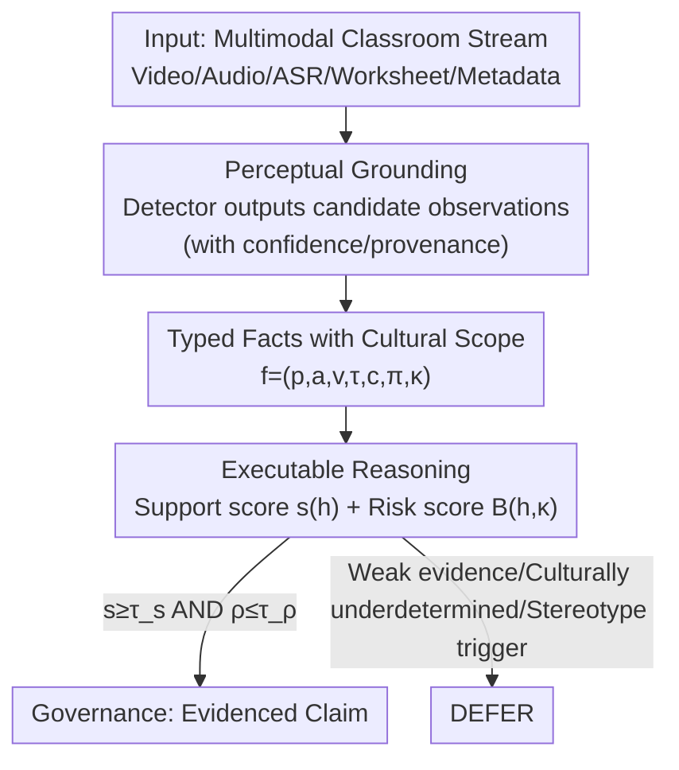

# Signals Are Not States: Neuro-Symbolic Safeguards for Culturally Aware Classroom AI

**Conference**: ACL 2026  
**arXiv**: [2603.22793](https://arxiv.org/abs/2603.22793)  
**Code**: None (Position/Method paper, implementation not open-sourced)  
**Area**: AI Safety / Fairness / Neuro-symbolic Reasoning  
**Keywords**: Classroom AI, Stereotypes, Neuro-symbolic, Cultural Scope, Deferral

## TL;DR
The paper argues that classroom AI should not directly interpret culturally contextualized signals such as "silence, averted gaze, or code-switching" as educational judgments like "low engagement, inattention, or low ability." It proposes the NSCR neuro-symbolic framework: mapping multimodal signals into typed facts with uncertainty, provenance, and **cultural scope**, followed by executable reasoning and governance policies to generate evidence-based claims, while **actively deferring (DEFER)** when evidence is insufficient or stereotype risks are high.

## Background & Motivation
**Background**: Large Language Models (LLMs) and Multimodal Foundation Models are entering educational settings as classroom assistants, teacher dashboards, and discussion summarization tools. The mainstream approach in Multimodal Learning Analytics (MMLA) follows a "low-level detection + direct label prediction" pipeline—estimating gaze, posture, speech, facial activity, or linguistic content, and then mapping these signals to a downstream classroom judgment (e.g., "the student is confused/disengaged").

**Limitations of Prior Work**: Educational constructs like engagement, confusion, collaboration quality, and teaching quality are unlike "object categories"—they are not directly visible but are "theory-laden" interpretations inferred from local evidence and shaped by local pedagogy, classroom norms, linguistic practices, and grade levels. A student not looking at the board might be looking at a worksheet, discussing with a peer, avoiding direct eye contact out of respect, waiting for a conversational turn, or translating in their head. However, the segment from signal to claim in existing systems is "hardly formalized": when it labels a learner as "confused/disengaged/uncooperative/low linguistic ability," it often fails to clarify which evidence played a role, what cultural assumptions were invoked, how uncertainty propagated, or when it should have deferred.

**Key Challenge**: In multicultural and multilingual classrooms, culturally contextualized behaviors are quietly converted into **educational stereotypes** regarding effort, ability, discipline, linguistic proficiency, or teacher quality. The root problem is that existing pipelines blend "observable evidence" and "culture-laden interpretation" into the same learning representation—end-to-end classifiers fold evidence into activations, while long-context LLMs bury evidence in prompts. Neither can answer which specific observation supported a claim or whether a cultural assumption was implicitly invoked.

**Goal**: (1) Define "stereotype-prone classroom inference" as a cross-cultural **safety problem**; (2) Provide a framework that separates observable evidence from construct-level claims; (3) Propose an evaluation agenda and metrics for cultural variation.

**Key Insight**: The central observation of the authors is: **Signals Are Not States**. A system should be able to state that "the student did not speak during this discussion phase" (an observable fact), but it **should not** infer "low engagement" without support from "opportunity to participate, task context, linguistic context, and cultural scope."

**Core Idea**: Use a neuro-symbolic architecture to insert an **auditable typed fact layer** between "signals" and "judgments," making uncertainty, provenance, and cultural scope first-class citizens, and treating "deferral" as a safety behavior rather than a failure.

## Method

### Overall Architecture
NSCR (Neuro-symbolic Classroom Reasoning) decomposes classroom inference into four serial stages. The core design principle is to maintain the separation between the three layers of representation: **observable facts → construct hypotheses → stereotype-risk claims**. The system can choose to report a lower layer while refusing to output a higher one.

A classroom session is modeled as a multimodal stream $X=\{X^{v}_{1:T}, X^{a}_{1:T}, X^{\ell}_{1:T}, X^{c}\}$, representing vision, audio, linguistic content (ASR/translation/worksheets), and contextual metadata (seating layout, subject, activity phase, language configuration, region, local rubrics, etc.). Unlike direct end-to-end prediction, NSCR introduces explicit intermediate objects: a perceptual grounding module $g_m$ converts raw streams into candidate observations $\mathcal{O}=\bigcup_{m\in\mathcal{M}} g_m(X)$, an abstraction operator $\Gamma$ maps candidate observations to symbolic facts $\mathcal{F}=\Gamma(\mathcal{O}, X^c)$, and an executable reasoner $R$ under policy $\mathcal{P}$ returns $(\hat{y}, \mathcal{E}, s, \rho)$—the prediction, evidence trace, support score $s$, and stereotype risk score $\rho$.

The entire design philosophy is intentionally conservative: biasing the system toward "saying less with evidence" rather than "saying more without it."

### Key Designs

**1. Signals $\neq$ States: Three-Layer Representation Separation**

This addresses the fundamental pain point of signals being directly read as states. NSCR distinguishes three layers: **observable facts** are grounded events (e.g., talk turns, gaze targets, help-seeking, shared tool use, teacher questions); **construct hypotheses** are tentative educational interpretations (e.g., "confusion candidate," "opportunity to participate," "collaboration segment"); **stereotype-risk claims** are unsupported or culturally over-generalized attributions (e.g., "low effort," "low ability," "poor discipline," "low linguistic proficiency," "weak teaching"). The system is designed to keep these separate; crucially, `OBS(student_4, silent, true)` is **not equivalent** to `CLAIM(student_4, disengaged, true)`—the former is an observation, while the latter is a claim requiring further contextual evidence. The paper provides a stereotype taxonomy (Table 1) listing dangerous shortcuts, cross-cultural issues, and symbolic safety valves for six categories (engagement, linguistic proficiency, participation, collaboration, discipline, teacher practice).

**2. Typed Facts with Cultural Scope and Uncertainty**

To address the issue where end-to-end evidence is buried in activations, each fact is represented as a 7-tuple $f=(p,a,v,\tau,c,\pi,\kappa)$, where $p$ is the predicate, $a$ the arguments, $v$ the value, $\tau$ the time interval, $c\in[0,1]$ the confidence, $\pi$ the provenance (detector name, modality, source segment), and $\kappa$ the **cultural or deployment scope** for which the fact/rule is intended. There are two constraints: facts must be close enough to detector outputs for auditing but far enough from raw signals to remain educationally meaningful; and the vocabulary must distinguish between observations and claims (using six predicate families: OBS, EVENT, REL, CONTEXT, CLAIM, POLICY). Design Principle P2 (Uncertainty Propagation) requires carrying detector confidence and translation noise through the pipeline; weak evidence cannot be "hardened" into confident claims. P3 (Explicit Cultural Scope) requires that **if a rule is used outside its scope, it triggers a confidence downgrade or deferral**—preventing upstream errors (like ASR failure in code-switching) from turning into learner-level judgments.

**3. Executable Reasoning and Stereotype Risk Scoring**

Instead of invisible activations, complex queries are synthesized by LLMs from symbolic facts into **executable reasoning programs**. These programs become auditable artifacts constrained by schemas and "blocked claim" policies. For example, a "confusion" program might require a recent teacher question + a failed attempt + help-seeking. The support score is a confidence-weighted average minus violation penalties:

$$s(h)=\frac{\sum_{f\in\operatorname{supp}(h)} w_f c_f}{\sum_{f\in\operatorname{supp}(h)} w_f}-\Big(\lambda_v V(h)+\lambda_p P(h)+\lambda_b B(h,\kappa)\Big)$$

Where $V(h)$ counts logical/temporal violations, $P(h)$ policy violations, and $B(h,\kappa)$ estimates stereotype risk under cultural scope. The risk term is formalized as the sum of known dangerous shortcuts from Table 1:

$$B(h,\kappa)=\sum_{r\in\mathcal{R}}\alpha_r\,\mathbf{1}[h\sim r]\,\bigl(1-\sigma_r(h,\kappa)\bigr)$$

$\mathbf{1}[h\sim r]$ indicates if hypothesis $h$ matches shortcut $r$ (e.g., "silence → disengagement"), and $\sigma_r(h,\kappa)\in[0,1]$ measures whether "contextual evidence endorsing $r$ (opportunity, task context, language config)" actually exists in scope $\kappa$. Thus, risk peaks when a hypothesis matches a stereotypical shortcut while the permitting context is missing.

**4. Deferral as Safety: The Governance Layer**

NSCR treats governance as a mitigation layer rather than an afterthought. The output policy is a piecewise function:

$$\text{output}=\begin{cases}\hat{y}, & s(\hat{y})\geq\tau_s,\ \Delta\geq\tau_\Delta,\ \rho(\hat{y})\leq\tau_\rho\\ \texttt{DEFER}, & \text{otherwise}\end{cases}$$

The system only outputs a claim if the support score is high ($s\geq\tau_s$), the margin over the runner-up is sufficient ($\Delta\geq\tau_\Delta$), and the stereotype risk is low ($\rho\leq\tau_\rho$). P4 defines **deferral as a first-class safety behavior**: refusing to answer under weak evidence or cultural indeterminacy is not a failure mode but a safety requirement. P5 (Privacy by Construction) makes symbolic traces the default unit of retention instead of raw video/audio, making auditing and deletion more controllable than end-to-end embeddings.

### A Walkthrough Example
Consider "avoiding engagement stereotypes": a dashboard that only counts talk turns might mislabel quiet students as "disengaged." In NSCR, **participation opportunity** is an independent reasoning goal. The system checks if the floor was open, if the student was blocked by overlapping speech, if the activity phase expected individual turns, and if local norms consider "public oral speech" a primary signal of engagement. If these conditions are not met, the system may report "no talk turns observed" (observable fact) but **must not** infer "low engagement" (construct claim). This explicitly blocks the dangerous shortcut "low talk turns → low effort" listed in Table 1.

## Key Experimental Results
> ⚠️ This is a **methodology/position paper** focusing on the "framework + evaluation agenda." It does not present empirical results from model runs; instead, it provides comparative positioning and proposed safety metrics.

### Positioning of NSCR vs. Mainstream Paradigms (Table 2)
The comparison focuses on auditability, uncertainty, and cultural scope rather than raw prediction accuracy.

| Attribute | E2E Multimodal Classifier | Prompt-only Multimodal LLM | NSCR (Ours) |
|------|------|------|------|
| Evidence Trace | None, labels only | NL rationale (can be hallucinated) | Explicit typed facts + Executable programs |
| Uncertainty | Implicit in logits | Verbalized, often unreliable | Propagated per fact and aggregated into $s$ |
| Cultural Scope | Not represented | Ad-hoc, only if in prompt | First-class attribute $\kappa$ of facts/rules |
| Deferral | Thresholded scores | Inconsistent, prompt-susceptible | Policy-enforced DEFER |
| Auditability | Low | Medium (rationales may be unfaithful) | High (verifiable facts + programs) |
| Privacy/Retention | Raw features retained | Raw context in prompt | Symbolic traces as default retention |

### Proposed Stereotype Safety Metrics
The paper argues that evaluation should happen at the reasoning and governance levels. It introduces three safety metrics to be reported **alongside** task accuracy.

| Metric | Definition | Meaning |
|------|------|------|
| Stereotype Leakage Rate (SLR) | $\Pr(\mathrm{SP}(\hat{y})\mid\hat{y}\neq\texttt{DEFER})$ | Proportion of non-deferral outputs that are stereotype-prone |
| Unsupported Attribution Rate (UAR) | $\Pr(\mathrm{UNSUP}(\hat{y})\mid\hat{y}\neq\texttt{DEFER})$ | Proportion of non-deferral outputs lacking sufficient evidence |
| Cultural Calibration Gap (CCG) | $\max_g\operatorname{ECE}_g-\min_g\operatorname{ECE}_g$ | The maximum disparity in calibration error across deployment groups |

### Key Findings
- The paper proposes an evaluation agenda across six task families (Table 3): culturally-conditioned state inference, evidence-grounded claim verification, multilingual/code-switching reasoning, cross-cultural collaboration analysis, counterfactual cultural robustness, and culturally-conditioned red-teaming.
- Evaluation is tiered into five levels: perception quality (mAP/F1/WER), grounding fidelity, stereotype risk (SLR/UAR/CCG), reliability under deferral, and human utility/policy compliance.
- Core claim: Classroom AI must move from "black-box label prediction" toward "verifiable, culture-aware, and responsibility-scoped" linguistic technology—drawing fewer conclusions, but ensuring every conclusion is backed by evidence.

## Highlights & Insights
- **Elevating Deferral to a Safety Goal**: While most systems treat "no answer" as a failure, this paper treats it as a first-class output with computable triggers (support/margin/risk thresholds), which is vital for high-stakes education.
- **Formalized Stereotype Risk** $B(h,\kappa)$: The intuition that "risk is highest when a shortcut is matched but permitting context is missing" is turned into an explicit formula, making "fairness" more actionable than a mere slogan.
- **Cultural Scope $\kappa$ as a First-Class Attribute**: Automatically downgrading rules used outside their scope is a clean mechanism to prevent cross-cultural misuse of norms.
- **Privacy by Construction**: Using symbolic traces instead of raw video for retention makes data minimization an architectural default rather than just a compliance requirement, which is highly valuable for data involving minors.

## Limitations & Future Work
- **Lack of Empirical Validation**: As a framework/position paper, it lacks SLR/UAR/CCG numbers from real classroom data. Calibrating thresholds ($\tau$) and weights ($\lambda, \alpha$) remains an open empirical question.
- **Schema Validity**: If chosen predicates do not correspond to meaningful constructs in the target context, the system might produce "tidy but misleading" explanations.
- **High Labeling Costs**: Construct alignment and cultural grounding require much richer labels (multi-stakeholder perspectives, local educator input) than simple detection benchmarks.
- **Surveillance Risks**: While symbolic traces are safer than raw video, they still encode sensitive information about minors and teachers. A neuro-symbolic pipeline does not solve the fundamental question of "whether monitoring should occur."

## Related Work & Insights
- **vs. Multimodal Learning Analytics (MMLA)**: Typical MMLA fuses signals into a unified representation for direct prediction; this paper shifts focus to multimodal reasoning over evidence within cultural scopes, prioritizing auditability and deferral.
- **vs. E2E Classifiers / Long-Context LLMs**: E2E models are unauditable; LLMs degrade when relevant evidence is buried in distractors and perform unevenly across languages. NSCR trades some flexibility for calibrated uncertainty and explicit cultural scope.
- **vs. NLP Bias Benchmarks (CrowS-Pairs, BBQ)**: Traditional benchmarks are often text-only and task-specific. This paper brings the stereotype problem into the multimodal, pedagogical, and locally contextualized classroom setting.

## Rating
- Novelty: ⭐⭐⭐⭐☆ Formalizing "Signals $\neq$ States" and stereotype risk as computable terms is highly novel.
- Experimental Thoroughness: ⭐⭐☆☆☆ Strictly a framework/agenda paper; no empirical results or calibrated thresholds.
- Writing Quality: ⭐⭐⭐⭐☆ Arguments are clear; the taxonomy and positioning tables are well-organized; example programs are effective.
- Value: ⭐⭐⭐⭐☆ Provides an auditable, deferral-enabled blueprint for high-stakes educational AI, with clear methodological value.

<!-- RELATED:START -->

## Related Papers

- [\[ICLR 2026\] Towards a Certificate of Trust: Task-Aware OOD Detection for Scientific AI](../../ICLR2026/ai_safety/towards_a_certificate_of_trust_task-aware_ood_detection_for_scientific_ai.md)
- [\[CVPR 2026\] Scaling Up AI-Generated Image Detection with Generator-Aware Prototypes](../../CVPR2026/ai_safety/scaling_up_ai-generated_image_detection_with_generator-aware_prototypes.md)
- [\[ICML 2026\] Where Rectified Flows Leak: Characterising Membership Signals Along the Interpolation Path](../../ICML2026/ai_safety/where_rectified_flows_leak_characterising_membership_signals_along_the_interpola.md)
- [\[ICML 2026\] Privacy Amplification in Differentially Private Zeroth-Order Optimization with Hidden States](../../ICML2026/ai_safety/privacy_amplification_in_differentially_private_zeroth-order_optimization_with_h.md)
- [\[CVPR 2026\] SAIDO: Scene-Aware and Importance-Guided Dynamic Optimization for Generalizable AI-Generated Image Detection](../../CVPR2026/ai_safety/saido_generalizable_detection_of_ai-generated_images_via_scene-aware_and_importa.md)

<!-- RELATED:END -->
