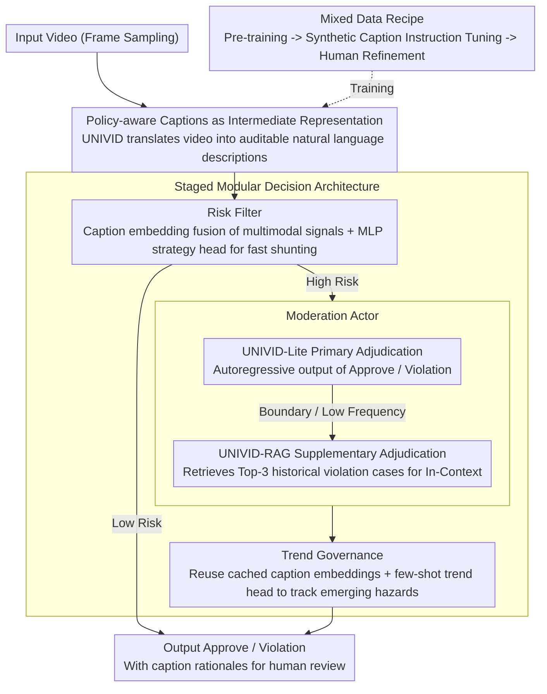

# UniVid: Unified Vision-Language Model for Video Moderation

**Conference**: ACL 2026  
**arXiv**: [2606.05748](https://arxiv.org/abs/2606.05748)  
**Code**: N/A (Authors do not open-source for safety considerations)  
**Area**: AI Safety / Content Moderation  
**Keywords**: Video Moderation, Vision-Language Models, Policy Alignment, Content Understanding, Model Compression

## TL;DR

UniVid evolves video moderation systems from unmaintainable "fragmented" architectures to interpretable and reusable "end-to-end" moderation systems by replacing 1,000+ black-box classifiers with a unified policy-aware captioning VLM. In ByteDance production deployment, it reduced violation leakage by 42.7% compared to traditional solutions.

## Background & Motivation

**Background**: Content moderation systems for global short-video platforms typically use large-scale clusters of specialized classifiers, with each classifier independently trained and maintained for a specific policy (e.g., violence, pornography, harassment).

**Limitations of Prior Work**: This "decentralized" approach faces three dilemmas. First, decision scores generated by thousands of black-box classifiers are difficult to explain to human auditors, lacking transparency. Second, whenever platform policies are updated or optimized, these classifiers must be retrained and redeployed, incurring high maintenance costs. Finally, these models operate in silos, unable to share semantic understanding, which complicates synergy with other business lines like advertising and recommendation.

**Key Challenge**: A fundamental tension exists between "high accuracy" and "ease of maintenance" in traditional classifier schemes—increasing the number of classifiers improves detection precision for certain fine-grained policies but simultaneously makes the system more complex and difficult to maintain.

**Goal**: Design a unified Vision-Language Model (VLM) that not only accurately understands video content but also generates **verifiable natural language rationales**, enabling humans to intuitively understand the basis of moderation decisions.

**Key Insight**: The authors observe that while modern VLMs (e.g., LLaVA) possess powerful multimodal understanding capabilities, open-source models often "over-refuse" to describe violating content due to safety alignment, and commercial VLMs (GPT-4o, Gemini) have extremely high deployment costs (over $3,000 per million videos). Fine-tuning a VLM with a carefully designed "data recipe" to safely describe violations under internal safety policy constraints could solve multiple problems at once.

**Core Idea**: Use a specialized fine-tuned VLM to generate policy-aligned video captions as a unified intermediate representation for all downstream decisions. Captions serve as both human-readable evidence and reusable semantic features.

## Method

### Overall Architecture

To solve the industrial-grade moderation predicament where "1,000+ black-box classifiers operate in silos, lack interpretability, and suffer from exploding maintenance costs," UniVid consolidates all policy judgments into a fine-tuned VLM. The model first translates the video into policy-aware natural language captions, serving as both human-readable evidence and reusable semantic features. When a video enters the system, it flows through a three-stage cascaded pipeline: the upstream Risk Filter uses UNIVID caption embeddings to fuse multimodal signals for rapid shunting via an MLP policy head; the mid-stream Moderation Actor uses UNIVID-Lite for primary adjudication and UNIVID-RAG for supplementary fine-grained decisions on high-risk videos; the downstream Trend Governance reuses cached caption embeddings with few-shot heads to track emerging hazard trends, ultimately outputting Approve/Violation decisions and auditable caption rationales.

### Key Designs

**1. Mixed Data Recipe: Real violating videos are scarce and legally sensitive, making it difficult to collect sufficient training samples covering all policies.**

The paper reduces data costs through three-stage training: stage one uses public LLaVA data for pre-training to align vision-text modalities; stage two performs instruction tuning on GPT-4o generated captions and synthetic VQA pairs (3.2M samples); stage three applies further fine-tuning using high-quality human-refined captions (0.1M samples) to strengthen policy alignment. The key is not volume but the 0.1M human-refinement stage, focusing on two tasks: factual correction (removing hallucinations, completing subject action details, and OCR) and policy grounding (mapping content to specific internal policy clauses). A mixture is used because pure GPT-4o captions have hallucinations and narrow policy coverage, while pure human labeling is expensive and lacks generalization. This scheme allows humans to "refine" rather than "label" from scratch, saving costs while maintaining policy consistency. Ablations confirm this: removing synthetic data drops violation recall by 16.8%, and using only human data results in a 26.1% drop.

**2. Policy-aware Captions as Intermediate Representation: Traditional classification scores are black boxes; auditors cannot verify why "Violence=0.87" holds.**

UNIVID does not output numerical predictions but generates descriptive text like "three men riding a red motorcycle" as a unified intermediate layer for all downstream decisions. These captions are both objective statements and implicit mappings to policies—humans can verify violations at a glance. Thus, the system evolves from a "black-box neural network" into a "human-in-the-loop" auditable process. These captions can also be reused by other business lines like ad safety and recommendation systems. Compared to black-box classifiers, this natural language intermediate representation retains original evidence and returns final decision power to humans, meeting modern content governance requirements for transparency and accountability.

**3. Staged Modular Decision Architecture: A single model cannot simultaneously achieve high recall, high precision, and low latency as these objectives are inherently conflicting.**

The paper optimizes each stage independently. UNIVID-Lite is the primary actor, fine-tuned on 1M labeled videos to directly output Approve/Violation via autoregressive generation. UNIVID-RAG acts as the secondary reviewer, retrieving Top-3 similar cases from a 100K historical violation knowledge base as In-Context examples to capture low-frequency and boundary violations, boosting recall. Trend Governance is lightweight—it trains only an MLP trend head reusing cached UNIVID caption embeddings, allowing it to adapt to emerging threats with few-shot learning. This allows the Risk Filter to relax thresholds for recall, the Moderation Actor to strictly adjudicate for precision, and Trend Governance to focus on adaptation speed, with each module responsible for its own metric without being torn by conflicting goals.

### A Complete Example

Consider a "borderline" short video: it first enters the Risk Filter, where UNIVID generates the caption "two people arguing and pushing in a room." The caption embedding is fed into the violence policy head, yielding a high risk score, allowing it to pass to the Moderation Actor. UNIVID-Lite reads the caption and judges it as a borderline case with low confidence. UNIVID-RAG then retrieves 3 similar historical "physical conflict" cases as In-Context prompts, eventually providing a Violation decision and attaching the caption as evidence for human review. If a new type of borderline content emerges, Trend Governance only needs to fine-tune its trend head using a few new samples while reusing cached embeddings, incorporating these videos into risk control without retraining the main model.

### Loss & Training

UNIVID adopts the standard autoregressive causal language modeling objective. Given video frames $V$ and a target caption $C$ of length $L$, the joint probability is maximized: $P(C | T_{\text{in}}, V_{\text{in}}) = \prod_{i=1}^{L} P(C_i | H_t, H_v, C_{<i})$. During the pre-training phase, only the MLP projection layer is trained while the vision encoder and LLM are frozen. In the fine-tuning phase, both the projection layer and the LLM decoder are trained. The total training time was 120 hours using 32 H100 GPUs. Mistral-v0.3-7B was chosen as the LLM backbone.

## Key Experimental Results

### Main Results

| Model | Violence | Sexual Abuse | Mental Health | Regulated Act. | Violation Recall | Recall | Precision | F1 |
|------|------|------|---------|----------|-----------|--------|--------|-----|
| GPT-4o | 45.9 | 17.4 | 32.3 | 42.5 | 36.1 | 32.8 | 65.5 | 37.4 |
| Gemini-2.5-Pro | 63.8 | 44.3 | 55.6 | 57.6 | 55.1 | 42.5 | 95.2 | 57.9 |
| LLaVA-OV 8B | 17.8 | 6.9 | 12.9 | 15.7 | 13.0 | 12.0 | 86.3 | 19.3 |
| **UNIVID-7B** | **56.3** | **51.3** | **50.2** | **57.7** | **54.3** | **28.9** | **82.3** | **39.1** |
| UNIVID-1B | 53.6 | 49.1 | 49.9 | 55.3 | 52.1 | 27.4 | 82.8 | 37.5 |

UNIVID-7B outperforms the open-source baseline LLaVA-OV across the board in violation recall (54.3% vs. 13.0%), with particularly strong performance in sensitive domains like sexual abuse and mental health.

### Ablation Study

| Configuration | Violence | Sexual Abuse | Mental Health | Regulated Act. | Violation Recall |
|------|------|------|---------|----------|-----------|
| UNIVID-7B (Full Model) | 56.3 | 51.3 | 50.2 | 57.7 | 54.3 |
| w/o Mixed Data | 37.9 | 35.5 | 33.5 | 41.1 | 37.5 |
| Human Data Only | 29.1 | 22.9 | 18.9 | 29.4 | 26.1 |

The mixed data recipe is critical—removing synthetic data leads to a 16.8% drop in violation recall, while using only human data shows the worst generalization (recall dropping to 26.1%).

### Production Results

| Metric | Before | After | Relative Change |
|------|--------|--------|----------|
| Violation Leakage Rate | 0.255% | 0.146% | -42.7% ↓ |
| Over-deletion Rate | 35.4% | 22.3% | -37.0% ↓ |
| Deployment Cost (per 1M videos) | - | $180 | 1/15 of Commercial VLMs |
| Replaced Specialized Classifiers | 1000+ | 1 | Significant Reduction in Complexity |
| Recovered GPU Resources | - | 1900 A30 GPUs | Computational Efficiency Gain |

## Highlights & Insights

- **The Brilliance of Captions as Intermediate Representation**: This design is the most clever aspect of the paper. Instead of making the VLM directly output "Violation/Approve," it generates natural language descriptions. This transforms the entire system from a "black-box neural network" to an "auditable human-machine collaboration process"—humans can read the captions to judge based on policy or provide feedback to identify model blind spots.
- **Restrained Mixed Data Recipe**: The authors did not greedily collect massive amounts of real violating videos but intelligently mixed GPT-4o synthetic data with human refinement. Human labeling is not from scratch but corrects GPT hallucinations and aligns with internal policies.
- **Staged Decision-making Eliminates "Multi-objective Conflict"**: The Risk Filter relaxes thresholds to maximize recall, the Moderation Actor adjudicates strictly to maximize precision, and Trend Governance adapts quickly to handle emerging threats.

## Limitations & Future Work

**Author-Acknowledged Limitations**:

- The system currently does not integrate reinforcement learning methods (like GRPO). While policy-aware captions serve as reasoning trajectories, internal policy guidelines are not directly encoded as reward signals explicitly tied to the generation process.
- The system uses frame sampling rather than full temporal modeling, meaning violations appearing only in a single frame might be missed if not sampled.

**Own Observations**:

- Although the evaluation set is more globalized than previous benchmarks (like KuaiMod), it is still primarily derived from the short-video platform ecosystem.
- Consistency of violation descriptions in multiple languages remains to be verified.

**Future Directions**: Explicitly encode policy guidelines as LLM system prompts or fine-tuning objectives; explore more efficient temporal sampling strategies; perform out-of-distribution testing on real traffic across multiple regions and platforms.

## Related Work & Insights

- **vs. Traditional Video Moderation Systems** (e.g., Shi et al. 2024 end-to-end classifier clusters): They use thousands of independent classifiers, each corresponding to one policy; Ours uses a single VLM to generate captions before making decisions. The difference is that traditional schemes are "one model per policy," with maintenance costs growing linearly with policy count.
- **vs. Open-source VLMs (LLaVA-OV, LLaVA-Next)**: They pursue generality, while Ours is fine-tuned for violating content. LLaVA's strength is community support and general capability; Our strength is specialized optimization for violation detection—improving recall from 13% to 54%.
- **vs. Commercial VLMs (GPT-4o, Gemini-2.5-Pro)**: They have the strongest multimodal understanding but extremely high deployment costs and "refusal to generate" issues caused by safety guardrails; Ours is cheaper (1/15) and does not refuse to describe violating content due to safety alignment.
- **Insight**: The mixed data strategy and human-labeling framework in this paper have reference value for other data-constrained scenarios (e.g., rare diseases in medical imaging, edge cases in autonomous driving).

## Rating

- Novelty: ⭐⭐⭐⭐ Replacing specialized classifiers with a VLM is not a brand-new idea, but systematically implementing it in an industrial-scale moderation system—including data recipes, multi-stage decisions, and model variants—represents significant engineering innovation.
- Experimental Thoroughness: ⭐⭐⭐⭐⭐ Includes offline benchmarking, sandbox simulations, and ablation experiments. The CapBench dataset is also more comprehensive than prior benchmarks.
- Writing Quality: ⭐⭐⭐⭐ Clear structure; ethics and compliance sections are well-developed.
- Value: ⭐⭐⭐⭐⭐ This is the first report of a specialized VLM moderation system successfully deployed on an industrial-scale short-video platform, showing significant improvements in leakage rate, over-deletion rate, and cost compared to benchmark systems.

<!-- RELATED:START -->

## Related Papers

- [\[ACL 2026\] On the (In-)Security of the Shuffling Defense in the Transformer Secure Inference](on_the_in-security_of_the_shuffling_defense_in_the_transformer_secure_inference.md)
- [\[ACL 2026\] Reverse Constitutional AI: A Framework for Controllable Toxic Data Generation via Probability-Clamped RLAIF](reverse_constitutional_ai_a_framework_for_controllable_toxic_data_generation_via.md)
- [\[ACL 2026\] OmniCompliance-100K: A Multi-Domain Rule-Grounded Real-World Safety Compliance Dataset](omnicompliance-100k_a_multi-domain_rule-grounded_real-world_safety_compliance_da.md)
- [\[CVPR 2026\] COPYLENS: Towards Copyrighted Characters Infringement Detection via Copyright-Aware Prompt Learning](../../CVPR2026/ai_safety/copylens_towards_copyrighted_characters_infringement_detection_via_copyright-awa.md)
- [\[CVPR 2026\] TTP: Test-Time Padding for Adversarial Detection and Robust Adaptation on Vision-Language Models](../../CVPR2026/ai_safety/ttp_test-time_padding_for_adversarial_detection_and_robust_adaptation_on_vision-.md)

<!-- RELATED:END -->
