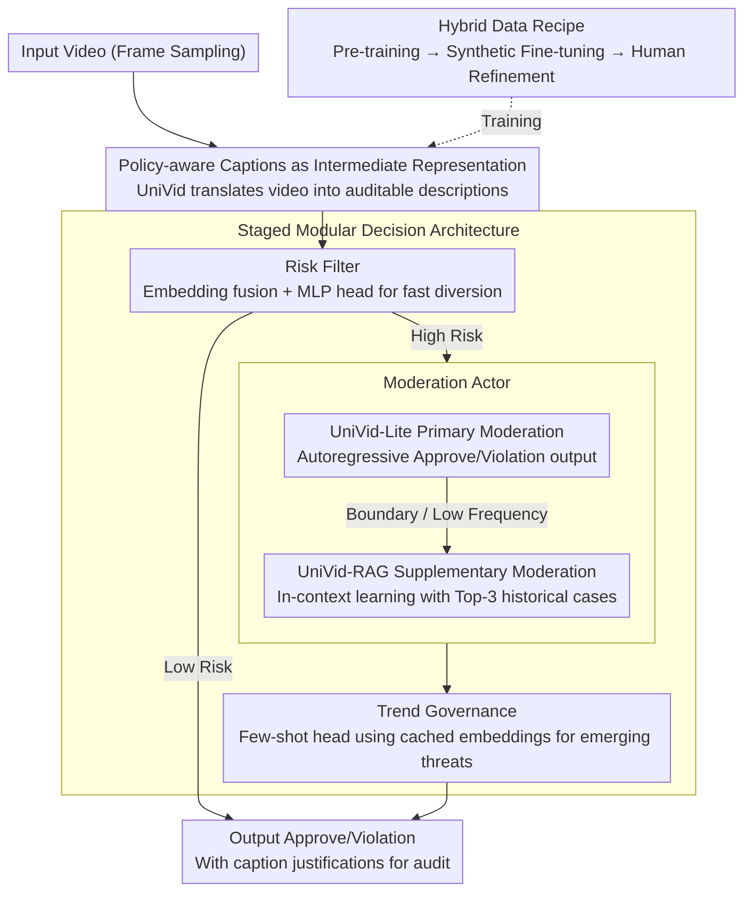

# UniVid: A Unified Vision-Language Model for Video Moderation

**Conference**: ACL 2026  
**arXiv**: [2606.05748](https://arxiv.org/abs/2606.05748)  
**Code**: N/A (not open-sourced by authors for safety reasons)  
**Area**: AI Safety / Content Moderation  
**Keywords**: Video Moderation, Vision-Language Models, Policy Alignment, Content Understanding, Model Compression

## TL;DR

UniVid evolves video moderation systems from unmaintainable "fragmented" architectures to interpretable, reusable "end-to-end" systems by replacing 1000+ black-box classifiers with a unified policy-aware captioning VLM, achieving a 42.7% reduction in violation leakage during production deployment on the ByteDance platform.

## Background & Motivation

**Background**: Content moderation systems for global short-video platforms typically employ massive families of specialized classifiers, where each classifier is independently trained and maintained for a specific policy (e.g., violence, pornography, harassment).

**Limitations of Prior Work**: This "decentralized" approach faces three major dilemmas. First, decision scores generated by thousands of black-box classifiers are difficult to explain to human auditors, lacking transparency. Second, whenever platform policies are updated or optimized, these classifiers must be retrained and redeployed, incurring extremely high maintenance costs. Finally, these models operate in silos and cannot share semantic understanding capabilities, making synergy with other business lines like advertising or recommendation difficult.

**Key Challenge**: There is a fundamental tension in traditional classifier schemes between "high accuracy" and "maintainability"—increasing the number of classifiers improves detection precision for certain fine-grained policies but simultaneously makes the system more complex and difficult to maintain.

**Goal**: To design a unified Vision-Language Model (VLM) that not only accurately understands video content but also generates **verifiable natural language justifications**, allowing humans to intuitively understand the basis for moderation decisions.

**Key Insight**: The authors observe that while modern VLMs (e.g., LLaVA) possess strong multimodal understanding, open-source models often "over-refuse" to describe violating content due to safety alignment, while commercial VLMs (GPT-4o, Gemini) are extremely expensive to deploy (costing over $3,000 per million videos). If a VLM could be fine-tuned with a carefully designed "data recipe" to safely describe violations under internal safety policy constraints, it could achieve multiple objectives at once.

**Core Idea**: Use a specialized fine-tuned VLM to generate policy-aligned video captions as a unified intermediate representation for all downstream decisions. Captions serve as both human-readable evidence and reusable semantic features.

## Method

### Overall Architecture

UniVid addresses the industrial moderation dilemma of "1000+ fragmented and unexplainable black-box classifiers" by unifying all policy judgments into a single fine-tuned VLM. The model first translates videos into policy-aware natural language captions, which serve as both human-readable evidence and reusable features. As videos enter the system, they flow through a three-stage cascaded pipeline—the upstream Risk Filter uses UniVid's caption embeddings to fuse multimodal signals and perform fast diversion via an MLP policy head; the midstream Moderation Actor utilizes UniVid-Lite for primary moderation and UniVid-RAG for supplementary moderation to make refined decisions; the downstream Trend Governance reuses cached caption embeddings and employs a few-shot head to track emerging hazard trends, ultimately outputting Approve/Violation decisions and auditable caption justifications.

### Key Designs

**1. Hybrid Data Recipe: Scarcity and legal sensitivity of real violation videos make it difficult to collect sufficient training samples covering all policies.**

The paper reduces data costs through three-stage training: the first stage involves pre-training on LLaVA public data to align vision-text modalities; the second stage performs instruction fine-tuning on captions and synthetic VQA pairs (3.2M samples) generated by GPT-4o; the third stage uses high-quality human-refined captions (0.1M samples) to further strengthen policy alignment. The key lies not in quantity but in the 0.1M human refinement step, which focuses on two tasks: factual correction (removing hallucinations, completing subject actions, and OCR) and policy grounding (mapping violation content to specific clauses in the internal policy library). A hybrid approach is chosen over single-source data because pure GPT-4o captions have high hallucinations and narrow policy coverage, while pure human data is expensive and generalizes poorly; the hybrid scheme allows humans to "refine" rather than "label" from scratch, saving costs while maintaining policy consistency. Ablations confirm this: removing synthetic data drops violation recall by 16.8%, and using only human data leads to a 26.1% drop.

**2. Policy-aware Captions as Intermediate Representation: Traditional classifier scores are black boxes, and auditors cannot verify why "Violence=0.87" holds.**

UniVid does not output numerical predictions but generates descriptive text, such as "three men riding a red motorcycle," as a unified intermediate layer for all downstream decisions. This caption serves as an objective statement of fact while implicitly mapping to policies—humans can judge violations at a glance. Consequently, the system transforms from a "black-box neural network" into a "human-in-the-loop" auditable process, and the same caption can be reused by other business lines like ad safety or recommendations. Compared to black-box classifiers, this natural language representation preserves original evidence and returns final decision-making power to humans, meeting modern content governance requirements for transparency and accountability.

**3. Staged Modular Decision Architecture: A single model cannot simultaneously achieve high recall, high precision, and low latency.**

The paper decouples goals by optimizing per stage. UniVid-Lite is the primary actor, fine-tuned on 1M labeled videos to directly output Approve/Violation in an autoregressive manner. UniVid-RAG is the supplementary actor, retrieving the Top-3 most similar cases from a 100K historical violation knowledge base as In-Context examples to capture low-frequency and boundary violations, boosting recall. Trend Governance is designed to be lightweight—training only an MLP trend head that reuses UniVid's cached caption embeddings, allowing it to adapt to emerging threats with few-shot learning. This allows the Risk Filter to prioritize recall, the Moderation Actor to prioritize precision, and Trend Governance to focus on adaptation speed, ensuring each module is responsible for its own metric without being torn by conflicting objectives.

### Loss & Training

UniVid employs a standard autoregressive causal language modeling objective. Given video frames $V$ and a target caption $C$ of length $L$, it maximizes the joint probability:
$$P(C | T_{\text{in}}, V_{\text{in}}) = \prod_{i=1}^{L} P(C_i | H_t, H_v, C_{<i})$$
During the pre-training stage, only the projection MLP layer is trained while freezing the vision encoder and LLM; during fine-tuning, both the projection layer and the LLM decoder are trained. The entire training took 120 hours using 32 H100 GPUs. Mistral-v0.3-7B was chosen as the LLM backbone.

## Key Experimental Results

### Main Results

| Model | Violence | Sexual Abuse | Mental Health | Regulated Acts | Violation Recall | Recall | Precision | F1 |
| :--- | :--- | :--- | :--- | :--- | :--- | :--- | :--- | :--- |
| GPT-4o | 45.9 | 17.4 | 32.3 | 42.5 | 36.1 | 32.8 | 65.5 | 37.4 |
| Gemini-2.5-Pro | 63.8 | 44.3 | 55.6 | 57.6 | 55.1 | 42.5 | 95.2 | 57.9 |
| LLaVA-OV 8B | 17.8 | 6.9 | 12.9 | 15.7 | 13.0 | 12.0 | 86.3 | 19.3 |
| **Ours-7B** | **56.3** | **51.3** | **50.2** | **57.7** | **54.3** | **28.9** | **82.3** | **39.1** |
| Ours-1B | 53.6 | 49.1 | 49.9 | 55.3 | 52.1 | 27.4 | 82.8 | 37.5 |

UniVid-7B significantly outperforms the open-source baseline LLaVA-OV in violation recall (54.3% vs 13.0%), with particularly strong performance in sensitive areas like sexual abuse and mental health.

### Ablation Study

| Configuration | Violence | Sexual Abuse | Mental Health | Regulated Acts | Violation Recall |
| :--- | :--- | :--- | :--- | :--- | :--- |
| Ours-7B (Full Model) | 56.3 | 51.3 | 50.2 | 57.7 | 54.3 |
| w/o Hybrid Data | 37.9 | 35.5 | 33.5 | 41.1 | 37.5 |
| Human data only | 29.1 | 22.9 | 18.9 | 29.4 | 26.1 |

The hybrid data recipe is crucial—removing synthetic data leads to a 16.8% drop in violation recall, while using only human data results in the worst generalization (recall dropping to 26.1%).

### Production Results

| Metric | Before | After | Gain |
| :--- | :--- | :--- | :--- |
| Violation Leakage Rate | 0.255% | 0.146% | -42.7% ↓ |
| Over-deletion Rate | 35.4% | 22.3% | -37.0% ↓ |
| Deployment Cost (per 1M videos) | - | $180 | 1/15 of Commercial VLM |
| Special Classifiers Replaced | 1000+ | 1 | Drastic Complexity Reduction |
| Freed GPU Resources | - | 1900 A30 units | Efficiency Gain |

## Highlights & Insights

- **The Brilliance of Captions as Intermediate Representation**: This is the cleverest design in the paper. Instead of forcing the VLM to output "Violation/Approve," it generates natural language descriptions. This transforms the system from a "black-box neural network" into an "auditable human-AI collaborative process"—humans can judge based on policy after reading the caption or provide feedback when models miss details.
- **Restrained Hybrid Data Recipe**: The authors did not greedily collect massive real violation videos but cleverly mixed GPT-4o synthetic data with human refinement. Human labeling was not done from scratch but used to correct GPT hallucinations and align with internal policies.
- **Staged Decisions Eliminate "Multi-objective Conflict"**: The Risk Filter relaxes thresholds to maximize recall, the Moderation Actor adheres to strict decisions to maximize precision, and Trend Governance adapts quickly to handle emerging threats.

## Limitations & Future Work

**Limitations acknowledged by the authors**:
- The system currently does not integrate reinforcement learning methods (e.g., GRPO). Although policy-aware captions act as reasoning trajectories, internal policy guidelines are not directly encoded as reward signals explicitly tied to the generation process.
- The system uses frame sampling rather than full temporal modeling, meaning violations appearing in only a single frame might be missed if not selected for sampling.

**Own observations on limitations**:
- While the evaluation set is more globalized than previous benchmarks (e.g., KuaiMod), it is still primarily derived from short-video platform ecosystems.
- The consistency of the model in multilingual violation descriptions still needs verification.

**Future Work**: Explicitly encode policy guidelines into LLM system prompts or fine-tuning targets; explore more efficient temporal sampling strategies; conduct out-of-distribution testing on real traffic across multiple regions and platforms.

## Related Work & Insights

- **vs. Traditional Moderation Systems** (e.g., Shi et al. 2024's end-to-end classifier families): They use thousands of independent classifiers per policy; this paper uses a single VLM to generate captions before decision-making. The difference is that traditional maintenance costs scale linearly with the number of policies.
- **vs. Open-source VLMs (LLaVA-OV, LLaVA-Next)**: They pursue generality, while this paper fine-tunes for violation content. LLaVA's strength is community support and general capability; this paper's strength is specialized optimization for violation detection—improving violation recall from 13% to 54%.
- **vs. Commercial VLMs (GPT-4o, Gemini-2.5-Pro)**: They have the strongest multimodal understanding but suffer from extremely high costs and "refusal to generate" caused by safety guardrails; the proposed model is cheaper (1/15) and does not refuse to describe violations due to safety alignment.
- **Insight**: The hybrid data strategy and human refinement framework in this paper are valuable for other data-constrained scenarios (e.g., rare diseases in medical imaging, edge cases in autonomous driving).

## Rating

- **Novelty**: ⭐⭐⭐⭐ Replacing specialized classifiers with a VLM is not entirely new, but systematizing it for industrial-scale moderation—including data recipes, multi-stage decisions, and model variants—is a significant engineering innovation.
- **Experimental Thoroughness**: ⭐⭐⭐⭐⭐ Includes offline benchmarking, sandbox simulations, and ablation studies; the CapBench dataset is more comprehensive than previous benchmarks.
- **Writing Quality**: ⭐⭐⭐⭐ Clear structure with well-addressed ethical and compliance sections.
- **Value**: ⭐⭐⭐⭐⭐ This is the first reported deployment of a specialized VLM moderation system on an industrial-scale short-video platform, showing significant improvements in leakage, over-deletion, and cost compared to benchmark systems.

<!-- RELATED:START -->

## Related Papers

- [\[ACL 2026\] On the (In-)Security of the Shuffling Defense in the Transformer Secure Inference](on_the_in-security_of_the_shuffling_defense_in_the_transformer_secure_inference.md)
- [\[ACL 2026\] Reverse Constitutional AI: A Framework for Controllable Toxic Data Generation via Probability-Clamped RLAIF](reverse_constitutional_ai_a_framework_for_controllable_toxic_data_generation_via.md)
- [\[ACL 2026\] OmniCompliance-100K: A Multi-Domain Rule-Grounded Real-World Safety Compliance Dataset](omnicompliance-100k_a_multi-domain_rule-grounded_real-world_safety_compliance_da.md)
- [\[CVPR 2026\] V-Attack: Targeting Disentangled Value Features for Controllable Adversarial Attacks on LVLMs](../../CVPR2026/ai_safety/v-attack_targeting_disentangled_value_features_for_controllable_adversarial_atta.md)
- [\[CVPR 2026\] A Provable Energy-Guided Test-Time Defense Boosting Adversarial Robustness of Large Vision-Language Models](../../CVPR2026/ai_safety/a_provable_energy-guided_test-time_defense_boosting_adversarial_robustness_of_la.md)

<!-- RELATED:END -->
