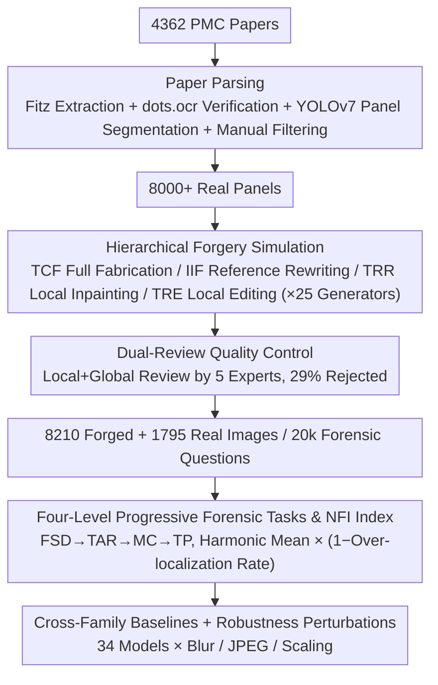

# AEGIS: A Holistic Benchmark for Evaluating Forensic Analysis of AI-Generated Academic Images

**Conference**: ACL 2026  
**arXiv**: [2604.28177](https://arxiv.org/abs/2604.28177)  
**Code**: https://github.com/BUPT-Reasoning-Lab/AEGIS (Available)  
**Area**: Image Generation / AIGC Detection / Academic Integrity  
**Keywords**: AI-generated image forensics, academic image, benchmark, MLLM, manipulation localization

## TL;DR
AEGIS is the first comprehensive benchmark for academic image forgery forensics, covering 7 major academic image categories with 39 subcategories, 4 forgery strategies (entirely fabricated, reference-based rewriting, local inpainting, and local editing), and 25 generative models. It proposes four tasks: forgery scope discrimination, text artifact recognition, manipulation type classification, and tampered pixel localization. Evaluating 25 MLLMs and 9 expert models reveals a structural complementarity: even GPT-5.1 achieves an overall score of only 48.80%, and expert models reach a pixel IoU of only 30.09%, highlighting that "generation evolves faster than forensics" and the trade-off between "MLLM reasoning vs. expert model sensitivity."

## Background & Motivation

**Background**: The misuse of AI-generated images in academic papers has become a new risk to publishing ethics (evidenced by retractions and public inquiries on Retraction Watch and PubPeer). Existing forensic methods fall into three categories: vision expert models based on frequency domain/diffusion processes/patch-level features (e.g., DRCT, DIRE, AIDE), MLLMs used as general discriminators, and hybrid solutions combining both (e.g., FakeShield, SIDA, FakeVLM).

**Limitations of Prior Work**: Existing benchmarks (e.g., GenImage, Semi-Truths, AIGIBench, DFBench, AIGuard) almost exclusively target general scenarios such as faces, scenes, or e-commerce. They adapt poorly to the "fine-grained structures, dense textures, and knowledge-intensive semantics" of academic images. Most only perform "real/fake" binary classification, ignoring the capabilities required for real academic reviews, such as **forgery scope, text anomalies, manipulation types, and pixel-level localization**.

**Key Challenge**: Academic image forensics is not a simple binary task but a chain of judgments from "global → local → pixel." Moreover, **expert models excel at low-level visual fingerprints but lack semantic reasoning, while MLLMs excel at semantic reasoning but lack low-level sensitivity.** No benchmark currently exposes the true weaknesses of both types of models simultaneously.

**Goal**: To build a comprehensive forensic benchmark dedicated to academia that can (1) systematically cover the diversity of 7 major academic image categories and 39 subcategories; (2) simulate 4 typical forgery strategies under 25 SOTA generators; and (3) differentiate model capabilities through 4 progressive tasks ranging from overall authenticity to pixel-level localization.

**Key Insight**: Extract 8,000 verified "panels" (the smallest indivisible unit of a figure) from over 4,000 open-source PubMed Central papers. Define 4 forgery strategies based on academic fraud scenarios, use 25 generative models to produce corresponding forged images, and then incorporate expert dual-review, automated quality assessment, and quantitative forensic metrics.

**Core Idea**: Treat academic image forensics as a "hierarchical evaluation + cross-modal orthogonal evaluation" and introduce the Normalized Forensic Index to incorporate multi-task consistency into the scoring.

## Method

### Overall Architecture
The construction of AEGIS consists of 3 stages, and the evaluation spans 4 dimensions: (1) **Paper Parsing**: Use Fitz to extract images and captions from 4,362 PMC papers, verify caption-image pairs with dots.ocr, and segment figures into minimal panels with YOLOv7. Experts manually filter non-academic or low-resolution content, resulting in 8,000+ labeled panels. (2) **Forgery Simulation**: Employ four strategies: Text-Constrained Fabrication (TCF), Image-Inference Fabrication (IIF), Tamper-Region Restoration (TRR), and Tamper-Region Editing (TRE), covering 25 generative models including Flux, Midjourney, DALL·E, GPT-Image-1, and Janus-Pro. (3) **Quality Control**: A dual-review process by 5 experts (local and global) filters out 29% of forged images, resulting in 8,210 high-quality forged samples and 1,795 real images, totaling 20k forensic questions. The evaluation side designs 4 progressive tasks: FSD (forgery scope discrimination: Real/Entire/Partial/Not Sure), TAR (text artifact recognition), MC (classification of insertion/deletion/editing in red-boxed regions), and TP (positioning via region-level bbox or pixel-level mask).

### Key Designs

**1. Hierarchically Simulated Academic-Specific Forgery Strategies: Real retraction cases only offer 2-3 usable examples, lacking structured labeling and edit traceability, which is insufficient for systematic evaluation.**

AEGIS uses synthetic data as a proxy for real data, ensuring forgery types mirror real fraudulent behavior with precisely controlled granularity. Four strategies spread across "global → local" and "text-driven → reference-driven" dimensions: TCF uses GPT-4o mini to rewrite real captions into semantically equivalent prompts for zero-shot text-to-image models (3,121 images); IIF uses real images as references for visual consistency (2,274 images); TRR uses SAM to automatically generate masks for inpainting (1,650 images); and TRE performs insertion/deletion/modification via masks or text instructions (1,165 images). This combination leverages SAM for pixel-level ground truth and covers 25 generative models, preserving the diversity of real fraud while achieving a scale and labeling precision unattainable with real retraction cases.

**2. Four-Level Progressive Forensic Tasks and the NFI Metric: A single accuracy metric fails to expose structural biases—a model might be extremely strong at TAR but exceptionally weak at TP.**

The paper breaks forensic capability into 4 complementary tasks: FSD uses a Real/Entire/Partial classification (with a "Not Sure" option) to resist forced guessing; TAR focuses on semantic and glyph consistency in text regions; MC provides a red box and forces the model to infer whether the region was "inserted/deleted/modified" based on the caption and structure; TP uses an adaptive granularity protocol (bbox with CLA/OLR for MLLMs, and IoU/F1 for experts). To measure "balanced capability" rather than peak performance, the index is defined as $\mathrm{NFI}_i=100\cdot \mathrm{HM}_i\cdot(1-\mathrm{OLR}_i)^\gamma$, where $\mathrm{HM}$ is the harmonic mean of the four task scores, and $\gamma=0.5$ penalizes over-localization. The harmonic mean requires high performance across all tasks to achieve a high NFI, while the $(1-\mathrm{OLR})^\gamma$ term prevents MLLMs from inflating CLA recall by predicting excessive bounding boxes.

**3. Large-Scale Baselines Across Families and Robustness Perturbations: Exposing the generation-forensics gap and measuring how fragile mainstream forensic paradigms are under common post-processing.**

The evaluation covers 14 closed-source MLLMs (e.g., GPT-4.1/5.1/o4-mini, Gemini 2.5/3, Claude Sonnet 4.5, Doubao, Qwen-VL), 11 open-source MLLMs (e.g., LLaVA-NeXT, Gemma 3 27B, Qwen2.5-VL-72B, Llama 4 Maverick), 1 unified multimodal model (Janus-Pro-7B), and 9 expert models. Inputs are further subjected to three types of post-processing: Gaussian blur (r=5), JPEG compression (q=50), and bilinear 0.5× scaling. This cross-family, cross-scale comparison combined with perturbation testing reveals the "expert model pixel sensitivity vs. poor robustness" and "MLLM reasoning strength vs. weak low-level sensitivity" complementarity, supporting the thesis that "future Expert AGI should use experts as sensors and MLLMs as cognitive agents."

### Loss & Training
AEGIS is an evaluation benchmark, not a training framework, and thus has no loss function. Evaluations use high-resolution PNGs to avoid JPEG interference. Prompts only contain task definitions. Closed-source models were accessed via OpenRouter API, while LLaVA/Doubao were run locally or via Volcengine on an 8×A40 (48GB) node.

## Key Experimental Results

### Main Results
Core results for 34 models on AEGIS (selected):

| Model | FSD ACC | TAR ACC | MC ACC | TP CLA | NFI |
|-------|---------|---------|--------|--------|-----|
| Human | 44.20 | 76.14 | 68.01 | – | – |
| GPT-5.1 | 50.99 | 76.43 | 60.07 | 46.87 | **48.80** |
| Gemini 3 Pro | 64.37 | 84.74 | 48.54 | 39.14 | 45.79 |
| GPT-4.1 | 66.34 | 83.57 | 44.55 | 25.93 | 43.31 |
| Claude Sonnet 4.5 | 25.36 | 58.76 | 44.80 | 27.41 | 26.83 |
| Qwen3-VL-Plus | 38.77 | 79.25 | 59.28 | 5.76 | 16.53 |
| AIDE (Expert) | 79.54 | – | – | – | – |
| DRCT (Expert) | 55.05 | – | – | – | – |
| FakeShield (Expert+MLLM) | 59.72 | – | – | IoU 30.09 | – |

Key Observations: MLLMs can reach 84.74% in TAR (Gemini 3), but the strongest expert model only achieves 30.09% in TP pixel IoU. Expert models show high FSD binary ACC (79.54% for AIDE) but possess almost no semantic reasoning capability.

### Ablation Study
Impact of Few-Shot / CoT prompting on different tasks (vs. Default):

| Prompt Strategy | FSD | TAR | MC | TP |
|-----------------|-----|-----|----|----|
| Few-Shot | +5 pp (pattern matching) | +3 pp | −10 pp (hurts reasoning) | −2 pp |
| CoT (GPT-5.1, avg of 7 classes) | +4.38 pp | +3.33 pp | Significant drop | +4.25 pp (CLA) |
| Default | baseline | baseline | baseline | baseline |

Post-processing Robustness: Under Gaussian blur / JPEG / 0.5× scaling, expert model scores drop by 10-20 pp, while MLLM scores drop by only 2-5 pp.

### Key Findings
- **Generation-Forensics Asymmetry**: 11 out of 25 generative models pull the average forensic accuracy below 50%, and 4 drop it below 30% (e.g., Nano Banana Pro). Only a few models like Gemini 3 Pro and GPT-4.1 show resistance across all generators.
- **Visual Density Bias**: Models perform stably on structured images like Charts/Diagrams but drop significantly on texture-dense images like Stained Micrographs/Medical Imaging, indicating heavy reliance on geometric regularity.
- **Functional Orthogonality of Experts vs. MLLMs**: Expert model Real-F1 is usually lower than Forgery-F1 (strong over-detection bias), while MLLMs show the opposite. Under post-processing, expert scores plummet while MLLMs remain stable—this provides hard evidence for a "sensor + cognitive agent" hybrid system.

## Highlights & Insights
- Shifting evaluation to a "hierarchical + multidimensional" approach rather than single classification is a methodological upgrade for benchmark design. This can be transferred to other tasks needing "overall authenticity → fine localization → causal attribution" (e.g., deepfake video, document forgery, code tampering).
- The harmonic mean and OLR penalty in NFI are clever: the harmonic mean forces **multi-task balance**, while the OLR penalty eliminates the shortcut of "randomly guessing boxes to inflate metrics."
- The three-step quality control (Synthetic Data + Expert Review + IS/FID/CLIP Auto-evaluation) is highly instructive for academic forgery simulation, as directly using real retraction cases cannot achieve the necessary scale and controllability.

## Limitations & Future Work
- Since only 2-3 real retraction cases are usable, the benchmark is primarily synthetic. Whether this perfectly aligns with real-world fraud distributions remains to be verified over time.
- Some SOTA forensic methods (e.g., AIGI-Holmes) lack open-source weights, limiting baseline coverage. Transferability to non-academic domains (legal evidence, financial documents) requires more experiments.
- The TP task uses different granularities for MLLMs and experts (bbox vs. mask), and a more unified protocol is needed for direct cross-paradigm comparison.

## Related Work & Insights
- **vs. DFBench (ACM MM 2025)**: DFBench also covers 4 forgery types but stops at detection ACC. AEGIS adds TAR/MC/TP dimensions for reasoning and localization within the academic domain.
- **vs. FakeShield/SIDA (Pixel-level Hybrid Models)**: FakeShield achieves only 30.09% IoU on AEGIS (previously >70% in general domains), showing that pixel-level localization in academia is far from solved.
- **vs. AIGuard (ACL Findings 2025)**: AIGuard targets global detection in e-commerce; AEGIS specifically evaluates mixed forgery strategies and multidimensional forensics in the academic domain.

## Rating
- Novelty: ⭐⭐⭐⭐ First forensic benchmark for the academic domain with broad strategy coverage, though the primary contribution is a benchmark rather than a new model.
- Experimental Thoroughness: ⭐⭐⭐⭐⭐ 34 models × 4 tasks + robustness + Few-Shot/CoT comparisons + error analysis; extremely high density.
- Writing Quality: ⭐⭐⭐⭐ Clear structure and high information density; some figures lack independent captions and require appendix references.
- Value: ⭐⭐⭐⭐⭐ Academic integrity is a high-stakes real-world need. Validated against real retraction cases, it has direct practical potential.

<!-- RELATED:START -->

## Related Papers

- [\[ACL 2026\] Can AI-Generated Persuasion Be Detected? Persuaficial Benchmark and AI vs. Human Linguistic Differences](can_ai-generated_persuasion_be_detected_persuaficial_benchmark_and_ai_vs_human_l.md)
- [\[CVPR 2026\] Enabling Supervised Learning of Generative Signatures for Generalized AI-Generated Images Detection](../../CVPR2026/aigc_detection/enabling_supervised_learning_of_generative_signatures_for_generalized_ai-generat.md)
- [\[CVPR 2026\] Locate-Then-Examine: Grounded Region Reasoning Improves Detection of AI-Generated Images](../../CVPR2026/aigc_detection/locate-then-examine_grounded_region_reasoning_improves_detection_of_ai-generated.md)
- [\[ACL 2026\] C-ReD: A Comprehensive Chinese Benchmark for AI-Generated Text Detection Derived from Real-World Prompts](c-red_a_comprehensive_chinese_benchmark_for_ai-generated_text_detection_derived_.md)
- [\[AAAI 2026\] BAID: A Benchmark for Bias Assessment of AI Detectors](../../AAAI2026/aigc_detection/baid_a_benchmark_for_bias_assessment_of_ai_detectors.md)

<!-- RELATED:END -->
