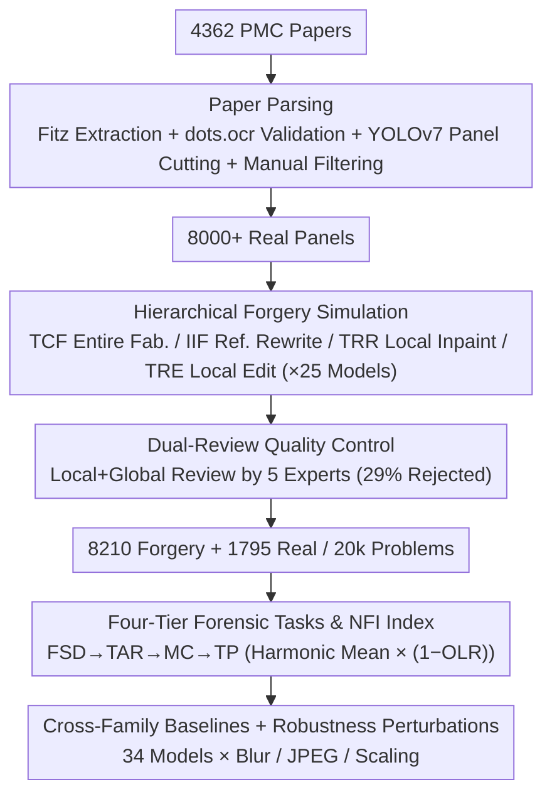

# AEGIS: A Holistic Benchmark for Evaluating Forensic Analysis of AI-Generated Academic Images

**Conference**: ACL 2026  
**arXiv**: [2604.28177](https://arxiv.org/abs/2604.28177)  
**Code**: https://github.com/BUPT-Reasoning-Lab/AEGIS (Available)  
**Area**: Image Generation / AIGC Detection / Academic Integrity  
**Keywords**: AI-generated image forensics, academic image, benchmark, MLLM, manipulation localization

## TL;DR
AEGIS is the first comprehensive benchmark for academic image forgery forensics, covering 7 major academic categories (39 sub-categories), 4 forgery strategies (Text-constrained Fabrication, Image-informed Fabrication, Tampering via Reconstruction, Tampering via Editing), and 25 generative models. It introduces four tasks: Forgery Scope Discrimination (FSD), Text Artifact Recognition (TAR), Manipulation Classification (MC), and Tampered Pixel Localization (TP). Evaluation of 25 MLLMs and 9 expert models reveals a structural complementarity: even GPT-5.1 achieves an aggregate NFI of only 48.80%, while expert models reach only 30.09% pixel IoU, highlighting the gap where "generation outpaces forensics" and "MLLM reasoning vs. expert model sensitivity" intersect.

## Background & Motivation

**Background**: The misuse of AI-generated images in academic papers has emerged as a new risk to publication ethics (e.g., cases on Retraction Watch and PubPeer). Existing forensic methods fall into three categories: vision expert models based on frequency domain/diffusion processes/patch-level features (DRCT, DIRE, AIDE), MLLMs used as general discriminators, and hybrid solutions (FakeShield, SIDA, FakeVLM).

**Limitations of Prior Work**: Current benchmarks (GenImage, Semi-Truths, AIGIBench, DFBench, AIGuard) target general scenes like faces or e-commerce. They adapt poorly to the fine-grained structures, dense textures, and knowledge-intensive semantics of academic images. Most only perform binary "Real/Fake" classification, ignoring **forgery scope, text anomalies, manipulation types, and pixel-level localization** required for real academic reviews.

**Key Challenge**: Academic image forensics is not a simple binary task but a chain of judgment from "Global → Local → Pixel." Furthermore, **expert models excel at low-level visual fingerprints but lack semantic reasoning, while MLLMs excel at reasoning but have poor low-level sensitivity.** No benchmark currently exposes the specific weaknesses of both model types simultaneously.

**Goal**: To build an academic-specific, multi-faceted forensic benchmark that can (1) systematically cover the diversity of 7 academic categories; (2) simulate 4 typical forgery strategies using 25 SOTA generators; and (3) utilize 4 progressive tasks to differentiate model capabilities from binary classification to pixel-level localization.

**Key Insight**: Extract 8,000 verified "panels" (the smallest indivisible unit of a figure) from 4,000+ open-source PubMed Central (PMC) papers. Define 4 forgery strategies based on real academic misconduct scenarios, use 25 generative models to produce forged counterparts, and apply dual expert review, automated quality assessment, and quantitative forensic metrics.

**Core Idea**: Treat academic image forensics as a "hierarchical evaluation + cross-modal orthogonal assessment" and introduce a Normalized Forensic Index (NFI) that incorporates multi-task consistency into the scoring mechanism.

## Method

### Overall Architecture
AEGIS construction follows 3 stages, and evaluation covers 4 dimensions: (1) **Paper Parsing**: Extracts images and captions from 4,362 PMC papers using Fitz, validates caption-image pairs with dots.ocr, segments figures into panels with YOLOv7, and manually filters non-academic/low-res content to obtain 8,000+ labeled panels. (2) **Forgery Simulation**: Implements four strategies—Text-constrained Fabrication (TCF), Image-informed Fabrication (IIF), Tampering via Reconstruction (TRR), and Tampering via Editing (TRE)—across 25 models including Flux, Midjourney, DALL·E, GPT-Image-1, and Janus-Pro. (3) **Quality Control**: A dual-layer review by 5 experts (local + global) filtered out 29% of forged images. This resulted in 8,210 high-quality forged samples and 1,795 real images, totaling 20k forensic questions. The evaluation side designs four progressive tasks: FSD, TAR, MC, and TP.

### Key Designs

**1. Hierarchical Simulation of Academic Forgery: Addressing the Scarcity of Real Retraction Data**
Real retraction cases are insufficient for systematic evaluation. AEGIS uses synthesis but ensures strategies mimic real misconduct: TCF rewrites real captions into prompts for zero-shot generation (3,121 samples); IIF uses real images as references for visual-consistent redraws (2,274 samples); TRR uses SAM-generated masks for local inpainting (1,650 samples); and TRE executes insertions, deletions, or edits via masks/text (1,165 samples). This approach leverages SAM to provide pixel-level ground truth and achieves a scale unattainable with real-world cases.

**2. Four-Tier Forensic Tasks & NFI Index: Exposing Structural Model Biases**
Forensic capability is divided into: FSD (Real/Entire/Partial classification with a "Not Sure" option), TAR (semantic/glyph consistency in text areas), MC (logic-based inference of "Insert/Delete/Edit" within a bounding box using captions), and TP (multi-granularity localization using bbox or masks). To measure balanced capability, the Normalized Forensic Index is defined as:
$$\mathrm{NFI}_i=100\cdot \mathrm{HM}_i\cdot(1-\mathrm{OLR}_i)^\gamma$$
where $\mathrm{HM}$ is the harmonic mean of the four task scores, and $(1-\mathrm{OLR})^\gamma$ (with $\gamma=0.5$) penalizes over-localization (preventing MLLMs from achieving high recall by guessing too many boxes).

**3. Cross-Family Baselines & Robustness: Measuring the Generation-Forensics Gap**
Evaluation covers 14 closed-source MLLMs (GPT-4.1/5.1, Gemini 2.5/3, Claude Sonnet 4.5), 11 open-source MLLMs (LLaVA-NeXT, Qwen2.5-VL), and 9 expert models. Robustness is tested against Gaussian blur (r=5), JPEG compression (q=50), and bilinear scaling (0.5×). This identifies that while expert models are sensitive to pixels, they are fragile under perturbations, whereas MLLMs are robust but lack low-level pixel sensitivity.

### Loss & Training
AEGIS is an evaluation benchmark, not a training framework. Forensic prompts include only task definitions. Evaluations use high-resolution PNGs to avoid compression noise. Closed-source models were accessed via OpenRouter API, while open-source models were deployed on 8×A40 nodes.

## Key Experimental Results

### Main Results
Core metrics for 34 models on AEGIS (Selected):

| Model | FSD ACC | TAR ACC | MC ACC | TP CLA | NFI |
|------|---------|---------|--------|--------|-----|
| Human | 44.20 | 76.14 | 68.01 | – | – |
| GPT-5.1 | 50.99 | 76.43 | 60.07 | 46.87 | **48.80** |
| Gemini 3 Pro | 64.37 | 84.74 | 48.54 | 39.14 | 45.79 |
| GPT-4.1 | 66.34 | 83.57 | 44.55 | 25.93 | 43.31 |
| Claude Sonnet 4.5 | 25.36 | 58.76 | 44.80 | 27.41 | 26.83 |
| Qwen3-VL-Plus | 38.77 | 79.25 | 59.28 | 5.76 | 16.53 |
| AIDE (Expert) | 79.54 | – | – | – | – |
| FakeShield (Hybrid) | 59.72 | – | – | IoU 30.09 | – |

Key Observation: MLLMs reach 84.74% in TAR (Gemini 3), but the strongest expert model achieves only 30.09% pixel IoU in TP. Expert models excel at binary classification (FSD 79.54% for AIDE) but lack semantic reasoning.

### Ablation Study
Impact of Few-Shot and CoT prompts vs. Default:
- **Few-Shot**: Improvs FSD (+5 pp) via pattern matching but significantly harms MC reasoning (-10 pp).
- **CoT (GPT-5.1)**: Improves FSD (+4.38 pp), TAR (+3.33 pp), and TP CLA (+4.25 pp), but MC performance drops.
- **Robustness**: Expert models drop 10-20 pp under JPEG/blur, while MLLMs drop only 2-5 pp.

### Key Findings
- **Generation-Forensics Asymmetry**: 11 of 25 generative models reduce average forensic accuracy below 50%. Only Gemini 3 Pro and GPT-4.1 show consistent resistance across generators.
- **Visual Density Bias**: Models perform stably on Chart/Diagram categories but fail on texture-dense ones like Stained Micrograph or Medical Imaging, indicating a reliance on geometric regularity.
- **Functional Orthogonality**: Expert models tend toward over-detection (higher Forgery-F1), while MLLMs tend toward under-detection. This supports a "sensor + cognitive agent" hybrid architecture for future forensics.

## Highlights & Insights
- Upgrading evaluation from binary classification to "hierarchical + multi-dimensional" is a methodological advancement transferable to deepfake video or code tampering detection.
- The NFI index effectively forces balanced performance across tasks and eliminates "over-localization" shortcuts.
- The three-step QC (Synthesis + Expert Review + Auto-Quality) provides a valuable pipeline for simulating domain-specific academic fraud when real data is scarce.

## Limitations & Future Work
- The benchmark remains heavily dominated by synthetic data due to the lack of structured real-world retraction samples.
- Some SOTA forensics weights remain private, limiting baseline coverage.
- The discrepancy in evaluation granularity between MLLMs (bbox) and experts (mask) in the TP task requires a more unified protocol.

## Related Work & Insights
- **vs. DFBench (ACM MM 2025)**: AEGIS goes beyond detection ACC to include TAR/MC/TP reasoning levels in the academic domain.
- **vs. FakeShield/SIDA**: While FakeShield scores >70% IoU in general domains, it drops to 30.09% on AEGIS, proving academic pixel localization remains unsolved.
- **vs. AIGuard**: AIGuard focuses on global detection for e-commerce; AEGIS evaluates hybrid strategies and multi-dimensional forensics specifically for academic integrity.

## Rating
- Novelty: ⭐⭐⭐⭐ First academic domain forensic benchmark with extensive strategies.
- Experimental Thoroughness: ⭐⭐⭐⭐⭐ 34 models across 4 tasks with robustness and prompt ablation.
- Writing Quality: ⭐⭐⭐⭐ High information density; clear structure.
- Value: ⭐⭐⭐⭐⭐ Direct potential for deployment in academic publishing workflows.

<!-- RELATED:START -->

## Related Papers

- [\[ACL 2026\] Can AI-Generated Persuasion Be Detected? Persuaficial Benchmark and AI vs. Human Linguistic Differences](can_ai-generated_persuasion_be_detected_persuaficial_benchmark_and_ai_vs_human_l.md)
- [\[CVPR 2026\] Locate-Then-Examine: Grounded Region Reasoning Improves Detection of AI-Generated Images](../../CVPR2026/aigc_detection/locate-then-examine_grounded_region_reasoning_improves_detection_of_ai-generated.md)
- [\[ACL 2026\] C-ReD: A Comprehensive Chinese Benchmark for AI-Generated Text Detection Derived from Real-World Prompts](c-red_a_comprehensive_chinese_benchmark_for_ai-generated_text_detection_derived_.md)
- [\[AAAI 2026\] BAID: A Benchmark for Bias Assessment of AI Detectors](../../AAAI2026/aigc_detection/baid_a_benchmark_for_bias_assessment_of_ai_detectors.md)
- [\[ACL 2026\] Who Wrote This Line? Evaluating the Detection of LLM-Generated Classical Chinese Poetry](who_wrote_this_line_evaluating_the_detection_of_llm-generated_classical_chinese_.md)

<!-- RELATED:END -->
