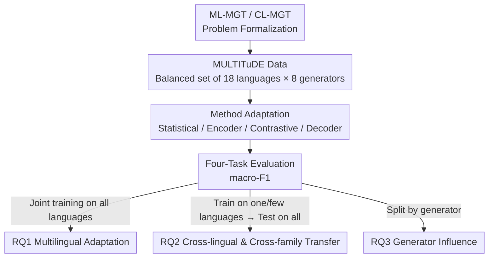

# Authorship Attribution in Multilingual Machine-Generated Texts

**Conference**: ACL 2026  
**arXiv**: [2508.01656](https://arxiv.org/abs/2508.01656)  
**Code**: To be confirmed  
**Area**: AIGC Detection  
**Keywords**: Machine-generated text detection, Authorship attribution, Multilingual, Cross-lingual transfer, MULTITuDE

## TL;DR
Existing research on machine-generated text authorship attribution (identifying which specific LLM or human produced a text) is almost entirely monolingual (primarily English). This paper is the first to formally define **Multilingual Authorship Attribution (ML-MGT)** and **Cross-Lingual Authorship Attribution (CL-MGT)**. Through a systematic evaluation of 18 languages $\times$ 8 generators (7 LLMs + human) using statistical methods, fine-tuned encoders, contrastive learning, and fine-tuned decoders, it finds that while fine-tuned/contrastive methods adapt well to multiple languages (best macro-F1 > 0.9), they **degrade severely when transferring across different language families or writing systems**, revealing the challenges of real-world multilingual scenarios.

## Background & Motivation
**Background**: As LLM fluency approaches human levels, machine-generated text (MGT) becomes increasingly difficult to distinguish. Initial responses focused on **binary MGT detection** (determining if a text is machine-written). However, as the number of LLMs grows daily, knowing it is "machine-written" is insufficient; identifying the **specific source model**—fine-grained **authorship attribution (AA)**—is crucial for accountability, provenance, and preventing abuse.

**Limitations of Prior Work**: Research in AA remains **largely monolingual**. Most work focuses on English, with a few extensions to Russian or Spanish, lacking systematic study of multilingual attribution. Modern LLMs are inherently multilingual and used across various cultural contexts; whether AA methods verified only in English can function or generalize in real-world multilingual scenarios remains an unexplored area.

**Key Challenge**: Attribution is significantly more difficult than detection (multi-class classification across 8 balanced categories, where the random baseline is only 0.125 macro-F1). Multilingualism adds another layer of complexity—linguistic properties vary greatly across different language families and writing systems (Latin, Cyrillic, Arabic, Hanzi, Greek). A "generator fingerprint" learned in one language might not transfer to another.

**Goal**: Dissect this blind spot using three research questions:  
RQ1: How do existing AA methods perform on Multilingual MGT (ML-MGT)?  
RQ2: To what extent can AA methods transfer across languages and language families (CL-MGT)?  
RQ3: How does the choice of generator model affect multilingual adaptability and cross-lingual generalization?

**Core Idea**: Instead of proposing a single new model, this work **formally defines the ML-MGT/CL-MGT problems for the first time + builds a unified and comparable multilingual evaluation + systematically adapts and tests representative existing methods**, providing the first systematic evidence of the difficulties and promising directions for this new problem.

## Method

### Overall Architecture
This is a **problem definition + systematic empirical study** paper rather than a single new method. The logical chain is: ① Formalize authorship attribution as a multi-class classification problem (ML-MGT) and define cross-lingual transfer as a special case (CL-MGT); ② Select a balanced evaluation set of 18 languages $\times$ 8 generators based on the MULTITuDE dataset; ③ Adapt four representative classes of existing methods (statistical, fine-tuned encoders, contrastive learning, fine-tuned decoders) to this attribution task; ④ Design four evaluation tasks to answer RQ1 (multilingual adaptation), RQ2 (transfer across languages/families), and RQ3 (generator impact), using macro-averaged F1 as the metric.

### Key Designs

**1. Problem Formalization of ML-MGT and CL-MGT: Splitting multilingual attribution into "Joint" and "Transfer" layers**

The paper first defines authorship attribution clearly. Given a text set $\mathcal{X}=\mathcal{X}_h\cup\mathcal{X}_m$ (human-written + machine text from a set of generators $\mathcal{M}$), each text belongs to a language in the set $\mathcal{L}$. The goal of **ML-MGT** (Problem 1) is to learn a mapping $f:\widehat{\mathcal{X}}\mapsto\mathcal{Y}=\{y_h\}\cup\mathcal{Y}_m$, identifying the author among 8 classes (human class $y_h$ + $|\mathcal{M}|$ machine generators). Language selection is controlled by strategy $g(\cdot)$, assuming human and MGT texts are available in the same language pairs. **CL-MGT** (Problem 2) is a special case: when the training language set $\mathcal{L}_{train}\subset\mathcal{L}_{test}$, the model must rely on cross-lingual knowledge transfer rather than memorization. This two-layer split is the framework for all subsequent experimental designs.

**2. Balanced Multilingual Evaluation Set: Filtering 18 languages $\times$ 8 generators from MULTITuDE to control comparability**

To ensure cross-lingual comparisons are not "contaminated by data bias," the paper uses the MULTITuDE (v3) dataset. It includes articles generated by 7 LLMs (Mistral-7B-Instruct, OPT-IML-Max-30B, v5-Eagle-7B, Vicuna-13B, Llama-2-70B-Chat, Aya-101, GPT-3.5-Turbo) using the same news headline prompts, plus human news from MassiveSum. **Each language uses the same set of generators, settings, and domains**, designed specifically for unbiased cross-lingual comparison. Out of 21 available languages, 18 were selected based on: (i) complete language-generator balance, and (ii) reaching at least 95% of the target sample size (approx. 1000 per generator for training, 300 for testing). The final set covers 8 language families and 5 writing systems (12 Latin / 3 Cyrillic / 1 Arabic / 1 Hanzi / 1 Greek), with uniform class distribution.

**3. Multilingual Adaptation Suite: Unified adaptation of four technical routes to the attribution task**

The paper adapts four categories of representative methods to AA. **Statistical Methods**: Zero-shot features are extracted using Fast-DetectGPT (mGPT-13B as reference/sampling model) and Binoculars (Falcon-7B as observer), followed by a Logistic Regression classifier; the stronger **StatEnsemble** feeds nine statistical features (Binoculars, Fast-DetectGPT, perplexity, Rank, log-rank, log-likelihood, Entropy, LLM-Deviation, DetectLLM-LRR) into an MLP. **Fine-tuned Encoders**: RoBERTa-large (monolingual English) and XLM-RoBERTa-large (multilingual), fine-tuned following existing work (lr 2e-6, max length 512). **Contrastive Learning**: The OTBDetector (top performer on OpenTuringBench) is adapted by replacing Longformer with XLM-RoBERTa-large to ensure multilingualism, using contrastive loss to separate latent representations of generators. **Fine-tuned Decoders**: Both mdok (based on Qwen3-4B-Base + QLoRA) and Qwen3-4B-Base are adapted with a multi-class classification head and fine-tuned. This covers the full spectrum from zero-shot statistical to discriminative fine-tuning and contrastive separation.

### An Illustrative Example: How RQ2 Cross-family Transfer Exposes Vulnerability
Taking "Writing System Transfer" as an example: the paper trains on English and Spanish (representing **Latin script**) or Russian (**Cyrillic script**) and tests across all 18 languages. Results (see RQ2 data) show that while transfer within the same family/script is acceptable, performance drops significantly when a model trained on Latin is tested on Cyrillic, Arabic, or Hanzi. This concretizes the vulnerability behind the ">0.9 macro-F1" joint training figures: models largely learn "generator fingerprints within specific languages." Changing the script or family causes these fingerprints to mismatch. This is a core warning: the multilingual capability of current AA methods is overestimated by "joint training" results.

## Key Experimental Results

### Main Results (RQ1: Multilingual Adaptation)
Joint training on all 18 languages, 8 classes, reporting macro-averaged F1 (random baseline 0.125). 5 out of 8 detectors reached macro-F1 $\ge$ 0.75; fine-tuning and contrastive methods adapted best.

| Method | Type | Average F1 (All Languages) | Note |
|------|------|------|------|
| Qwen3-4B-Base | Fine-tuned Decoder | 0.93 | Top performer |
| mdok | Fine-tuned Decoder (QLoRA) | 0.93 | >0.9 in most languages |
| OTBDetector | Contrastive Learning | 0.90 | 7× fewer params, only ~3% drop |
| XLM-R-large | Multilingual Encoder | 0.84 | |
| RoBERTa-large | English Encoder | 0.75 | Surprisingly difficult in English |
| StatEnsemble | Statistical Ensemble | 0.45 | Statistical methods are weak |
| Fast-DetectGPT | Single Statistical | 0.23 | |
| Binoculars | Single Statistical | 0.16 | Slightly above random |

### Cross-lingual/Cross-family Transfer (RQ2) and Generator Influence (RQ3)

| Evaluation Dimension | Setting | Key Observation |
|------|------|------|
| Multilingual Adaptation (RQ1) | Joint training on all languages | Fine-tuning/Contrastive F1 >0.9, Statistical $\le$ 0.45 |
| Per-language Transfer (RQ2) | Train on en/es/ru (single/combined) → Test on all | Performance fluctuates heavily based on language similarity |
| Per-family/Script Transfer (RQ2) | Latin (en+es) vs. Cyrillic (ru) training → Test on all | Most significant degradation across different writing systems |
| Generator Influence (RQ3) | Class-level F1 by generator | Generator identity interacts with language context |

### Key Findings
- **Fine-tuning/Contrastive > Statistical; Decoder/Contrastive > 0.9 in most languages**: Qwen3-4Base, mdok, and OTBDetector lead significantly. Pure zero-shot statistical methods (Fast-DetectGPT 0.23, Binoculars 0.16) are nearly unusable for attribution—statistical signals for "detection" are insufficient for "attribution."
- **OTBDetector offers high efficiency**: Despite being 7× smaller than Qwen3-4B-Base/mdok, its F1 only drops by 3%, attributed to sharper decision boundaries from contrastive loss.
- **English text is surprisingly difficult to attribute**: Even with the monolingual English pre-trained RoBERTa, F1 on English remains lower (around 0.72/0.65), suggesting generator fingerprints in high-resource languages may not be easier to distinguish.
- **Cross-family/Cross-script is the true bottleneck**: Methods transfer reasonably well within similar language families, but performance degrades significantly across Latin $\leftrightarrow$ Cyrillic $\leftrightarrow$ Arabic $\leftrightarrow$ Hanzi, influenced by both target language properties and generator identity.

## Highlights & Insights
- **Problem Formalization as a Contribution**: Formalizing "Multilingual Authorship Attribution" and "Cross-lingual Transfer" as ML-MGT/CL-MGT provides a reusable evaluation framework for future work.
- **"High Joint Training Scores" can be Misleading**: The >0.9 F1 in RQ1 is impressive, but RQ2 reveals severe flaws in cross-family transfer. This contrast reminds the community not to be misled by a single joint multilingual number; transferability is the true test of real-world scenarios.
- **Transferable Experimental Design**: Using "same generator, same domain, same setting, varying only language" with balanced data isolates the effects of language/family, a control-variable approach applicable to any "cross-lingual robustness" evaluation.

## Limitations & Future Work
- Only used one dataset (MULTITuDE) and focused on the news domain—whether findings hold across social media, code, or dialogue remains unverified.
- The generator set consists of 7 relatively early LLMs (GPT-3.5, Llama-2, Vicuna, etc.); newer models (GPT-4 class, Claude, newest open-source models) are not covered, and fingerprint separability might change with model iterations.
- The paper stops at "revealing problems + evaluating existing methods" and does not propose a new method for cross-family generalization; the solution for CL-MGT remains an open problem.
- Evaluation focuses on macro-F1, with limited discussion on calibration or adversarial robustness (e.g., paraphrasing/obfuscation) critical for deployment.

## Related Work & Insights
- **vs. Binary MGT Detection (DetectGPT/Binoculars, etc.)**: Detection only determines "Human vs. Machine"; this work performs fine-grained attribution. Experiments prove statistical signals effective for detection fail for attribution.
- **vs. Monolingual Attribution (OTBDetector / OpenTuringBench)**: These methods are SOTA in monolingual English. This work adapts them to 18 languages, exposing cross-lingual transfer gaps through multilingual stress testing.
- **vs. Existing Multilingual MGT Datasets (M4GT-Bench / RAID)**: MULTITuDE was chosen because it maintains consistent generators/settings/domains across all languages, enabling unbiased cross-lingual comparison rather than just increasing language count.

## Rating
- Novelty: ⭐⭐⭐⭐ First systematic study of multilingual/cross-lingual authorship attribution.
- Experimental Thoroughness: ⭐⭐⭐⭐ Wide coverage (18 langs $\times$ 8 generators $\times$ 4 method classes), but limited to a single dataset/domain.
- Writing Quality: ⭐⭐⭐⭐ Clear problem definitions and rigorous control-variable design.
- Value: ⭐⭐⭐⭐ Established evaluation standards for provenance/accountability and identified the cross-family transfer challenge.

<!-- RELATED:START -->

## Related Papers

- [\[ACL 2025\] MultiSocial: Multilingual Benchmark of Machine-Generated Text Detection of Social-Media Texts](../../ACL2025/aigc_detection/multisocial_mgt_detection.md)
- [\[ACL 2026\] DetectRL-X: Towards Reliable Multilingual and Real-World LLM-Generated Text Detection](detectrl-x_towards_reliable_multilingual_and_real-world_llm-generated_text_detec.md)
- [\[NeurIPS 2025\] DuoLens: A Framework for Robust Detection of Machine-Generated Multilingual Text and Code](../../NeurIPS2025/aigc_detection/duolens_a_framework_for_robust_detection_of_machine-generated_multilingual_text_.md)
- [\[ACL 2026\] BIASEDTALES-ML: A Multilingual Dataset for Analyzing Narrative Attribute Distributions in LLM-Generated Stories](biasedtales-ml_a_multilingual_dataset_for_analyzing_narrative_attribute_distribu.md)
- [\[ACL 2026\] ExaGPT: Example-Based Machine-Generated Text Detection for Human Interpretability](exagpt_example-based_machine-generated_text_detection_for_human_interpretability.md)

<!-- RELATED:END -->
