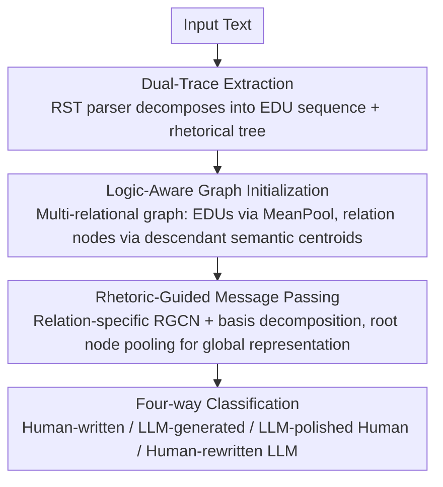

# Beyond the Final Actor: Modeling the Dual Roles of Creator and Editor for Fine-Grained LLM-Generated Text Detection

**Conference**: ACL 2026  
**arXiv**: [2604.04932](https://arxiv.org/abs/2604.04932)  
**Code**: [https://race.yang-li.cn](https://race.yang-li.cn)  
**Area**: AIGC Detection  
**Keywords**: LLM-generated text detection, Rhetorical Structure Theory, Creator-Editor modeling, Fine-grained classification, Discourse analysis

## TL;DR
Ours proposes RACE (Rhetorical Analysis for Creator-Editor Modeling), which utilizes Rhetorical Structure Theory (RST) to construct logic graphs for modeling the thought architecture of the "Creator," while extracting discourse unit-level features to capture the linguistic style of the "Editor." This enables four-way fine-grained LLM-generated text detection (Human-written / LLM-generated / LLM-polished Human / Human-rewritten LLM).

## Background & Motivation

**Background**: LLM-generated text detection primarily focuses on binary classification (Human vs. LLM). Recently, some works have introduced "mixed text" as a third category for a three-way classification setup.

**Limitations of Prior Work**: Even three-way classification is insufficiently granular. "LLM-polished Human text" and "Human-rewritten LLM text" lead to entirely different policy consequences in practical regulation. The former is often regarded as legitimate writing assistance, while the latter is seen as a cheating behavior intended to bypass detection. Both belong to the "mixed text" category, making them indistinguishable via traditional methods using unified features.

**Key Challenge**: The Creator-Editor collaboration patterns of these two mixed types are fundamentally different. LLM-polished human text = human logical framework + LLM expression style; Human-rewritten LLM text = LLM logical framework + human expression disturbances. Unified features struggle to capture these decoupled dual traces.

**Goal**: To design a detection framework capable of separately modeling the contributions of the "Creator" and the "Editor" to achieve reliable four-way fine-grained detection.

**Key Insight**: The creator's identity is deeply embedded in the logical organization and argumentative progression (humans use hierarchical reasoning, while LLMs tend towards flat descriptions). The editor's influence is mainly reflected in surface linguistic expressions. RST is uniquely suited to separating these two levels.

**Core Idea**: RST is used to parse text into a rhetorical relation tree, which is converted into a logic graph to characterize the creator's "thought fingerprint." Simultaneously, EDU-level (Elementary Discourse Unit) semantic representations capture the editor's linguistic style.

## Method

### Overall Architecture

RACE aims to solve "four-way fine-grained detection"—not only distinguishing between human and LLM writing but also separating "LLM-polished human text" from "human-rewritten LLM text." The **Mechanism** involves decoupling modeling of the "Creator" (logical framework) and the "Editor" (surface language). First, an RST parser decomposes the text into an EDU sequence and a rhetorical relation tree. This is used to build a multi-relational logic graph where EDUs serve as leaf nodes and rhetorical relations as internal nodes. After node feature initialization, deep representations are learned through rhetoric-guided message passing. Finally, global representations are pooled from the root node and fed into a classifier to simultaneously detect creator fingerprints hidden in logical organization and editor traces hidden in linguistic style.

### Key Designs

**1. Dual-Trace Extraction: The creator's logical framework and the editor's surface style are intertwined in mixed texts, making them inseparable via unified features.**

RACE uses an end-to-end RST parser to parse text into a binary constituent tree. Leaf nodes are EDU sequences representing the editor's linguistic units. Internal nodes carry labels like Elaboration or Contrast, representing the creator's logical organization. A single tree separates "who built the logical skeleton" and "who applied the surface decoration." This is supported by statistical observations: human creators significantly over-express Attribution and Background relations (citing sources, setting context), while LLM creators over-express Elaboration and Evaluation (listing information). This structural fingerprint remains nearly unchanged even after editing—the cosine similarity of rhetorical relation frequencies for the same creator remains $>0.89$, indicating that editors struggle to alter the creator's underlying logic.

**2. Logic-Aware Graph Initialization: One-hot encoding of relation labels is too sparse, and rhetorical nodes carry almost no semantics.**

The paper constructs a multi-relational graph $\mathcal{G} = (\mathcal{V}_{edu} \cup \mathcal{V}_{rel}, \mathcal{E}, \mathcal{R})$. EDU nodes are initialized using MeanPool embeddings from a PLM. Relation nodes are initialized via Descendant Span Pooling, which recursively takes the semantic centroid of all descendant EDUs. Dimensions are reduced to $d_{feat}$ via an information bottleneck projection to filter surface noise. Compared to one-hot encoding, "injecting" context into relation nodes via descendant semantic centroids allows each rhetorical node to carry the semantics of the text segment it governs, enabling content-rich message passing.

**3. Rhetoric-Guided Message Passing: Different rhetorical relations (causal, contrastive, elaborative) carry distinct logical functions and require relation-specific propagation rules.**

RACE employs an $L$-layer RGCN to learn independent transformation matrices for each rhetorical relation, allowing different logical relations to follow distinct channels. To prevent parameter explosion and overfitting on sparse relations, basis decomposition is used: $\mathbf{W}_r^{(l)} = \sum_{k=1}^B \alpha_{rk}^{(l)} \mathbf{V}_k^{(l)}$. This allows all relations to share $B$ basis matrices while only learning combination coefficients. Finally, global text representations are pooled from the root node. Ablation studies show that removing basis decomposition causes overfitting on sparse relations, dropping AUROC to ~91.

### Example Case

Consider an "LLM-polished human text": The logical skeleton is human-built, so the RST tree retains many Attribution and Background relations, but the sentence surfaces are smoothed by the LLM with an LLM-like vocabulary style. RACE parses it into EDUs and a rhetorical tree; leaf nodes carry the "polished" style, while internal nodes carry "human-like" deep logic. Logic-aware initialization injects governed semantics into rhetorical nodes. After propagation via RGCN through Attribution/Background channels, the root-pooled global representation encodes both "Creator=Human" (deep logic, frequent citations) and "Editor=LLM" (smooth style), allowing the classifier to distinguish it from "human-rewritten LLM text" (flat logic + human-like surface perturbations).

### Loss & Training
Joint loss $\mathcal{L}_{total} = \mathcal{L}_{con} + \mathcal{L}_{ce}$: Supervised contrastive loss encourages compact intra-class clustering, while cross-entropy loss performs classification. The backbone uses RoBERTa-base with only the final layer fine-tuned.

## Key Experimental Results

### Main Results
Four-way detection on the HART dataset.

| Method | AUROC (Avg) | TPR@1%FPR |
|------|------------|-----------|
| RoBERTa | ~85 | 68.06 |
| CoCo | ~86 | - |
| DeTeCtive | ~87 | - |
| **RACE** | **~92** | **~80** |

### Ablation Study

| Configuration | AUROC | Description |
|------|-------|------|
| Full RACE | **~92** | Complete model |
| w/o RST graph (EDU only) | ~87 | Removes creator modeling, drops 5 pts |
| w/o contrastive loss | ~90 | Feature space is less compact |
| w/o basis decomposition | ~91 | Overfitting on sparse relations |

### Key Findings
- RACE achieved the highest AUROC among 12 baselines and maintained high recall at a low false positive rate (1% FPR).
- Creator modeling (RST graph) provided the largest contribution—performance dropped by 5 points without it.
- Rhetorical relation frequency analysis verified the core hypothesis: human-written text has deeper, more complex RST structures, while LLM text is flatter.
- For the same creator, the cosine similarity of rhetorical relation frequencies remained $>0.89$ after editing, proving that editing rarely changes the creator's fingerprint.

## Highlights & Insights
- The **Creator-Editor dual-role framework** is a clear and powerful concept—elevating "who is the final actor" to "who established the logic + who performed the surface modification."
- The discovery of **RST as a creator fingerprint** is highly persuasive—human rhetorical structures are deeper with more citation/background relations, whereas LLMs prefer flat elaboration/evaluation structures.
- The introduction of the low false positive rate metric (**TPR@1%FPR**) is practical—in high-risk scenarios like academic integrity checks, avoiding false accusations is more critical than improving recall.

## Limitations & Future Work
- Dependency on the quality of the RST parser; current parsers may be inaccurate for certain text types.
- Evaluated only on the HART dataset; cross-domain generalization capability remains unknown.
- The four-way setup assumes a single editing pass, whereas multi-round human-LLM interaction scenarios are more complex.
- As LLM capabilities improve, their rhetorical structures may increasingly mirror those of humans.

## Related Work & Insights
- **vs DetectAIve**: Also attempts four-way classification but uses unified features; RACE is more granular with dual-role modeling.
- **vs CoCo**: CoCo considers discourse information but lacks the hierarchical structure of RST.
- **vs LF-Motifs**: Uses word frequency patterns for detection, failing to capture differences at the logical organization level.

## Rating
- **Novelty**: ⭐⭐⭐⭐⭐ The Creator-Editor framework + RST creator fingerprint is a highly original design.
- **Experimental Thoroughness**: ⭐⭐⭐⭐ 12 baselines are sufficient, though evaluation on a single dataset limits generalization verification.
- **Writing Quality**: ⭐⭐⭐⭐⭐ The motivation analysis is exceptionally convincing.
- **Value**: ⭐⭐⭐⭐⭐ First to bring four-way fine-grained detection to a practical level of performance.

<!-- RELATED:START -->

## Related Papers

- [\[ACL 2025\] HACo-Det: A Study Towards Fine-Grained Machine-Generated Text Detection under Human-AI Coauthoring](../../ACL2025/aigc_detection/haco-det_a_study_towards_fine-grained_machine-generated_text_detection_under_hum.md)
- [\[CVPR 2026\] Fine-grained Image Aesthetic Assessment: Learning Discriminative Scores from Relative Ranks](../../CVPR2026/aigc_detection/fine-grained_image_aesthetic_assessment_learning_discriminative_scores_from_rela.md)
- [\[ACL 2026\] DetectRL-X: Towards Reliable Multilingual and Real-World LLM-Generated Text Detection](detectrl-x_towards_reliable_multilingual_and_real-world_llm-generated_text_detec.md)
- [\[ACL 2026\] Temporal Flattening in LLM-Generated Text: Comparing Human and LLM Writing Trajectories](temporal_flattening_in_llm-generated_text_comparing_human_and_llm_writing_trajec.md)
- [\[CVPR 2026\] PPM-CLIP: Probabilistic Prompt Modeling for Generalizable AI-Generated Image Detection](../../CVPR2026/aigc_detection/ppm-clip_probabilistic_prompt_modeling_for_generalizable_ai-generated_image_dete.md)

<!-- RELATED:END -->
