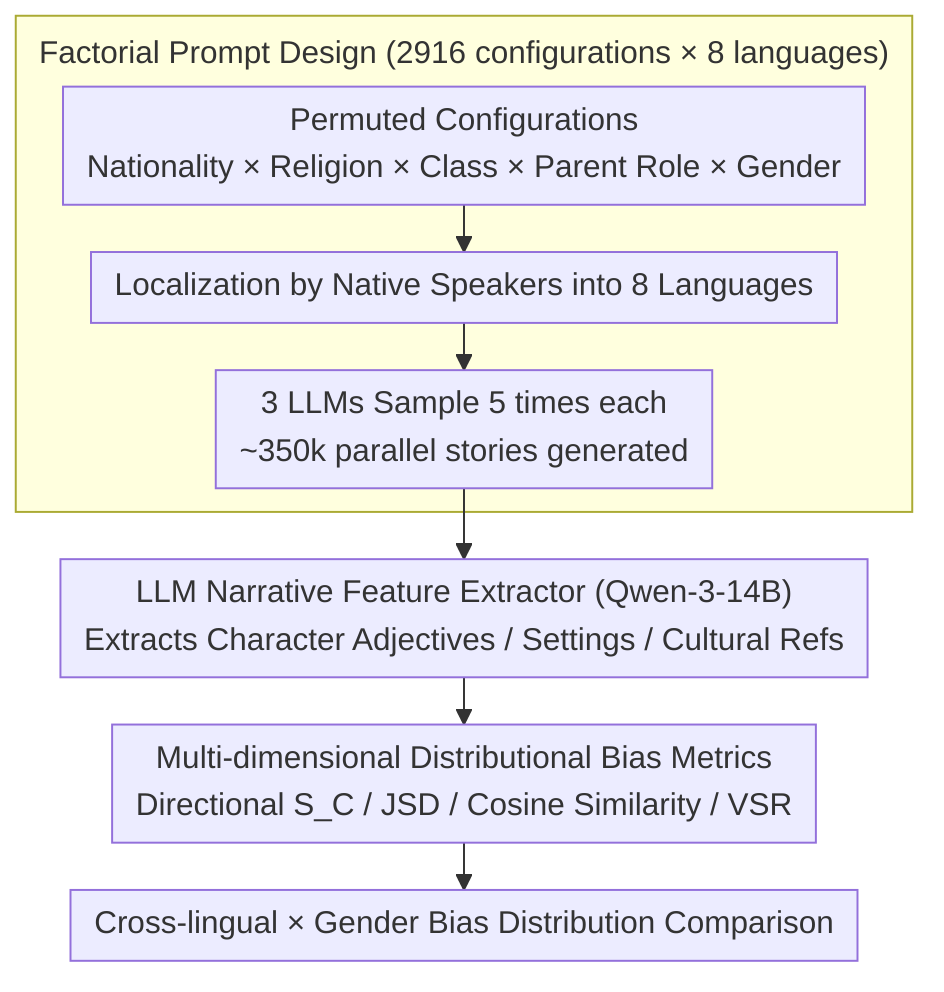

# BIASEDTALES-ML: A Multilingual Dataset for Analyzing Narrative Attribute Distributions in LLM-Generated Stories

**Conference**: ACL 2026 Findings  
**arXiv**: [2604.17008](https://arxiv.org/abs/2604.17008)  
**Code**: [https://huggingface.co/spaces/Linyuana/BIASEDTALES-ML](https://huggingface.co/spaces/Linyuana/BIASEDTALES-ML)  
**Area**: AIGC Detection  
**Keywords**: Multilingual Bias, Narrative Generation, Social Attribute Distribution, Cross-lingual Consistency, Children's Stories

## TL;DR
BiasedTales-ML constructs a corpus of approximately 350,000 LLM-generated children's stories across 8 languages. Through a factorial prompt design and a distributional analysis framework, it reveals that **the distribution of social attributes in narratives varies significantly across different languages**, and English-centric evaluations fail to reflect bias patterns in multilingual scenarios.

## Background & Motivation

**Background**: LLMs are increasingly used to generate narrative content (especially children's stories), which implicitly convey notions of social roles, occupations, and environments. Existing social bias research primarily focuses on English short-text tasks (such as sentence completion or classification).

**Limitations of Prior Work**: (1) Evaluation of bias in short texts fails to capture indirect biases expressed through characters, settings, and plot structures in long-form narratives; (2) Current bias benchmarks (e.g., StereoSet, BBQ) are static classification tasks, decoupled from real-world generation scenarios; (3) Little work has systematically investigated the cross-lingual consistency of bias in multilingual narrative generation.

**Key Challenge**: Safety alignment techniques like RLHF are mainly developed based on English data and Western norms. However, the manifestation of bias in other languages may be entirely different—conclusions of being "safe" from English evaluations may not hold in low-resource languages.

**Goal**: (1) Construct a large-scale parallel multilingual narrative corpus; (2) Propose a systematic framework for narrative-level social attribute distribution analysis; (3) Empirically study cross-lingual bias consistency.

**Key Insight**: Children's stories are chosen as a controlled yet expressive narrative domain—they encourage positive and imaginative content while requiring the model to make structural choices about characters, environments, and social roles.

**Core Idea**: Generate parallel stories across 8 languages using a factorial prompt design (systematically varying nationality $\times$ religion $\times$ social class $\times$ parental roles $\times$ child's gender). Analyze bias using distributional metrics rather than instance-level labeling.

## Method

### Overall Architecture
The pipeline decomposes the challenge of "how to systematically compare multilingual narrative bias" into three steps: first, localize a standardized template for children's story prompts into 8 languages using native speakers; second, sample approximately 350,000 parallel stories from 3 LLMs across all prompt configurations; finally, extract narrative features (character traits, settings, cultural references) from each story using an LLM-based extractor and compare the distribution differences of these social attributes across linguistic and gender dimensions using a set of statistical metrics. The input consists of controlled combinations of social attributes, and the output is a set of cross-lingually comparable bias distribution metrics. The mechanism relies on "distributional measures" rather than per-sample labeling, making the bias analysis scalable for large-scale generation scenarios.

### Key Designs

**1. Factorial Prompt Design: Isolating Language Medium from Cultural Content via Controlled Variables**

A problem with translation-based benchmarks is that they cannot distinguish whether a bias pattern stems from the language itself (grammar, vocabulary) or from the cultural content it carries. This paper addresses this by systematically combining 27 nationalities $\times$ 6 religions $\times$ 2 social classes $\times$ 3 parental roles $\times$ 3 children's genders, resulting in 2,916 unique prompt configurations. These are sampled across 8 languages and 3 models, totaling ~350,000 stories. The selection of languages is also controlled—covering those with no grammatical gender (English/Chinese/Japanese/Korean), those with grammatical gender (Spanish/Russian/Arabic), and low-resource languages (Swahili). This allows hypotheses such as "whether grammatical gender amplifies bias" to be tested independently.

**2. LLM Narrative Feature Extractor: Converting Indirect Narrative Bias into Structured Attribute Representations**

Bias in narratives is rarely explicit; it is indirectly expressed through character descriptions and scene settings, such as "who is brave vs. who is obedient" or whether a story takes place in a forest or a kitchen. This paper uses Qwen-3-14B to extract a three-dimensional representation $E = (A_{\text{adj}}, V_{\text{env}}, C_{\text{cul}})$ from each story $S$. These represent character description adjectives, setting keywords, and cultural references respectively. The extractor achieved 85.6% accuracy and Cohen's $\kappa = 0.618$ on 800 manually verified samples, indicating that structural extraction is reliable for long texts.

**3. Multi-dimensional Distributional Bias Metrics: Complementary Indicators for Direction, Magnitude, Consistency, and Quality**

No single metric can fully describe bias. Therefore, this paper employs four metrics: Directional Bias $S_C = \ln(P(C|g_m)/P(C|g_f))$ uses log-ratios to describe whether an attribute category leans toward male or female stories; JSD (Jensen-Shannon Divergence) measures the overall dispersion of the distribution; Cosine Similarity measures whether the same bias pattern is consistent across different languages; and Valid Story Rate (VSR) controls for generation quality, preventing low-quality outputs from being mistaken for "unbiased." Together, these metrics answer which direction bias leans, by how much, whether it is stable across languages, and whether it is contaminated by generation quality.

### Loss & Training
This is purely an evaluation/analysis work and does not involve model training. The generation phase uses the vLLM inference framework with a high sampling temperature to encourage narrative diversity and prevent stories from collapsing into templated text.

## Key Experimental Results

### Main Results

| Analysis Dimension | Key Findings | Model |
|--------------------|--------------|-------|
| Directional Bias | Communality descriptions lean female across all languages; intellect descriptions lean male in Arabic/Russian. | 8B Models |
| Grammatical Gender Impact | Llama-3.1-8B shows higher JSD (greater bias dispersion) in gendered languages; Qwen-3-8B shows no significant difference. | - |
| Cross-lingual Consistency | Qwen-3 has high cross-lingual cosine similarity (consistent); Llama-3 shows large discrepancies between English and low-resource languages. | - |
| Small Model Effect | 1B models show near-zero directional bias, not due to better safety, but due to **lack of lexical diversity** reverting to generic patterns. | Llama-3.2-1B |

### Ablation Study

| Configuration | Effect | Description |
|---------------|--------|-------------|
| Gender Condition | Male → outdoor/activity words; Female → home/relationship words | Consistent across languages |
| Social Class Condition | Working class → practical/labor words; Affluent → leisure/aesthetic words | Qwen-3 data |
| Low-resource Language | Swahili shows lower VSR and higher JSD | Particularly evident in 1B models |

### Key Findings
- Bias patterns observed in English **cannot** be simply extrapolated to other languages, especially low-resource ones.
- The relationship between model scale and bias is non-monotonic: small models are not "safer" but rather "more mediocre" (lexical diversity bottleneck).
- The impact of grammatical gender on bias dispersion varies by model and is not a universal rule.
- Qwen-3 shows higher cross-lingual consistency than Llama-3, likely reflecting differences in multilingual training data coverage.

## Highlights & Insights
- **Factorial Experimental Design** is the primary highlight: by systematically varying social attribute dimensions, the impact of each factor can be precisely isolated. This methodology can be transferred to any NLP evaluation involving multi-factor analysis.
- **Finding that small model bias appears low due to lack of capability**: This is a crucial insight, warning against declaring safety based on surface-level distributional uniformity, as lexical poverty also produces uniform distributions.
- Distributional-level bias analysis (rather than instance-level labeling) is better suited for large-scale generation scenarios, avoiding the non-scalability of per-sample annotation.

## Limitations & Future Work
- Stories are generated by LLMs and may not directly reflect bias patterns in human narratives.
- Feature extraction relies on LLMs, which may introduce its own extraction bias.
- While the 8 languages are representative, they do not cover many other low-resource languages.
- Analysis is limited to the distributional level and does not delve into the quality of individual stories or the actual impact on children.

## Related Work & Insights
- **vs. Biased Tales (Rooein et al., 2025)**: The latter only covers English and a few languages; BiasedTales-ML extends this to a factorial design across 8 languages.
- **vs. StereoSet/BBQ**: Compared to static classification benchmarks, this work analyzes bias performance in scenarios closer to real-world usage through long-text generation.
- **vs. Yong et al., 2025**: The latter studies cross-lingual transfer of safety interventions, while this work supplements it with representational safety analysis in non-adversarial scenarios.

## Rating
- Novelty: ⭐⭐⭐⭐ Large-scale multilingual narrative bias analysis is a novel direction; the factorial design methodology is valuable.
- Experimental Thoroughness: ⭐⭐⭐⭐ 350k stories, 8 languages, 3 models, and multi-dimensional analysis, though missing a comparison with human narratives.
- Writing Quality: ⭐⭐⭐⭐ Clear structure and rich visualizations, though discussions are somewhat general.

<!-- RELATED:START -->

## Related Papers

- [\[ACL 2026\] DetectRL-X: Towards Reliable Multilingual and Real-World LLM-Generated Text Detection](detectrl-x_towards_reliable_multilingual_and_real-world_llm-generated_text_detec.md)
- [\[ACL 2026\] Authorship Attribution in Multilingual Machine-Generated Texts](authorship_attribution_in_multilingual_machine-generated_texts.md)
- [\[ACL 2026\] Temporal Flattening in LLM-Generated Text: Comparing Human and LLM Writing Trajectories](temporal_flattening_in_llm-generated_text_comparing_human_and_llm_writing_trajec.md)
- [\[ACL 2025\] A Rose by Any Other Name: LLM-Generated Explanations Are Good Proxies for Human Explanations to Collect Label Distributions on NLI](../../ACL2025/aigc_detection/a_rose_by_any_other_name_llm-generated_explanations_are_good_proxies_for_human_e.md)
- [\[ACL 2026\] GigaCheck: Detecting LLM-generated Content via Object-Centric Span Localization](gigacheck_detecting_llm-generated_content_via_object-centric_span_localization.md)

<!-- RELATED:END -->
