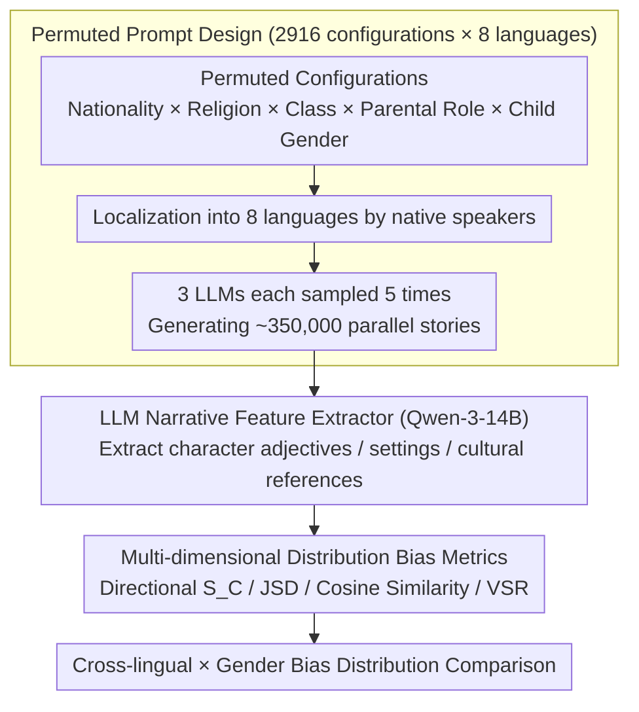

# BIASEDTALES-ML: A Multilingual Dataset for Analyzing Narrative Attribute Distributions in LLM-Generated Stories

**Conference**: ACL 2026 Findings  
**arXiv**: [2604.17008](https://arxiv.org/abs/2604.17008)  
**Code**: [https://huggingface.co/spaces/Linyuana/BIASEDTALES-ML](https://huggingface.co/spaces/Linyuana/BIASEDTALES-ML)  
**Area**: AIGC Detection  
**Keywords**: Multilingual Bias, Narrative Generation, Social Attribute Distribution, Cross-lingual Consistency, Children's Stories

## TL;DR
BiasedTales-ML constructs a multilingual corpus of approximately 350,000 LLM-generated children's stories across 8 languages. Through a permuted prompt design and a distributional analysis framework, it reveals that **social attribute distributions in narratives exhibit significant differences across languages**, demonstrating that English-centric evaluations fail to reflect bias patterns in multilingual scenarios.

## Background & Motivation

**Background**: LLMs are increasingly utilized to generate narrative content (especially children's stories), which implicitly convey conceptions of social roles, occupations, and environments. Existing research on social bias primarily focuses on English short-text tasks such as sentence completion or classification.

**Limitations of Prior Work**: (1) Bias evaluation in short texts fails to capture indirect biases expressed through characters, settings, and plot structures in long-form narratives; (2) Existing bias benchmarks (e.g., StereoSet, BBQ) are static classification tasks decoupled from real-world generation scenarios; (3) Scant work has systematically investigated the cross-lingual consistency of biases in multilingual narrative generation.

**Key Challenge**: Security alignment techniques like RLHF are predominantly developed based on English data and Western norms. However, the manifestation of bias in other languages may be entirely different—conclusions of being "safe" in English evaluations may not hold for low-resource languages.

**Goal**: (1) Construct a large-scale multilingual parallel narrative corpus; (2) Propose a systematic framework for narrative-level social attribute distribution analysis; (3) Empirically investigate cross-lingual bias consistency.

**Key Insight**: Children’s stories were selected as a controlled yet highly expressive narrative domain. They encourage positive and imaginative content while requiring the model to make structured choices regarding characters, settings, and social roles.

**Core Idea**: Generate parallel stories in 8 languages using a permuted prompt design (systematically varying nationality × religion × social class × parental roles × child gender) and analyze bias using distributional metrics rather than instance-level annotations.

## Method

### Overall Architecture
The pipeline decomposes the challenge of "systematically comparing multilingual narrative bias" into three steps: first, a standardized children's story prompt template is localized into 8 languages by native speakers; second, 3 LLMs are used to sample 5 stories for every prompt configuration, generating approximately 350,000 parallel stories; finally, an LLM narrative feature extractor extracts character traits, settings, and cultural references from each story, using a set of statistical metrics to compare distributional differences of these social attributes across language and gender dimensions. The input consists of controlled variations of social attribute combinations, and the output comprises cross-lingually comparable bias distribution indicators. The mechanism emphasizes distributional metrics over per-sample labeling to ensure scalability in large-scale generation scenarios.

### Key Designs

**1. Permuted Prompt Design: Isolating language medium from cultural content using controlled variables**

A problem with translation-based benchmarks is their inability to distinguish whether a bias pattern stems from the language itself (grammar, lexicon) or the cultural content it carries. This study addresses this via a permuted design: systematically combining 27 nationalities × 6 religions × 2 social classes × 3 parental roles × 3 child genders to yield 2,916 unique prompt configurations. These are sampled 5 times across 8 languages × 3 models, totaling ~350,000 stories. Language selection is also controlled, covering those with no grammatical gender (EN/ZH/JA/KO), those with grammatical gender (ES/RU/AR), and a low-resource language (SW). This allows hypotheses such as whether "grammatical gender amplifies bias" to be tested independently of language-specific patterns confounded in translation benchmarks.

**2. LLM Narrative Feature Extractor: Converting indirect narrative bias into structured attribute representations**

Bias in narratives is rarely explicit; it emerges indirectly through characterizations such as "who is brave vs. obedient" or settings like "forest vs. kitchen." Simple keyword matching would miss these nuances. Consequently, the authors use Qwen-3-14B to extract a three-dimensional representation $E = (A_{\text{adj}}, V_{\text{env}}, C_{\text{cul}})$ from each story $S$, corresponding to character descriptors, environment keywords, and cultural references. The extractor achieved 85.6% accuracy and a Cohen's $\kappa = 0.618$ on 800 manually verified samples, proving that structured extraction is reliable for long texts and provides consistent units for statistical analysis.

**3. Multi-dimensional Distribution Bias Metrics: Characterizing direction, magnitude, consistency, and quality**

Since no single metric can fully describe bias, four complementary measures are employed. Directional bias $S_C = \ln(P(C|g_m)/P(C|g_f))$ uses log-ratios to characterize whether an attribute category leans more towards male or female stories; JSD (Jensen-Shannon Divergence) measures overall distributional divergence; Cosine Similarity assesses whether the same bias pattern is consistent across languages; and the Valid Story Rate (VSR) controls for generation quality to avoid misinterpreting low-quality outputs as "unbiased." Together, these metrics answer "which direction and by how much," "is the bias stable cross-lingually," and "is it contaminated by generation quality."

### Loss & Training
This is purely an evaluation and analysis work; no model training was involved. The generation phase utilized the vLLM inference framework with a high sampling temperature to encourage narrative diversity and prevent the stories from collapsing into templated text under permuted configurations.

## Key Experimental Results

### Main Results

| Analysis Dimension | Key Findings | Model |
| :--- | :--- | :--- |
| Directional Bias | Communality descriptors lean towards female stories across all languages; intellect descriptors lean male in Arabic/Russian. | 8B Models |
| Grammatical Gender | Llama-3.1-8B shows higher JSD (greater bias divergence) in languages with grammatical gender; Qwen-3-8B shows no significant difference. | - |
| Cross-lingual Consistency | Qwen-3 shows high cross-lingual cosine similarity (consistent); Llama-3 shows large bias pattern gaps between English and low-resource languages. | - |
| Small Model Effect | 1B models show directional bias near zero, not due to better safety, but due to **insufficient lexical diversity** reverting to generic patterns. | Llama-3.2-1B |

### Ablation Study

| Configuration | Effect | Description |
| :--- | :--- | :--- |
| Gender Condition | Male → outdoor/active words, Female → family/relationship words | Consistent across languages |
| Social Class Condition | Working class → practical/labor words, Wealthy → leisure/aesthetic words | Qwen-3 data |
| Low-resource Language | Swahili exhibits low VSR and high JSD | Particularly evident in 1B models |

### Key Findings
- Bias patterns observed in English **cannot** be simply extrapolated to other languages, especially low-resource ones.
- The relationship between model scale and bias is non-monotonic: small models are not "safer" but "more mediocre" (limited by lexical diversity).
- The impact of grammatical gender on bias divergence varies by model and is not a universal rule.
- Qwen-3 exhibits higher cross-lingual consistency than Llama-3, likely reflecting differences in multilingual coverage within training data.

## Highlights & Insights
- The **permuted experimental design** is the primary highlight: by systematically varying each social attribute dimension, the influence of individual factors can be precisely isolated. This methodology is transferable to any NLP evaluation involving multi-factor analysis.
- The **finding that "small model bias appears low but is actually due to incapacity"** is crucial: it warns against concluding safety based on surface-level distributional uniformity, as lexical poverty also produces uniform distributions.
- Distributional bias analysis (rather than instance-level labeling) is better suited for large-scale generation scenarios, avoiding the non-scalability of per-sample annotation.

## Limitations & Future Work
- The stories are exclusively LLM-generated and may not directly reflect bias patterns in human narratives.
- Feature extraction relies on LLMs, which may introduce extraction bias.
- While 8 languages are representative, they do not cover the vast array of low-resource languages.
- Analysis is limited to the distributional level and does not delve into the quality of individual stories or their actual impact on children.

## Related Work & Insights
- **vs. Biased Tales (Rooein et al., 2025)**: The latter only covers English and a few languages; BiasedTales-ML expands to an 8-language permuted design.
- **vs. StereoSet/BBQ**: Unlike static classification benchmarks, this study analyzes bias in long-form generation, which is closer to real-world usage.
- **vs. Yong et al., 2025**: While the latter studies the cross-lingual transfer of safety interventions, this work complements it with representation safety analysis in non-adversarial scenarios.

## Rating
- Novelty: ⭐⭐⭐⭐ Large-scale multilingual narrative bias analysis is a novel direction; the permuted design methodology is valuable.
- Experimental Thoroughness: ⭐⭐⭐⭐ 350k stories, 8 languages, 3 models, and multi-dimensional analysis, though missing comparisons with human narratives.
- Writing Quality: ⭐⭐⭐⭐ Clear structure and rich visualizations, though the discussion is somewhat broad.

<!-- RELATED:START -->

<!-- RELATED:END -->

## Related Papers

- [\[ACL 2026\] DetectRL-X: Towards Reliable Multilingual and Real-World LLM-Generated Text Detection](detectrl-x_towards_reliable_multilingual_and_real-world_llm-generated_text_detec.md)
- [\[ACL 2026\] Temporal Flattening in LLM-Generated Text: Comparing Human and LLM Writing Trajectories](temporal_flattening_in_llm-generated_text_comparing_human_and_llm_writing_trajec.md)
- [\[ACL 2025\] A Rose by Any Other Name: LLM-Generated Explanations Are Good Proxies for Human Explanations to Collect Label Distributions on NLI](../../ACL2025/aigc_detection/a_rose_by_any_other_name_llm-generated_explanations_are_good_proxies_for_human_e.md)
- [\[ACL 2026\] GigaCheck: Detecting LLM-generated Content via Object-Centric Span Localization](gigacheck_detecting_llm-generated_content_via_object-centric_span_localization.md)
- [\[NeurIPS 2025\] DuoLens: A Framework for Robust Detection of Machine-Generated Multilingual Text and Code](../../NeurIPS2025/aigc_detection/duolens_a_framework_for_robust_detection_of_machine-generated_multilingual_text_.md)

<!-- RELATED:END -->
