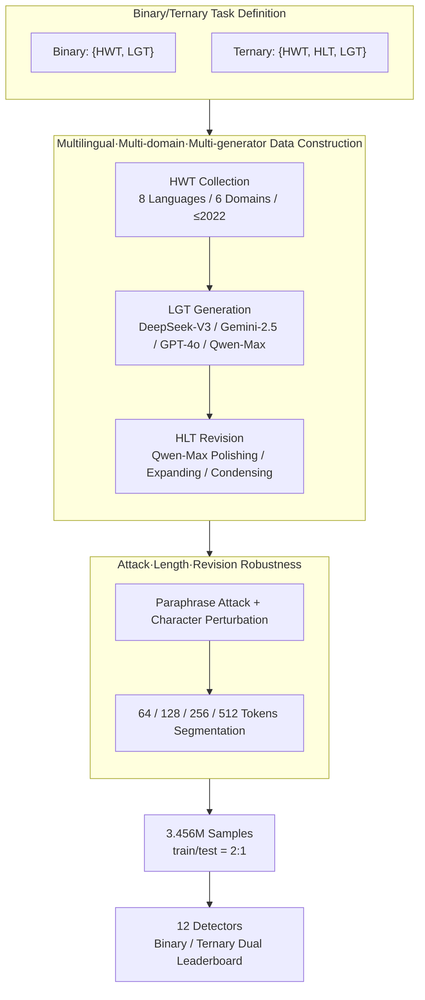

# DetectRL-X: Towards Reliable Multilingual and Real-World LLM-Generated Text Detection

**Conference**: ACL2026  
**arXiv**: [2605.15518](https://arxiv.org/abs/2605.15518)  
**Code**: https://github.com/AIDC-AI/Marco-LLM/tree/main/DetectRL-X  
**Area**: AIGC Detection / LLM-Generated Text Detection  
**Keywords**: LLM-Generated Text Detection, Multilingual Robustness, Ternary Classification, Attack Evaluation, DetectRL-X

## TL;DR
DetectRL-X constructs a benchmark containing 3.456 million samples across multiple languages, domains, attacks, and lengths with parallel binary/ternary classification, proving that existing detectors still have significant robustness gaps in real-world multilingual and human-AI collaborative writing scenarios.

## Background & Motivation
**Background**: LLM-generated text detection is typically defined as a binary classification task to distinguish between Human-Written Text (HWT) and LLM-Generated Text (LGT). Existing detectors fall into two categories: statistical-based methods (e.g., Log-Likelihood, Log-Rank, DetectLLM-LRR, GECScore, Binoculars) and supervised neural detectors (e.g., XLM-RoBERTa-Classifier and mDeBERTa-Classifier).

**Limitations of Prior Work**: Many benchmarks only cover a few languages, generators, or clean distributions, making it difficult to address real-world deployment issues. In commercial scenarios, text may come from different domains, generators, and languages, and may undergo polishing, expanding, condensing, paraphrasing, back-translation, or character perturbation. More critically, actual text is often not purely human-written or purely machine-generated, but human-authored then revised by LLMs. Such Hybrid LLM-Text (HLT) makes traditional binary classification unrealistic.

**Key Challenge**: High scores achieved by detectors in single-domain, single-language, and single-generator settings do not imply their ability to handle real-world internet text. Detection evaluation needs to simultaneously cover linguistic differences, domain gaps, generator variations, text lengths, attacks, and human-AI collaboration; otherwise, the reliability of detectors is systematically overestimated.

**Goal**: The authors aim to construct a detection benchmark closer to real-world usage, covering 8 commercially common languages, 6 high-risk application domains, 4 mainstream generators, 8 attack/perturbation dimensions, 4 text length granularities, and 3 revision operations, while evaluating both Binary and Ternary tasks.

**Key Insight**: Instead of proposing a single new detector, this paper focuses on completing the evaluation space. It integrates HWT, LGT, and HLT into a unified data framework and establishes a leaderboard to compare the performance of 12 representative detection methods under various distribution shifts.

**Core Idea**: Use more complex and realistic multilingual evaluations to expose the vulnerability of detectors, rather than continuing to pursue nearly saturated scores on clean binary classification benchmarks.

## Method

### Overall Architecture
DetectRL-X does not propose a new detector; instead, its "method" lies in the design of data construction, task definition, attack generation, and evaluation modules. It organizes around three text categories: HWT (Human-Written), LGT (LLM-Generated), and HLT (Mixed text via LLM-assisted revision). These correspond to the Binary task $\{HWT, LGT\}$ and the Ternary task $\{HWT, HLT, LGT\}$. Data construction begins by collecting human-written text in 8 languages (English, German, Spanish, French, Portuguese, Russian, Arabic, and Chinese), grouped into high/medium/low complexity. Sources cover six domains (Academic, News, Novel, SEO, Wiki, WebText), using only pre-2022 texts to minimize LGT contamination. Subsequently, LGT is generated using DeepSeek-V3, Gemini-2.5-flash, GPT-4o, and Qwen-Max, while HLT is constructed by using Qwen-Max to perform polishing, expanding, and condensing on HWT/LGT. Finally, multilingual paraphrase/perturbation attacks are superimposed, and samples are segmented into lengths of 64/128/256/512 tokens. The final dataset size is 3,456,000 samples, with a 2:1 train/test split.

### Key Designs

**1. Extending Binary to Ternary: Incorporating the Grey Zone of Human-AI Collaboration**

Traditional detection defines the task as $f_{Binary}: T \to \{HWT, LGT\}$, which can only answer "is it machine-generated" but fails to handle realistic scenarios like "human manuscript polished locally by LLM." This paper introduces $f_{Ternary}: T \to \{HWT, HLT, LGT\}$, where HLT originates from human-written text polished, expanded, or condensed by an LLM, directly corresponding to assisted writing in professional content production. This category forces detectors to make boundary judgments on "hybrid authorship"—experiments confirm that HLT blurs the boundary between HWT and LGT, causing ternary performance to drop significantly compared to binary, thus better reflecting real-world deployment difficulties.

**2. Multilingual, Multi-domain, and Multi-generator Construction: Avoiding Inflation on English-Only Styles**

Most LLMs and detectors have training distributions skewed towards English, meaning high scores on clean English sets often fail to extrapolate to real internet text. Thus, the data covers 8 languages and 6 domains across 4 generators (DeepSeek-V3, Gemini-2.5-flash, GPT-4o, Qwen-Max). Languages are categorized by complexity and typological distance from English: High (Arabic, Russian, Chinese), Medium (German, French, Spanish, Portuguese), and Low (English). This allows the hypothesis—that greater script and morphological differences lead to more difficult tokenization and representation—to be explicitly tested, exposing cross-lingual transfer vulnerabilities as quantifiable performance drops.

**3. Robustness Evaluation for Attack, Length, and Revision: Simulating Real-World Rewriting and Noise**

Real-world detection rarely encounters raw model outputs, but rather LLM text that has been modified. Therefore, the benchmark systematizes potential user operations into multiple attack dimensions: Paraphrase Attacks (Encoder/Seq2seq/Decoder Paraphrasing and Back-Translation) and Perturbation Attacks (Character Insertion/Substitution/Deletion and Zero-width Insertion), combined with length sub-samples (64/128/256/512 tokens) to assess length sensitivity. The value of this stress test lies in measuring whether detectors rely on fragile surface statistical features that can be erased by rewriting; experiments show that paraphrasing is much more destructive than character perturbation.

### Loss & Training
The paper does not propose a new training loss but evaluates 12 existing detectors. Statistical methods include Log-Likelihood, Log-Rank, DetectLLM-LRR, GECScore, ReviseDetect, Fast-DetectGPT, Binoculars, Lastde++, RepreGuard, and Biscope; neural methods include X-Rob-Classifier and mDeBERTa-Classifier. Since LLMs are often black-boxes in real scenarios, watermarking methods are excluded. Performance is measured using Binary and Ternary leaderboards, comparing dimensions like In-Distribution, Cross-Domain, Cross-Generator, Cross-Language, Cross-Paraphrase, Cross-Perturbation, Cross-Length, and Cross-Operation.

## Key Experimental Results

### Main Results

| Task | Best/Representative Method | Avg $F^B_1$ | Avg $F^F_1$ | Interpretation |
| :--- | :--- | :--- | :--- | :--- |
| Binary | X-Rob-Classifier | 95.58% | 91.31% | Ranked 1st in Binary; neural detectors are strongest overall |
| Binary | mDeBERTa-Classifier | 95.48% | 93.20% | 2nd in Binary, but higher $F^F_1$ than X-Rob-Classifier |
| Ternary | mDeBERTa-Classifier | 87.68% | 81.10% | Strongest in Ternary, but significant drop compared to Binary |
| Binary / Ternary | Biscope | 80.06% / 59.69% | 63.62% / 37.91% | Even weaker neural detectors outperform best statistical methods on avg |
| ID (Stat. Detector) | GECScore | 83.22% | N/A | Statistical methods are unstable in complex multilingual distributions |

### Ablation Study

| Robustness Dimension | Performance Change | Description |
| :--- | :--- | :--- |
| Cross-Language | Neural Binary avg $F^B_1$: 95.3% $\to$ 91.4%; Ternary: 87.10% $\to$ 66.28% | Cross-lingual transfer is especially difficult in Ternary tasks |
| Cross-Domain vs Cross-Generator | Binary Neural: Cross-Domain drop 2.95%, Cross-Generator drop 0.78% | Domain shift is a more significant bottleneck than generator shift |
| Paraphrase / Perturbation | Binary Neural: -28.1% vs -13.1%; Ternary: -16.8% vs -4.3% | Paraphrasing destroys detection signals more than character junk |
| Length / Operation | Binary Neural: -4.5% vs -1%; Ternary: -11.9% vs -13.4% | Text length and revision operations have a greater impact on Ternary tasks |
| Binary vs Ternary | Stat ID: 67.9% $\to$ 39.3%; Neural ID: 97.6% $\to$ 87.1% | HLT category significantly increases difficulty, reflecting hybrid authorship |

### Key Findings
- Neural detectors are generally stronger than statistical ones but the problem is not "solved." Substantial performance drops occur in Cross-Language, Cross-Domain, and paraphrase scenarios.
- Statistical detectors are fragile against real-world mixed distributions. Even in In-Distribution settings, their average $F^B_1$ is only 67.89%, indicating that single-domain/single-generator experiments overestimate their effectiveness.
- Ternary tasks are closer to real-world deployment. Overall, statistical methods drop from 58.3% to 35.3%, and neural methods from 90.4% to 76.7%, showing that HLT blurs the boundary between HWT and LGT.
- Paraphrasing is more dangerous than character perturbation. Statistical detectors lose 25-40% under binary paraphrasing, and neural detectors drop up to 35.5%, suggesting reliance on surface features that can be rewritten.
- Language complexity provides an analytical dimension. High-complexity languages (Arabic, Russian, Chinese) pose greater challenges in tokenization, representation, and cross-lingual transfer.

## Highlights & Insights
- The biggest highlight is shifting the evaluation task from "pretty but simple" binary classification back to the real world. The HLT category is crucial because most actual text is human-authored and model-polished.
- The 8 evaluation dimensions make the benchmark more of a stress test than a simple leaderboard. It identifies whether cross-lingual, cross-domain, length, or rewriting factors are undermining the detector.
- The conclusion for statistical methods is practical: while they have low deployment costs and better interpretability, they are unstable in multilingual and attack scenarios and should not be judged solely on clean test sets.
- Insight for training: Future detectors need language-invariant features, domain-robust features, and explicit HLT training data rather than just learning the generator "fingerprints" of LGT.

## Limitations & Future Work
- The authors acknowledge the temporal correlation of the benchmark. LLM generation quality is rapidly improving; future model outputs will more closely resemble human text, making current data styles potentially obsolete.
- Language coverage is still limited. Although 8 languages are broader than most benchmarks, they do not include more regional languages, low-resource languages, or dialect variations.
- Watermarking methods were excluded. The reasoning is the black-box nature of commercial LLMs, but this means the benchmark does not cover active detection routes.
- The definition of ternary classification could be further refined. HLT currently only covers polishing, expanding, and condensing; future work could include multi-turn human-AI collaborative writing or cross-lingual post-editing.

## Related Work & Insights
- **vs Traditional LGT Binary Benchmarks**: Traditional datasets usually only distinguish HWT/LGT; DetectRL-X adds HLT to better match real-world collaboration.
- **vs Multi-generator Benchmarks (M4/RAID)**: These have expanded generators and attacks, but DetectRL-X emphasizes multilingualism, ternary tasks, and a unified 8-dimensional robustness comparison.
- **vs Statistical Detectors**: Methods like DetectLLM-LRR and Binoculars rely on probability or logit features. Their advantage is being unsupervised, but their weakness is lack of robustness to domain, language, and paraphrasing.
- **vs Neural Detectors**: X-Rob-Classifier and mDeBERTa-Classifier rank higher, but their performance still drops in Cross-Language and Ternary settings, indicating that supervised detection requires broader training distributions.

## Rating
- Novelty: ⭐⭐⭐⭐☆ Fewer new detection algorithms, but the benchmark design integrates HLT, multilingualism, and real-world attacks comprehensively.
- Experimental Thoroughness: ⭐⭐⭐⭐⭐ Data scale of 3.456M, covering 8 languages, 6 domains, 4 generators, 12 detectors, and 8 evaluation dimensions.
- Writing Quality: ⭐⭐⭐⭐☆ Logically clear, though tables are long and some metric naming requires careful reading.
- Value: ⭐⭐⭐⭐⭐ Highly valuable for actual AIGC detection deployment, specifically warning against over-reliance on English-only clean binary accuracy.

<!-- RELATED:START -->

## Related Papers

- [\[ACL 2026\] C-ReD: A Comprehensive Chinese Benchmark for AI-Generated Text Detection Derived from Real-World Prompts](c-red_a_comprehensive_chinese_benchmark_for_ai-generated_text_detection_derived_.md)
- [\[ICLR 2026\] TSM-Bench: Detecting LLM-Generated Text in Real-World Wikipedia Editing Practices](../../ICLR2026/aigc_detection/tsm-bench_detecting_llm-generated_text_in_real-world_wikipedia_editing_practices.md)
- [\[ACL 2026\] Temporal Flattening in LLM-Generated Text: Comparing Human and LLM Writing Trajectories](temporal_flattening_in_llm-generated_text_comparing_human_and_llm_writing_trajec.md)
- [\[ACL 2026\] BIASEDTALES-ML: A Multilingual Dataset for Analyzing Narrative Attribute Distributions in LLM-Generated Stories](biasedtales-ml_a_multilingual_dataset_for_analyzing_narrative_attribute_distribu.md)
- [\[ACL 2026\] Beyond the Final Actor: Modeling the Dual Roles of Creator and Editor for Fine-Grained LLM-Generated Text Detection](beyond_the_final_actor_modeling_the_dual_roles_of_creator_and_editor_for_fine-gr.md)

<!-- RELATED:END -->
