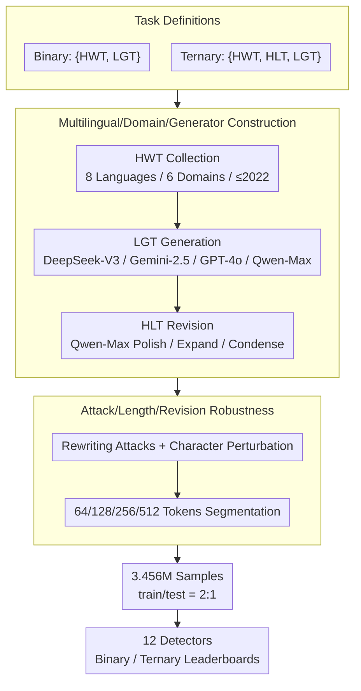

# DetectRL-X: Towards Reliable Multilingual and Real-World LLM-Generated Text Detection

**Conference**: ACL2026  
**arXiv**: [2605.15518](https://arxiv.org/abs/2605.15518)  
**Code**: https://github.com/AIDC-AI/Marco-LLM/tree/main/DetectRL-X  
**Area**: AIGC Detection / LLM-Generated Text Detection  
**Keywords**: LLM-Generated Text Detection, Multilingual Robustness, Ternary Classification, Attack Evaluation, DetectRL-X

## TL;DR
DetectRL-X constructs a benchmark featuring 3.456 million samples across multiple languages, domains, attacks, and lengths with parallel binary and ternary classification tasks. It demonstrates that existing detectors still exhibit significant robustness deficiencies in real-world multilingual and human-machine collaborative writing scenarios.

## Background & Motivation
**Background**: LLM-generated text detection is typically defined as a binary classification task distinguishing between Human-Written Text (HWT) and LLM-Generated Text (LGT). Existing detectors are categorized into statistical methods (e.g., Log-Likelihood, Log-Rank, DetectLLM-LRR, GECScore, Binoculars) and supervised neural detectors (e.g., XLM-RoBERTa-Classifier and mDeBERTa-Classifier).

**Limitations of Prior Work**: Many benchmarks only cover a few languages, generators, or clean distributions, failing to address real-world deployment challenges. In commercial scenarios, text may originate from various domains, generators, and languages, and may undergo polishing, expansion, compression, rewriting, back-translation, or character perturbations. Crucially, actual text is often neither purely human nor purely machine-written, but rather human text revised by LLMs. This Hybrid LLM-Text (HLT) makes traditional binary classification unrealistic.

**Key Challenge**: High scores achieved by detectors in single-domain, single-language, and single-generator settings do not guarantee performance on authentic internet text. Evaluation must simultaneously account for linguistic differences, domain shifts, generator variations, text length, attacks, and collaborative writing; otherwise, detector reliability will be systematically overestimated.

**Goal**: The authors aim to construct a detection benchmark closer to real-world usage, covering 8 commercially common languages, 6 high-risk application domains, 4 mainstream generators, 8 attack/perturbation dimensions, 4 text length granularities, and 3 revision operations, while evaluating both binary and ternary tasks.

**Key Insight**: Rather than proposing a single new detector, the paper completes the evaluation space. It integrates HWT, LGT, and HLT into a unified framework and establishes a leaderboard to compare 12 representative detection methods under various distribution shifts.

**Core Idea**: Expose the fragility of detectors through more complex, realistic multilingual evaluations instead of pursuing near-saturated scores on clean binary benchmarks.

## Method

### Overall Architecture
DetectRL-X does not propose a new detector; instead, its "method" lies in the design of data construction, task definitions, attack generation, and evaluation modules. It organizes three categories: HWT (human), LGT (machine), and HLT (human text revised by LLM). These correspond to binary tasks $\{HWT, LGT\}$ and ternary tasks $\{HWT, HLT, LGT\}$. Data construction begins by collecting human text in 8 languages (English, German, Spanish, French, Portuguese, Russian, Arabic, Chinese), categorized by linguistic complexity. Sources cover six domains (Academic, News, Novel, SEO, Wiki, WebText), using pre-2022 data to minimize LGT contamination. Subsequently, LGT is generated using DeepSeek-V3, Gemini-2.5-flash, GPT-4o, and Qwen-Max. HLT is constructed by using Qwen-Max to polish, expand, or condense HWT. Finally, multilingual paraphrase and perturbation attacks are superimposed, and samples are segmented into 64/128/256/512 token lengths. The final dataset consists of 3,456,000 samples, split 2:1 for training and testing.

### Key Designs

**1. Extension from Binary to Ternary Classification: Including Collaborative Writing**
Traditional detection defines the task as $f_{Binary}: T \to \{HWT, LGT\}$, which identifies "machine flavor" but fails to handle "human drafts polished by LLMs," a common real-world gray area. This paper introduces $f_{Ternary}: T \to \{HWT, HLT, LGT\}$, where HLT represents human-written text that has been polished, expanded, or condensed by an LLM. This directly corresponds to auxiliary writing in office and content production. By introducing this category, the evaluation forces detectors to make boundary judgments on "hybrid authorship"—experiments confirm that HLT blurs the boundary between HWT and LGT, causing a significant drop in ternary performance compared to binary.

**2. Multilingual, Multi-domain, Multi-generator Data Construction**
Most LLMs and detectors are trained on English-heavy distributions, leading to scores on clean English sets that cannot generalize to real internet text. The benchmark covers 8 languages and 6 domains using generators from four providers. Languages are categorized by complexity: High (Arabic, Russian, Chinese), Medium (German, French, Spanish, Portuguese), and Low (English). This allows for explicit testing of the hypothesis that "greater differences in writing systems and morphological structures increase representation difficulty," exposing cross-lingual transfer fragility as a quantifiable metric.

**3. Robustness Evaluation Across Attacks, Lengths, and Revisions**
Real-world detection rarely encounters raw model outputs; instead, it faces revised LLM text. The benchmark systematizes user modifications into multiple dimensions: Paraphrase Attacks (Encoder/Seq2seq/Decoder Paraphrasing and Back-Translation) and Perturbation Attacks (Character Insertion/Substitution/Deletion and Zero-width Insertion), alongside length sensitivity analysis (64/128/256/512 tokens). This stress test reveals whether detectors rely on fragile surface statistical features that can be erased by rewriting—experiments show paraphrasing is far more destructive than character perturbations.

### Loss & Training
The paper does not propose new training losses but evaluates 12 existing detectors. Statistical methods include Log-Likelihood, Log-Rank, DetectLLM-LRR, GECScore, ReviseDetect, Fast-DetectGPT, Binoculars, Lastde++, RepreGuard, and Biscope. Neural methods include X-Rob-Classifier and mDeBERTa-Classifier. Watermarking methods are excluded as commercial LLMs are often black boxes. Evaluation uses Binary and Ternary leaderboards, comparing metrics across In-Distribution, Cross-Domain, Cross-Generator, Cross-Language, Cross-Paraphrase, Cross-Perturbation, Cross-Length, and Cross-Operation dimensions.

## Key Experimental Results

### Main Results

| Task | Best / Rep. Method | Avg $F^B_1$ | Avg $F^F_1$ | Interpretation |
|--------|------|------|----------|------|
| Binary | X-Rob-Classifier | 95.58% | 91.31% | Ranked 1st on binary leaderboard; neural detectors are strongest overall. |
| Binary | mDeBERTa-Classifier | 95.48% | 93.20% | 2nd in binary, but higher $F^F_1$ than X-Rob-Classifier. |
| Ternary | mDeBERTa-Classifier | 87.68% | 81.10% | Strongest in ternary, but significantly lower than binary. |
| Binary / Ternary | Biscope | 80.06% / 59.69% | 63.62% / 37.91% | Even weaker neural detectors outperform the best statistical detectors on average. |
| In-Distribution Stat. | GECScore | 83.22% | N/A | Statistical methods are unstable in complex multilingual mixtures even for ID tasks. |

### Ablation Study

| Robustness Dimension | Performance Change Observed | Description |
|------|---------|------|
| Cross-Language | Neural Binary Avg $F^B_1$ dropped from 95.3% to 91.4%; Ternary from 87.10% to 66.28% | Cross-lingual transfer is especially difficult in ternary tasks (mDeBERTa dropped 20.55%). |
| Cross-Domain vs Generator | Binary Neural detectors: Cross-Domain dropped 2.95%, Cross-Generator dropped 0.78% | Domain shift is a more significant real-world bottleneck than generator shift. |
| Paraphrase / Perturbation | Binary Neural dropped 28.1% and 13.1%; Ternary dropped 16.8% and 4.3% | Paraphrasing is more destructive to detection signals than fine-grained character noise. |
| Length / Operation | Binary Neural dropped ~4.5% and 1%; Ternary dropped 11.9% and 13.4% | Text length and revision operations have a larger impact on ternary classification. |
| Binary vs Ternary | ID Stat. detectors dropped from 67.9% to 39.3%; Neural from 97.6% to 87.1% | HLT category significantly increases task difficulty and reflects hybrid authorship. |

### Key Findings
- Neural detectors outperform statistical ones but are not "solved." Substantial performance drops occur in Cross-Language, Cross-Domain, and paraphrase scenarios.
- Statistical detectors are fragile against real hybrid distributions. Even in In-Distribution settings, their average $F^B_1$ is only 67.89%, suggesting single-domain experiments overestimate their efficacy.
- The Ternary task is closer to real deployment. On average, statistical methods drop from 58.3% to 35.3%, and neural methods from 90.4% to 76.7%, indicating that HLT blurs the HWT/LGT boundary.
- Paraphrasing is more dangerous than character perturbation. Statistical detectors lose 25-40% under paraphrasing, indicating reliance on surface features that rewriting can eliminate.
- Language complexity provides an analytical dimension. High-complexity languages (Arabic, Russian, Chinese) pose greater challenges in tokenization and cross-lingual transfer.

## Highlights & Insights
- The main highlight is pulling evaluation back from "neat but simple" binary classification to the real world. The HLT category is crucial because most text is polished by models rather than being purely machine-generated.
- The 8 evaluation dimensions make the benchmark function as a stress test rather than a simple leaderboard, identifying exactly what (e.g., cross-language vs. rewriting) causes failure.
- The conclusion on statistical methods is practical: while they are low-cost and interpretable, they lack stability in multilingual and attack-prone scenarios and should not be judged solely on clean sets.
- For future training, models need language-invariant and domain-robust features, and training data must explicitly include HLT rather than just learning generator fingerprints.

## Limitations & Future Work
- The benchmark has temporal sensitivity. As LLM generation quality improves, outputs will closer resemble human text, making current generators and styles obsolete.
- Language coverage remains limited. While 8 languages are broader than most benchmarks, they exclude many regional languages, low-resource languages, and dialects.
- Watermarking is excluded because industrial LLMs are black boxes, meaning the benchmark does not cover "active watermarking" routes.
- The definition of ternary classification could be further refined. HLT currently only covers polishing, expanding, and condensing; future work could include multi-turn co-writing and post-editing of translations.

## Related Work & Insights
- **vs. Traditional LGT Binary Benchmarks**: These usually only distinguish HWT/LGT; DetectRL-X adds HLT to better reflect human-machine collaboration.
- **vs. M4 / RAID Multi-generator Evaluations**: These already cover multiple generators and attacks, but DetectRL-X emphasizes multilingualism, ternary tasks, and a unified 8-dimensional robustness comparison.
- **vs. Statistical Detectors**: Methods like DetectLLM-LRR and Binoculars are unsupervised but suffer from poor robustness across domains, languages, and rewriting.
- **vs. Neural Detectors**: X-Rob and mDeBERTa rank higher, but their performance drop in Cross-Language and Ternary scenarios indicates that supervised detection still requires broader training distributions.

## Rating
- Novelty: ⭐⭐⭐⭐☆ Few new detection algorithms, but the benchmark design integrates HLT, multilingualism, and real-world attacks thoroughly.
- Experimental Thoroughness: ⭐⭐⭐⭐⭐ 3.456 million samples, 8 languages, 6 domains, 4 generators, 12 detectors, and 8 evaluation dimensions.
- Writing Quality: ⭐⭐⭐⭐☆ Argumentation is clear, though some tables are extremely long with a slight learning curve for metric naming.
- Value: ⭐⭐⭐⭐⭐ Highly valuable for real-world AIGC detection deployment, warning against over-reliance on English-only binary accuracy.

<!-- RELATED:START -->

## Related Papers

- [\[ACL 2026\] C-ReD: A Comprehensive Chinese Benchmark for AI-Generated Text Detection Derived from Real-World Prompts](c-red_a_comprehensive_chinese_benchmark_for_ai-generated_text_detection_derived_.md)
- [\[ACL 2026\] Temporal Flattening in LLM-Generated Text: Comparing Human and LLM Writing Trajectories](temporal_flattening_in_llm-generated_text_comparing_human_and_llm_writing_trajec.md)
- [\[ACL 2026\] BIASEDTALES-ML: A Multilingual Dataset for Analyzing Narrative Attribute Distributions in LLM-Generated Stories](biasedtales-ml_a_multilingual_dataset_for_analyzing_narrative_attribute_distribu.md)
- [\[ACL 2026\] Beyond the Final Actor: Modeling the Dual Roles of Creator and Editor for Fine-Grained LLM-Generated Text Detection](beyond_the_final_actor_modeling_the_dual_roles_of_creator_and_editor_for_fine-gr.md)
- [\[NeurIPS 2025\] DuoLens: A Framework for Robust Detection of Machine-Generated Multilingual Text and Code](../../NeurIPS2025/aigc_detection/duolens_a_framework_for_robust_detection_of_machine-generated_multilingual_text_.md)

<!-- RELATED:END -->
