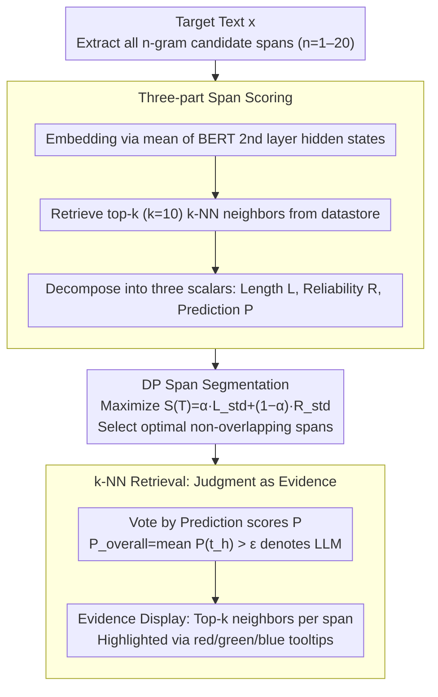

# ExaGPT: Example-Based Machine-Generated Text Detection for Human Interpretability

**Conference**: ACL 2026 Findings  
**arXiv**: [2502.11336](https://arxiv.org/abs/2502.11336)  
**Code**: https://github.com/ryuryukke/ExaGPT  
**Area**: AIGC Detection / Interpretable Machine Learning / Retrieval Augmentation  
**Keywords**: LLM Text Detection, Interpretability, k-NN Retrieval, Dynamic Programming, Cross-domain Generalization

## TL;DR
ExaGPT reformulates "determining whether text is human or LLM-generated" as "finding which side of a datastore contains more similar spans." By utilizing BERT embeddings, k-NN retrieval, and Dynamic Programming (DP) for optimal span segmentation, it provides interpretable evidence (most similar retrieved spans) and improves accuracy by up to +37.0 percentage points over previous interpretable detectors at 1% FPR.

## Background & Motivation
**Background**: LLM-generated text detection is primarily divided into three categories: watermarking, metric-based (log-prob / entropy / perplexity / probability curvature), and supervised classifiers (RoBERTa fine-tuning, Ghostbuster, Pangram). Overall AUROC already exceeds 99%, appearing "solved."

**Limitations of Prior Work**: Detectors outputting only binary labels are unacceptable regarding false positives—writers have been fired and students' reputations damaged due to misidentification. Existing "interpretable" detectors (GLTR highlighted tokens, SHAP/LIME attribution, DNA-GPT n-gram overlap) provide token-level statistics or machine-perspective attribution scores that are unintelligible to average users.

**Key Challenge**: The human intuitive process for determining if text is AI-written is: "Have I seen this phrasing more often in AI or human text?"—essentially classification based on similar span frequency. No existing detector aligns with this example-based decision process, rendering them untrustworthy even when accurate.

**Goal**: (1) Design a detector that inherently operates by "finding similar span examples"; (2) Naturally transform these "similar spans" into human-readable evidence; (3) Maintain SOTA accuracy in practical scenarios like 1% FPR.

**Key Insight**: The authors borrow logic from plagiarism detection (Maurer 2006, Barrón-Cedeño 2013)—humans judge text sources based on verbatim overlap and semantically similar spans. This logic is applied to LLM detection: build a datastore of human and LLM text, segment target text into spans, perform k-NN retrieval, and observe which class has more similar spans.

**Core Idea**: Reformulate detection as "k-NN majority voting + DP span segmentation"—replacing classifiers with retrieval so the model's decision path naturally serves as evidence.

## Method

### Overall Architecture
ExaGPT decomposes binary classification into two retrieval-based phases: first, scoring each candidate segment of the target text $x$ based on its similarity to either side of the datastore, and then using DP to select a set of non-overlapping spans covering the full text. The final judgment is made by voting based on the "LLM-ness" of these segments. No classifier is trained; the decision comes directly from retrieved snippets.

### Key Designs

**1. Three-part span scoring: Decoupling evidence strength into Length, Reliability, and Prediction**

Humans ask two questions when judging AI text: "Have I seen this in AI text?" and "Which side is more frequent?" A single similarity score cannot carry both. ExaGPT uses the mean of BERT 2nd layer hidden states for each $n$-gram span ($n \in [1,20]$) to find top-$k$ ($k=10$) neighbors. It then extracts three scalars: Length $L=n$, Reliability $R=\frac{1}{k}\sum_j c_j$ (average neighbor similarity), and Prediction $P=\frac{1}{k}\sum_j \mathbb{1}(l_j=\text{LLM})$ (proportion of LLM labels). Decoupling $R$ and $P$ allows the second stage to select "solid" evidence while voting for the source independently.

**2. DP span segmentation: Selecting "long and similar" spans from exponential combinations**

Naive fixed-granularity segmentation (e.g., $n=5$) fails to capture verbatim long overlaps or rare but highly discriminative short segments. ExaGPT maximizes $S(T)=\frac{1}{H}\sum_h[\alpha L^{\text{std}}(t_h)+(1-\alpha)R^{\text{std}}(t_h)]$, where $L^{\text{std}}, R^{\text{std}}$ are normalized scores and $\alpha$ balances length and reliability. Solved via DP, the state $\text{dp}[i]$ records the best score for prefix $x_{0:i}$. Transitioning involves iterating $j\in[i-N,i)$ to find the max mean. Complexity is $O(m\cdot N)$ ($N=20$). This ensures the user sees long, reliable continuous evidence.

**3. k-NN retrieval as both judgment and evidence: Aligning decision paths with explanations**

Traditional SHAP/LIME provides post-hoc explanations that may diverge from the actual decision path. ExaGPT defines the judgment as $P_{\text{overall}}=\frac{1}{H}\sum_h P(t_h)>\epsilon$. The top-$k$ neighbors $E=\{(t_h,[s_h^1,\dots,s_h^k])\}_{h=1}^H$ used for this judgment are displayed directly as tooltips color-coded by label (Human/Neutral/LLM). Since the decision and evidence stem from the same k-NN results, post-hoc inconsistency is eliminated.

### Full Example
For a suspected AI sentence, ExaGPT extracts all candidate spans from $n=1$ to $20$ and queries the datastore. A long span finds 10 highly similar neighbors in human arXiv data (high $R$, $P\approx 0$), while a short span hits ChatGPT neighbors (high $P$). DP selects the optimal non-overlapping sequence maximizing $S(T)$. The mean $P$ of selected spans determines the label, and hovering over any segment reveals the top-10 real datastore examples that triggered the decision.

### Loss & Training
ExaGPT is training-free. It uses `bert-large-uncased` for embeddings (2nd layer mean pooling). The datastore uses the training split of the M4 dataset (2000 pairs per domain×generator) with FAISS indices. Hyperparameters include the segmentation coefficient $\alpha$ (tuned on validation; smaller $\alpha$ favoring reliability works best) and the threshold $\epsilon$ (determined at 1% FPR on validation).

## Key Experimental Results

### Main Results
Average accuracy at 1% FPR on the M4 dataset (Wikipedia, Reddit, WikiHow, arXiv):

| Generator | Detector | Wikipedia ACC | Reddit ACC | WikiHow ACC | arXiv ACC | Avg ACC | Avg AUROC |
|-----------|----------|---------------|------------|-------------|-----------|---------|-----------|
| ChatGPT | RoBERTa-SHAP | 77.1 | 61.0 | 50.0 | 87.3 | 68.9 | 100.0 |
| ChatGPT | LR-GLTR | 60.0 | 94.0 | 85.8 | 97.7 | 84.4 | 97.9 |
| ChatGPT | DNA-GPT | 49.4 | 62.9 | 93.5 | 59.9 | 66.4 | 91.4 |
| ChatGPT | **Ours** | **92.3** | 86.6 | **96.0** | 95.8 | **92.7** | 99.2 |
| GPT-4 | RoBERTa-SHAP | 87.8 | 66.4 | 77.4 | 68.6 | 75.1 | 100.0 |
| GPT-4 | LR-GLTR | 85.7 | 97.2 | 77.8 | 98.5 | 89.8 | 98.1 |
| GPT-4 | **Ours** | 87.3 | 91.1 | **92.2** | **98.7** | **92.3** | 99.0 |
| Dolly-v2 | **Ours** | **63.8** | 76.6 | **75.6** | 67.3 | **70.8** | 90.4 |

Human evaluation of interpretability (96 samples × 4 detectors):

| Detector | Acc. of Human Judgments (%) |
|----------|------------------------------|
| RoBERTa-SHAP | 47.9 |
| LR-GLTR | 57.3 |
| DNA-GPT | 53.1 |
| **Ours** | **61.5** |

### Ablation Study
Cross-domain/generator robustness and inference cost:

| Configuration | Key Metric | Description |
|------|---------|------|
| Single domain, cross-domain test (Wiki → arXiv) | AUROC 89.3 / ACC@1%FPR 60.5 | Performance drops significantly |
| ALL multi-domain, cross-domain test | AUROC 94.3-99.5 / ACC 73.4-96.7 | Mixed datastore mitigates gap |
| Cross-generator (GPT-4 → Dolly, arXiv) | AUROC 61.8 / ACC 51.5 | Fails between commercial and open-source LLMs |
| DIPPER paraphrase (ChatGPT, avg 4 domains) | AUROC 96.0 / ACC 76.5 | Outperforms LR-GLTR (93.9 / 72.9) |
| Datastore 2000 → 500 pairs | AUROC 99.5 → 99.4 | Negligible loss |
| 500 pairs + FAISS-IVFPQ | Latency 1.22 sec (-91%), AUROC 97.8 | Deployable with minor AUROC cost |

### Key Findings
- LR-GLTR, the strongest interpretable baseline, hits only 60.0 ACC@1%FPR on ChatGPT × Wikipedia, while Ours achieves 92.3. Interpretability and performance are not necessarily a trade-off.
- Smaller $\alpha$ (praising reliability) yields better results, though the method is generally robust to hyperparameters.
- Cross-generator detection (GPT-4 to Dolly) is the primary failure mode due to disparate vocabulary distributions.
- A datastore as small as 500 pairs is sufficient, lowering the deployment barrier compared to supervised methods.

## Highlights & Insights
- **Decision as Evidence**: Validates example-based interpretability by unifying the prediction and explanation paths through k-NN.
- **DP on Spans**: Formalizing evidence selection as an optimal segmentation problem with length-reliability trade-offs is more elegant than heuristic clipping.
- **Training-free SOTA**: Beats supervised RoBERTa fine-tuning and metric-based SOTA methods in low FPR zones by treating classification as retrieval.
- **Layer 2 BERT Hidden States**: Shallow layers balance lexical and semantic similarity better than the final layer for span-level matching.

## Limitations & Future Work
- **Datastore Dependency**: Requires pre-labeled data and index reconstruction for new domains or models.
- **Open-source Generator Gap**: Performance falls to near-random when indices do not cover the specific model's output style.
- **Small Human Eval Scale**: The +13.6 point gain in human evaluation lacks large-scale user testing.
- **Inference Cost**: Standard settings require heavy GPU memory; compression like IVFPQ is mandatory for production.

## Related Work & Insights
- **vs DNA-GPT**: DNA-GPT relies on verbatim overlap and online re-generation; Ours uses semantic embeddings and offline retrieval, improving human judgment accuracy (+8.4 points).
- **vs Binoculars / Fast-DetectGPT**: While SOTA metric-based methods are black boxes, Ours achieves comparable performance with transparent evidence.
- **vs kNN-LM**: While kNN-LM uses retrieval for generation, Ours applies it to classification with the unique addition of DP segmentation.

## Rating
- Novelty: ⭐⭐⭐⭐ Introducing example-based interpretability to LLM detection with DP segmentation is a clear, underexplored combination.
- Experimental Thoroughness: ⭐⭐⭐⭐⭐ Comprehensive cross-domain, cross-generator, and ablation testing.
- Writing Quality: ⭐⭐⭐⭐ Clear motivation and intuitive figures, though the DP algorithm section is dense.
- Value: ⭐⭐⭐⭐ Highly practical for high-stakes scenarios (education, moderation) due to auditability.

<!-- RELATED:START -->

## Related Papers

- [\[ACL 2026\] Temporal Flattening in LLM-Generated Text: Comparing Human and LLM Writing Trajectories](temporal_flattening_in_llm-generated_text_comparing_human_and_llm_writing_trajec.md)
- [\[ACL 2025\] HACo-Det: A Study Towards Fine-Grained Machine-Generated Text Detection under Human-AI Coauthoring](../../ACL2025/aigc_detection/haco-det_a_study_towards_fine-grained_machine-generated_text_detection_under_hum.md)
- [\[ACL 2026\] When Personalization Tricks Detectors: The Feature-Inversion Trap in Machine-Generated Text Detection](when_personalization_tricks_detectors_the_feature-inversion_trap_in_machine-gene.md)
- [\[NeurIPS 2025\] DuoLens: A Framework for Robust Detection of Machine-Generated Multilingual Text and Code](../../NeurIPS2025/aigc_detection/duolens_a_framework_for_robust_detection_of_machine-generated_multilingual_text_.md)
- [\[ACL 2025\] MultiSocial: Multilingual Benchmark of Machine-Generated Text Detection of Social-Media Texts](../../ACL2025/aigc_detection/multisocial_mgt_detection.md)

<!-- RELATED:END -->
