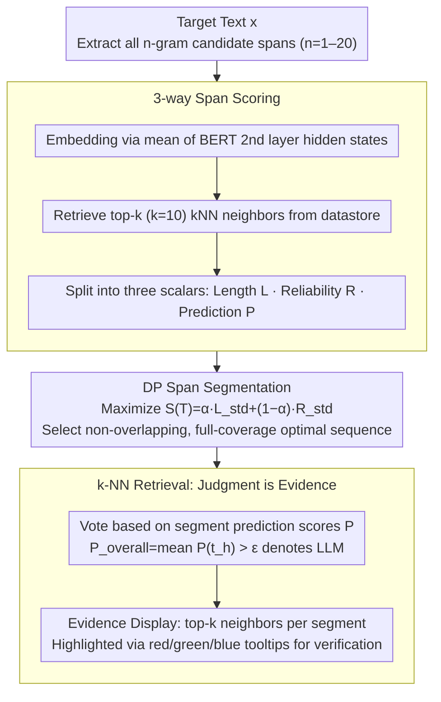

# ExaGPT: Example-Based Machine-Generated Text Detection for Human Interpretability

**Conference**: ACL 2026 Findings  
**arXiv**: [2502.11336](https://arxiv.org/abs/2502.11336)  
**Code**: https://github.com/ryuryukke/ExaGPT  
**Area**: AIGC Detection / Explainable Machine Learning / Retrieval Augmentation  
**Keywords**: LLM Text Detection, Interpretability, k-NN Retrieval, Dynamic Programming, Cross-domain Generalization

## TL;DR
ExaGPT reframes the task of "determining whether a text is human-written or LLM-generated" as "identifying which side has more similar spans in a data store." By utilizing BERT embeddings, k-NN retrieval, and dynamic programming for optimal span segmentation, it provides interpretable evidence (most similar retrieved span examples) while improving accuracy by up to $+37.0$ points over previous explainable detectors at 1% FPR.

## Background & Motivation
**Background**: LLM-generated text detection is primarily divided into three categories: text watermarking, metric-based (log-prob / entropy / perplexity / probability curvature), and supervised classifiers (RoBERTa fine-tuning, Ghostbuster, Pangram). Overall AUROC scores have already reached over 99%, appearing to be a "solved" problem.

**Limitations of Prior Work**: However, detectors that only output binary labels are unacceptable due to false positives—writers have been fired and students' reputations damaged due to misidentification by AI detectors. Existing "explainable" detectors (GLTR highlighting tokens, SHAP/LIME attribution, DNA-GPT n-gram overlap) provide evidence in the form of token-level statistics or machine-perspective attribution scores, which are difficult for ordinary users to interpret.

**Key Challenge**: The intuitive process humans use to determine "is this written by AI" is: "Have I seen this phrase or way of speaking more often in AI text or human text?", i.e., "classification by the number of similar spans." However, no existing detector aligns with this example-based decision process, so even accurate detectors fail to help users judge whether a specific prediction is trustworthy.

**Goal**: (1) Design a detector that inherently works by "finding similar span examples"; (2) Naturally transform "similar spans" into evidence for human consumption; (3) Maintain SOTA accuracy in practical scenarios such as 1% FPR.

**Key Insight**: The authors borrow decision logic from plagiarism detection (Maurer 2006, Barrón-Cedeño 2013)—humans judge text sources based on verbatim overlap and semantically similar spans. This logic is applied to LLM detection: construct a datastore of human-written and LLM-generated texts, segment the target text into spans, perform k-NN retrieval, and determine which side has more similar spans.

**Core Idea**: Refactor detection as "k-NN majority voting + dynamic programming span segmentation"—in short, "replacing the classifier with retrieval so that the model's decision path naturally serves as human-readable evidence."

## Method

### Overall Architecture
ExaGPT decomposes the binary classification of "determining text source" into a two-stage retrieval process: first, scoring each candidate segment of the target text $x$ based on "which side of the datastore it resembles more," then using dynamic programming to select a set of non-overlapping, full-coverage optimal segments. Finally, a collective decision is made by voting based on the "LLM-likeness" of these segments. No classifier is trained during the entire process—decisions come directly from retrieved similar segments, making the same batch of segments both the basis for judgment and the evidence for the user.

### Key Designs

**1. 3-way span scoring: Decoupling "is this segment evidence" into length, reliability, and prediction signals**

When determining AI text, humans essentially ask two things—"Have I seen this phrasing in AI text?" and "Which side exists more frequently?" A single similarity score cannot carry both layers of information. ExaGPT therefore first computes embeddings for each $n$-gram span ($n \in [1,20]$) using the mean of the second-layer hidden states of BERT, retrieves top-$k$ ($k=10$) k-NN neighbors from the datastore, and extracts three scalars: length score $L=n$, reliability score $R=\frac{1}{k}\sum_j c_j$ (mean similarity of neighbors, measuring if legitimate similar segments exist in the datastore), and prediction score $P=\frac{1}{k}\sum_j \mathbb{1}(l_j=\text{LLM})$ (the proportion of LLM labels among neighbors, indicating which side the segment leans toward). By separating reliability and prediction, the second stage can use $R$ to select segments with "solid evidence" and $P$ to perform the source vote, preventing the distortion that occurs when "similarity" and "class identity" are collapsed into one score.

**2. Dynamic programming span segmentation: Selecting the "long and truly similar" set of segments from exponential $n$-gram combinations**

Naive segmentation with fixed granularity (e.g., always taking $n=5$) fails at both ends: it loses very verbatim long overlaps and misses short but highly discriminative rare segments. ExaGPT defines segmentation to maximize the objective $S(T)=\frac{1}{H}\sum_h[\alpha L^{\text{std}}(t_h)+(1-\alpha)R^{\text{std}}(t_h)]$, where $L^{\text{std}}, R^{\text{std}}$ are standardized scores normalized on the validation set, and $\alpha$ adjusts the preference between length and reliability. This is solved via DP: state $\text{dp}[i]$ records the maximum cumulative score and backtrack pointer for the prefix $x_{0:i}$. Transitions enumerate the previous split point $j\in[i-N,i)$ to maximize the mean, resulting in a segmentation sequence $T=[t_1,\dots,t_H]$, with complexity $O(m\cdot N)$ ($N=20$ for maximum $n$-gram). Consequently, long segments and high-similarity segments are prioritized simultaneously, providing users with "long and similar" continuous evidence, which maximizes readability in the UI.

**3. k-NN retrieval as both judgment and evidence: Making the decision path the explanation**

Traditional SHAP/LIME can only state post-hoc "which tokens were important," and the explanation may not align with the actual decision path; users must also understand likelihood or attribution to interpret them. ExaGPT defines the overall judgment as $P_{\text{overall}}=\frac{1}{H}\sum_h P(t_h)>\epsilon$ for LLM, while the top-$k$ neighbors $E=\{(t_h,[s_h^1,\dots,s_h^k])\}_{h=1}^H$ for each segment used in the judgment are presented directly as tooltips color-coded by label (red/green/blue for Human/Neutral/LLM). Hovering the mouse reveals the "10 most similar real segments from the datastore" and their label distribution. Since the decision and the evidence are products of the same k-NN process, post-hoc attribution inconsistency is eliminated by design, allowing users to personally verify the reliability of the prediction.

### Mechanism Example
Input a sentence suspected to be AI-written. ExaGPT first breaks it into all candidate $n$-grams from $n=1$ to $20$ and retrieves them from the datastore: a long segment might find 10 highly similar neighbors in the arXiv human corpus ($R$ high, $P\approx 0$, leaning Human), while another short segment matches most neighbors in the ChatGPT corpus ($P\approx 1$, leaning LLM). DP selects a set of non-overlapping segments that cover the whole sentence and maximize $S(T)$—prioritizing long and reliable segments. Finally, the $P$ scores of the selected segments are averaged; if they exceed threshold $\epsilon$, it is judged as LLM, and each segment is highlighted with its top-10 neighbors for the user to hover and verify.

### Loss & Training
ExaGPT is entirely training-free: the detection phase uses only BERT-large-uncased for embeddings (taking the mean pooling of the 2nd layer, as it provides the best balance between lexical and semantic similarity). The datastore uses the training split of the M4 dataset (2,000 sample pairs for each domain × generator combination) to build a FAISS index. The only "hyperparameters" are the segmentation coefficient $\alpha\in\{0,0.125,0.25,\dots,1.0\}$, selected on validation for best detection performance (experiments show a preference for reliability, i.e., smaller $\alpha$), and the detection threshold $\epsilon$ derived based on "FPR=1% on validation."

## Key Experimental Results

### Main Results
Average detection accuracy at 1% FPR on the M4 dataset (4 domains: Wikipedia/Reddit/WikiHow/arXiv × 3 generators: ChatGPT/GPT-4/Dolly-v2):

| Generator | Detector | Wikipedia ACC | Reddit ACC | WikiHow ACC | arXiv ACC | Avg ACC | Avg AUROC |
|-----------|----------|---------------|------------|-------------|-----------|---------|-----------|
| ChatGPT | RoBERTa-SHAP | 77.1 | 61.0 | 50.0 | 87.3 | 68.9 | 100.0 |
| ChatGPT | LR-GLTR | 60.0 | 94.0 | 85.8 | 97.7 | 84.4 | 97.9 |
| ChatGPT | DNA-GPT | 49.4 | 62.9 | 93.5 | 59.9 | 66.4 | 91.4 |
| ChatGPT | **ExaGPT** | **92.3** | 86.6 | **96.0** | 95.8 | **92.7** | 99.2 |
| GPT-4 | RoBERTa-SHAP | 87.8 | 66.4 | 77.4 | 68.6 | 75.1 | 100.0 |
| GPT-4 | LR-GLTR | 85.7 | 97.2 | 77.8 | 98.5 | 89.8 | 98.1 |
| GPT-4 | **ExaGPT** | 87.3 | 91.1 | **92.2** | **98.7** | **92.3** | 99.0 |
| Dolly-v2 | **ExaGPT** | **63.8** | 76.6 | **75.6** | 67.3 | **70.8** | 90.4 |

Human evaluation of interpretability (96 samples × 4 detectors):

| Detector | Acc. of Human Judgments (%) |
|----------|------------------------------|
| RoBERTa-SHAP | 47.9 |
| LR-GLTR | 57.3 |
| DNA-GPT | 53.1 |
| **ExaGPT** | **61.5** |

### Ablation Study
Cross-domain (GPT-4) / Cross-generator (arXiv) / Paraphrase robustness / Inference cost:

| Configuration | Key Metrics | Description |
|------|---------|------|
| Single-domain training, cross-domain test (Wikipedia → arXiv, GPT-4) | AUROC 89.3 / ACC@1%FPR 60.5 | Significant performance drop with single-source datastore |
| ALL multi-domain training, cross-domain test | AUROC 94.3-99.5 / ACC 73.4-96.7 | Mixed datastore nearly eliminates cross-domain gap |
| Single-generator (GPT-4 → Dolly, arXiv) | AUROC 61.8 / ACC 51.5 | Nearly fails between open-source vs. closed-source LLMs |
| DIPPER paraphrase (ChatGPT, avg 4 domains) | AUROC 96.0 / ACC 76.5 | Still significantly leads LR-GLTR (93.9 / 72.9) |
| Datastore 2000 → 500 pairs | AUROC 99.5 → 99.4 | Nearly no loss |
| 500 pairs + FAISS-IVFPQ | GPU 162→20 GB (-87%), Latency 14.6→1.22 sec (-91%), AUROC 97.8 | Optimized for deployment with only 1.7% AUROC loss |

### Key Findings
- The strongest explainable baseline, LR-GLTR, achieves only 60.0 ACC@1%FPR on ChatGPT × Wikipedia, while ExaGPT reaches 92.3, an absolute difference of $+32.3$ points. This indicates that existing "explainable" detectors are barely usable in the low FPR range; interpretability and performance are not necessarily a trade-off.
- Smaller values of the segmentation coefficient $\alpha$ (i.e., leaning toward reliability score) yield better performance—choosing "spans that actually have similar neighbors in the datastore" is more effective than just "choosing long spans." However, even with the worst $\alpha$ tuning, AUROC does not fall below 98.5%, showing the method's insensitivity to hyperparameters.
- The cross-open-source vs. closed-source LLM scenario is the primary failure mode: AUROC is only 61.8 when using a GPT-4 datastore to test Dolly output. This is because Dolly's writing style and vocabulary distribution differ too much from commercial LLMs, causing similar span retrieval to fail.
- The discovery that "500 pairs in the datastore are sufficient" is critical—it means practical deployment can start with just a few thousand labeled samples, which is a lower threshold than supervised methods like RoBERTa that require 2000+ training samples.

## Highlights & Insights
- **Decision as Evidence**: ExaGPT unifies "model prediction" and "human explanation" into the same k-NN retrieval process. This bypasses the inherent flaw of post-hoc explanations like SHAP/LIME, which may not match the actual decision path. This is a rare, clear implementation of example-based interpretability in NLP detection.
- **DP for Span Segmentation**: Formulating the search for "most persuasive evidence segments" as an optimal segmentation problem with length-reliability trade-offs is more elegant than heuristic fixed $n$-gram segmentation. This DP-on-spans approach could be transferred to tasks like plagiarism detection, attribution, and key sentence selection in summarization.
- **Training-free yet beats SOTA Supervised Methods**: Without training any models, ExaGPT outperforms fine-tuned RoBERTa (+17.2 ACC on GPT-4) and SOTA metric methods like Binoculars/Fast-DetectGPT at 1% FPR. This suggests that in low FPR regions, refactoring classification into retrieval may be inherently more robust.
- **2nd Layer BERT Hidden State**: Choosing the 2nd layer of BERT instead of the default last layer for span embeddings—based on a pilot study—is key, as shallower layers provide a better balance between lexical and semantic similarity. This engineering detail significantly impacts retrieval quality and is a valuable insight for any retrieval-based NLP system.

## Limitations & Future Work
- **Datastore Dependency**: The method requires a pre-labeled datastore; indices must be rebuilt for cross-domain/cross-generator scenarios. Additionally, unlabeled samples are needed for unseen LLMs (like newly released models).
- **Open vs. Closed Source Generator Failure**: Performance drops to near-random for GPT-4 → Dolly, limiting the feasibility of a "one-size-fits-all" datastore for all LLMs. The authors only mitigate this with ALL multi-source datastores rather than solving it fundamentally.
- **Small Human Eval Sample**: Only 4 annotators with NLP backgrounds evaluated 96 samples, so the $+13.6$ point advantage in interpretability has limited statistical significance and does not cover general users.
- **High Inference Cost**: The original setting requires 162 GB GPU memory + 14.6 sec/sample; even with IVFPQ, it requires 20 GB. This overhead is clearly too high for short texts (like 100-word student assignments), necessitating more aggressive index compression.
- **Future Directions**: (1) Introduce contrastive learning to train specialized span encoders to replace vanilla BERT for better cross-domain stability; (2) Make the datastore dynamically expandable with a user-feedback loop; (3) Explore span-level defense against adversarial paraphrasing.

## Related Work & Insights
- **vs DNA-GPT**: DNA-GPT also uses $n$-gram overlap for evidence but only matches verbatim literal overlaps and requires LLM online re-generation for comparison. ExaGPT uses semantic embeddings and retrieval to match "semantically similar but lexically different" spans and is entirely offline, offering $+8.4$ points in human eval (53.1→61.5).
- **vs GLTR / RoBERTa+SHAP**: The former highlights token probability rankings, and the latter highlights SHAP attribution scores—both are "machine-view" explanations requiring users to understand likelihood or attribution. ExaGPT provides similar sentence examples that humans understand instantly, improving interpretability by $+13.6$ points.
- **vs Binoculars / Fast-DetectGPT**: SOTA metric methods rely on cross-perplexity or probability curvature for high scores but are entirely unexplainable. ExaGPT maintains comparable performance while adding an evidence layer, showing the interpretability tax in a retrieval framework can be near zero.
- **vs kNN-MT / kNN-LM**: These works use retrieval for decoding interpolation in generative tasks. ExaGPT applies the same retrieval philosophy to binary detection, with the innovation being "using DP for optimal segmentation"—a structure specific to detection tasks.

## Rating
- Novelty: ⭐⭐⭐⭐ Introducing example-based interpretability to LLM detection with DP for span segmentation is a clear and under-explored combination, though the retrieval-as-classifier idea has precedents in kNN-LM/MT.
- Experimental Thoroughness: ⭐⭐⭐⭐⭐ Main experiments across 4 domains × 3 generators + cross-domain/cross-generator/paraphrase/datastore size/$\alpha$ sensitivity/inference cost/SOTA comparison + human eval covers nearly all reasonable ablation dimensions.
- Writing Quality: ⭐⭐⭐⭐ Clear motivation, intuitive diagrams (Figure 1/2), and genuine reflection in the limitations and ethics sections; however, the DP algorithm pseudocode is a bit dense and difficult upon first reading.
- Value: ⭐⭐⭐⭐ Highly practical for high-stakes scenarios like education and content moderation by providing an "auditable" dimension; the training-free nature and 500-pair datastore starting point lower the barrier to deployment.

<!-- RELATED:START -->

## Related Papers

- [\[ACL 2026\] Temporal Flattening in LLM-Generated Text: Comparing Human and LLM Writing Trajectories](temporal_flattening_in_llm-generated_text_comparing_human_and_llm_writing_trajec.md)
- [\[ACL 2025\] HACo-Det: A Study Towards Fine-Grained Machine-Generated Text Detection under Human-AI Coauthoring](../../ACL2025/aigc_detection/haco-det_a_study_towards_fine-grained_machine-generated_text_detection_under_hum.md)
- [\[ACL 2026\] When Personalization Tricks Detectors: The Feature-Inversion Trap in Machine-Generated Text Detection](when_personalization_tricks_detectors_the_feature-inversion_trap_in_machine-gene.md)
- [\[NeurIPS 2025\] DuoLens: A Framework for Robust Detection of Machine-Generated Multilingual Text and Code](../../NeurIPS2025/aigc_detection/duolens_a_framework_for_robust_detection_of_machine-generated_multilingual_text_.md)
- [\[ICLR 2026\] Beyond Raw Detection Scores: Markov-Informed Calibration for Boosting Machine-Generated Text Detection](../../ICLR2026/aigc_detection/beyond_raw_detection_scores_markov-informed_calibration_for_boosting_machine-gen.md)

<!-- RELATED:END -->
