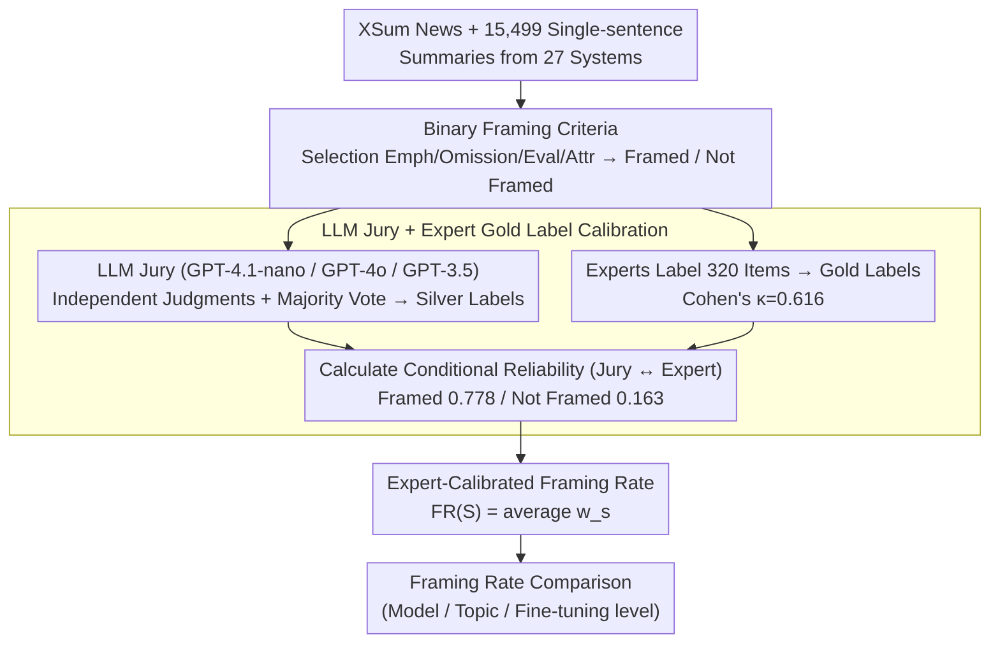

# Frame In, Frame Out: Measuring Framing Bias in LLM-Generated News Summaries

**Conference**: ACL2026  
**arXiv**: [2505.05406](https://arxiv.org/abs/2505.05406)  
**Code**: https://github.com/vpastorino/FIFO  
**Area**: AIGC Detection / Summary Evaluation / Media Bias  
**Keywords**: Framing bias, News summarization, LLM evaluation, XSum, Expert calibration  

## TL;DR
This paper proposes FIFO, a method that utilizes an LLM jury combined with expert calibration to measure whether LLM-generated news summaries introduce framing bias on the XSum dataset at scale. It finds that several high-capacity models exhibit higher framing rates compared to human summary baselines.

## Background & Motivation
**Background**: News summarization models are typically evaluated based on factual consistency, coverage, fluency, and preference scores. Particularly in single-sentence news summarization tasks like XSum, mainstream evaluations focus on "correctness" and "fluency." However, news texts are more than just sets of facts; headlines and summaries influence reader comprehension through selection, emphasis, omission, and attribution of responsibility.

**Limitations of Prior Work**: Most existing framing research stems from communication studies or supervised framing detection, where the goal is usually to determine which category of frame a news text belongs to. Summarization evaluation rarely checks whether a model introduces interpretive perspectives that were not prominent in the source text. Consequently, a summary can be factually compatible and linguistically fluent while still nudging readers toward emotional, political, or moral interpretations.

**Key Challenge**: The compression process in summarization naturally requires selection and omission, while framing is an interpretive shift generated precisely by these choices. Traditional metrics treat compression as an information fidelity problem; this paper further defines it as a question of whether the "interpretive perspective is altered by the model."

**Goal**: The authors aim to build an extensible benchmark that covers numerous models and topics while avoiding total reliance on potentially biased LLM annotations, providing analysis of framing rates across models, topics, and training settings.

**Key Insight**: Instead of requiring models to identify fine-grained frame types, the paper first addresses a more fundamental question: does identifiable framing exist in the summary? This binary classification makes annotation and calibration more scalable and suitable as an evaluation dimension for summarization systems.

**Core Idea**: Use a three-model LLM jury for batch framing annotation, then use small-scale expert annotations to estimate the reliability weights of the jury. This converts raw silver labels into expert-calibrated framing rates.

## Method
The core of FIFO is not training a new summarization model, but proposing a framing-aware summarization evaluation pipeline. It first collects XSum outputs from 27 summarization systems, then uses an LLM jury to assign Framed / Not Framed labels to each summary, and finally uses an expert-labeled set to calibrate these labels for reliability, yielding framing rates comparable across models and topics.

### Overall Architecture
The input consists of news articles and their system-generated single-sentence summaries. For each summary, FIFO determines whether it introduces an interpretive frame via selective emphasis, evaluative language, attribution of responsibility, causal organization, or omission. The output is not a final judgment of an individual summary, but an expert-calibrated framing rate at the model, topic, or subset level.

The process consists of four steps. First, 15,499 summaries from 27 systems (covering BART, T5, FLAN-T5, GPT, Claude, LLaMA, etc.) are aggregated from XSum. Second, an LLM jury comprising GPT-4.1-nano, GPT-4o, and GPT-3.5-Turbo independently judges Framed / Not Framed, forming silver labels via majority vote. Third, 320 summaries are randomly sampled for manual annotation by framing analysis experts to obtain gold labels, yielding a Cohen's $\kappa=0.616$. Fourth, each silver label is converted into a probability weight based on the correspondence between jury and expert labels, and then aggregated into an expert-calibrated framing rate.

### Key Designs

**1. Binary framing operationalization: Compressing complex framing theory into an evaluable summary attribute—whether the summary possesses an interpretive frame.**

While fine-grained frame taxonomies in communication studies (attribution of responsibility, moral evaluation, conflict framing, etc.) are suitable for content analysis, large-scale evaluation of summarization systems requires a stable, extensible criterion. FIFO thus asks a binary question: when a summary makes a certain interpretation prominent through selective emphasis, omission, evaluative wording, causal organization, or attribution of responsibility, it is labeled as Framed; if it only states the core event without introducing a clear interpretive perspective, it is labeled as Not Framed. This coarse granularity trades detail for annotation consistency and scalability, making it suitable as a new evaluation dimension.

**2. LLM jury + Expert gold label calibration: Finding a balance between large-scale coverage and expert reliability.**

Relying solely on experts to label 15,499 summaries is too costly, while relying solely on LLMs risks treating the models' own biases as ground truth. FIFO allows three models (GPT-4.1-nano, GPT-4o, GPT-3.5-Turbo) to judge independently and use majority voting to produce silver labels. Then, 320 summaries are sampled for expert annotation to obtain gold labels, reaching a Cohen's $\kappa=0.616$. Crucially, these gold labels estimate systematic bias: the probability that an expert agrees a summary is Framed when the jury says Framed is 77.8%, and the probability the expert sees it as Framed when the jury says Not Framed is 16.3%. These conditional probabilities bridge "cheap but noisy LLM labels" and "expensive but reliable expert judgments."

**3. Expert-calibrated framing rate: Converting framing frequency from raw binary silver labels into an estimate that acknowledges jury error.**

Simply counting the proportion of "jury-labeled Framed" cases assumes LLM labels are ground truth, which would be systematically biased. FIFO uses calibrated weight aggregation: for a summary set $S$,

$$FR(S)=\frac{1}{|S|}\sum_{s\in S}w_s,$$

where summaries labeled Framed by the jury take $w_s=0.778$ and those labeled Not Framed take $w_s=0.163$, corresponding to the expert agreement rates. This approach acknowledges jury fallibility while maintaining large-scale statistical power to compare the effects of model capacity, fine-tuning, and news topics on framing.

### Loss & Training
Ours does not train a new generative model nor propose a neural loss function. The "training strategy" is closer to an evaluation calibration strategy: using a prompt-based LLM jury to generate silver labels, followed by expert gold labels to estimate conditional reliability, and finally aggregating reliability weights into a framing rate. This design allows FIFO to be used as an external evaluation tool for various summarization systems rather than being dependent on a specific architecture.

## Key Experimental Results

### Main Results

| Item | Value / Setting | Function | Remarks |
|------|-------------|------|------|
| Summary Source | XSum | Single-doc single-sentence summary | Strong compression easily exposes selective emphasis |
| Number of Systems | 27 Summarization Systems | Model-level comparison | Covers encoder-decoder and decoder-only models |
| Silver Label Scale | 15,499 summaries | Large-scale framing analysis | Generated by 3-model LLM jury majority vote |
| Expert Gold Labels | 320 summaries | Calibration and validation | Expert vs. Jury Cohen's $\kappa=0.616$ |
| Expert Agreement (Jury = Framed) | 77.8% | Calibration weight | Corresponds to $w=0.778$ |
| Expert Agreement (Jury = Not Framed) | 16.3% | Calibration weight | Corresponds to $w=0.163$ |

### Ablation Study

| Analysis Dimension | Key Finding | Description |
|----------|----------|------|
| Model Capacity / Pre-training | Large models have significantly higher overall framing rates, $p=0.0012$ | Paradoxically, low rates in small models may stem from lower output quality |
| XSum Fine-tuning | Fine-tuned models have significantly lower framing rates than base models, $p=0.0006$ | Task-specific fine-tuning may constrain summarization style |
| Intra-family Size Effect | Pearson $r=-0.44$ | Larger models within the same family have slightly lower rates; data/settings matter more than parameters |
| Topic Effect | Politics (Human baseline ~53%), Health/Science (Human baseline ~31%) | Several high-capacity models exceed human baselines in these categories |
| Length Correlation | Point-biserial $r_{pb}\approx0.1904$ | Framing is weakly correlated with length but cannot be fully explained by it |

### Key Findings
- FIFO demonstrates that framing is not an occasional phenomenon of specific models but an evaluation dimension that varies systematically with model capability, training methods, and news topics.
- Large models are more likely to generate linguistically rich and interpretive summaries, which improves readability but increases the room for introducing framing.
- Fine-tuning on XSum can reduce the framing rate, suggesting that task data and style constraints might be more important than simply scaling up models.
- The data indicates that "stronger models" are not naturally more neutral. High-capacity models may be more prone to shaping interpretive frames because they are better at organizing narratives, providing context, and generating evaluative language.

## Highlights & Insights
- The most valuable contribution is translating framing from a communication study concept into a summarization evaluation metric. It reminds us that factually correct summaries can still be biased in "how the facts are told."
- The expert calibration weights are pragmatic. The authors do not pretend the LLM jury is ground truth but use small-scale gold labels to estimate systematic error, which is more credible than reporting raw LLM annotation proportions.
- While binary framing is coarse, it is effective as a first-layer risk screening. Future summarization systems could use FIFO-like metrics to identify high-risk topics or models before conducting fine-grained frame type analysis.
- The results imply that "stronger models" do not naturally lead to more neutrality. High-capacity models may be more adept at narrative organization and evaluative language, making them more likely to shape interpretive frameworks.

## Limitations & Future Work
- FIFO relies on an LLM jury for silver labels; despite expert calibration, annotations may still inherit the blind spots or socio-cultural biases of the jury models.
- The dataset only covers English single-document summaries and XSum style, which does not directly explain framing behavior in multi-document, multilingual, or long-form news generation.
- The binary setting cannot specify which type of frame is present, such as attribution of responsibility, moral evaluation, conflict, or economic consequences.
- Future work could extend to multilingual news, different media ecosystems, and fine-grained frame taxonomies, combining them with factuality/stance/sentiment metrics for a more comprehensive news summarization evaluation.

## Related Work & Insights
- **vs. Traditional framing detection**: Traditional work identifies which frame a text expresses (content analysis); this paper focuses on whether a generated summary introduces framing (evaluation of generation systems).
- **vs. ROUGE / factuality / coherence**: These metrics measure information coverage, factual correctness, and linguistic quality; FIFO measures interpretive shift, filling the gap for "factually compatible but narratively biased" content.
- **vs. LLM-as-a-judge**: Standard LLM evaluation treats model output as a final verdict; FIFO uses expert gold labels to calibrate judge reliability, inspiring other subjective evaluation tasks to adopt small-scale expert calibration.

## Rating
- Novelty: ⭐⭐⭐⭐☆ Systematically introduces framing bias into summarization evaluation with clear problem definition.
- Experimental Thoroughness: ⭐⭐⭐⭐☆ Covers 27 systems and topic analysis; expert set is small but calibrated; lacks multilingual/multi-doc scenarios.
- Writing Quality: ⭐⭐⭐⭐☆ Motivation, examples, and calibration formulas are clear.
- Value: ⭐⭐⭐⭐⭐ Highly practical for news summarization, media generation, and LLM content governance; a dimension likely to be reused in subsequent evaluation work.

<!-- RELATED:START -->

## Related Papers

- [\[CVPR 2026\] FRAME: Forensic Routing and Adaptive Multi-path Evidence Fusion for Image Manipulation Detection](../../CVPR2026/aigc_detection/frame_forensic_routing_and_adaptive_multi-path_evidence_fusion_for_image_manipul.md)
- [\[AAAI 2026\] BAID: A Benchmark for Bias Assessment of AI Detectors](../../AAAI2026/aigc_detection/baid_a_benchmark_for_bias_assessment_of_ai_detectors.md)
- [\[ACL 2025\] Comparing LLM-generated and human-authored news text using formal syntactic theory](../../ACL2025/aigc_detection/llm_vs_human_formal_syntax.md)
- [\[ACL 2026\] DetectRL-X: Towards Reliable Multilingual and Real-World LLM-Generated Text Detection](detectrl-x_towards_reliable_multilingual_and_real-world_llm-generated_text_detec.md)
- [\[ACL 2026\] Temporal Flattening in LLM-Generated Text: Comparing Human and LLM Writing Trajectories](temporal_flattening_in_llm-generated_text_comparing_human_and_llm_writing_trajec.md)

<!-- RELATED:END -->
