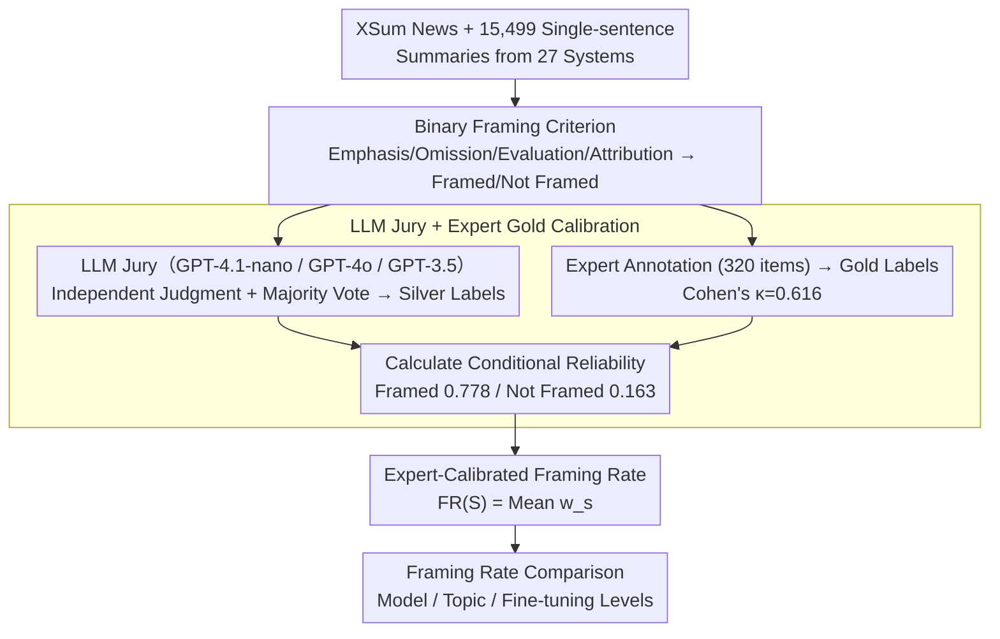

# Frame In, Frame Out: Measuring Framing Bias in LLM-Generated News Summaries

**Conference**: ACL2026  
**arXiv**: [2505.05406](https://arxiv.org/abs/2505.05406)  
**Code**: https://github.com/vpastorino/FIFO  
**Area**: AIGC Detection / Summary Evaluation / Media Bias  
**Keywords**: Framing bias, News summarization, LLM evaluation, XSum, Expert calibration  

## TL;DR
This paper proposes FIFO, a method that uses an LLM jury with expert calibration to measure whether LLM news summaries introduce framing bias on XSum at scale. It finds that several high-capacity models exhibit higher proportions of framed expressions compared to human summary baselines.

## Background & Motivation
**Background**: News summarization models are typically evaluated using factual consistency, coverage, fluency, and preference scores. Especially in single-sentence news summarization tasks like XSum, mainstream evaluations focus on "correctness" and "fluency." However, news texts are not just collections of facts; headlines and summaries influence reader understanding through selection, emphasis, omission, and attribution of responsibility.

**Limitations of Prior Work**: Existing framing research mostly originates from communication studies or supervised framing detection, where the goal is usually to determine the frame category of a text. Summarization evaluation rarely checks whether a model introduces an interpretive perspective that is not prominent in the original text. Consequently, a summary can be factually compatible and linguistically fluent yet still steer the reader toward emotional, political, or moral interpretations.

**Key Challenge**: The compression process in summarization models naturally necessitates selection and omission, which are the very mechanisms that produce framing bias through interpretive shifts. While traditional metrics view compression as an information fidelity problem, this paper views it as a question of whether the "interpretive perspective" is altered by the model.

**Goal**: The authors aim to construct a scalable benchmark that covers numerous models and topics while avoiding total reliance on biased LLM annotations. It also provides an analysis of framing rates at the model, topic, and training setting levels.

**Key Insight**: Instead of requiring models to identify fine-grained frame types, the paper first addresses a more fundamental question: does the summary contain identifiable framing? This binary classification makes annotation and calibration more scalable and suitable as an evaluation dimension for summarization systems.

**Core Idea**: Use a three-model LLM jury to batch-annotate framing, then use a small-scale expert annotation to estimate the jury's reliability weights, thereby converting raw silver labels into expert-calibrated framing rates.

## Method
The core of FIFO is not training a new summarization model, but proposing a framing-aware summarization evaluation pipeline. It collects XSum outputs from 27 summarization systems, uses an LLM jury to assign Framed / Not Framed labels to each summary, and finally performs reliability calibration using an expert-annotated set to obtain framing rates comparable across models and topics.

### Overall Architecture
The input consists of news articles and single-sentence summaries generated by 27 systems. For each summary, FIFO determines if it introduces an interpretive frame via selective emphasis, evaluative language, responsibility attribution, causal organization, or omission. The output is an expert-calibrated framing rate at the model, topic, or subset level.

The process consists of four steps. First, 15,499 summaries from 27 systems (covering BART, T5, FLAN-T5, GPT, Claude, LLaMA, etc.) are aggregated. Second, a jury composed of GPT-4.1-nano, GPT-4o, and GPT-3.5-Turbo independently judges each summary as Framed / Not Framed, forming silver labels via majority voting. Third, 320 summaries are randomly selected for manual annotation by framing analysis experts to obtain gold labels (Cohen's $\kappa=0.616$). Fourth, silver labels are converted into probability weights based on their correspondence with expert labels and aggregated into expert-calibrated framing rates.

### Key Designs

**1. Binary framing operationalization: Compressing complex framing theory into an evaluable summary attribute—does this summary have an interpretive frame?**

While fine-grained frame taxonomies from communication studies (responsibility, morality, conflict, etc.) are suitable for content analysis, large-scale evaluation of summarization systems requires a stable, scalable criterion. FIFO simplifies this to a binary question: when a summary makes a certain interpretation prominent through selective emphasis, omission, evaluative wording, causal organization, or attribution of responsibility, it is labeled as Framed; if it only states core events without a clear interpretive perspective, it is labeled Not Framed. This coarseness facilitates annotation consistency and scalability.

**2. LLM jury + Expert gold calibration: Balancing large-scale coverage with expert reliability.**

Manually annotating 15,499 summaries is too costly, while relying solely on LLMs risks treating model bias as ground truth. FIFO uses three models (GPT-4.1-nano, GPT-4o, GPT-3.5-Turbo) for independent voting to produce silver labels. Then, 320 items are manually annotated by experts to calculate Cohen's $\kappa=0.616$. Crucially, these gold labels are used to estimate the jury's systematic bias: the probability that an expert agrees a summary is Framed when the jury says it is "Framed" is 77.8%, while the probability that an expert still considers it Framed when the jury says "Not Framed" is 16.3%. These conditional probabilities bridge "cheap but noisy LLM labels" and "expensive but reliable expert judgments."

**3. Expert calibrated framing rate: Converting the framing frequency of a model or topic from raw silver labels to estimates that acknowledge jury error.**

Simply counting the proportion of jury-labeled "Framed" items assumes LLM labels are ground truth, leading to systematic bias. FIFO uses calibrated weight aggregation: for a summary set $S$,

$$FR(S)=\frac{1}{|S|}\sum_{s\in S}w_s,$$

where $w_s=0.778$ for summaries labeled Framed by the jury, and $w_s=0.163$ for those labeled Not Framed. This acknowledges jury fallibility while maintaining the power of large-scale statistics to compare the effects of model capacity, fine-tuning methods, and news topics.

### Loss & Training
This work does not train a new generative model nor propose a neural network loss function. its "training strategy" is closer to an evaluation calibration strategy: utilizing a prompt-based LLM jury to generate silver labels, followed by expert gold labels to estimate conditional reliability, and finally aggregating framing rates using reliability weights. This design allows FIFO to serve as an external evaluation tool for various summarization systems.

## Key Experimental Results

### Main Results

| Item | Value / Setting | Role | Notes |
|------|-------------|------|------|
| Summary Source | XSum | Single-doc single-sentence summary | Strong compression easily exposes selective emphasis |
| System Count | 27 summarization systems | Model-level comparison | Covers encoder-decoder and decoder-only models |
| Silver Label Scale | 15,499 summaries | Large-scale framing analysis | Generated by majority vote of three-model LLM jury |
| Expert Gold Labels | 320 summaries | Calibration and validation | Expert-jury Cohen's $\kappa=0.616$ |
| Expert Agreement for Jury "Framed" | 77.8% | Calibration weight | Corresponds to $w=0.778$ |
| Expert "Framed" when Jury "Not Framed" | 16.3% | Calibration weight | Corresponds to $w=0.163$ |

### Ablation Study

| Analysis Dimension | Key Findings | Explanation |
|----------|----------|------|
| Model Capacity / Pre-training | Large models have significantly higher framing rates ($p=0.0012$) | Lower framing rates in small models may partly stem from poor output quality |
| XSum Fine-tuning | Fine-tuned models have significantly lower framing rates than base models ($p=0.0006$) | Task-specific fine-tuning may constrain summarization style |
| Size Effect within Families | Pearson $r=-0.44$ | Larger models within the same family have slightly lower framing rates, suggesting training data/settings outweigh parameter count |
| Topic Effect | Political news human baseline ~53%, Health & Science ~31% | Multiple high-capacity models exceed human baselines in these categories |
| Relationship with Length | Point-biserial $r_{pb}\approx0.1904$ | Framing is weakly correlated with length but cannot be fully explained by it |

### Key Findings
- FIFO demonstrates that framing is not an isolated phenomenon in specific models but an evaluation dimension that varies systematically with model capability, training methods, and news topics.
- Large models are more likely to produce summaries with rich language and stronger interpretations, which improves readability but increases the space for introducing framing.
- XSum fine-tuning reduces framing rates, suggesting that task data and stylistic constraints may be more important than simply increasing model size.
- High-capacity models exceed human baselines in framing for specific sensitive topics like politics and health.

## Highlights & Insights
- The most valuable contribution is Transforming framing from a communication studies concept into a summarization evaluation metric. It reminds us that factually correct summaries can still be biased in "how they tell the facts."
- The expert calibration weights are pragmatic. Instead of pretending the LLM jury provides ground truth, the authors use a small gold set to estimate systematic error, which is more credible than reporting raw LLM proportions.
- While binary framing is coarse, it is effective for initial risk screening. Future systems could use FIFO-like metrics to identify high-risk topics or models before performing fine-grained analysis.
- The results imply that "stronger models" are not naturally more neutral. High-capacity models, being better at organizing narratives and generating evaluative language, may more easily shape interpretive frames.

## Limitations & Future Work
- FIFO relies on an LLM jury for silver labels; despite expert calibration, annotations may still inherit the blind spots or socio-cultural biases of the jury models.
- The dataset only covers English single-document summaries and XSum style, which does not directly translate to framing behavior in multi-document, multilingual, or long-form news generation.
- The binary setting cannot specify the type of frame (e.g., responsibility, morality, conflict).
- Future work could extend to multilingual news, different media ecosystems, and fine-grained frame taxonomies, integrated with factuality, stance, and sentiment metrics.

## Related Work & Insights
- **vs. Traditional framing detection**: Traditional work identifies what frame a text expresses (content analysis); this work focuses on whether the generated summary *introduces* framing (evaluation task).
- **vs. ROUGE / factuality / coherence**: These measure information coverage and linguistic quality; FIFO measures interpretive shift, filling the gap for "factually compatible but narratively biased" summaries.
- **vs. LLM-as-a-judge**: Standard LLM judges treat model output as the final verdict; FIFO uses expert gold labels to calibrate judge reliability, inspiring similar approaches for other subjective evaluation tasks.

## Rating
- Novelty: ⭐⭐⭐⭐☆ Systematically introduces framing bias to summarization evaluation with a clear definition.
- Experimental Thoroughness: ⭐⭐⭐⭐☆ Covers 27 systems and topic analysis; expert set is small but calibrated.
- Writing Quality: ⭐⭐⭐⭐☆ Motivation and calibration formulas are clear.
- Value: ⭐⭐⭐⭐⭐ Highly practical for news summarization and LLM governance; likely to be reused in future evaluation frameworks.

<!-- RELATED:START -->

## Related Papers

- [\[CVPR 2026\] Common Inpainted Objects In-N-Out of Context](../../CVPR2026/aigc_detection/common_inpainted_objects_in-n-out_of_context.md)
- [\[ACL 2025\] Comparing LLM-generated and human-authored news text using formal syntactic theory](../../ACL2025/aigc_detection/llm_vs_human_formal_syntax.md)
- [\[AAAI 2026\] BAID: A Benchmark for Bias Assessment of AI Detectors](../../AAAI2026/aigc_detection/baid_a_benchmark_for_bias_assessment_of_ai_detectors.md)
- [\[ACL 2026\] DetectRL-X: Towards Reliable Multilingual and Real-World LLM-Generated Text Detection](detectrl-x_towards_reliable_multilingual_and_real-world_llm-generated_text_detec.md)
- [\[ACL 2026\] Temporal Flattening in LLM-Generated Text: Comparing Human and LLM Writing Trajectories](temporal_flattening_in_llm-generated_text_comparing_human_and_llm_writing_trajec.md)

<!-- RELATED:END -->
