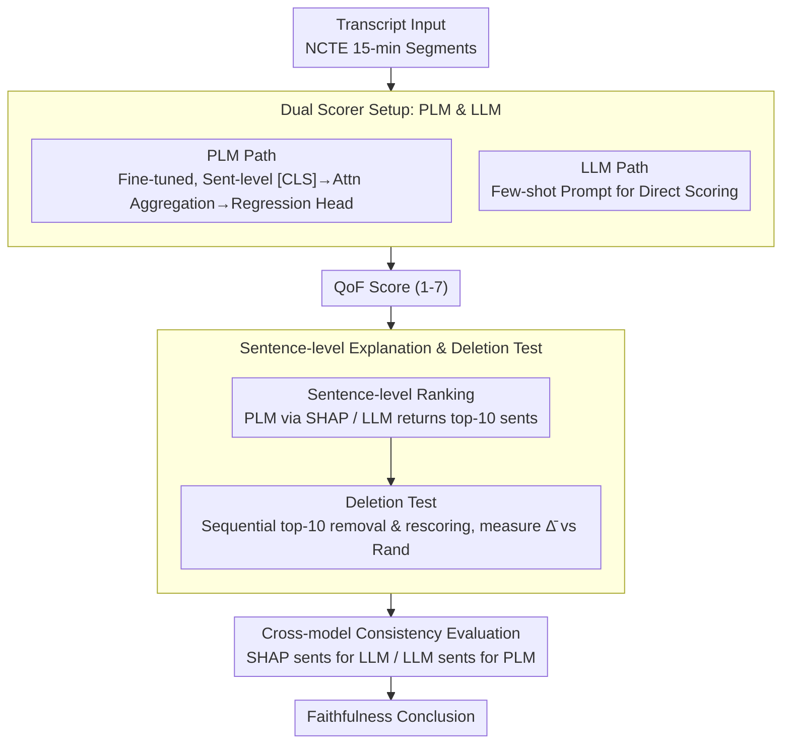

# From Scoring to Explanations: Evaluating SHAP and LLM Rationales for Rubric-based Teaching Quality Assessment

**Conference**: ACL2026 Findings  
**arXiv**: [2606.05180](https://arxiv.org/abs/2606.05180)  
**Code**: Not provided in cache  
**Area**: Educational NLP / Explainability / Automated Rubric Scoring  
**Keywords**: SHAP, LLM Explanation, Teaching Quality Assessment, Sentence-level Attribution, Deletion Test  

## TL;DR
This paper proposes a sentence-level explanation evaluation framework for automated rubric scoring. By comparing fine-tuned PLMs, prompted LLMs, SHAP attribution, and LLM rationales in a classroom teaching feedback quality scoring task, it finds that fine-tuned PLMs are more accurate, while SHAP provides more faithful and transferable explanations than LLM-generated rationales.

## Background & Motivation
**Background**: Automated rubric scoring has been applied to open-ended linguistic performance assessments such as essays, peer feedback, classroom transcripts, and clinical notes. Models typically output a scalar score representing whether the text meets a specific rubric dimension.

**Limitations of Prior Work**: Providing scores alone is insufficient, especially in high-stakes educational scenarios. Teachers, students, and administrators need to know why a model assigned a specific score to trust, contest, or improve feedback. While LLMs can generate plausible-looking natural language explanations, research indicates these explanations are often merely plausible and not necessarily faithful.

**Key Challenge**: Rubric scoring requires explainability and accountability, yet the internal decision processes of powerful models are difficult to observe directly. LLM rationales are readable but may not reflect the true computational basis; attribution methods like SHAP are closer to causal influence but lack systematic comparison in long classroom transcripts and multi-level rubric scenarios.

**Goal**: The authors aim to answer three questions: which is more suitable for scoring Quality of Feedback (QoF), PLMs or LLMs; whether SHAP or LLM sentence ranking is better at identifying sentences that truly influence scores; and whether explanations generated by one type of model can transfer to another.

**Key Insight**: The paper defines explanation as sentence-level evidence ranking rather than free-text justification. This allows for a unified deletion test to measure faithfulness: if the model's prediction changes significantly after removing the top-k sentences selected by the explanation method, it indicates those sentences indeed influenced the score.

**Core Idea**: Utilizing a protocol of "sentence-level SHAP / LLM ranking → delete top-10 sentences → rescore → compare prediction changes" to systematically test if rubric scoring explanations are faithful and to perform cross-model transfer testing.

## Method
The method in this paper functions as an evaluation framework rather than a single new model. The authors first train or call two types of scorers, then use two explanation methods to identify important sentences, and finally evaluate explanation quality through score variations after deleting these sentences.

### Overall Architecture
Data consists of NCTE elementary mathematics classroom transcripts, totaling over 1,600 lessons, segmented into 6,005 15-minute clips and annotated by experts using the CLASS framework. This study focuses on the Quality of Feedback dimension under Instructional Support, with scores ranging from 1-7. The training set contains 4,775 segments and the test set 1,230 segments, with no classroom overlap across splits. For each transcript segment, the model first outputs a QoF score; the explanation method then provides a ranking of the most important sentences; the system sequentially deletes the top-10 sentences and rescores, using the average consecutive prediction change $\overline{\Delta}$ to measure if the explanation accurately hit the evidence the model relies on.

### Key Designs

**1. Dual Scorer Setup (PLM vs. LLM): Putting two technical routes on the same table to clarify what explanation methods depend on.**

Rubric scoring can follow the traditional path of task-specific fine-tuning or the new path of direct scoring via general instruction LLMs. Viewing either in isolation prevents determining whether explanation evaluation conclusions are universal or model-specific. Therefore, the authors implement both: on the PLM side, they fine-tune base/large versions of BERT, ALBERT, RoBERTa, and DeBERTaV3. Each transcript segment is encoded sentence-by-sentence, collecting `[CLS]` representations which are aggregated via a trainable attention layer into a document vector, followed by a linear regression head to predict the 1-7 QoF scalar. On the LLM side, they call open-source instruction models like Llama 3.1, Mixtral, Qwen3, and Mistral using few-shot prompts to assign scores after reading the segments. The former represents supervised rubric scoring requiring labeling and training, while the latter represents zero-training, plug-and-play solutions. Aligning them provides a comparable experimental basis for whether explanation methods are faithful only for certain model classes.

**2. Sentence-level Explanation and Deletion Test: Transforming abstract faithfulness into measurable prediction changes.**

Free-text rationales may seem logical but cannot be easily verified, posing a risk in high-stakes scoring. The authors address this by defining explanation as sentence-level evidence ranking and linking it to model predictions via a deletion test. For PLMs, they run SHAP on the document-level regression output, treating each sentence embedding as a feature to obtain its Shapley value. For LLMs, they use a zero-shot prompt to have the model directly return the indices of the 10 most influential sentences. After gathering the ranking, sentences are deleted sequentially. The prediction change at step $i$ is recorded as $\Delta_i=f(x_{-r_{i-1}})-f(x_{-r_i})$, and the average change of the top-10 ($\overline{\Delta}$) serves as the faithfulness metric. A larger $\overline{\Delta}$ indicates the selected sentences are closer to the evidence the model truly relies on. To rule out the confounder that any deletion might disturb the model, the authors run a random deletion baseline; ranked deletion must significantly exceed random deletion to attribute the change to the explanation method itself.

**3. Cross-model Consistency Evaluation: Testing if the evidence found by one model counts for another architecture.**

If an explanation only disturbs its source model, it behaves more like a model-specific quirk than true rubric-related evidence. Thus, the authors selected 3 PLMs (BERT large, DeBERTaV3 large, ALBERT base) and 3 LLMs (Qwen3 235B, Mistral Small, Llama 3.1 8B) for cross-perturbation: sentences selected by the LLM are deleted from the PLM input, and SHAP-selected sentences from the PLM are deleted from the LLM input. Comparing these prediction change trajectories reveals if the explanation captures general rubric-relevant evidence (stable across architectures) or is merely "local" to the source model.

### Loss & Training
PLM fine-tuning uses Mean Squared Error (MSE) to optimize the 1-7 QoF regression target. At the input level, each sentence is truncated to 128 tokens, with a maximum of 263 sentences per document, covering 98% of sentence lengths and 90% of document lengths. LLMs are not task-fine-tuned; they use deterministic decoding for few-shot scoring and zero-shot sentence ranking, with local inference utilizing 4-bit nf4 quantization. All explanation evaluations use identical sentence segmentation, deletion rules, and top-10 settings; cases with fewer than 10 sentences occurred in only 17 out of 1,230 test segments (1.3%).

## Key Experimental Results

### Main Results

| Dataset / Setting | Metric | Key Result (Ours) | Baseline Method | Conclusion |
|--------|------|------|----------|------|
| NCTE QoF test | MAE / MSE | DeBERTaV3 large (FT): 0.96 / 1.31 | Constant baseline: 0.96 / 1.35 | Strongest PLM slightly outperforms constant baseline, ~1 rubric point error. |
| NCTE QoF test | MAE / MSE | Mistral Small Instruct: 1.02 / 1.78 | Top FT PLM: 0.96 / 1.31 | LLM is less accurate than fine-tuned PLM but has wider output range. |
| PLM Pred. Distribution | Score Range | DeBERTaV3 large: [2.03, 5.89] | True Scale: [1, 7] | PLM suffers from label compression; struggles with extremes. |
| LLM Pred. Distribution | Mean / SD | Mistral Small: 4.37 / 0.77 | DeBERTaV3 large: 4.14 / 0.16 | LLM covers more range but has higher error. |
| Explanation Alignment | Jaccard / Spearman | Avg Jaccard: 0.085, Spearman: 0.062 | SHAP vs. 9 LLM rankings | SHAP and LLM rationales rarely select the same sentences. |

### Ablation Study

| Configuration | Key Metric | Description |
|------|---------|------|
| BERT large + SHAP ranked deletion | $\overline{\Delta}=0.0329$ | Deleting SHAP-weighted sentences in PLM has the highest impact. |
| DeBERTaV3 large + SHAP ranked deletion | $\overline{\Delta}=0.0049$ | Even accurate models can be insensitive to single-sentence removal. |
| Qwen3 235B + LLM ranked deletion | $\overline{\Delta}=0.0388$ | Qwen3 235B shows the highest self-explanation perturbation among LLMs. |
| Mistral Small + LLM ranked deletion | $\overline{\Delta}=0.0033$ | The most accurate LLM scorer's rationale is not necessarily the most faithful. |
| Random deletion baseline | Near 0 (e.g., BERT 0.0082, Qwen3 -0.0036) | Larger change in ranked deletion is not due to random noise. |
| SHAP → LLM transfer | First SHAP sentence often drops LLM score significantly | SHAP evidence impact generalizes to LLMs. |
| LLM rationale → PLM transfer | Change significantly lower than SHAP deletion | LLM rationales transfer poorly to PLM decision bases. |

### Key Findings
- Fine-tuned PLMs achieve better scoring accuracy but compress predictions toward the 3-5 range, making it difficult to identify extreme teaching quality.
- LLMs produce a more complete 1-7 distribution but have higher MAE/MSE and unstable sentence-ranking formats; some models fail to consistently return 10 sentences even after retries.
- SHAP explanations are more stable in both self-model and cross-model deletions; LLM rationales may seem like "reasons" but have limited actual impact on predictions.
- Teacher utterances are the primary evidence source: LLMs select teacher utterances 79.5% of the time, and PLMs 74.0%, aligning with the QoF task definition.

## Highlights & Insights
- **Shifting from "Plausibility" to "Prediction Change"**: In education, it is easy to be swayed by the readability of natural language rationales. This paper uses deletion tests to remind us that explanations must be tied to model behavior.
- **Asymmetry between SHAP and LLM rationales**: Sentences chosen by LLMs often have little impact on PLMs, yet SHAP-selected sentences significantly perturb LLMs. This suggests traditional attribution methods remain indispensable for high-stakes NLP.
- **Accuracy-Faithfulness Misalignment**: DeBERTaV3 large is the strongest scorer but not the most sensitive explanation target; Mistral Small is the strongest LLM scorer but has very low deletion impact. This implies model selection should not rely solely on MAE.
- **Framework Portability**: As long as a task involves long-form rubric scoring and allows for sentence or segment-level deletion, this protocol can be reused for essay grading, peer feedback, or medical record quality assessment.

## Limitations & Future Work
- Dataset scale and label distribution are limited. Although QoF is relatively balanced, only 19% of labels in the 6k segments lie outside the 3-5 range, leading to PLM label compression.
- The study only uses text transcripts. Real CLASS scoring relies on multi-modal signals (audio, pitch, visual interaction); text-only models may miss crucial pedagogical behaviors.
- Each segment has only one expert annotation, preventing estimation of inter-rater reliability or distinction between model error and human noise.
- Deleting sentences disrupts classroom discourse flow, potentially affecting LLMs that rely on context. Future work could include human rationale or construct relevance labels to verify if selected sentences match rubric constructs.
- Format reliability for LLM sentence ranking remains an engineering risk; high-stakes systems cannot rely solely on free-form generation.

## Related Work & Insights
- **vs. attention-based explanation**: The validity of attention weights as explanations is debated; this paper chooses SHAP and deletion tests, which are closer to the faithfulness standard of "influence on output."
- **vs. LIME / SHAP in essay scoring**: Early SHAP was used for automated essay rubric explanation; this work extends it to long classroom transcripts, hierarchical PLMs, and cross-model evaluation.
- **vs. LLM chain-of-thought rationale**: CoT or natural language reasons may improve readability but are not necessarily faithful. This paper’s ranking results further demonstrate that LLM rationales in high-stakes scoring require independent validation.
- **Mechanism Insight**: Future explainable educational NLP should treat the explanation module as a testable component: assessing both user understanding and whether deletions, substitutions, or counterfactuals actually change the model's prediction.

## Rating
- Novelty: ⭐⭐⭐⭐☆ While deletion tests and SHAP are not new, applying them to the intersection of PLM/LLM rubric scoring, sentence rationales, and cross-model transfer is highly valuable.
- Experimental Thoroughness: ⭐⭐⭐⭐☆ Broad model coverage and detailed evaluation; could be improved by adding more CLASS dimensions and human-labeled sentence evidence.
- Writing Quality: ⭐⭐⭐⭐☆ Clear research questions, solid experimental narrative, and strong educational motivation; tables are numerous but the core argument is well-maintained.
- Value: ⭐⭐⭐⭐☆ Provides a strong warning regarding the use of LLM explanations in high-stakes scenarios, emphasizing that fluent rationales should not be mistaken for faithful ones.

<!-- RELATED:START -->

## Related Papers

- [\[ACL 2025\] A Rose by Any Other Name: LLM-Generated Explanations Are Good Proxies for Human Explanations to Collect Label Distributions on NLI](../../ACL2025/aigc_detection/a_rose_by_any_other_name_llm-generated_explanations_are_good_proxies_for_human_e.md)
- [\[ACL 2026\] Who Wrote This Line? Evaluating the Detection of LLM-Generated Classical Chinese Poetry](who_wrote_this_line_evaluating_the_detection_of_llm-generated_classical_chinese_.md)
- [\[AAAI 2026\] BAID: A Benchmark for Bias Assessment of AI Detectors](../../AAAI2026/aigc_detection/baid_a_benchmark_for_bias_assessment_of_ai_detectors.md)
- [\[CVPR 2026\] Quality-Aware Calibration for AI-Generated Image Detection in the Wild](../../CVPR2026/aigc_detection/quality-aware_calibration_for_ai-generated_image_detection_in_the_wild.md)
- [\[ACL 2026\] AEGIS: A Holistic Benchmark for Evaluating Forensic Analysis of AI-Generated Academic Images](aegis_a_holistic_benchmark_for_evaluating_forensic_analysis_of_ai-generated_acad.md)

<!-- RELATED:END -->
