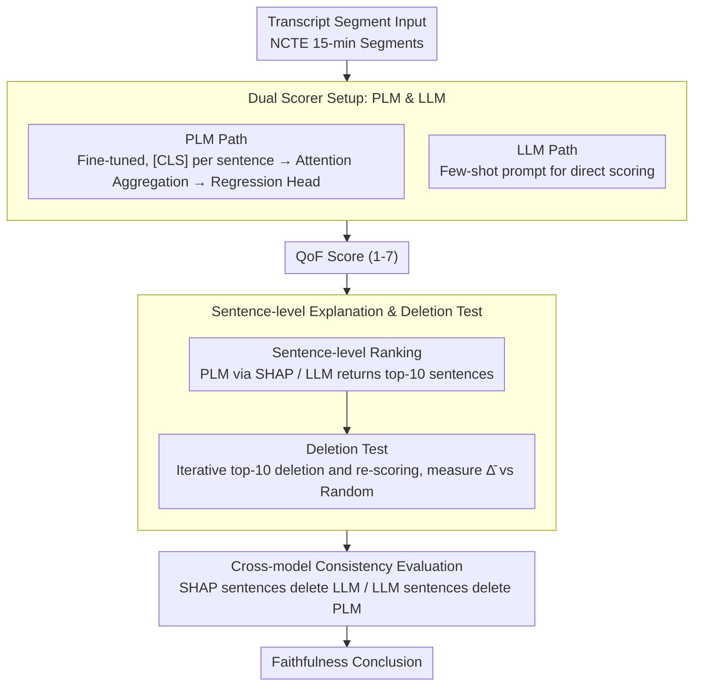

# From Scoring to Explanations: Evaluating SHAP and LLM Rationales for Rubric-based Teaching Quality Assessment

**Conference**: ACL2026 Findings  
**arXiv**: [2606.05180](https://arxiv.org/abs/2606.05180)  
**Code**: Not provided in cache  
**Area**: Educational NLP / Interpretability / Automated Rubric Scoring  
**Keywords**: SHAP, LLM rationales, teaching quality assessment, sentence-level attribution, deletion test  

## TL;DR
This paper proposes a sentence-level explanation evaluation framework for automated rubric scoring. Comparing fine-tuned PLMs, prompted LLMs, SHAP attribution, and LLM rationales on a classroom feedback quality scoring task, the study finds that fine-tuned PLMs are more accurate, while SHAP provides more faithful and transferable explanations than LLM-generated ones.

## Background & Motivation
**Background**: Automated rubric scoring has been utilized for evaluating open-ended linguistic performances in essays, peer feedback, classroom transcripts, and clinical records. Models typically output a scalar score representing the degree to which a text adheres to a specific rubric dimension.

**Limitations of Prior Work**: Providing a score alone is insufficient, especially in high-stakes educational settings. Teachers, students, and administrators need to understand the reasoning behind a model's score to trust, contest, or improve feedback. While LLMs can generate human-like natural language explanations, research indicates these rationales are often merely plausible rather than faithful to the model's actual decision logic.

**Key Challenge**: Rubric scoring requires interpretability and accountability, yet the internal decision-making processes of high-performing models are difficult to observe directly. LLM rationales are readable but may not reflect the true computational evidence; attribution methods like SHAP are closer to causal influence but lack systematic evaluation in long classroom transcripts and multi-level rubric contexts.

**Goal**: The authors aim to address three questions: whether PLMs or LLMs are better suited for scoring the Quality of Feedback; whether SHAP or LLM sentence ranking more accurately identifies sentences that truly drive the score; and whether explanations generated for one model type can transfer to another.

**Key Insight**: The paper defines explanation as sentence-level evidence ranking rather than free-text justification. This enables a unified deletion test to measure faithfulness: if removing the top-$k$ sentences identified by an explanation method significantly alters the model's prediction, those sentences are considered the actual evidence for the score.

**Core Idea**: By employing a protocol of "sentence-level SHAP / LLM ranking $\rightarrow$ deleting top-10 sentences $\rightarrow$ re-scoring $\rightarrow$ comparing prediction changes," the study systematically tests if rubric scoring explanations are faithful and further conducts cross-model transfer tests.

## Method
The methodology serves as an evaluation framework rather than a single new model. The authors first deploy two types of scorers, use two explanation methods to identify important sentences, and finally assess explanation quality by observing score deviations after these sentences are removed.

### Overall Architecture
The data originates from NCTE elementary mathematics classroom transcripts, comprising over 1,600 lessons divided into 6,005 15-minute segments, annotated by experts using the CLASS framework. This study focuses on the "Quality of Feedback" (QoF) dimension under Instructional Support, with scores ranging from 1 to 7. The dataset is split into 4,775 segments for training and 1,230 for testing (grouped by classroom). For each transcript segment, the model first outputs a QoF score; the explanation method then ranks the most important sentences; the system iteratively deletes the top-10 sentences and re-scores, measuring the average consecutive prediction change $\overline{\Delta}$ to determine if the explanation successfully identifies the model's evidence.

### Key Designs

**1. Dual Scorer Setup: Comparing two technical routes to identify model-specific explanation dependencies.**

Rubric scoring can follow the traditional path of task-specific fine-tuning or the emerging path of direct scoring via general-purpose instruction-tuned LLMs. To determine if explanation conclusions are universal, the authors implement both: on the PLM side, base and large versions of BERT, ALBERT, RoBERTa, and DeBERTaV3 are fine-tuned. These models encode transcripts sentence-by-sentence, aggregate `[CLS]` representations through a trainable attention layer, and use a linear regression head to predict a scalar QoF. On the LLM side, open-source models like Llama 3.1, Mixtral, Qwen3, and Mistral are called with few-shot prompts. This provides a comparative basis between supervised scoring and zero-training, plug-and-play solutions.

**2. Sentence-level Explanation and Deletion Test: Quantifying "explanation faithfulness" through measurable prediction shifts.**

Since free-text rationales are difficult to verify, the authors define explanation as sentence-level evidence ranking and link it to model behavior via a deletion test. For PLMs, SHAP is applied to the document-level regression output, treating each sentence embedding as a feature to calculate its Shapley value. For LLMs, a zero-shot prompt asks the model to return the indices of the 10 most influential sentences. After obtaining the ranking, sentences are deleted sequentially. The prediction change at step $i$ is recorded as $\Delta_i=f(x_{-r_{i-1}})-f(x_{-r_i})$, and the average change $\overline{\Delta}$ for the top-10 sentences serves as the faithfulness metric. Higher $\overline{\Delta}$ indicates that the chosen sentences are more critical to the model's actual decisions. A random deletion baseline is used to ensure the observed changes are not merely due to text removal.

**3. Cross-model Consistency Evaluation: Testing if evidence identified for one model type is valid for another.**

If an explanation only perturbs its source model, it reflects a model-specific quirk rather than rubric-relevant evidence. The authors select 3 PLMs (BERT large, DeBERTaV3 large, ALBERT base) and 3 LLMs (Qwen3 235B, Mistral Small, Llama 3.1 8B) for cross-perturbation. They use LLM-selected sentences to perturb PLM inputs and SHAP-selected sentences to perturb LLM inputs. Sentences that consistently alter predictions across architectures are considered to capture more general rubric-relevant evidence.

### Loss & Training
Fine-tuned PLMs optimize the Mean Squared Error (MSE) for the 1-7 QoF regression target. At the input level, sentences are truncated to 128 tokens, and documents are capped at 263 sentences, covering 98% of sentence lengths and 90% of document lengths. LLMs use deterministic decoding for few-shot scoring and zero-shot sentence ranking without task-specific fine-tuning. Local inference uses 4-bit nf4 quantization. All explanation evaluations use uniform sentence splitting and top-10 deletion rules.

## Key Experimental Results

### Main Results

| Dataset / Setting | Metric | Key Results (Ours) | Baseline / Comparison | Conclusion |
|-------------------|--------|---------------------|-----------------------|------------|
| NCTE QoF test | MAE / MSE | DeBERTaV3 large: 0.96 / 1.31 | Constant baseline: 0.96 / 1.35 | Top PLMs slightly outperform the constant baseline with ~1 rubric point error. |
| NCTE QoF test | MAE / MSE | Mistral Small Instruct: 1.02 / 1.78 | Best fine-tuned PLM: 0.96 / 1.31 | LLMs are less accurate than fine-tuned PLMs but have wider output ranges. |
| PLM Distribution | Score Range | DeBERTaV3 large: [2.03, 5.89] | True Scale: 1-7 | PLMs suffer from label compression and fail to capture extreme scores. |
| LLM Distribution | Mean / SD | Mistral Small: 4.37 / 0.77 | DeBERTaV3 large: 4.14 / 0.16 | LLMs cover more of the scale but with higher error. |
| Explanation Alignment | Jaccard / Spearman | Avg Jaccard: 0.085, Spearman: 0.062 | SHAP vs 9 LLM rankings | SHAP and LLM rationales rarely select the same sentences. |

### Ablation Study

| Configuration | Key Metric | Description |
|---------------|------------|-------------|
| BERT large + SHAP ranked deletion | $\overline{\Delta}=0.0329$ | Deleting SHAP-identified sentences had the largest impact in PLMs. |
| DeBERTaV3 large + SHAP ranked deletion | $\overline{\Delta}=0.0049$ | Even accurate models can be insensitive to single-sentence deletions. |
| Qwen3 235B + LLM ranked deletion | $\overline{\Delta}=0.0388$ | Qwen3 235B showed the highest self-explanation perturbation among LLMs. |
| Mistral Small + LLM ranked deletion | $\overline{\Delta}=0.0033$ | The most accurate LLM scorer does not necessarily produce the most faithful rationale. |
| Random deletion baseline | Majority near 0 | Larger $\overline{\Delta}$ in ranked deletion is not caused by random sentence removal. |
| SHAP → LLM transfer | Sudden large $\Delta$ | SHAP-selected evidence significantly impacts LLM predictions as well. |
| LLM rationale → PLM transfer | Smaller $\overline{\Delta}$ | LLM rationales transfer poorly to the actual decision logic of PLMs. |

### Key Findings
- Fine-tuned PLMs have better scoring accuracy but compress predictions toward the mean (3-5), making extreme teaching qualities hard to identify.
- LLMs provide a more complete 1-7 distribution but have higher MAE/MSE and unstable sentence-ranking formats; some models fail to return 10 sentences consistently even after retries.
- SHAP explanations are more stable for both self-model and cross-model deletion. LLM rationales may look like "explanations" but have limited impact on actual model predictions.
- Teacher discourse is the primary source of evidence: LLMs select teacher utterances 79.5% of the time and PLMs 74.0%, aligning with the QoF rubric definition.

## Highlights & Insights
- **Shifting from "plausibility" to "prediction impact"**: Educational settings are easily swayed by the readability of natural language rationales. This paper uses deletion tests to remind us that explanations must be anchored to model behavior.
- **Asymmetry between SHAP and LLM provides insight**: Sentences chosen by LLMs rarely affect PLMs, but SHAP-selected sentences significantly perturb LLMs. This suggests traditional attribution methods remain indispensable in high-stakes NLP.
- **Misalignment between accuracy and faithfulness**: DeBERTaV3 large is the best scorer but isn't the most sensitive explanation target. Mistral Small is a top LLM scorer but has low deletion-based faithfulness. Model selection should not rely solely on MAE.
- **High framework transferability**: This protocol can be applied to any long-context rubric scoring task, such as essay grading or clinical record evaluation, as long as text can be deleted at a granular level.

## Limitations & Future Work
- Dataset scale and label distribution are limited. 19% of QoF labels falling outside the 3-5 range caused PLM label compression.
- The study is text-only. CLASS scoring relies on multi-modal signals (audio, rhythm, visual cues) that text-only models miss.
- Lack of inter-rater reliability data makes it difficult to distinguish model error from human annotation noise.
- Deletion disrupts discourse coherence, which may disproportionately affect LLMs. Future work should incorporate human rationale or construct-relevance labels.
- The formatting reliability of LLM sentence ranking remains an engineering risk for high-stakes systems.

## Related Work & Insights
- **vs attention-based explanation**: Unlike weight-based attention, SHAP and deletion tests are closer to a "faithfulness" standard concerning evidence impact on output.
- **vs LIME / SHAP in essay scoring**: This work extends earlier SHAP-based rubric studies to long-form classroom transcripts and hierarchical PLM architectures.
- **vs LLM chain-of-thought rationale**: CoT rationales improve readability but may not be faithful. The sentence-ranking results suggest that LLM rationales in high-stakes scoring require independent verification.
- **Insight**: Educational NLP explanation modules should be treated as testable components: evaluating both user understanding and the causal link to model predictions via perturbations.

## Rating
- Novelty: ⭐⭐⭐⭐☆ Deletion tests and SHAP are not new, but applying them to compare PLM/LLM rubric scoring and cross-model transfer is valuable.
- Experimental Thoroughness: ⭐⭐⭐⭐☆ Covers a wide range of models and detailed evaluation; limited by the focus on a single rubric dimension and dataset.
- Writing Quality: ⭐⭐⭐⭐☆ Clear research questions, solid experimental narrative, and strong educational motivation.
- Value: ⭐⭐⭐⭐☆ Provides a strong warning against relying on LLM rationales in high-stakes settings without verifying their faithfulness.

<!-- RELATED:START -->

## Related Papers

- [\[CVPR 2026\] Learning Where to Look and How to Judge: Resolution-agnostic Image Quality Assessment with Quality-aware Saliency](../../CVPR2026/aigc_detection/learning_where_to_look_and_how_to_judge_resolution-agnostic_image_quality_assess.md)
- [\[ACL 2026\] Who Wrote This Line? Evaluating the Detection of LLM-Generated Classical Chinese Poetry](who_wrote_this_line_evaluating_the_detection_of_llm-generated_classical_chinese_.md)
- [\[ACL 2025\] A Rose by Any Other Name: LLM-Generated Explanations Are Good Proxies for Human Explanations to Collect Label Distributions on NLI](../../ACL2025/aigc_detection/a_rose_by_any_other_name_llm-generated_explanations_are_good_proxies_for_human_e.md)
- [\[AAAI 2026\] BAID: A Benchmark for Bias Assessment of AI Detectors](../../AAAI2026/aigc_detection/baid_a_benchmark_for_bias_assessment_of_ai_detectors.md)
- [\[ACL 2026\] AEGIS: A Holistic Benchmark for Evaluating Forensic Analysis of AI-Generated Academic Images](aegis_a_holistic_benchmark_for_evaluating_forensic_analysis_of_ai-generated_acad.md)

<!-- RELATED:END -->
