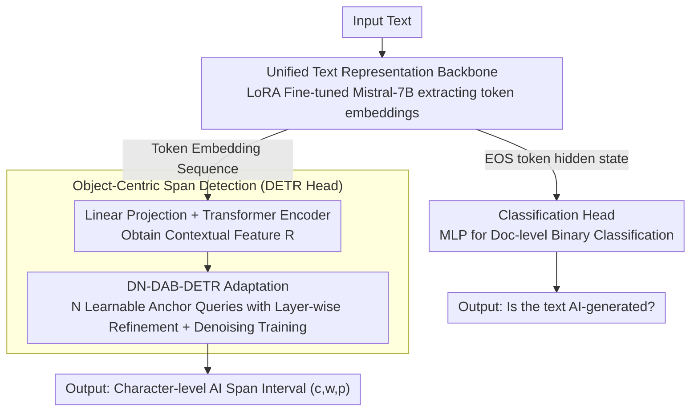

# GigaCheck: Detecting LLM-generated Content via Object-Centric Span Localization

**Conference**: ACL 2026 Findings  
**arXiv**: [2410.23728](https://arxiv.org/abs/2410.23728)  
**Code**: [GitHub](https://github.com/ai-forever/gigacheck)  
**Area**: Object Detection  
**Keywords**: LLM-generated text detection, Object detection paradigm, DETR, Text span localization, Human-AI collaborative text

## TL;DR

GigaCheck is proposed as a dual-strategy framework: it utilizes a fine-tuned LLM for document-level classification and innovatively treats AI-generated text spans as "objects," employing a DETR-like architecture to achieve end-to-end, character-level localization.

## Background & Motivation

**Background**: With the rapid improvement in the quality of LLM-generated content, AI-generated text has become increasingly difficult to distinguish from human-written text in various scenarios. Detecting AI-generated content has become a critical requirement for combating misinformation, academic fraud, and the spread of spam.

**Limitations of Prior Work**: (1) Document-level detection methods lack reliability on human-AI collaborative texts (partially human-written and partially machine-written); (2) existing span-level detection methods are primarily based on token-level sequence tagging (BIO), requiring manual post-processing to aggregate tokens into continuous spans and being limited by sentence boundaries and fixed granularity; (3) the development of detection methods lags behind the advancements in generative models.

**Key Challenge**: The need to simultaneously solve document-level classification ("Is this article AI-generated?") and span-level localization ("Which specific segments are AI-generated?") while sharing representations between the two tasks to improve efficiency.

**Goal**: To propose a unified framework capable of both high-precision document-level detection and precise localization of AI-generated text spans.

**Key Insight**: AI-generated text spans are analogous to "objects" in images. By utilizing the mature DETR architecture from visual object detection, end-to-end 1D span detection can be achieved, transferring the robustness of visual detection to the natural language processing domain.

## Method

### Overall Architecture

GigaCheck employs a "shared backbone + dual heads" structure to simultaneously address two tasks. The input text first passes through a LoRA fine-tuned Mistral-7B to extract token embeddings. The classification head takes the hidden state of the final EOS token and passes it through an MLP to provide a document-level judgment. The DETR head treats the embedding sequence as a 1D feature map, directly regressing character-level intervals for AI-written segments, similar to detecting objects in an image. Both heads share the same fine-tuned backbone and can be used independently; thus, document-level classification and span localization are built upon the same text representation.

### Key Designs

**1. Unified Text Representation Backbone: Feeding both heads with a single set of LoRA fine-tuned embeddings**

Detection datasets are typically small, and full-parameter fine-tuning is prone to overfitting and slow training. Therefore, the backbone utilizes a LoRA fine-tuned Mistral-7B—freezing pre-trained weights while training only low-rank matrices—which generalizes better and converges faster on small datasets. During training, two proxy tasks are set: a three-class classification (human/machine/collaborative) to produce frozen features for the DETR head, and a binary classification (human/machine) co-trained with the classification head. The superior performance of the same embeddings across both tasks validates the universality of this representation.

**2. Object-Centric Span Detection: End-to-end localization of AI spans as 1D "objects" to bypass post-processing**

Sequence tagging (BIO) methods label each individual token and then rely on heuristic rules to aggregate tokens into spans, which is limited by sentence boundaries and fixed granularity. GigaCheck reformulates this as a detection problem: token embeddings $\mathbf{E}$ from the fine-tuned LLM are transformed into contextual features $\mathbf{R}$ via linear projection and a Transformer encoder. $N$ learnable anchor queries $(c, w)$ (center, width) are refined layer-by-layer in a Transformer decoder, with each layer predicting offsets $(\Delta c, \Delta w)$. The final output is a triplet $(c, w, p)$—center, width, and confidence—all normalized to a character-level interval in $[0, 1]$. By directly regressing continuous intervals, the need for aggregation post-processing is eliminated, and localization granularity is character-level, independent of the tokenizer.

**3. DN-DAB-DETR Adaptation: Porting robust visual localization mechanisms to text**

Implementing the detection paradigm in 1D text faces similar challenges to original DETR designs, such as training instability and slow convergence. GigaCheck adopts DAB-DETR's learnable anchor boxes as positional queries and stacks the denoising training strategy from DN-DETR (training learnable queries alongside noisy ground truth queries). Hungarian matching is used to pair predictions with ground truths. Among variants like DAB-DETR, Deformable DETR, and CO-DETR, DN-DAB-DETR demonstrated the best localization accuracy and training stability, leading to its selection for the detection head decoder.

### Loss & Training

The detection head loss is a weighted sum of L1, gIoU, and Focal Loss, calculated for both Hungarian-matched predictions and denoising GT queries. The classification head uses binary cross-entropy. Training occurs in two stages: the backbone is frozen while training the DETR head and becomes trainable during classification head training.

## Key Experimental Results

### Main Results (Classification)

| Dataset | GigaCheck (Mistral-7B) | Prev. SOTA | Description |
|--------|---------------------|----------|------|
| TuringBench (FAIR) | High Precision | RoBERTa-based methods | Strong classification performance with a unified backbone |
| TweepFake | High Precision | - | Validation in the tweet domain |
| MAGE | High Precision | - | Large-scale validation across multi-generator and multi-domain |

### Main Results (Span Detection)

| Dataset | GigaCheck (DETR) | Prev. Methods | Description |
|--------|---------------|---------|------|
| RoFT | High Localization Accuracy | Sequence Tagging | Single boundary scenarios |
| RoFT-ChatGPT | High Localization Accuracy | - | ChatGPT generation scenarios |
| TriBERT | High Localization Accuracy | - | Multiple boundary (1-3) scenarios |

### Key Findings
- The DETR architecture can be successfully extended from visual space to text space, proving the feasibility of the object detection paradigm in NLP.
- The same fine-tuned backbone performs excellently in both classification and detection tasks, verifying the strong generalization ability of the learned embeddings.
- End-to-end span detection eliminates the need for heuristic post-processing required by sequence tagging methods.
- LoRA-based parameter-efficient fine-tuning is particularly effective on small datasets.

## Highlights & Insights
- **Paradigm Innovation**: Redefining text span detection as a 1D object detection problem is an elegant and effective cross-domain transfer.
- **Unified Framework**: A single fine-tuned backbone serves both detection and classification, which is not only efficient but also validates embedding universality.
- **End-to-End Design**: DETR directly outputs character-level intervals, avoiding the complexities of BIO tagging and post-processing.
- **Model Agnostic**: The backbone can be replaced with any decoder-only LLM, making the framework highly extensible.
- **Open-source Contribution**: Full code is publicly released to promote reproducibility.

## Limitations & Future Work
- Evaluation is currently limited to English text; multilingual adaptation is an important future direction.
- Generators in the detection datasets are mostly earlier models (GPT-2/3, CTRL); effectiveness on the latest LLMs remains unknown.
- The number of DETR queries $N$ must be preset based on the dataset and cannot adapt dynamically.
- Robustness analysis against adversarial attacks (e.g., paraphrasing, watermark removal) is insufficient.
- Multi-granularity detection (joint detection at paragraph, sentence, and word levels) can be explored in the future.

## Related Work & Insights
- **vs. Sci-SpanDet**: Sci-SpanDet relies on IMRaD document structures for scientific paper detection; GigaCheck is domain-agnostic and applicable to any text.
- **vs. Sequence Tagging (BIO)**: Sequence tagging requires manual aggregation of tokens into spans; GigaCheck directly regresses continuous intervals.
- **vs. Statistical Methods (DetectGPT, etc.)**: Statistical methods require access to the probability distribution of the target LLM; GigaCheck operates without this requirement.

## Rating
- Novelty: ⭐⭐⭐⭐⭐ Significantly innovative in applying DETR to text span localization for the first time.
- Experimental Thoroughness: ⭐⭐⭐⭐ Dual validation across 3 classification and 3 detection benchmarks, though lacking tests on the latest LLMs.
- Writing Quality: ⭐⭐⭐⭐ Clear architectural diagrams and rigorous methodological descriptions with appropriate cross-modal analogies.
- Value: ⭐⭐⭐⭐ Provides a new technical route for AI-generated text detection, with impact enhanced by open-sourcing.

<!-- RELATED:START -->

## Related Papers

- [\[ICLR 2026\] Learn-to-Distance: Distance Learning for Detecting LLM-Generated Text](../../ICLR2026/aigc_detection/learn-to-distance_distance_learning_for_detecting_llm-generated_text.md)
- [\[ACL 2026\] Temporal Flattening in LLM-Generated Text: Comparing Human and LLM Writing Trajectories](temporal_flattening_in_llm-generated_text_comparing_human_and_llm_writing_trajec.md)
- [\[NeurIPS 2025\] Can LLMs Write Faithfully? An Agent-Based Evaluation of LLM-generated Islamic Content](../../NeurIPS2025/aigc_detection/can_llms_write_faithfully_an_agent-based_evaluation_of_llm-generated_islamic_con.md)
- [\[ACL 2025\] KatFishNet: Detecting LLM-Generated Korean Text through Linguistic Feature Analysis](../../ACL2025/aigc_detection/katfishnet_detecting_llm-generated_korean_text_through_linguistic_feature_analys.md)
- [\[ICLR 2026\] TSM-Bench: Detecting LLM-Generated Text in Real-World Wikipedia Editing Practices](../../ICLR2026/aigc_detection/tsm-bench_detecting_llm-generated_text_in_real-world_wikipedia_editing_practices.md)

<!-- RELATED:END -->
