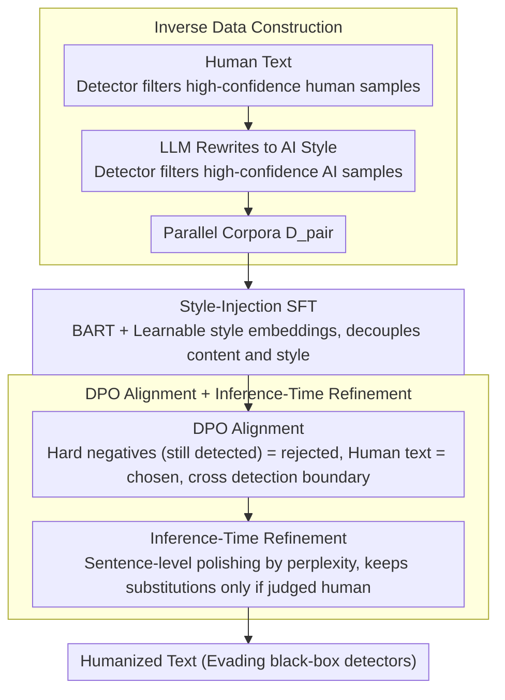

# MASH: Evading Black-Box AI-Generated Text Detectors via Style Humanization

**Conference**: ACL 2026 Findings  
**arXiv**: [2601.08564](https://arxiv.org/abs/2601.08564)  
**Code**: [https://github.com/githigher/MASH](https://github.com/githigher/MASH)  
**Area**: Image Generation/Text Detection Adversarial  
**Keywords**: AI-generated text detection, black-box adversarial attack, style transfer, text humanization, DPO alignment

## TL;DR

This paper proposes MASH (Multi-Stage Style Humanization Alignment), which utilizes a three-stage pipeline consisting of style-injection SFT → DPO alignment → inference-time refinement. By training a rewriter with only 0.1B parameters, it evades AI text detectors with an average attack success rate of 92% in black-box settings while maintaining excellent linguistic quality.

## Background & Motivation

**Background**: The misuse of AI-generated text (AIGT) has spurred the development of numerous detection methods, including training-based detectors (e.g., RoBERTa fine-tuned classifiers) and zero-shot detectors (e.g., Binoculars, Fast-DetectGPT). These detectors have achieved high accuracy on standard benchmarks, and commercial APIs (Writer, Scribbr) are already widely deployed.

**Limitations of Prior Work**: Existing adversarial evasion strategies face significant practical hurdles—(1) perturbation-based methods (e.g., TextFooler, Charmer) have limited attack success rates in black-box settings; (2) prompt-based methods (e.g., PromptAttack) rely on the consistency of model instruction-following, leading to unstable performance; (3) rewriting-based methods (e.g., DIPPER, DPO-Evader) typically require white-box access to either the source generator or the target detector's internal information.

**Key Challenge**: Detectors identify AI text by capturing differences in semantic and statistical feature distributions between AI and human text. To evade detection effectively, the style distribution of AI text must be fundamentally altered to approximate human distributions. This requires completing a "machine style → human style" transfer while maintaining semantic invariance—yet obtaining parallel training data (AI text → corresponding human text) is extremely difficult.

**Goal**: Design a pure black-box style transfer framework that can humanize text generated by any LLM to evade detection without accessing the internal information of source generators or target detectors.

**Key Insight**: Construct training data in reverse—while "AI → human" parallel data is difficult to obtain, the "human → AI" direction is straightforward (using an LLM to rewrite human text). This reverse construction yields parallel corpora used for style-injection SFT to learn human style patterns.

**Core Idea**: Redefine detector evasion as a specialized "machine style → human style" text style transfer task. This is implemented through a three-stage pipeline: SFT to learn human styles + DPO to learn crossing detection boundaries + inference-time refinement to ensure quality.

## Method

### Overall Architecture

MASH reformulates "detector evasion" as a "machine style → human style" text style transfer problem, training a rewriter with only 0.1B parameters using a four-stage pipeline. It first constructs parallel corpora in reverse—generating AI-style text from existing human text to solve the scarcity of "AI → human" data. Then, style-injection SFT teaches the rewriter "what human style looks like," followed by DPO to push it to "know how to cross detection boundaries." Finally, it performs sentence-level refinement during inference to fix fluency. The entire process is black-box and requires no internal information from the source generator or target detector.

### Key Designs

**1. Inverse Data Construction: Utilizing the "Human → AI" directional asymmetry to create parallel corpora with zero annotation.**

To learn "AI → human" style transfer, the most direct way is training on paired AI text and corresponding human text, but such data is hard to get. MASH exploits an asymmetry: making an LLM rewrite human text into AI style is very easy. Specifically, raw text is collected from open-source datasets, and a detector filters for high-confidence human text $\mathbf{x}_{human}$ ($D(\mathbf{x}_{human})<\tau$). An LLM then rewrites each into semantically equivalent AI text, filtered for high-confidence AI text ($D(\mathbf{x}_{ai})>\tau$), resulting in $N$ pairs of parallel data $\mathcal{D}_{pair}=\{(\mathbf{x}_{ai}^{(i)},\mathbf{x}_{human}^{(i)})\}$. This process requires no manual annotation or alignment.

**2. Style-Injection SFT: Decoupling content and style via learnable style embeddings to give the rewriter a starting point that preserves semantics.**

Directly fine-tuning on parallel data risks overfitting and semantic loss. MASH introduces two learnable style embeddings $\mathbf{s}_{ai}, \mathbf{s}_{human} \in \mathbb{R}^d$ on a pre-trained BART. The encoder produces content representations $\mathbf{H}_{content}$, and the fusion layer linearly injects the selected style: $\mathbf{H}_{fused}^{(t)}=\mathbf{W}_p\cdot[\mathbf{h}_{content}^{(t)};\mathbf{s}_{style}]+\mathbf{b}_p$. Training uses a multi-task objective $\mathcal{L}_{SFT}=\lambda\mathcal{L}_{recon}+(1-\lambda)\mathcal{L}_{trans}$—where $\mathcal{L}_{recon}$ (reconstructing original AI text after injecting AI style) constrains semantic maintenance, and $\mathcal{L}_{trans}$ (generating human text after injecting human style) learns style patterns.

**3. DPO Alignment + Inference-Time Refinement: Pushing the rewriter across detection boundaries, then restoring fluency without sacrificing evasion.**

SFT helps the model identify the "target style" but not "how far the detection boundary is." MASH treats the negative scaled detector confidence as an implicit reward $r(x,y)=-C\cdot D(y)$, which convergent policies optimize toward the $D(y)\to 0$ region. Training pairs utilize hard negative mining—samples from SFT that are still detected serve as rejected responses, while original human texts serve as chosen responses. During inference, the system refines sentences in descending order of perplexity: LLMs rewrite low-fluency sentences, and substitutions are accepted only if the detector still judges them as human.

### Loss & Training

- SFT Stage: Multi-task loss $\mathcal{L}_{SFT} = \lambda\mathcal{L}_{recon} + (1-\lambda)\mathcal{L}_{trans}$, initialized with BART-base.
- DPO Stage: $\mathcal{L}_{DPO} = -\mathbb{E}[\log\sigma(h_\theta(\mathbf{y}_w|\mathbf{x}) - h_\theta(\mathbf{y}_l|\mathbf{x}))]$, where $h_\theta(\mathbf{y}|\mathbf{x}) = \beta\log\frac{\pi_\theta(\mathbf{y}|\mathbf{x})}{\pi_{ref}(\mathbf{y}|\mathbf{x})}$.
- Hard negative selection criteria: $D(\mathbf{y}_l) > \tau$, ensuring a maximized probability gap between preference pairs.
- Optimizer: AdamW on a single NVIDIA RTX 3090 GPU.

## Key Experimental Results

### Main Results (Against RoBERTa Detector, ASR↑)

| Method | Essay | Reuters | WP | Humanity | Social | STEM | Average |
|------|-------|---------|-----|----------|--------|------|------|
| DeepWordBug | 0.13 | 0.02 | 0.51 | 0.07 | 0.11 | 0.07 | 0.15 |
| TextFooler | 0.38 | 0.29 | 0.59 | 0.11 | 0.10 | 0.07 | 0.26 |
| Charmer | 0.45 | 0.05 | 0.62 | 0.73 | 0.84 | 0.29 | 0.50 |
| GradEscape | 0.22 | 0.02 | 0.00 | 0.37 | 0.52 | 0.38 | 0.25 |
| CoPA | 0.01 | 0.00 | 0.17 | 0.20 | 0.19 | 0.16 | 0.12 |
| **Ours (MASH)** | **0.95** | **0.73** | **0.90** | **0.87** | **0.98** | **1.00** | **0.92** |

### Ablation Study (Against Binoculars Detector)

| Configuration | Essay ASR | Reuters ASR | WP ASR | Description |
|------|-----------|-------------|--------|------|
| MASH Full | 0.94 | 0.95 | 0.85 | Complete method |
| w/o DPO | ~0.23 | ~0.16 | ~0.33 | Significant drop in ASR without DPO |
| w/o Style-SFT | ~0.03 | ~0.03 | ~0.02 | Nearly ineffective without SFT |

### Key Findings

- **0.1B model outperforms large models**: MASH based on BART-base (0.14B) outperforms methods using large LLMs like PromptAttack and DIPPER, proving style alignment is more critical than scale.
- **Superior quality preservation**: MASH matches or exceeds best baselines in GRUEN (fluency) and maintains BERTScore (semantic preservation) between 0.89-0.90.
- **Strong cross-detector generalization**: Performs remarkably against RoBERTa (trained), Binoculars (zero-shot), SCRN (denoising), and commercial APIs.
- **Incremental contributions**: Style-SFT provides foundational style transfer, DPO enhances boundary-crossing, and refinement ensures output quality.

## Highlights & Insights

- **Novelty of Inverse Data Construction**: Leveraging the asymmetry between "AI rewriting human text" and vice versa provides high-quality parallel corpora at zero cost.
- **Redefining Evasion as Style Transfer**: Changing the objective from "tricking the detector" to "writing like a human" provides a methodological breakthrough.
- **Implicit Adversarial Training via DPO**: Embedding detector confidence as an implicit reward in DPO avoids the need for an explicit reward model.
- **Value of Efficiency**: Trainable on a single 3090 GPU with low parameter counts, requiring no detector queries during inference after training.

## Limitations & Future Work

- Currently only tested with ChatGPT-generated text; effects on other LLM sources (Claude, Llama) remain unverified.
- DPO requires limited interaction with the detector; alternative solutions are needed for completely inaccessible detectors.
- Restricted to English text; style differences in multilingual scenarios require exploration.
- Lacks discussion on building detectors robust against MASH from a defender's perspective.
- Inference-time refinement relies on an external LLM polisher, increasing inference costs.

## Related Work & Insights

- **vs DIPPER (Krishna et al., 2023)**: DIPPER uses T5-XXL (11B) but has very low ASR under black-box settings. MASH achieves 0.95 ASR with a 0.14B model.
- **vs DPO-Evader (Nicks et al., 2023)**: DPO-Evader lacks the Style-SFT initialization, resulting in near-zero ASR on some datasets.
- **vs CoPA (Fang et al., 2025)**: CoPA relies on high-compute contrastive learning; MASH outperforms it via the SFT+DPO pipeline.

## Rating

- Novelty: ⭐⭐⭐⭐
- Experimental Thoroughness: ⭐⭐⭐⭐⭐
- Writing Quality: ⭐⭐⭐⭐
- Value: ⭐⭐⭐⭐

<!-- RELATED:START -->

## Related Papers

- [\[ICML 2026\] Black-Box Detection of LLM-Generated Text Using Generalized Jensen-Shannon Divergence](../../ICML2026/aigc_detection/black-box_detection_of_llm-generated_text_using_generalized_jensen-shannon_diver.md)
- [\[ACL 2026\] When Personalization Tricks Detectors: The Feature-Inversion Trap in Machine-Generated Text Detection](when_personalization_tricks_detectors_the_feature-inversion_trap_in_machine-gene.md)
- [\[AAAI 2026\] BAID: A Benchmark for Bias Assessment of AI Detectors](../../AAAI2026/aigc_detection/baid_a_benchmark_for_bias_assessment_of_ai_detectors.md)
- [\[ACL 2026\] mdok-style at SemEval-2026 Task 10: Finetuning LLMs for Conspiracy Detection](mdok-style_at_semeval-2026_task_10_finetuning_llms_for_conspiracy_detection.md)
- [\[ACL 2026\] REFLEX: Self-Refining Explainable Fact-Checking via Verdict-Anchored Style Control](reflex_self-refining_explainable_fact-checking_via_verdict-anchored_style_contro.md)

<!-- RELATED:END -->
