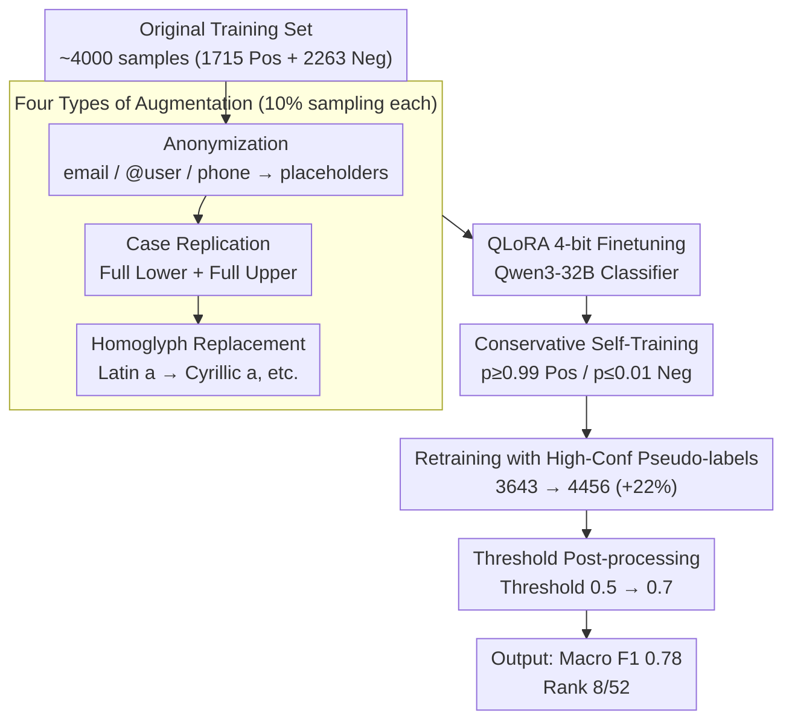

# mdok-style at SemEval-2026 Task 10: Finetuning LLMs for Conspiracy Detection

**Conference**: ACL 2026 (SemEval-2026 Task 10)  
**arXiv**: [2605.02712](https://arxiv.org/abs/2605.02712)  
**Code**: https://github.com/kinit-sk/mdok-style-psycomark2026 (Available)  
**Area**: Conspiracy Theory Detection / SemEval / LLM Finetuning  
**Keywords**: PsyCoMark, QLoRA, Self-training, Data Augmentation, Qwen3-32B

## TL;DR
The authors port the finetuning paradigm of their PAN@CLEF2025-winning machine-generated text (MGT) detector, mdok, to conspiracy detection: four types of data augmentation (anonymization, case variation, homoglyphs, and deduplication) are used to expand the training set, followed by a round of self-training (retaining only high-confidence pseudo-labels where $p \ge 0.99$ or $p \le 0.01$). Qwen3-32B is then finetuned using QLoRA 4-bit PEFT, ultimately achieving a Macro F1 = 0.78 and ranking 8/52 (85th percentile) in SemEval-2026 Task 10 subtask 2.

## Background & Motivation

**Background**: SemEval-2026 Task 10 (PsyCoMark) bridges psychology and NLP, requiring systems to determine if a Reddit comment expresses conspiracy beliefs. Subtask 2 is a binary Yes/No classification for English. The provided training data is relatively small, consisting of 1715 positive and 2263 negative samples, with text lengths restricted to 160–1000 characters. Early works utilized SVMs with lexical or stylistic features; subsequent improvements incorporated psycholinguistic features (e.g., certainty, emotional intensity, distrust framing). While recent LLMs have joined the field, they often suffer from hallucination and precision issues; emotion-aware finetuned LLMs like ConspEmoLLM represent the current state of the art over vanilla LLMs.

**Limitations of Prior Work**: ① The training set is too small for 32B-scale LLMs, leading to overfitting during direct finetuning; ② Social media conspiracy texts are heavily noise-laden with URLs, @mentions, emails, phone numbers, and homoglyphs, which easily interfere with LLM tokenizers; ③ Inconsistent casing is common in social media, yet traditional classifiers are often misled by case variation; ④ Organizers did not release ground truth for the dev/test sets, preventing supervised iteration for hyperparameter tuning and forcing "blind" submissions to Codabench.

**Key Challenge**: Achieving SOTA performance on a new task with an LLM requires sufficient scale and diversity in training data; however, the PsyCoMark dataset is both small and narrow. Furthermore, when using larger models, computational costs must be controlled, especially as DeBERTa (<0.5B parameters) can already achieve a score of 0.75, leaving uncertain headroom for a 32B model.

**Goal**: To port the successful "mdok recipe" to conspiracy detection with minimal engineering changes, thereby validating the cross-task transferability of an LLM finetuning pipeline originally designed for MGT detection.

**Key Insight**: The authors treat conspiracy detection as a robust binary classification task. They borrow three major techniques from the PAN@CLEF2025 champion detector mdok: anonymization-as-augmentation, homoglyph-aware training, and QLoRA efficient finetuning, while adding a round of self-training to utilize unlabeled dev/test data.

**Core Idea**: Combining mdok-style data augmentation with high-confidence threshold self-training and Qwen3-32B QLoRA yields a robust solution capable of ranking in the top 20% of SemEval.

## Method

### Overall Architecture

The core mechanism of this system paper is to verify task transferability by applying the exact finetuning recipe of mdok to conspiracy detection. The pipeline consists of three stages: first, four types of data augmentation expand the ~4000 original samples to remove surface noise interference; second, Qwen3-32B is finetuned into a binary classifier using QLoRA 4-bit; finally, this model generates high-confidence pseudo-labels for unlabeled data to be used in a second round of training. During inference, the positive class threshold is adjusted from 0.5 to 0.7 to improve precision.

### Key Designs

**1. mdok-style Data Augmentation: Injecting diversity into small-scale data to force semantic learning**
Conspiracy texts, similar to MGT, are filled with spurious surface cues like URLs, mentions, all-caps shouting, and intentional character substitutions. To prevent the model from learning these as shortcuts, four augmentations are used: (i) **Anonymization** uses regex to replace identifying tokens like emails and phone numbers with generic placeholders; (ii) **Case variation** creates full lower-case and full upper-case duplicates to inject the prior that conspiracy detection is case-invariant; (iii) **Homoglyphication** replaces characters with visually similar ones from different scripts (e.g., Latin `a` to Cyrillic `а`) to make the classifier robust against tokenizer-level noise. Only 10% of each augmentation is sampled to avoid overwhelming the original data.

**2. Conservative Self-Training: Leveraging unlabeled dev/test data while minimizing noise**
While the organizers did not release ground truth for the dev/test sets, these samples are utilized through self-training. To mitigate the risk of error propagation common in silver labeling, the authors apply extremely strict thresholds: only samples with $p \ge 0.99$ are labeled positive, and $p \le 0.01$ as negative. This high-precision, low-recall approach expanded the training set from 3643 to 4456 samples (+22%). This strategy is particularly effective for competition settings where hyperparameter tuning is restricted.

**3. QLoRA Efficient Finetuning + Threshold Post-processing: Taming 32B on limited hardware**
Full finetuning of a 32B model is computationally prohibitive for many labs. Using QLoRA (4-bit quantization + low-rank adapters), the authors updated only a fraction of the parameters, allowing Qwen3-32B to be trained on a single A100 64GB (~100 GPU hours). During inference, moving the threshold from 0.5 to 0.7 provided a further 0.01 F1 gain (0.77 to 0.78), as the task is more sensitive to precision—misclassifying a harmless comment is costlier than missing a conspiracy.

### Loss & Training
- Binary cross-entropy (default in transformers `seq-cls`) with no class weighting.
- A holdout set of 100x2 samples was used for validation (due to unlabeled dev sets), with checkpoints selected by Macro F1.
- Self-training was restricted to a single round to control error accumulation.
- Model selection compared Qwen3 (4B, 14B, 32B) and Gemma-3 (1B, 12B), with Qwen3-32B performing best in the dev phase.

## Key Experimental Results

### Main Results (PsyCoMark Subtask 2 Official Test Set, Macro F1)

| System | Macro F1 |
|---|---|
| **Qwen3-32B_ST_th0.7 (Submitted)** | **0.78** |
| Qwen3-32B_ST | 0.77 |
| Qwen3-32B_th0.7 | 0.77 |
| Qwen3-32B | 0.76 |
| DeBERTa-Large (<0.5B) | 0.75 |
| Qwen3-14B-Base | 0.75 |
| Gemma-3-1B-PT_ST | 0.75 |
| Qwen3-4B-Base | 0.75 |
| Gemma-3-12B-PT | 0.74 |
| Gemma-3-1B-PT | 0.73 |
| Qwen3-4B-Base_ST | 0.72 |
| Random baseline | 0.50 |

**Selected Unofficial Codabench Ranking**:

| Rank | Team | Macro F1 |
|---|---|---|
| 1 | NJUST_KMG | 0.89 |
| 2 | AGAI | 0.87 |
| 3 | jia57 | 0.86 |
| ... | ... | ... |
| **8** | **mdok-style** | **0.78** |
| ... | ... | ... |

The system ranked 8th out of 52 (85th percentile), outperforming over 80% of teams.

### Ablation Study

| Configuration | Macro F1 | $\Delta$ vs Base |
|---|---|---|
| Qwen3-32B (Base) | 0.76 | – |
| + Self-Training | 0.77 | +0.01 |
| + threshold=0.7 | 0.77 | +0.01 |
| + Self-Training + threshold=0.7 | **0.78** | +0.02 |

Interestingly, self-training decreased performance on Qwen3-4B (0.75 $\to$ 0.72), suggesting that self-training requires high model capacity; smaller models suffer from noise in pseudo-labels.

### Key Findings
- **Diminishing Returns**: The 32B model with full techniques only outperformed DeBERTa-Large (0.5B) by 0.03. For small-data binary classification, DeBERTa remains a highly cost-effective choice.
- **Combined Gains**: Self-training and threshold post-processing each contributed ~1 F1 point. The largest jump (0.73 $\to$ 0.76) came from the initial base model selection.
- **Capacity Requirement**: The failure of self-training on smaller models indicates that the reliability of silver labels is highly correlated with the base model's intrinsic predictive capability.
- **Transferability**: Porting the pipeline from MGT detection to conspiracy detection achieved the 85th percentile, validating it as a general-purpose framework for binary text classification.

## Highlights & Insights
- Porting anonymization, homoglyphication, and case-variant augmentations proves that handling spurious surface cues is universally beneficial for social media text classification.
- The ultra-strict threshold ($\ge 0.99 / \le 0.01$) for self-training is a "safe" strategy when ground truth for validation sets is unavailable.
- Threshold moving (0.5 $\to$ 0.7) is a "free lunch" for tasks where false positives are more costly than false negatives.
- The transparent comparison showing the high cost-benefit ratio of DeBERTa vs. 32B models is valuable for community reproducibility.

## Limitations & Future Work
- Evaluated only on the English PsyCoMark dataset; cross-lingual performance remains unknown.
- Model selection was limited to Qwen3 and Gemma-3, excluding LLaMA-3, Mistral, or DeepSeek.
- No external datasets (e.g., other conspiracy or misinformation corpora) were used.
- Self-training was limited to one round; multi-round iteration was not explored.
- Error analysis is missing as the ground truth was not released by organizers.

## Related Work & Insights
- **vs mdok (Macko 2025)**: The source system won the PAN@CLEF2025 task; this work demonstrates its cross-task applicability.
- **vs ConspEmoLLM (Liu 2024)**: While others use explicit emotional signals, this work uses data augmentation to handle surface noise.
- **vs DeBERTa baseline**: Highlights that for small data, 32B models are over 50x more computationally expensive than DeBERTa for marginal gains.

## Rating
- Novelty: ⭐⭐⭐ (Cross-task application of an existing recipe)
- Experimental Thoroughness: ⭐⭐⭐⭐ (Extensive system comparisons and ablations)
- Writing Quality: ⭐⭐⭐⭐⭐ (Concise and clear reproduction instructions)
- Value: ⭐⭐⭐⭐ (Practical engineering insights for NLP competitions)

<!-- RELATED:START -->

## Related Papers

- [\[ACL 2026\] MASH: Evading Black-Box AI-Generated Text Detectors via Style Humanization](mash_evading_black-box_ai-generated_text_detectors_via_style_humanization.md)
- [\[ACL 2026\] REFLEX: Self-Refining Explainable Fact-Checking via Verdict-Anchored Style Control](reflex_self-refining_explainable_fact-checking_via_verdict-anchored_style_contro.md)
- [\[ICLR 2026\] PoliCon: Evaluating LLMs on Achieving Diverse Political Consensus Objectives](../../ICLR2026/aigc_detection/policon_evaluating_llms_on_achieving_diverse_political_consensus_objectives.md)
- [\[NeurIPS 2025\] Can LLMs Write Faithfully? An Agent-Based Evaluation of LLM-generated Islamic Content](../../NeurIPS2025/aigc_detection/can_llms_write_faithfully_an_agent-based_evaluation_of_llm-generated_islamic_con.md)
- [\[ACL 2026\] ExaGPT: Example-Based Machine-Generated Text Detection for Human Interpretability](exagpt_example-based_machine-generated_text_detection_for_human_interpretability.md)

<!-- RELATED:END -->
