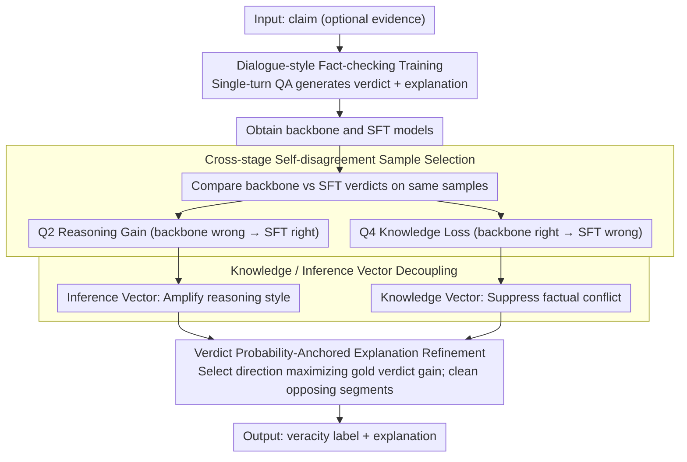

# REFLEX: Self-Refining Explainable Fact-Checking via Verdict-Anchored Style Control

**Conference**: ACL2026  
**arXiv**: [2511.20233](https://arxiv.org/abs/2511.20233)  
**Code**: The paper claims to be open-sourced; specific URL not provided in the cache  
**Area**: AIGC Detection / Explainable Fact-Checking  
**Keywords**: Explainable Fact-Checking, Activation Steering, Hallucination Suppression, Verdict-Anchored Explanation, Self-Refinement  

## TL;DR
REFLEX binds verdict prediction and explanation generation in fact-checking by constructing internal steering vectors from self-disagreement samples between the backbone and fine-tuned models. Without relying on search APIs or closed-source teacher models, it improves the verdict Macro-F1 and produces shorter, more consistent, and less misleading explanations.

## Background & Motivation
**Background**: Automatic fact-checking systems typically provide both a veracity verdict and an explanation. As LLMs are applied to fact-checking, mainstream solutions either generate verdicts and explanations directly or rely on retrieval, Google Search API, closed-source teacher models, or multi-agent dialogues to supplement evidence and reasoning trajectories.

**Limitations of Prior Work**: These external dependency schemes enhance information sources but introduce two issues. First, retrieved evidence, teacher distillation, and multi-agent interactions may introduce hallucinations or propagate errors. Second, external APIs and multi-agent workflows increase latency, making them unsuitable for real-time fact-checking. More critically, LLM-generated explanations may appear plausible but remain inconsistent with the final verdict, potentially misleading human judgment with deceptive narrative styles.

**Key Challenge**: Fact-checking explanations consist of both factual content and reasoning/narrative style. Existing methods often mix the two: focusing solely on external evidence may amplify noise, while pure fine-tuning may bake knowledge conflicts from local training signals into model behavior. The authors argue for decoupling "fact-sensitive signals" from "style/reasoning-sensitive signals" within the model's internal representations.

**Goal**: Ours aims to achieve more accurate verdicts and faithful explanations under single-model, few-shot, and low-external-dependency conditions. Specifically, it seeks to identify samples reflecting reasoning gain vs. knowledge loss during fine-tuning and control the generation process accordingly.

**Key Insight**: The authors observe prediction discrepancies between the backbone and SFT models on the same training samples. "Incorrect-to-correct" transitions after fine-tuning are viewed as reasoning style activation, while "correct-to-incorrect" transitions are viewed as factual knowledge perturbation. This cross-stage self-disagreement provides internal supervision without manually constructed contrastive samples.

**Core Idea**: Use backbone/SFT self-disagreement samples to decompose steering vectors into Inference Vectors and Knowledge Vectors. Then, adaptively select and intervene in the generation based on the verdict probability gain, ensuring explanations are anchored by the verdict rather than surface style.

## Method
The REFLEX method does not retrieve evidence followed by LLM explanation writing; instead, it reframes fact-checking as a dialogue-style single-turn question-answering task and identifies controllable explanation directions within the model. The overall process involves training a fact-checker to output verdicts and explanations, extracting "good" and "bad" directions from backbone-SFT disagreement, and correcting explanations using these directions during inference.

### Overall Architecture
The input is a claim (optionally with evidence), and the output is a veracity label and explanation. REFLEX operates in three steps.

Step 1: Dialogue-style Fact-Checker Training. The paper converts traditional document-style supervision into QA/dialogue training where the model generates $v$ or $v;exp$ in a single turn. The authors assume the backbone contains sufficient factual knowledge; limited supervision serves mostly to activate existing knowledge and shape the task style.

Step 2: Adaptive Sample Selection. After training, the backbone and SFT models perform inference on the training set. Samples are categorized into quadrants based on whether predictions match the gold verdict. Q2 samples (backbone incorrect $\to$ SFT correct) are deemed Reasoning Gain; Q4 samples (backbone correct $\to$ SFT incorrect) are deemed Knowledge Loss.

Step 3: Self-Explanation Guided Steering. Steering directions are extracted from Q2/Q4 and decoupled into Inference Vectors and Knowledge Vectors. During inference, the direction that maximizes the gold verdict probability gain is selected to intervene in decoder block activations, further cleaning explanation segments that contradict the optimal direction.

### Key Designs

**1. Cross-stage self-disagreement sample selection: Using "self-conflict" before and after fine-tuning as supervision signals instead of manual contrastive samples.**

One of the hardest tasks in fact-checking is constructing clean contrastive samples that "change explanation style without altering factual content"—manual annotation is nearly impossible. REFLEX utilizes the prediction disagreement between the backbone and SFT models. Let $\hat{v}^{base}$ and $\hat{v}^{sft}$ be the verdicts. If $\hat{v}^{base}\neq v^{gold}$ and $\hat{v}^{sft}=v^{gold}$, fine-tuning corrected the error (reasoning gain). If $\hat{v}^{base}=v^{gold}$ and $\hat{v}^{sft}\neq v^{gold}$, fine-tuning introduced an error (knowledge loss). This self-disagreement naturally isolates which reasoning styles were activated and which factual representations were damaged, proving more natural and closer to internal model behavior than manual counterfactual pairs.

**2. Knowledge Vector and Inference Vector Decoupling: Splitting a general steering direction into "reasoning styles to amplify" and "factual conflicts to suppress."**

Explanation hallucinations are often a product of factual content and narrative style being entangled. Using a single steering vector for both inevitably results in trade-offs. REFLEX splits the direction into two components: Inference Vectors derived from reasoning gain samples (representing reasoning/style signals to amplify) and Knowledge Vectors derived from knowledge loss samples (representing factual conflicts to suppress). To keep overhead low, logistic probes are used to extract and apply these directions at the decoder block level. By decoupling them, the model preserves consistent factual representations while enhancing explanation styles aligned with the verdict.

**3. Verdict Probability-Anchored Explanation Refinement: Ensuring steering serves the verdict rather than just making the explanation sound better.**

An explanation that "sounds like an explanation" is useless unless it faithfully supports the final verdict. REFLEX selects directions based on their contribution to the gold verdict probability rather than fluency. For each candidate direction, the probability difference between steered and unsteered outputs for the gold verdict is compared; the direction with the maximum gain is used for intervention. After selecting the optimal direction $s_l$, the cosine similarity $a_{l,t}=h_{l,t}\cdot s_l/(\|h_{l,t}\|\|s_l\|)$ is calculated for each token's hidden state. Segments densely opposing the optimal direction are treated as noise and cleaned using lightweight Ratcliff-Obershelp pattern matching. Anchoring steering to the verdict probability gap prevents the explanation from being misled by surface narrative styles.

### Loss & Training
The training phase uses a standard cross-entropy objective for joint verdict and explanation generation. The paper compares four input/output configurations: $c\to v$, $c\to v;exp$, $c;evi\to v$, and $c;evi\to v;exp$. After experiments, target generation without evidence but with explanations was chosen for RAW-FC and LIAR-RAW, as evidence introduced noise and amplified hallucinations in most settings. AVeriTeC, where explanations naturally depend on evidence, followed its specific task format. Inference temperature was fixed at 0, and few-shot samples were drawn from other training splits to avoid leakage.

## Key Experimental Results

### Main Results
The main experiment compares external dependency schemes with REFLEX on RAW-FC and LIAR-RAW. Table 1 indicates that REFLEX outperforms RAV and L-Defense on RAW-FC using a single open-source backbone and 465 self-extracted samples. On LIAR-RAW, REFLEX achieved a best reported Macro-F1 of 50.59.

| Method | External Dependency | Training Explanation Scale | RAW-FC Macro-F1 | LIAR-RAW Macro-F1 | Note |
|------|----------|--------------|-----------------|-------------------|------|
| ChatGPT | Closed-source API | None | 44.43 / 39.31 | 25.11 / 21.90 | Two settings; evidence made it worse |
| HiSS | Google Search API | None | 53.90 | 37.50 | Retrieval-based external evidence |
| FactLLaMA | Google Search API | LLaMA2-7B | 55.65 | 30.44 | Also relies on external search |
| L-Defense | ChatGPT + RoBERTa-Large | 32,240 | 61.20 | 30.53 | Large-scale GPT-3.5 distillation |
| RAV | 3 LLaMA-3.1-70B-Instruct | Unreported | 59.19 | 25.40 | Multi-agent scheme |
| REFLEX / S-EGS | None | 465 self-extracted | 64.99 | 50.59 | 3.79 higher than L-Defense on RAW-FC |

### Ablation Study
The authors conducted multi-level ablations: cross-backbone, cross-dataset transfer, pairing strategies, and analysis of explanation quality vs. vector types.

| Ablation Setting | Key Indicator | Description |
|----------|----------|------|
| S-EGS across backbones | Up to 5.03 Macro-F1 Gain | Outperforms SFT in most LLaMA-2 and Qwen-3 settings |
| Cross-dataset transfer: LLaMA-2 R→L | Target LIAR-RAW Macro-F1 50.59, Gain +7.54 | Directions from strong source models help weak targets |
| Cross-dataset transfer: LLaMA-2 L→R | Target RAW-FC Macro-F1 47.20, Change -13.39 | Weak source directions harm strong targets |
| Vertical steering w/o exp, LLaMA-2 RAW-FC | 34.01, Gain +7.57 | Explanation-guided signals help even when skipping explanation output |
| Horizontal steering w/o exp, LLaMA-2 RAW-FC | 34.82, Gain +8.38 | Internal horizontal directions also work |

### Key Findings
- REFLEX is highly data-efficient: 465 self-extracted samples outperformed L-Defense's 32,240 GPT-3.5 distilled explanations on RAW-FC.
- Evidence conditioning is not always beneficial: Including evidence often performed worse than excluding it on RAW-FC and LIAR-RAW, suggesting external evidence can introduce noise.
- Transferability is conditional: Source model Macro-F1 is highly correlated with target gain (Pearson 0.95), meaning effective steering directions require strong source settings.
- KV and IV behave differently: KV reduces misleadingness while IV improves informativeness/soundness, supporting the decoupling of "fact-sensitive" and "style-sensitive" signals.

## Highlights & Insights
- Using "self-disagreement before and after training" as a supervision signal is highly effective. It avoids the difficulty of manual contrastive sample construction and is closer to internal model control than simple prompt engineering.
- REFLEX does not simplify explanation faithfulness as just "retrieving more evidence." Instead, it notes that external evidence can introduce noise, a crucial reminder for fact-checking system design.
- Verdict probability anchoring is a transferable design. Many tasks suffer from "plausible but unhelpful explanations" (e.g., medical triage, legal QA); these can benefit from using task goal probabilities to select control directions.
- The discussion on transferability is measured: steering vectors don't generalize unconditionally; the reliability depends on the transition from strong sources to weak targets.

## Limitations & Future Work
- Limited model scale: Due to resources, tests were concentrated on 7B-8B models (LLaMA-2, Qwen-3, Mistral), leaving performance on larger models or different architectures unproven.
- LIAR-RAW label merging: Labels were merged into three categories to align with explanation generation difficulty and prior work, which may not fully represent 6-class political fact-checking.
- Internal knowledge obsolescence: Reducing retrieval dependency increases reliance on pre-existing knowledge. Activation editing could adapt to new events, but this wasn't explicitly verified for temporal shifts in the cache.
- Quality assessment: Explanation quality still relies partially on LLM-as-a-judge and manual subsets. Future work could include stricter factual consistency audits.

## Related Work & Insights
- **vs. HiSS / FactLLaMA**: These rely on retrieval/Google APIs for new info; REFLEX focuses on low latency and reduced retrieval hallucinations but depends more on internal knowledge.
- **vs. L-Defense**: While L-Defense distills thousands of explanations, REFLEX achieves higher RAW-FC Macro-F1 with hundreds of internal samples, suggesting high-signal internal samples may be better for faithfulness.
- **vs. RAV**: RAV uses multi-agent dialogues for complex deliberation; REFLEX uses single-model internal control for low-latency fact-checking.
- **vs. ITI / CAA**: Traditional methods use a single truth/style direction; REFLEX contributes decoupled KV/IV and task-anchored selection via verdict probability gaps.

## Rating
- Novelty: ⭐⭐⭐⭐⭐ The decoupling of KV/IV via cross-stage self-disagreement is clear and fits the fact-checking domain.
- Experimental Thoroughness: ⭐⭐⭐⭐☆ Covers transfer, pairing, and human evaluation, though limited to 7B-8B scales.
- Writing Quality: ⭐⭐⭐⭐☆ Solid motivation and explanation, though the many settings and appendix tables require close attention.
- Value: ⭐⭐⭐⭐⭐ Directly applicable to explainable fact-checking, content moderation, and activation control.

<!-- RELATED:START -->

## Related Papers

- [\[ICML 2026\] LLM Self-Recognition: Steering and Retrieving Activation Signatures](../../ICML2026/aigc_detection/llm_self-recognition_steering_and_retrieving_activation_signatures.md)
- [\[ACL 2026\] mdok-style at SemEval-2026 Task 10: Finetuning LLMs for Conspiracy Detection](mdok-style_at_semeval-2026_task_10_finetuning_llms_for_conspiracy_detection.md)
- [\[ACL 2026\] MASH: Evading Black-Box AI-Generated Text Detectors via Style Humanization](mash_evading_black-box_ai-generated_text_detectors_via_style_humanization.md)
- [\[ICLR 2026\] Calibrating Verbalized Confidence with Self-Generated Distractors](../../ICLR2026/aigc_detection/calibrating_verbalized_confidence_with_self-generated_distractors.md)
- [\[CVPR 2026\] Investigating Self-Supervised Representations for Audio-Visual Deepfake Detection](../../CVPR2026/aigc_detection/investigating_self-supervised_representations_for_audio-visual_deepfake_detectio.md)

<!-- RELATED:END -->
## Related Papers

- [\[ACL 2026\] mdok-style at SemEval-2026 Task 10: Finetuning LLMs for Conspiracy Detection](mdok-style_at_semeval-2026_task_10_finetuning_llms_for_conspiracy_detection.md)
- [\[ACL 2026\] MASH: Evading Black-Box AI-Generated Text Detectors via Style Humanization](mash_evading_black-box_ai-generated_text_detectors_via_style_humanization.md)
- [\[ICLR 2026\] Calibrating Verbalized Confidence with Self-Generated Distractors](../../ICLR2026/aigc_detection/calibrating_verbalized_confidence_with_self-generated_distractors.md)
- [\[CVPR 2026\] Investigating Self-Supervised Representations for Audio-Visual Deepfake Detection](../../CVPR2026/aigc_detection/investigating_self-supervised_representations_for_audio-visual_deepfake_detectio.md)
- [\[ICML 2026\] LLM Self-Recognition: Steering and Retrieving Activation Signatures](../../ICML2026/aigc_detection/llm_self-recognition_steering_and_retrieving_activation_signatures.md)

<!-- RELATED:END -->
