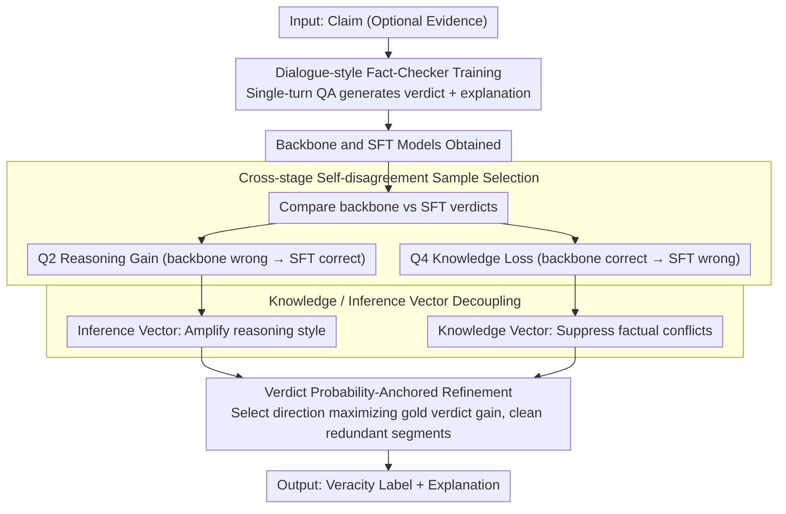

# REFLEX: Self-Refining Explainable Fact-Checking via Verdict-Anchored Style Control

**Conference**: ACL2026  
**arXiv**: [2511.20233](https://arxiv.org/abs/2511.20233)  
**Code**: The paper claims it is open-sourced; no specific URL is provided in the cache.  
**Area**: AIGC Detection / Explainable Fact-Checking  
**Keywords**: Explainable Fact-Checking, Activation Steering, Hallucination Mitigation, Verdict-Anchored Explanation, Self-Refinement  

## TL;DR
REFLEX couples verdict prediction and explanation generation in fact-checking by constructing internal steering vectors from self-disagreement samples between a backbone and a fine-tuned model. This approach improves verdict Macro-F1 and produces shorter, more consistent, and less misleading explanations without relying on search APIs or closed-source teacher models.

## Background & Motivation
**Background**: Automated fact-checking systems typically aim to provide both a veracity verdict and an explanation. As LLMs are increasingly utilized for fact-checking, mainstream solutions either let models generate verdicts and explanations directly or rely on retrieval, Google Search APIs, closed-source teacher models, or multi-agent dialogues to supplement evidence and reasoning trajectories.

**Limitations of Prior Work**: These external-dependency solutions enhance information sources but introduce two problems. First, retrieved evidence, teacher distillation, and multi-round agent interactions can introduce hallucinations or propagate errors. Second, external APIs and multi-agent workflows increase latency, making them unsuitable for real-time fact-checking. Critically, LLM-generated explanations may appear plausible while remaining inconsistent with the final verdict, potentially misleading human judgment through deceptive narrative styles.

**Key Challenge**: Fact-checking explanations consist of both factual content and reasoning/narrative style. Existing methods often mix these components: focusing solely on external evidence may amplify noise, while pure fine-tuning might embed knowledge conflicts from local training signals into the model's behavior. The authors argue for the necessity of disentangling "fact-sensitive signals" from "style/reasoning-sensitive signals" within internal model representations.

**Goal**: The paper aims to achieve higher verdict accuracy and more faithful explanations under single-model, few-shot, and low-external-dependency conditions. Specifically, it seeks to identify samples representing "reasoning gain" versus "knowledge loss" from fine-tuning to control the generation process.

**Key Insight**: By observing prediction differences between a backbone and an SFT model on the same training sample, the authors view "wrong-to-correct" transitions as activation of reasoning style and "correct-to-wrong" transitions as perturbations of factual knowledge. This cross-stage self-disagreement provides internal supervision without requiring manually constructed contrastive samples.

**Core Idea**: Use backbone/SFT self-disagreement samples to decompose steering vectors into Inference Vectors and Knowledge Vectors. Then, adaptively select and intervene in the generation process based on verdict probability gain to ensure explanations are anchored to the verdict rather than being misled by surface-level styles.

## Method
Instead of retrieving evidence first and then writing explanations, REFLEX reformulates fact-checking into a dialogue-style single-turn QA task and identifies controllable explanation directions within the model. The overall workflow first trains a fact-checker that outputs verdicts and explanations, extracts "good" and "bad" directions from backbone-SFT disagreements, and uses these to correct explanations during inference.

### Overall Architecture
The input is a claim (optionally with evidence), and the output is a veracity label and an explanation. REFLEX operates in three steps.

First is Dialogue-style Fact-Checker Training. The paper converts traditional document-style supervision into QA/dialogue training where the model generates $v$ or $v;exp$ in a single turn. The authors maintain that backbones already contain substantial factual knowledge, so limited supervision is better used for activating knowledge and shaping task style than simple document continuation.

Second is Adaptive Sample Selection. After training, the authors run inference on the training set using both the backbone and SFT models, categorizing results into quadrants based on gold verdict matching. Q2 samples (backbone wrong, SFT correct) are viewed as Reasoning Gain; Q4 samples (backbone correct, SFT wrong) are viewed as Knowledge Loss.

Third is Self-Explanation Guided Steering. Steering directions are extracted from Q2/Q4 and decoupled into Inference Vectors and Knowledge Vectors. During inference, the direction that maximizes the probability gain of the gold verdict is selected to control decoder block activations, further cleaning the explanation of segments conflicting with the optimal direction.

### Key Designs

**1. Cross-stage self-disagreement sample selection: Using "self-directed argument" before and after fine-tuning as supervision signals instead of manual contrastive samples.**

Constructing clean contrastive samples—where only explanation style changes while factual content remains static—is extremely difficult via manual annotation. REFLEX utilizes prediction disagreements between the backbone and SFT models on same samples. Let $\hat{v}^{base}$ and $\hat{v}^{sft}$ be their respective verdicts: if $\hat{v}^{base}\neq v^{gold}$ and $\hat{v}^{sft}=v^{gold}$, it is labeled reasoning gain. Conversely, if $\hat{v}^{base}=v^{gold}$ and $\hat{v}^{sft}\neq v^{gold}$, it is labeled knowledge loss. This separation naturally isolates "reasoning style" from "fact representation damage," proving more proximal to internal model behavior than counterfactual samples.

**2. Knowledge Vector and Inference Vector Decoupling: Splitting a general steering direction into "reasoning style to amplify" and "factual conflict to suppress."**

Explanation hallucinations are often a entanglement of factual errors and narrative style. REFLEX splits the steering into two paths: Inference Vectors (from Q2) represent reasoning/style signals to be amplified, while Knowledge Vectors (from Q4) represent factual conflicts to be suppressed. To minimize overhead, logistic probes extract and apply these directions at the decoder block level. This allows the model to preserve factual consistency while enhancing verdict-aligned styles.

**3. Verdict probability-anchored explanation refinement: Ensuring steering serves the verdict rather than just making explanations sound plausible.**

An explanation is meaningless if it does not faithfully support the final verdict. REFLEX chooses directions based on their contribution to the gold verdict probability rather than fluency. For each candidate direction, the probability difference between steered and unsteered outputs for the gold verdict is compared. Once the optimal direction $s_l$ is chosen, cosine similarity $a_{l,t}=h_{l,t}\cdot s_l/(\|h_{l,t}\|\|s_l\|)$ identifies redundant tokens conflicting with this direction, which are then removed using light-weight Ratcliff-Obershelp pattern matching.

### Loss & Training
The training phase uses standard cross-entropy objectives for joint verdict and explanation generation. Four input-output configurations were compared: $c\to v$, $c\to v;exp$, $c;evi\to v$, and $c;evi\to v;exp$. The authors chose targets without evidence for RAW-FC and LIAR-RAW to avoid noise/hallucination amplification, though AVeriTeC utilized evidence as per its task format. Inference temperature was fixed at 0.

## Key Experimental Results

### Main Results
REFLEX was compared against external-dependency solutions on RAW-FC and LIAR-RAW. Table 1 indicates it surpasses RAV and L-Defense using a single backbone and only 465 self-extracted samples.

| Method | Ext. Dependency | Explanations for Training | RAW-FC Macro-F1 | LIAR-RAW Macro-F1 | Notes |
|------|----------|--------------|-----------------|-------------------|------|
| ChatGPT | Closed-source API | N/A | 44.43 / 39.31 | 25.11 / 21.90 | Evidence inclusion degraded results |
| HiSS | Google Search API | N/A | 53.90 | 37.50 | Retrieval-based external evidence |
| FactLLaMA | Google Search API | LLaMA2-7B | 55.65 | 30.44 | Relies on external search |
| L-Defense | ChatGPT + RoBERTa-Large | 32,240 | 61.20 | 30.53 | Large-scale GPT-3.5 distillation |
| RAV | 3x LLaMA-3.1-70B-Instruct | N/A | 59.19 | 25.40 | Multi-agent approach |
| **Ours (REFLEX / S-EGS)** | **None** | **465 self-extracted** | **64.99** | **50.59** | Macro-F1 +3.79 over L-Defense (RAW-FC) |

### Ablation Study
Ablations covered cross-backbone performance, cross-dataset transfer, and vector types.

| Setting | Key Metric | Description |
|----------|----------|------|
| S-EGS across backbones | Up to +5.03 Macro-F1 | Outperforms SFT on LLaMA-2 and Qwen-3 across sets |
| Transfer: LLaMA-2 R→L | LIAR-RAW Macro-F1 50.59 (+7.54 Gain) | Strong source directions benefit weak target setups |
| Transfer: LLaMA-2 L→R | RAW-FC Macro-F1 47.20 (-13.39 Gain) | Weak source directions can hurt strong targets |
| Vertical steering w/o exp | +7.57 Gain | Explanation-guided signals help even verdict-only outputs |

### Key Findings
- REFLEX is highly data-efficient: 465 samples outperform 32,240 distilled explanations.
- Evidence conditioning is not always beneficial; external evidence can introduce noise and amplify hallucinations.
- Transfer reliability is correlated with source model strength (Pearson correlation 0.95), suggesting steering quality depends on the source setting.
- KV and IV behave differently: KV reduces misleadingness while IV increases informativeness/soundness.

## Highlights & Insights
- Using "cross-stage self-disagreement" as a supervision signal avoids the difficulty of manual contrastive sample construction and aligns closer with internal model behavior.
- Faithfulness isn't just about more evidence; external evidence can be detrimental, highlighting a need for internal representation control.
- Verdict probability anchoring is a transferable design for any task where explanations must serve a specific decision (e.g., medical triage or legal Q&A).

## Limitations & Future Work
- Model scale was limited to 7B-8B parameters; results on larger models remain unverified.
- LIAR-RAW used collapsed 3-class labels; performance in 6-class political fact-checking scenarios may differ.
- Internal knowledge can become outdated. While the authors suggest activation editing for new events, this was not extensively verified on temporal-transfer datasets.
- Explanation evaluation still relies partly on LLM-as-a-Judge and subset manual analysis.

## Related Work & Insights
- **vs HiSS / FactLLaMA**: REFLEX avoids the latency and hallucination risks of external search APIs but relies more on internal knowledge.
- **vs L-Defense**: REFLEX shows that internal activation control with few high-signal samples can outperform large-scale distillation.
- **vs ITI / CAA**: REFLEX contributes by decoupling steering into KV/IV and using the task-specific probability gap for anchoring.

## Rating
- Novelty: ⭐⭐⭐⭐⭐ Disentangling KV/IV through self-disagreement is elegant and task-appropriate.
- Experimental Thoroughness: ⭐⭐⭐⭐☆ Extensive ablations, but limited model scales.
- Writing Quality: ⭐⭐⭐⭐☆ Clear motivation, though complex method details require careful reading.
- Value: ⭐⭐⭐⭐⭐ High utility for explainable fact-checking and internal activation control.

<!-- RELATED:START -->

## Related Papers

- [\[ICLR 2026\] Calibrating Verbalized Confidence with Self-Generated Distractors](../../ICLR2026/aigc_detection/calibrating_verbalized_confidence_with_self-generated_distractors.md)
- [\[ACL 2026\] mdok-style at SemEval-2026 Task 10: Finetuning LLMs for Conspiracy Detection](mdok-style_at_semeval-2026_task_10_finetuning_llms_for_conspiracy_detection.md)
- [\[ACL 2026\] MASH: Evading Black-Box AI-Generated Text Detectors via Style Humanization](mash_evading_black-box_ai-generated_text_detectors_via_style_humanization.md)
- [\[NeurIPS 2025\] QiMeng-NeuComBack: Self-Evolving Translation from IR to Assembly Code](../../NeurIPS2025/aigc_detection/qimeng-neucomback_self-evolving_translation_from_ir_to_assembly_code.md)
- [\[ACL 2026\] DetectRL-X: Towards Reliable Multilingual and Real-World LLM-Generated Text Detection](detectrl-x_towards_reliable_multilingual_and_real-world_llm-generated_text_detec.md)

<!-- RELATED:END -->
