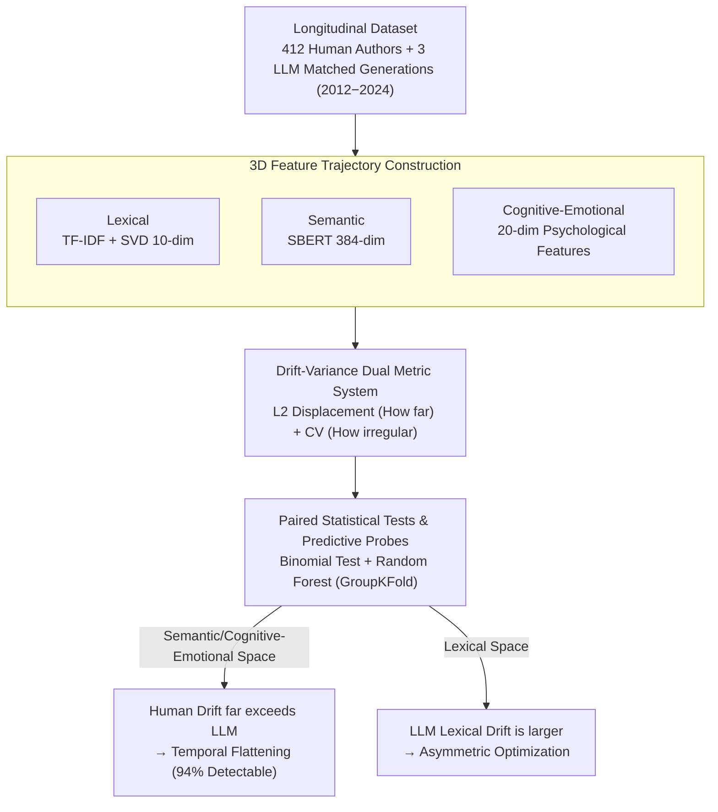

# Temporal Flattening in LLM-Generated Text: Comparing Human and LLM Writing Trajectories

**Conference**: ACL 2026 Findings  
**arXiv**: [2604.12097](https://arxiv.org/abs/2604.12097)  
**Code**: [GitHub](https://github.com/yjkim717/Cognitive-Emotional-Trajectories)  
**Area**: AIGC Detection  
**Keywords**: Temporal Flattening, LLM-generated Text Detection, Longitudinal Writing Analysis, Cognitive-Emotional Features, Synthetic Data

## TL;DR

By constructing a longitudinal writing dataset spanning 12 years, this study discovers a "temporal flattening" phenomenon in LLM-generated text—while lexical diversity is high, temporal drift in semantic and cognitive-emotional dimensions is significantly lower than in humans. Human and LLM texts can be distinguished with 94% accuracy based solely on temporal variation patterns.

## Background & Motivation

**Background**: Large Language Models (LLMs) have been widely applied in content generation, dialogue systems, and synthetic training data production. The current deployment paradigm for LLMs is stateless—each generation is an independent response that does not retain historical memory.

**Limitations of Prior Work**: Human writing is inherently longitudinal; an author's style, cognitive state, and emotional expression naturally evolve over time. However, existing LLM generation paradigms assume that independently sampled documents can sufficiently approximate the distribution of human writing, a hypothesis that has never been systematically verified.

**Key Challenge**: LLMs perform excellently on static quality metrics (e.g., semantic retention, fluency) but may systematically lose the longitudinal structure inherent in human writing along the temporal dimension. This loss poses hidden risks for downstream applications requiring temporal consistency (e.g., synthetic training data, authorship attribution, mental health trajectory modeling).

**Goal**: To answer two core questions—(1) Can LLMs reproduce human temporal structures over long time spans? (2) If differences exist, which human writing temporal dynamics are systematically lost or flattened?

**Key Insight**: Drawing from psycholinguistics and computational stylistics, this study treats writing as a longitudinal process. It quantifies temporal structure in three representation spaces—lexical, semantic, and cognitive-emotional—using two complementary metrics: drift and variance.

**Core Idea**: LLM-generated text exhibits "temporal flattening"—showing high diversity in lexical space, but significantly lower temporal drift and fluctuations in semantic and cognitive-emotional spaces compared to humans. This disparity persists under both history-aware and history-unaware conditions.

## Method

### Overall Architecture

The study constructs a longitudinal dataset containing 412 human authors and 6,086 documents (2012–2024), covering academic abstracts, blogs, and news. For each human author, matching writing trajectories were generated using three LLMs: DeepSeek V1, GPT-4o mini, and Claude 3.5 Haiku, totaling 103,459 LLM documents. The temporal dynamic differences between humans and LLMs were quantified by calculating drift and variance across three representation spaces (lexical, semantic, and cognitive-emotional) and validated through statistical tests and classifiers.

### Key Designs

**1. 3D Feature Trajectory Construction: Capturing evolution over time from three complementary spaces.**

Relying on a single dimension cannot distinguish which layer "flattening" occurs in. Thus, the authors calculated three representations for each author per year: lexical (TF-IDF reduced to 10 dimensions via SVD) to capture surface-level word usage changes; semantic (SBERT 384-dimensional embeddings) to capture deep meaning shifts; and cognitive-emotional (20 interpretable psychological features including Big Five proxies, affect, readability, etc.) to capture psychological and stylistic evolution. Concatenating these feature vectors chronologically yields a temporal trajectory $\mathcal{T}(e) = (\mathbf{x}_1^{(e)}, \ldots, \mathbf{x}_T^{(e)})$. The complementarity of these spaces is a prerequisite for discovering the "asymmetric" phenomenon where LLMs are diverse in lexical space but flattened in others.

**2. Drift-Variance Dual Metric System: Respectively quantifying "how far" and "how irregularly" a trajectory moves.**

Temporal dynamics have two complementary aspects. Drift measures the total displacement using the L2 distance between adjacent annual feature vectors: $\text{drift}_t^{(e)} = \|\mathbf{x}_{t+1}^{(e)} - \mathbf{x}_t^{(e)}\|_2$, reflecting how far the writing has "traveled" in the representation space. Variance quantifies the irregularity of inter-annual fluctuations using the coefficient of variation: $\mathrm{CV}(f) = \frac{\mathrm{std}(\Delta f_{1:T})}{\mathrm{mean}(\Delta f_{1:T})}$. Together, they fully characterize the human temporal structure with both directional drift and irregular fluctuations, both of which are suppressed in LLMs.

**3. Paired Statistical Tests & Predictive Probes: Elevating the observation of "humans evolve more" to a verifiable and predictable conclusion.**

To avoid confusion by individual differences, a binomial test was performed on each paired human-LLM author set to test whether the rate of human evolution exceeding LLM evolution was significantly higher than 50%. To further prove this difference is predictable, a Random Forest classifier was trained using only 20-dimensional cognitive-emotional CV features. GroupKFold (grouped by author_id) cross-validation was used to prevent data leakage. The results showed that humans and LLMs could be distinguished with 94% accuracy based solely on these temporal variation features, indicating that flattening is not only statistically significant but strong enough to serve as a detection signal.

### Loss & Training

This is an analytical study and does not involve model training. The classifier used 5-fold GroupKFold cross-validation (grouped by author_id) to ensure all trajectories of the same author did not appear in both training and test sets. Benjamini-Hochberg FDR correction ($q < 0.05$) was applied to multiple comparisons.

## Key Experimental Results

### Main Results

| Representation Space | Metric | Human Win Rate Range | p-value | Meaning |
| :--- | :--- | :--- | :--- | :--- |
| TF-IDF (Lexical) | Drift | 0.20-0.33 | p=1.0 | LLM lexical drift is larger |
| SBERT (Semantic) | Drift | 0.75-0.86 | p<0.0001 | Human semantic drift far exceeds LLMs |
| Cog-Emo (Cognitive-Emotional) | Drift | 0.76-0.99 | p<0.0001 | Human cog-emo drift is significantly higher |

### Ablation Study

| Configuration | Accuracy | AUC | F1 | Description |
| :--- | :--- | :--- | :--- | :--- |
| Pooled (IW) | 0.936 | 0.977 | 0.863 | Instance-wise condition |
| Pooled (Hist) | 0.933 | 0.977 | 0.856 | History-augmented condition |
| Balanced-Claude 3.5 (IW) | 0.97 | 1.00 | 0.97 | Claude is easiest to distinguish |
| Balanced-GPT-4o mini (IW) | 1.00 | 1.00 | 1.00 | GPT-4o mini is almost perfectly distinguishable |

### Key Findings

- LLMs exhibit "asymmetric optimization": high lexical diversity but low semantic and cognitive-emotional drift, indicating LLMs optimize surface-level changes but fail to replicate deep evolution.
- GPT-4o mini shows the most severe cognitive-emotional flattening: humans had larger Cog-Emo drift in 97% of author pairs, rising to 99% under the history condition.
- Temporal flattening persists in both instance-wise and history-augmented conditions, suggesting it is a systemic property of current deployment paradigms.
- The most discriminative features were average sentence length (18.7%), agreeableness (15.9%), and neuroticism (9.3%).

## Highlights & Insights

- Proposes the new concept of "Temporal Flattening," revealing a systemic flaw in LLM-generated text along the temporal dimension.
- Achieves 94% classification accuracy and 0.98 AUC using only 20-dimensional cognitive-emotional CV features, providing a new approach for AIGC detection.
- Open-sources a longitudinal dataset containing 412 authors to facilitate further research.
- Finds that history augmentation does not fix temporal flattening, implying the root cause lies in the model architecture or training paradigm itself.

## Limitations & Future Work

- The dataset primarily covers English writing; temporal flattening across other languages remains to be verified.
- Only three commercial LLMs were tested; whether open-source or fine-tuned models perform differently remains to be explored.
- The study focuses on discovering the phenomenon rather than proposing solutions; how to generate LLM text with authentic temporal structures remains an open problem.
- Cognitive-emotional features depend on the accuracy of tools like LIWC, and their generalizability across different domains requires further validation.

## Related Work & Insights

- **vs. Synthetic Data Quality (Chim et al.)**: While synthetic data research focuses on static quality, this work reveals systemic flaws in the temporal dimension.
- **vs. Model Collapse (Shumailov et al.)**: Model collapse focuses on distribution decay during iterative training; this work provides a complementary perspective from temporal consistency.
- **vs. Human-LLM Co-evolution (Geng & Trotta)**: Prior work primarily analyzed the lexical level; this work extends analysis to semantic and cognitive-emotional dimensions.

## Rating

- Novelty: ⭐⭐⭐⭐⭐ The "Temporal Flattening" concept is novel, and the longitudinal perspective on LLM text is a fresh angle.
- Experimental Thoroughness: ⭐⭐⭐⭐ Comprehensive design across three domains, three models, and two conditions with rigorous statistical testing.
- Writing Quality: ⭐⭐⭐⭐ Clearly structured and driven by key research questions.
- Value: ⭐⭐⭐⭐ Provides direct insights for AIGC detection, synthetic data generation, and longitudinal text modeling.

<!-- RELATED:START -->

## Related Papers

- [\[ACL 2025\] Comparing LLM-generated and human-authored news text using formal syntactic theory](../../ACL2025/aigc_detection/llm_vs_human_formal_syntax.md)
- [\[ACL 2026\] GigaCheck: Detecting LLM-generated Content via Object-Centric Span Localization](gigacheck_detecting_llm-generated_content_via_object-centric_span_localization.md)
- [\[ACL 2026\] ExaGPT: Example-Based Machine-Generated Text Detection for Human Interpretability](exagpt_example-based_machine-generated_text_detection_for_human_interpretability.md)
- [\[ACL 2026\] DetectRL-X: Towards Reliable Multilingual and Real-World LLM-Generated Text Detection](detectrl-x_towards_reliable_multilingual_and_real-world_llm-generated_text_detec.md)
- [\[ACL 2026\] Beyond the Final Actor: Modeling the Dual Roles of Creator and Editor for Fine-Grained LLM-Generated Text Detection](beyond_the_final_actor_modeling_the_dual_roles_of_creator_and_editor_for_fine-gr.md)

<!-- RELATED:END -->
