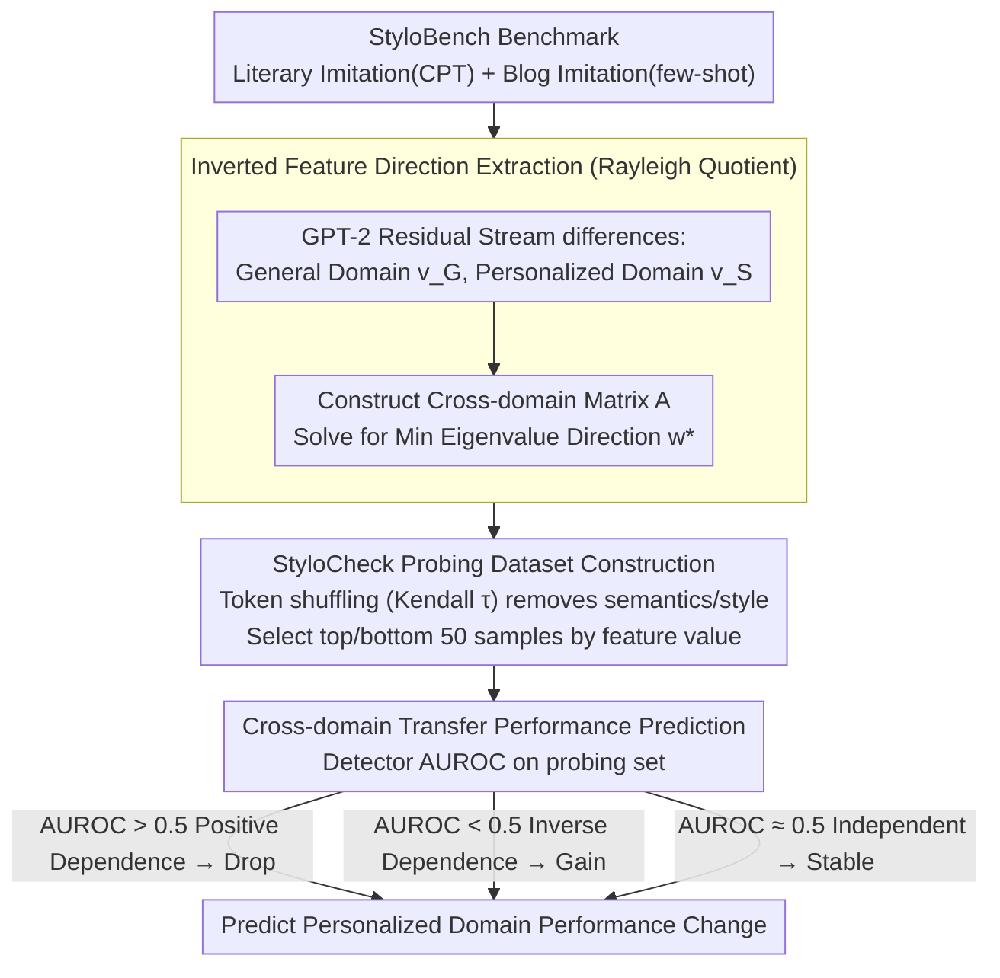

# When Personalization Tricks Detectors: The Feature-Inversion Trap in Machine-Generated Text Detection

**Conference**: ACL 2026 Oral  
**arXiv**: [2510.12476](https://arxiv.org/abs/2510.12476)  
**Code**: GitHub  
**Area**: AIGC Detection  
**Keywords**: Machine-Generated Text Detection, Personalized Text, Feature Inversion, Style Transfer, Robustness

## TL;DR

This work reveals the "Feature-Inversion Trap" of MGT detectors in personalized scenarios—where features distinguishing human-written text (HWT) and machine-generated text (MGT) in general domains invert in personalized domains, causing detector performance to collapse or even flip. The authors propose the StyloCheck framework to predict cross-domain performance changes by quantifying the detector's reliance on inverted features, achieving a prediction correlation of over 0.85.

## Background & Motivation

**Background**: Large Language Models (LLMs) are increasingly proficient at mimicking individual writing styles. Personalized text generation (e.g., style imitation, ghostwriting) has become a realistic threat. Existing MGT detection methods perform well in general scenarios (e.g., News, Wikipedia), with AUROC reaching 85%+.

**Limitations of Prior Work**: No systematic study has examined how MGT detectors perform in personalized scenarios. The authors constructed StyloBench, the first personalized MGT detection benchmark, and found that existing detectors experience sharp performance degradation or even inversion on personalized text. For example, Fast-DetectGPT drops from 98.78% AUROC in the general domain to 8.71% in personalized literary style imitation, a near-complete inversion.

**Key Challenge**: Discriminative features relied upon by detectors (e.g., text diversity—the assumption that HWT is more diverse than MGT) fail in personalized contexts. Personalized MGT may actually be more diverse or less coherent than the original HWT, causing feature directions to flip.

**Goal**: (1) Construct a personalized MGT detection benchmark; (2) Explain the mechanism of detector performance degradation; (3) Propose a diagnostic tool to predict the cross-domain transfer performance of detectors.

**Key Insight**: By training domain classifiers, the authors found that domain feature values for MGT are slightly lower than HWT in the general domain, but this relationship inverts in personalized domains. This suggests the existence of a feature direction that systematically inverts across domains.

**Core Idea**: Formalize the feature inversion problem as a Rayleigh Quotient optimization problem to extract the direction of maximum inversion, and build the diagnostic framework StyloCheck based on this.

## Method

### Overall Architecture

The method consists of three parts: (1) StyloBench benchmark construction—including two sub-scenarios: literary work imitation (via CPT-tuned LLMs) and blog style imitation (via few-shot prompting); (2) Theoretical analysis of the Feature-Inversion Trap—identifying the inverted feature direction via Rayleigh Quotient and verifying its correlation with detector performance; (3) StyloCheck diagnostic framework—generating a probing dataset through token shuffling to retain only inverted features and evaluating the detector's dependency on them. StyloBench serves as the data foundation, while the subsequent three steps (finding inversion direction → creating probing sets → predicting transfer) constitute the core contributions.

### Key Designs

**1. Inverted Feature Direction Extraction (Rayleigh Quotient Method): Converting intuitive observations of feature inversion into a solvable mathematical object.**

The authors aim to find the feature direction where the HWT/MGT difference inverts most sharply between general and personalized domains. Using the deep residual stream of GPT-2 as the text representation space, they calculate the difference vectors $v_G$ and $v_S$ (MGT minus HWT) for general and personalized domains, respectively. They then construct the cross-domain matrix $A = \sum_i \frac{1}{2}(v_G v_S^\top + v_S v_G^\top)$ and solve $\min_{\|\mathbf{w}\|=1} \mathbf{w}^\top A \mathbf{w}$. The eigenvector $\mathbf{w}^*$ corresponding to the minimum eigenvalue represents the direction of strongest inversion. Projecting text onto this direction shows MGT feature values are significantly higher than HWT in the general domain, but completely reversed in the personalized domain. The Rayleigh Quotient provides a closed-form solution and guarantees a global optimal inversion direction, upgrading empirical observation into a quantifiable structural quantity.

**2. StyloCheck Probing Dataset Construction: Creating samples that differ only in inverted features while stripping away all other information.**

To accurately measure a detector's dependence on inverted features, confounding factors like semantics, style, and category must be removed. The authors apply token shuffling of varying intensities (controlled by Kendall $\tau$) to the text. Shuffling destroys semantics and style while preserving inverted feature values. They then select the 50 variants with the highest feature values as positive samples and the 50 lowest as negative samples. Verification shows that domain and MGT classifiers perform near chance on this probing set, proving that confounders are successfully removed—leaving only the inverted features.

**3. Cross-domain Transfer Performance Prediction: Using a "physical exam report" to predict if a detector will fail in personalized domains.**

With a probing set containing only inverted features, the detector's AUROC on this set serves as a "dependency reading" for inverted features. This predicts performance changes when migrating from general to personalized domains: AUROC > 0.5 indicates positive dependence (performance will drop); AUROC < 0.5 indicates inverse dependence (performance may gain, explaining why the Entropy detector improves in personalized domains); AUROC ≈ 0.5 indicates independence (performance remains stable). Experiments show that StyloCheck's predictions have a Pearson correlation exceeding 0.7 with actual cross-domain performance gaps in 78% of settings. The practical value is that risks can be predicted using only shuffled token probing sets without collecting large target-domain datasets before deployment.

### Loss & Training

The core StyloCheck method is a diagnostic framework rather than a training method. The inverted feature direction is solved via eigenvalue decomposition and does not require training.

## Key Experimental Results

### Main Results (Detector Cross-domain Performance)

| Detector | M4 (General) Avg AUROC | Stylo-Blog Avg | Stylo-Literary Avg |
|--------|-------------------|---------------|-------------------|
| Fast-DetectGPT | 84.52 | 77.20 | 20.13 |
| Lastde | 91.72 | 70.78 | 66.04 |
| Lastde++ | 90.55 | 76.68 | 49.24 |
| Entropy | 34.90 | 44.56 | 76.18 |
| Log-Likelihood | 79.86 | 71.63 | 25.59 |

### Ablation Study (Reliability of StyloCheck Predictions)

| Number of Probing Datasets | Pearson r > 0.5 Proportion | Pearson r > 0.7 Proportion |
|--------------|---------------------|---------------------|
| 5 | 90% | 78% |
| Increased Number | Higher | Higher |

### Key Findings
- Deeper personalization (CPT vs. few-shot) leads to more severe performance degradation—Stylo-Literary (CPT-trained) shows sharper drops than Stylo-Blog (few-shot).
- The Entropy detector is the only method that improves in personalized domains (AUROC rising from ~35% to ~76%) because its dependence direction on inverted features is opposite to other detectors.
- The inverted feature direction is highly consistent across datasets (mean cosine similarity 0.547), indicating a structural cross-domain phenomenon rather than a dataset-specific fluke.
- Inverted features correlate with "text diversity"—personalized MGT breaks the traditional assumption that "HWT is more diverse than MGT."

## Highlights & Insights

- **Translating practical problems into elegant mathematical forms**: The feature inversion phenomenon is precisely formulated as a Rayleigh Quotient problem with a closed-form solution. This path from phenomenon to theory is exemplary.
- **Practical value of the StyloCheck "diagnostic" approach**: By using shuffled token probing sets instead of massive target-domain data, cross-domain performance can be predicted with extremely low deployment costs.
- **Counter-intuitive discovery**: Personalized MGT is more "diverse" than the original HWT, overturning the fundamental assumption in MGT detection that machine text is more monotonous.

## Limitations & Future Work

- Focused solely on English; stylistic feature distributions may vary across languages.
- StyloBench includes only 7 authors and 4 blog generators, which is relatively small in scale.
- StyloCheck only predicts changes based on inverted features and may not capture degradation caused by other factors.
- No fundamental mitigation was proposed—how to train detectors that do not rely on inverted features remains an open question.

## Related Work & Insights

- **vs. RAID / M4**: These focus on general domain MGT detection without considering personalization; StyloBench fills this gap and reveals structural weaknesses in general detectors.
- **vs. Fast-DetectGPT**: One of the strongest general domain detectors, yet its AUROC drops to 8.71% in personalized literary imitation, proving that high general performance does not guarantee robustness.
- **vs. Training-based detectors**: Performance can be recovered after in-domain fine-tuning, but cross-domain generalization remains limited.

## Rating

- Novelty: ⭐⭐⭐⭐⭐ First to reveal the Feature-Inversion Trap with mathematical characterization and the novel StyloCheck framework.
- Experimental Thoroughness: ⭐⭐⭐⭐ Included 7 detectors, 11 generators, and multi-domain testing, though dataset scale could be larger.
- Writing Quality: ⭐⭐⭐⭐ Clear logic from phenomenon to theory to application, though notation-heavy sections require careful reading.
- Value: ⭐⭐⭐⭐⭐ Significant cautionary implications for the MGT detection field; StyloCheck has direct practical utility.

<!-- RELATED:START -->

## Related Papers

- [\[ACL 2026\] MASH: Evading Black-Box AI-Generated Text Detectors via Style Humanization](mash_evading_black-box_ai-generated_text_detectors_via_style_humanization.md)
- [\[ACL 2026\] ExaGPT: Example-Based Machine-Generated Text Detection for Human Interpretability](exagpt_example-based_machine-generated_text_detection_for_human_interpretability.md)
- [\[ICML 2026\] Feature-Augmented Transformers for Robust AI-Text Detection Across Domains and Generators](../../ICML2026/aigc_detection/feature-augmented_transformers_for_robust_ai-text_detection_across_domains_and_g.md)
- [\[ACL 2025\] Iron Sharpens Iron: Defending Against Attacks in Machine-Generated Text Detection with Adversarial Training](../../ACL2025/aigc_detection/greater_adversarial_mgt_detection.md)
- [\[NeurIPS 2025\] DuoLens: A Framework for Robust Detection of Machine-Generated Multilingual Text and Code](../../NeurIPS2025/aigc_detection/duolens_a_framework_for_robust_detection_of_machine-generated_multilingual_text_.md)

<!-- RELATED:END -->
