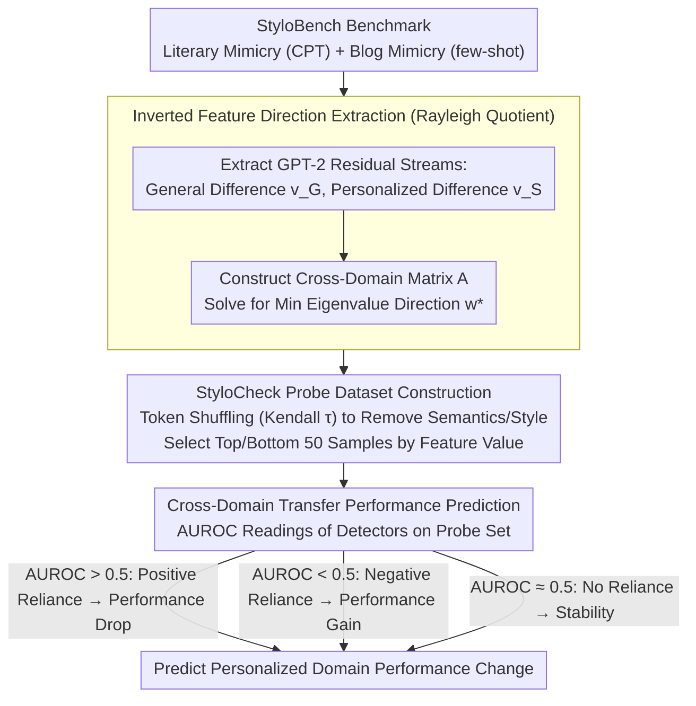

# When Personalization Tricks Detectors: The Feature-Inversion Trap in Machine-Generated Text Detection

**Conference**: ACL 2026 Oral  
**arXiv**: [2510.12476](https://arxiv.org/abs/2510.12476)  
**Code**: GitHub  
**Area**: AIGC Detection  
**Keywords**: Machine-Generated Text Detection, Personalized Text, Feature Inversion, Style Transfer, Robustness

## TL;DR

This paper reveals the "feature-inversion trap" of MGT detectors in personalized scenarios—features that distinguish human-written text (HWT) from machine-generated text (MGT) in general domains undergo inversion in personalized domains, causing detector performance to crash or even flip. The authors propose the StyloCheck framework to predict cross-domain performance changes by quantifying detector reliance on inverted features, achieving a prediction correlation of over 0.85.

## Background & Motivation

**Background**: Large Language Models (LLMs) are increasingly proficient at mimicking individual writing styles, making personalized text generation (e.g., style mimicry, ghostwriting) a realistic threat. Existing MGT detection methods perform well in general scenarios (e.g., News, Wikipedia), achieving AUROC scores of 85%+.

**Limitations of Prior Work**: No systematic study has examined MGT detector performance in personalized scenarios. The authors constructed StyloBench, the first personalized MGT detection benchmark, and discovered that the performance of existing detectors drops sharply on personalized text, sometimes even reversing. For instance, Fast-DetectGPT achieves 98.78% AUROC in general domains but drops to 8.71% on personalized literary style mimicry, indicating a near-total inversion.

**Key Challenge**: The discriminative features relied upon by detectors (such as text diversity—under the assumption that human writing is more diverse than machine writing) fail in personalized scenarios. Personalized MGT may actually be more diverse and less coherent than the original human-written text, causing the feature direction to flip.

**Goal**: (1) Construct a personalized MGT detection benchmark; (2) explain the mechanism behind detector performance degradation; (3) propose a diagnostic tool to predict cross-domain transfer performance.

**Key Insight**: By training domain classifiers, the authors found that domain feature values for MGT are slightly lower than for HWT in general domains, but this relationship reverses in personalized domains—suggesting a systematic inversion of a feature direction across domains.

**Core Idea**: The feature inversion problem is formalized as a Rayleigh quotient optimization problem to extract the direction of maximum inversion, serving as the basis for the StyloCheck diagnostic framework.

## Method

### Overall Architecture

The method consists of three parts: (1) StyloBench benchmark construction—including two sub-scenarios: literary work mimicry (via CPT fine-tuning of LLMs) and blog style mimicry (via few-shot prompting); (2) theoretical analysis of the feature-inversion trap—using the Rayleigh quotient to identify inverted feature directions and verifying their correlation with detector performance; (3) StyloCheck diagnostic framework—generating a probe dataset through token shuffling that preserves only the inverted features to evaluate detector reliance on them. While StyloBench provides the data foundation, the core contributions are the subsequent steps (finding inversion direction → creating probe sets → predicting transfer).

### Key Designs

**1. Inverted Feature Direction Extraction (Rayleigh Quotient Method): Converting intuitive observations of "feature inversion" into a solvable mathematical object.**

The authors aim to find the feature direction where the HWT/MGT difference reverses most drastically between general and personalized domains. Using the deep residual streams of GPT-2 as the representation space, they calculate difference vectors $v_G$ and $v_S$ (MGT minus HWT) for the general and personalized domains, respectively. They then construct the cross-domain matrix $A = \sum_i \frac{1}{2}(v_G v_S^\top + v_S v_G^\top)$ and solve $\min_{\|\mathbf{w}\|=1} \mathbf{w}^\top A \mathbf{w}$. The eigenvector $\mathbf{w}^*$ corresponding to the minimum eigenvalue represents the direction of strongest inversion. Projecting text onto this direction shows that while MGT feature values are significantly higher than HWT in the general domain, the relationship is completely flipped in the personalized domain. The Rayleigh quotient provides a closed-form solution and ensures a globally optimal inversion direction, upgrading an intuitive observation into a quantifiable structural quantity.

**2. StyloCheck Probe Dataset Construction: Creating samples that differ only in inverted features while stripping away all other information.**

To accurately measure how much a detector relies on inverted features, semantics, style, and label confounders must be removed. The authors perform token shuffling of varying intensities (controlled by Kendall $\tau$) on the text. Shuffling destroys semantic and stylistic information but preserves inverted feature values. From these shuffled variants, they select 50 samples with the highest feature values as positive samples and 50 with the lowest as negative samples. Validation show that both domain and MGT classifiers perform near chance on this probe set, proving that confounders are removed—leaving only the inverted features themselves to be distinguished.

**3. Cross-Domain Transfer Performance Prediction: Using a "check-up report" to anticipate detector failure in personalized domains.**

With the inverted-feature-only probe set, the AUROC of a detector on this set serves as a "reliance reading" for inverted features. This predicts performance changes when migrating from general to personalized domains: AUROC > 0.5 indicates positive reliance (performance will drop); AUROC < 0.5 indicates negative reliance (performance might actually increase, which explains why the Entropy detector improves in personalized domains); and AUROC ≈ 0.5 indicates no reliance (stable performance). In experiments, the Pearson correlation between StyloCheck predictions and actual cross-domain performance gaps exceeded 0.7 in 78% of settings. The practical value is that risk can be assessed using only shuffled probe sets without requiring large-scale target domain data collection.

### Loss & Training

StyloCheck is a diagnostic framework rather than a training method. The inverted feature direction is solved via eigenvalue decomposition and does not require training.

## Key Experimental Results

### Main Results (Cross-Domain Detector Performance)

| Detector | M4 (General) Avg AUROC | Stylo-Blog Avg | Stylo-Literary Avg |
|--------|-------------------|---------------|-------------------|
| Fast-DetectGPT | 84.52 | 77.20 | 20.13 |
| Lastde | 91.72 | 70.78 | 66.04 |
| Lastde++ | 90.55 | 76.68 | 49.24 |
| Entropy | 34.90 | 44.56 | 76.18 |
| Log-Likelihood | 79.86 | 71.63 | 25.59 |

### Ablation Study (Reliability of StyloCheck Predictions)

| Number of Probe Datasets | Percentage with Pearson r > 0.5 | Percentage with Pearson r > 0.7 |
|--------------|---------------------|---------------------|
| 5 | 90% | 78% |
| Increased Number | Higher | Higher |

### Key Findings
- Deeper personalization (CPT vs. few-shot) leads to more severe performance degradation—Stylo-Literary (CPT) shows sharper drops than Stylo-Blog (few-shot).
- The Entropy detector is the only method that improves in personalized domains (AUROC rising from ~35% to ~76%) because its reliance on inverted features is opposite to that of other detectors.
- The inverted feature direction is highly consistent across different datasets (mean cosine similarity of 0.547), indicating a cross-domain structural phenomenon rather than an artifact of specific datasets.
- Inverted features correlate with "text diversity"—personalized MGT breaks the traditional assumption that "HWT is more diverse than MGT."

## Highlights & Insights

- **Transforming practical problems into elegant math**: The feature inversion phenomenon is precisely formulated as a Rayleigh quotient problem with a closed-form solution and high interpretability.
- **The "check-up" approach of StyloCheck is highly practical**: It predicts detector performance in target domains using only shuffled probe sets, significantly reducing the cost of cross-domain risk assessment.
- **Counter-intuitive discovery**: Personalized MGT is more "diverse" than the original HWT, overturning the fundamental assumption in MGT detection that machine text is more monotonous.

## Limitations & Future Work

- Restricted to English; stylistic feature distributions may vary across different languages.
- StyloBench includes only 7 authors and 4 blog generators, representing a limited scale.
- StyloCheck only predicts changes based on inverted features; it cannot capture degradation caused by other factors.
- No fundamental mitigation is proposed—how to train detectors that do not rely on inverted features remains an open question.

## Related Work & Insights

- **vs. General Benchmarks (RAID, M4)**: These benchmarks focus on general domain MGT detection and neglect personalized scenarios. StyloBench fills this gap and reveals structural weaknesses in general detectors.
- **vs. Fast-DetectGPT**: One of the strongest detectors in general domains, yet its AUROC drops to 8.71% in personalized literary mimicry, showing that high general performance does not guarantee robustness.
- **vs. Training-based Detectors**: While in-domain fine-tuning can restore performance, cross-domain generalization remains limited.

## Rating

- Novelty: ⭐⭐⭐⭐⭐ First to reveal the feature-inversion trap with mathematical characterization; the StyloCheck framework is highly original.
- Experimental Thoroughness: ⭐⭐⭐⭐ Tested 7 detectors and 11 generators across multiple domains, though dataset scale could be larger.
- Writing Quality: ⭐⭐⭐⭐ Clear logic from phenomenon to theory to application, though heavy notation requires careful reading.
- Value: ⭐⭐⭐⭐⭐ Highly significant for the MGT detection field; StyloCheck has immediate practical utility.

<!-- RELATED:START -->

## Related Papers

- [\[ACL 2026\] ExaGPT: Example-Based Machine-Generated Text Detection for Human Interpretability](exagpt_example-based_machine-generated_text_detection_for_human_interpretability.md)
- [\[ACL 2026\] MASH: Evading Black-Box AI-Generated Text Detectors via Style Humanization](mash_evading_black-box_ai-generated_text_detectors_via_style_humanization.md)
- [\[ICML 2026\] Feature-Augmented Transformers for Robust AI-Text Detection Across Domains and Generators](../../ICML2026/aigc_detection/feature-augmented_transformers_for_robust_ai-text_detection_across_domains_and_g.md)
- [\[ACL 2025\] Iron Sharpens Iron: Defending Against Attacks in Machine-Generated Text Detection with Adversarial Training](../../ACL2025/aigc_detection/greater_adversarial_mgt_detection.md)
- [\[NeurIPS 2025\] DuoLens: A Framework for Robust Detection of Machine-Generated Multilingual Text and Code](../../NeurIPS2025/aigc_detection/duolens_a_framework_for_robust_detection_of_machine-generated_multilingual_text_.md)

<!-- RELATED:END -->
