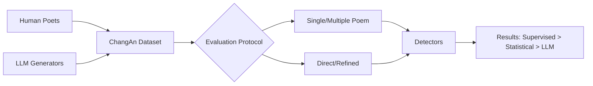

# Who Wrote This Line? Evaluating the Detection of LLM-Generated Classical Chinese Poetry

**Conference**: ACL 2026  
**arXiv**: [2604.10101](https://arxiv.org/abs/2604.10101)  
**Code**: [GitHub](https://github.com/VelikayaScarlet/ChangAn)  
**Area**: AIGC Detection  
**Keywords**: Classical Chinese Poetry Detection, AI-Generated Text, Chinese NLP, Benchmark, Literary Creation

## TL;DR

This paper constructs ChangAn (containing 30,664 poems), the first detection benchmark for LLM-generated classical Chinese poetry. It systematically evaluates 12 AI detection methods across various text granularities and generation strategies, revealing the severe limitations of current Chinese text detectors in the classical poetry domain.

## Background & Motivation

**Background**: Large Language Models' capabilities in text generation have expanded to literary creation, including classical Chinese poetry. AI-generated poetry has sparked widespread controversy regarding creative authenticity and ethics on various poetry journals and platforms, with several journals publicly condemning unlabeled AI submissions.

**Limitations of Prior Work**: Existing research on AI-generated text detection primarily focuses on modern languages and contemporary styles, largely neglecting the specialized field of classical Chinese poetry. General detection methods face three challenges in this domain: (1) Classical poetry follows strict metrical rules (tonality, rhythm, antithesis), making it difficult for detectors to determine if these patterns result from humans following tradition or AI mimicking learned patterns; (2) Classical poetry shares an extensive imagery system, leading to significant overlap in lexical distribution between humans and AI; (3) Classical poetry features flexible part-of-speech usage and inverted syntax that deviates from modern Chinese grammar, further increasing detection difficulty.

**Key Challenge**: The highly formalized constraints of classical poetry make AI-generated content highly similar to human creations in surface features. Traditional detection methods based on statistical characteristics or language model perplexity struggle to distinguish them effectively.

**Goal**: Construct the first detection benchmark specifically for LLM-generated classical Chinese poetry and systematically evaluate the capability boundaries of existing detection methods to provide a data and experimental foundation for research in this field.

**Key Insight**: Systematically evaluate detection methods from two dimensions: text granularity (single poem vs. multiple poems) and generation strategy (direct generation vs. refinement), while exploring the dual role of LLMs as both generators and zero-shot detectors.

**Core Idea**: The strict formal constraints of classical poetry effectively mask the statistical traces of AI generation, rendering existing detectors nearly ineffective and necessitating specialized detection benchmarks and methods.

## Method

### Overall Architecture

This paper does not propose a new detector but builds a "dataset + evaluation protocol" to interrogate the true capabilities of existing detection methods on classical poetry. The ChangAn dataset is constructed, containing 10,276 classical poems created by modern humans and 20,388 poems generated by four mainstream LLMs (DeepSeek-V3.2, GPT-4.1, Kimi-K2, Doubao Seed-1.6). Samples are organized by two text granularities (single/multiple) and two generation strategies (direct/refined). The experiment measures comparable AUROC/Macro-F1 across 12 detectors categorized into decision-based and probability-based types.

### Key Designs

**1. Dataset Construction Strategy: Using Modern Poets' Works to Prevent Data Leakage**

A major pitfall in classical poetry detection is evaluation contamination—famous classical masterpieces are already part of LLM pre-training corpora. To avoid detectors merely "recognizing" memorized texts, the human side only includes new works by modern poets following classical metrics, sourced from social platforms and professional literary publications. The LLM side uses two prompts: direct generation and a refined generation simulating human "polishing," locking the detection task onto true differences in style and structure.

**2. Multi-granularity Evaluation Design: Compensating for Information Scarcity via Aggregation**

A classical poem often consists of only dozens of characters, providing sparse statistical features. Therefore, the protocol sets both single and Multiple Poem Detection (MPD, in groups of 6 and 12). MPD corresponds to poetry collection publication scenarios, investigating whether discriminative signals accumulate when aggregating multiple poems from the same source. The choice of 6 poems follows the Chinese tradition of six-poem sets (e.g., "Three Officials and Three Partings").

**3. Exploration of LLM Self-Detection: Testing for "Identity Signals" via Cross-Detection Matrices**

The authors test the hypothesis that models are best at identifying their own generation traces. Each LLM acts as both generator and detector to construct a cross-detection matrix. Results falsify this hypothesis—most models show no self-detection advantage in classical poetry. For example, Doubao Seed-1.6 achieves a recall of only 16.09% on its own poems, suggesting that strict formal constraints smooth out exploitable "identity signals."

### Loss & Training

The supervised detector RoBERTa is fine-tuned on Chinese RoBERTa for 3 epochs with a learning rate of $1e-4$ and a batch size of 16. The dataset is split 8:1:1 for training/validation/testing. All experiments were run 3 times on 2 A100 GPUs and averaged to reduce randomness.

## Key Experimental Results

### Main Results

| Detection Method | Type | AUROC | Macro-F1 | Description |
|---------|------|-------|----------|------|
| RoBERTa (Fine-tuned) | Supervised | 95.03 | 86.18 | Best Detector |
| Log-Rank | Stat-Prob | 85.86 | 75.56 | Best Unsupervised Method |
| Log-Likelihood | Stat-Prob | 83.94 | 73.77 | Stable Performance |
| Fast-DetectGPT | Stat-Prob | 49.67 | 49.35 | Completely Ineffective |
| DeepSeek-V3.2 | Decision | - | 39.42 | Best LLM Predictor |
| GPT-4.1 | Decision | - | 23.31 | Worst LLM Predictor |

### Ablation Study

| Configuration | AUROC | Macro-F1 | Description |
|------|-------|----------|------|
| Kimi-K2 Generation | 74.13 | 67.48 | Hardest Model to Detect |
| Doubao Seed-1.6 Generation | 76.34 | 68.89 | Medium Detection Difficulty |
| DeepSeek-V3.2 Generation | 77.17 | 69.59 | Easier to Detect |
| GPT-4.1 Generation | 76.34 | 69.41 | Easier to Detect |

### Key Findings

- Fast-DetectGPT fails completely (AUROC 49.67%), as its negative curvature hypothesis does not hold under the highly constrained language structure of classical poetry.
- Chinese LLMs (DeepSeek, Kimi, Doubao) generally outperform GPT-4.1 as decision-based detectors, likely due to better classical literature coverage in training.
- LLMs possess almost no self-recognition capability in classical poetry; formal constraints effectively mask generation traces.
- Fine-tuned RoBERTa performs best across all sources (AUROC 93.61-97.95%), proving supervised learning can capture shared machine features.

## Highlights & Insights

- First benchmark dataset for AI detection of classical Chinese poetry, addressing an important research gap.
- Analysis of how linguistic features (metrics, imagery, syntax) cause general detection methods to fail.
- Discovered that statistical trace densities are similar across different LLMs for classical poetry, implying that formal constraints impose similar generation patterns.
- The refinement strategy design effectively simulates the human creative "polishing" process.

## Limitations & Future Work

- Dataset only covers Ci, Jueju, and Lushi genres, excluding forms like Chu Ci and Fu.
- Detection evaluation relies on existing public methods rather than novel specialized architectures.
- Human poetry quality from web platforms varies, which may affect the detection baseline.
- Lack of granular analysis on which specific poetic styles are hardest to detect.

## Related Work & Insights

- **vs. English Poetry Detection (Chen et al.)**: English poetry has weaker constraints; classical Chinese poetry's strong constraints create unique challenges.
- **vs. Modern Chinese Poetry Detection (Wang et al.)**: Modern poetry is free-form with obvious linguistic differences; classical poetry is significantly harder to detect.
- **vs. Haiku Detection (Hitsuwari et al.)**: Both involve high constraints, but classical Chinese imagery systems are more complex.

## Rating

- Novelty: ⭐⭐⭐⭐ First classical Chinese poetry AI detection benchmark with realistic significance.
- Experimental Thoroughness: ⭐⭐⭐⭐ Comprehensive evaluation across 12 methods and 4 LLMs.
- Writing Quality: ⭐⭐⭐⭐ Solid structure and deep linguistic analysis.
- Value: ⭐⭐⭐⭐ Essential foundation for the emerging field of literary AI detection.

<!-- RELATED:START -->

<!-- RELATED:END -->

- **Mechanism**: Data de-contamination and cross-model comparison under structured linguistic constraints.
- **Ours**: ChangAn Benchmark.
- **Prev. SOTA**: General-purpose AI text detectors.
- **Gain**: Identified domain-specific failure modes and established a high-accuracy supervised baseline.

## Related Papers

- [\[ACL 2026\] C-ReD: A Comprehensive Chinese Benchmark for AI-Generated Text Detection Derived from Real-World Prompts](c-red_a_comprehensive_chinese_benchmark_for_ai-generated_text_detection_derived_.md)
- [\[ACL 2026\] AEGIS: A Holistic Benchmark for Evaluating Forensic Analysis of AI-Generated Academic Images](aegis_a_holistic_benchmark_for_evaluating_forensic_analysis_of_ai-generated_acad.md)
- [\[ACL 2026\] From Scoring to Explanations: Evaluating SHAP and LLM Rationales for Rubric-based Teaching Quality Assessment](from_scoring_to_explanations_evaluating_shap_and_llm_rationales_for_rubric-based.md)
- [\[NeurIPS 2025\] Classical Planning with LLM-Generated Heuristics: Challenging the State of the Art with Python Code](../../NeurIPS2025/aigc_detection/classical_planning_with_llm-generated_heuristics_challenging_the_state_of_the_ar.md)
- [\[ACL 2026\] Beyond the Final Actor: Modeling the Dual Roles of Creator and Editor for Fine-Grained LLM-Generated Text Detection](beyond_the_final_actor_modeling_the_dual_roles_of_creator_and_editor_for_fine-gr.md)

<!-- RELATED:END -->
