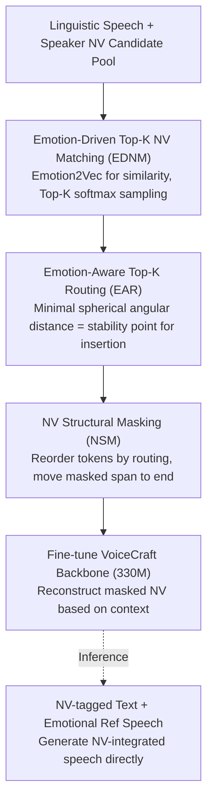

# Affectron: Emotional Speech Synthesis with Affective and Contextually Aligned Nonverbal Vocalizations

**Conference**: ACL 2026 Findings  
**arXiv**: [2603.14432](https://arxiv.org/abs/2603.14432)  
**Code**: [https://github.com/choddeok/Affectron](https://github.com/choddeok/Affectron)  
**Area**: Audio & Speech / Speech Synthesis  
**Keywords**: Non-verbal Vocalizations, Emotional Speech Synthesis, NV-Augmented Training, Emotion Routing, Neural Codec Language Model

## TL;DR
This paper proposes the Affectron framework. Through two training-time augmentation strategies—Emotion-Driven Top-K NV Matching and Emotion-Aware Top-K Routing—it achieves diverse and emotionally aligned synthesis of non-verbal vocalizations (e.g., laughter, sighs) using small-scale open-source decoupled corpora, significantly outperforming the VoiceCraft baseline based on pure linguistic pre-training.

## Background & Motivation

**Background**: Non-verbal vocalizations (NVs), such as laughter, sighs, and cries, are crucial means of expressing emotion in emotional speech synthesis. Existing expressive TTS systems primarily rely on two types of methods: label-controlled TTS (manually inserting NV labels to control type and position) and spontaneous-style TTS (implicitly predicting NV from contextual cues).

**Limitations of Prior Work**: Label-controlled methods depend on alignment annotations or NV detection models; biases in detection models and error propagation lead to temporal inconsistencies in NV positions. Spontaneous-style methods are limited by the irreproducibility of proprietary datasets. Publicly available NV corpora are generally biased toward basic types (e.g., breaths and laughter) and contain acoustic artifacts, failing to model fine-grained NV variants (e.g., the difference between a chuckle, giggle, and snicker).

**Key Challenge**: The fundamental bottleneck is the lack of large-scale, diverse, high-quality public NV corpora. Although existing Neural Codec Language Models (NCLMs) can generate natural speech on low-quality corpora, they are primarily designed for voice cloning and lack the ability to control prosodic variations of fine-grained NVs.

**Goal**: To achieve emotion-consistent and contextually aligned diverse NV generation using small-scale open-source decoupled corpora (where linguistic speech and NVs are recorded separately).

**Key Insight**: The authors observe that emotional attributes typically change gradually rather than abruptly between adjacent segments; the emotional angular distance between segments with short time intervals is small. Therefore, positions with minimal emotional change can serve as natural anchors for NV insertion.

**Core Idea**: Design a training-time NV augmentation strategy. Appropriate NV types are selected via emotion embedding matching, and suitable insertion positions are determined via emotional angular distance routing. The pre-trained VoiceCraft model is then fine-tuned using these augmented samples.

## Method

### Overall Architecture

The fundamental dilemma Affectron addresses is the scarcity of public NV corpora and the fact that linguistic speech and NVs are recorded separately, meaning no "full sentences including NVs" are available for learning. The approach is to "assemble" missing training samples during training—using VoiceCraft (330M parameters) pre-trained on pure linguistic speech as the backbone. On the input side, linguistic speech first undergoes emotion matching to select suitable NVs, then emotion routing to determine insertion positions, forming augmented samples with NVs. Structural masking is then used to let the backbone learn to generate NVs based on the surrounding emotional context. During inference, output is generated directly from NV-tagged text and emotional reference speech; the matching and routing augmentation mechanisms are not involved in inference.

### Key Designs

**1. Emotion-Driven Top-K NV Matching (EDNM): Solving the emotional mismatch between random NV and speech**

To pair an NV with linguistic speech, the simplest way is random sampling, but laughter paired with a sad sentence destroys emotional consistency. EDNM selects by emotion: given linguistic speech $u$ and speaker $s$, it retrieves all NV candidates for that speaker, calculates the cosine similarity of emotion embeddings using Emotion2Vec, takes the Top-K (set to 10), and normalizes them into a probability distribution via temperature-scaled softmax ($\tau=0.7$) to sample up to 2 NVs. The key is that it does not take a deterministic result but samples from the Top-K—ensuring the selected NV aligns with the emotional state while maintaining diversity of NV types through sampling.

**2. Emotion-Aware Top-K Routing (EAR): Solving where to insert NV without breaking emotional coherence**

Once an NV is selected, its position within the sentence must be decided. This paper’s core observation is that emotional attributes change gradually across segments, so "emotional stability points" with minimal change are natural anchors. EAR uses Montreal Forced Aligner to segment speech into words, uses an emotional attribute predictor to generate pseudo-labels, and maps these to spherical coordinates. For each NV, it calculates the emotional angular distance $\Delta$ (based on spherical arc cosine distance) to all possible positions, selects Top-K minimal distances, and samples the insertion point. Using spherical coordinates rather than Euclidean distance captures the directional shifts of emotional attributes better than linear distance.

**3. NV Structural Masking (NSM): Enabling the model to see bidirectional emotional context rather than just history**

Standard autoregression depends only on leftward history. However, the naturalness of a sigh depends on the emotional buildup before and after it—a bidirectional condition. NSM extends VoiceCraft’s causal masking: the NV codec token sequences are reordered according to the routing. An NV segment and its neighboring linguistic tokens are randomly selected as a masked span and moved to the end of the sequence, followed by efficient multi-codebook autoregressive modeling with delayed stacking. This allows the model to utilize context from both sides when "filling in" the masked NV.

### Loss & Training

The framework uses the AdamW optimizer with a learning rate of $1\times10^{-5}$ and a batch size of 100 (via gradient accumulation). Training involves 50,000 steps and takes approximately 5 days on 4 NVIDIA RTX A6000 GPUs. Training data is sourced from the EARS dataset (~100 hours of clean speech + 4 hours of NV, 107 speakers).

## Key Experimental Results

### Main Results (Seen Speakers)

| Method | NV-Acc↑ | NV-Sim↑ | NV-EECS↑ | NV-SECS↑ | WER↓ | V-EECS↑ |
|:---|:---:|:---:|:---:|:---:|:---:|:---:|
| VoiceCraft (Baseline) | 10.49 | 0.5898 | 0.6149 | 0.8950 | 9.05 | 0.6212 |
| Affectron (Full) | 37.75 | 0.6118 | 0.5748 | 0.8906 | 6.59 | 0.6216 |

### Ablation Study

| Configuration | NV-Acc↑ | NV-EECS↑ | Description |
|:---|:---:|:---:|:---|
| w/ DA only | 58.78 | 0.5455 | Augmentation only; high Acc but poor alignment |
| w/ DA + EDNM | 35.83 | 0.5648 | EECS improves with emotion matching |
| w/ DA + EDNM + EAR | 32.93 | 0.5707 | EECS further improves with routing |
| Full (+ NSM) | 37.75 | 0.5748 | Best NV quality with bidirectional context |

### Key Findings
- Affectron's NV type distribution alignment far exceeds all LLM baselines (JSD of 0.0051 vs. 0.1130 for the best LLM).
- Removing EDNM increases NV-Acc (random matching increases diversity) but significantly decreases EECS, confirming the importance of emotional alignment.
- NSM's use of bidirectional context is more suitable for NV generation than standard causal masking.
- The same trends are observed on unseen speakers, verifying zero-shot generalization.

## Highlights & Insights
- **Train-time augmentation, zero inference cost**: Matching and routing modules are used only during training. During inference, the model generates directly from annotated text, incurring no extra overhead. This pattern of "train-time augmentation $\rightarrow$ inference-time simplification" is highly effective.
- **Modeling emotional dynamics in spherical coordinates**: Mapping multi-dimensional emotional attributes to a sphere and measuring change via angular distance captures directional emotional shifts better than Euclidean distance.
- **330M small model beats 7B-20B LLMs**: The specialized small model significantly outperforms general large models in NV type prediction, showing that explicit domain-specific emotional modeling is more effective than pure text reasoning.

## Limitations & Future Work
- Validated only on the EARS dataset (~100 hours), which is limited in scale.
- Linguistic speech and NV are recorded separately, failing to model overlap in real-world scenarios.
- NV types cover only 15 categories, missing richer non-verbal expressions.
- Direct comparison with the latest large-scale NV-capable TTS systems like CosyVoice is missing.

## Related Work & Insights
- **vs. VoiceCraft**: The original model only supports voice cloning with extremely weak NV capabilities; Affectron empowers it through augmented training.
- **vs. Label-controlled TTS (ELaTE, EmoCtrl-TTS)**: These rely on error-prone detection models for labeling; Affectron's routing is calculated via emotional attributes.
- **vs. CosyVoice**: Requires large-scale high-quality annotated corpora, whereas Affectron works on small-scale open-source decoupled corpora.

## Rating
- Novelty: ⭐⭐⭐⭐ Emotion-driven matching and routing are novel augmentation strategies.
- Experimental Thoroughness: ⭐⭐⭐⭐ Detailed ablation studies and convincing LLM comparisons.
- Writing Quality: ⭐⭐⭐⭐ Logical flow from motivation to experimental results.
- Value: ⭐⭐⭐ Specific domain, but the augmentation strategy is generalizable.

## Related Papers

- [\[ICLR 2026\] TASTE: Text-Aligned Speech Tokenization and Embedding for Spoken Language Modeling](../../ICLR2026/audio_speech/taste_text-aligned_speech_tokenization_and_embedding_for_spoken_language_modelin.md)
- [\[ACL 2026\] ReStyle-TTS: Relative and Continuous Style Control for Zero-Shot Speech Synthesis](restyle-tts_relative_and_continuous_style_control_for_zero-shot_speech_synthesis.md)
- [\[ACL 2026\] LLM-MC-Affect: LLM-Based Monte Carlo Modeling of Affective Trajectories and Latent Ambiguity for Interpersonal Dynamic Insight](llm-mc-affect_llm-based_monte_carlo_modeling_of_affective_trajectories_and_laten.md)
- [\[ACL 2025\] Autoregressive Speech Synthesis without Vector Quantization](../../ACL2025/audio_speech/autoregressive_speech_synthesis_without_vq.md)
- [\[ICLR 2026\] Incentive-Aligned Multi-Source LLM Summaries](../../ICLR2026/audio_speech/incentive-aligned_multi-source_llm_summaries.md)

<!-- RELATED:END -->

<!-- RELATED:START -->

## Related Papers

- [\[ACL 2026\] UniVocal: Unified Speech-Singing Code-Mixed Synthesis](univocal_unified_speech-singing_code-switching_synthesis.md)
- [\[ACL 2026\] ReStyle-TTS: Relative and Continuous Style Control for Zero-Shot Speech Synthesis](restyle-tts_relative_and_continuous_style_control_for_zero-shot_speech_synthesis.md)
- [\[ACL 2026\] LLM-MC-Affect: LLM-Based Monte Carlo Modeling of Affective Trajectories and Latent Ambiguity for Interpersonal Dynamic Insight](llm-mc-affect_llm-based_monte_carlo_modeling_of_affective_trajectories_and_laten.md)
- [\[ICLR 2026\] TASTE: Text-Aligned Speech Tokenization and Embedding for Spoken Language Modeling](../../ICLR2026/audio_speech/taste_text-aligned_speech_tokenization_and_embedding_for_spoken_language_modelin.md)
- [\[ACL 2026\] UniSRM: A Unified Speech Reward Model for Fine-Grained Speech Evaluation](unisrm_a_unified_speech_reward_model_for_reasoning-based_fine-grained_assessment.md)

<!-- RELATED:END -->
