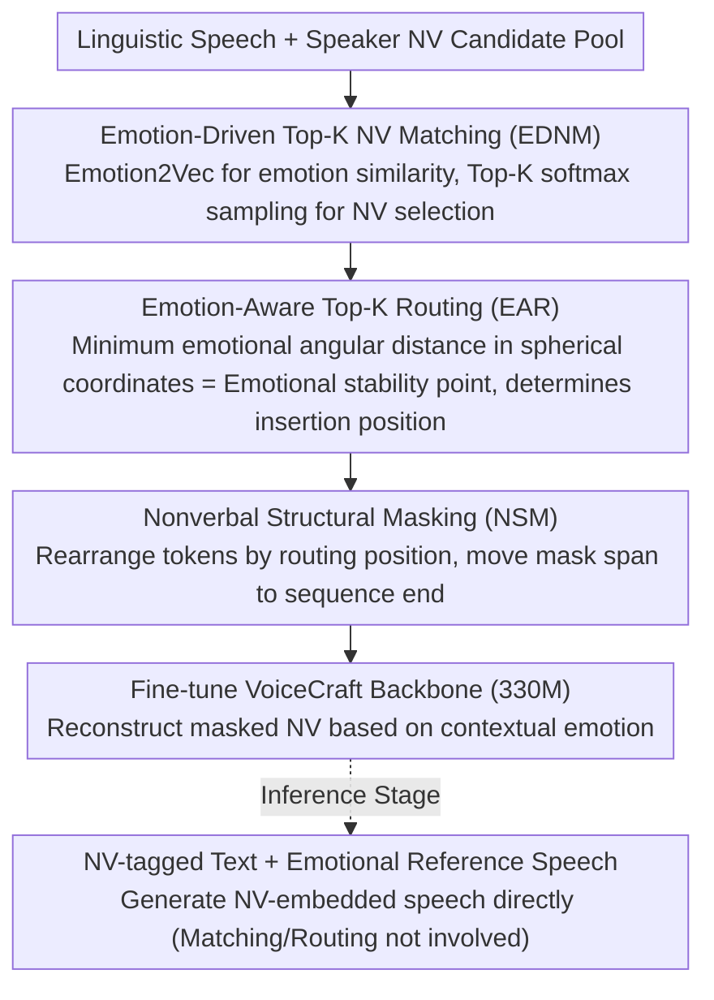

# Affectron: Emotional Speech Synthesis with Affective and Contextually Aligned Nonverbal Vocalizations

**Conference**: ACL 2026 Findings  
**arXiv**: [2603.14432](https://arxiv.org/abs/2603.14432)  
**Code**: [https://github.com/choddeok/Affectron](https://github.com/choddeok/Affectron)  
**Area**: Audio & Speech / Speech Synthesis  
**Keywords**: Nonverbal Vocalizations, Emotional Speech Synthesis, NV-Augmented Training, Emotion Routing, Neural Codec Language Model

## TL;DR
This paper proposes the Affectron framework, which implements two train-time augmentation strategies—Emotion-Driven Top-K NV Matching and Emotion-Aware Top-K Routing—on small-scale open-source decoupled corpora. It achieves diverse and emotionally aligned synthesis of nonverbal vocalizations (NVs, e.g., laughter, sighs), significantly surpassing the VoiceCraft baseline based on pure linguistic pre-training.

## Background & Motivation

**Background**: Nonverbal vocalizations (NVs), such as laughter, sighs, and crying, are key means of expressing emotion in emotional speech synthesis. Existing expressive TTS systems mainly rely on two types of methods: label-controlled TTS (manually inserting NV labels to control type and position) and spontaneous style TTS (implicitly predicting NVs from contextual cues).

**Limitations of Prior Work**: Label-controlled methods rely on alignment annotations or NV detection models; biases in detection models and error propagation lead to temporal inconsistency in NV positions. Spontaneous style methods are limited by the non-reproducibility of proprietary datasets. Publicly available NV corpora are generally biased toward basic types (e.g., breathing and laughter) and contain acoustic artifacts, failing to model fine-grained NV variants (e.g., the difference between a chuckle, giggle, and snicker).

**Key Challenge**: The lack of large-scale, diverse, and high-quality public NV corpora is the fundamental bottleneck. Although existing Neural Codec Language Models (NCLMs) can generate natural speech on low-quality corpora, they are primarily oriented toward voice cloning and lack control over the prosodic variations of fine-grained NVs.

**Goal**: To achieve emotionally consistent and contextually aligned diverse NV generation using small-scale open-source decoupled corpora (where linguistic speech and NVs are recorded separately).

**Key Insight**: The authors observe that emotional attributes usually transition gradually rather than abruptly between adjacent word segments; the emotional angular distance between segments with short time intervals is small. Therefore, positions with minimal emotional change can serve as natural anchors for NV insertion.

**Core Idea**: Design a train-time NV augmentation strategy. Use emotion embedding matching to select appropriate NV types and emotion angular distance routing to determine suitable insertion points. Then, fine-tune a pre-trained VoiceCraft model using these augmented samples.

## Method

### Overall Architecture

The fundamental dilemma Affectron addresses is the scarcity of public NV corpora and the fact that linguistic speech and NVs are recorded separately, meaning there are no "complete sentences containing NVs" available for learning. The approach is to "assemble" missing training samples during training. Using VoiceCraft (330M parameters) pre-trained on pure linguistic speech as the backbone, the linguistic speech at the input side first undergoes emotion matching to select a suitable NV, followed by emotion routing to decide the insertion position. After forming the NV-embedded augmented sample, a structural mask is used to teach the backbone to generate NVs based on preceding and succeeding emotional contexts. During inference, the output is generated directly from NV-tagged text and emotional reference speech; the matching and routing augmentation mechanisms are not involved in inference.

### Key Designs

**1. Emotion-Driven Top-K NV Matching (EDNM): Solving the problem of random NV-speech emotion mismatch**

To pair an NV with a piece of linguistic speech, the simplest way is random sampling, but pairing laughter with a sad sentence destroys emotional consistency. EDNM instead selects based on emotion: given linguistic speech $u$ and speaker $s$, it retrieves all NV candidates for that speaker, calculates the cosine similarity of emotion embeddings between each candidate and the speech using Emotion2Vec, and takes the Top-K (set to 10). These are then normalized into a probability distribution via temperature-scaled softmax ($\tau=0.7$), and up to 2 NVs are sampled. The key is that it doesn't take the single highest similarity result deterministically; instead, it samples based on probability across Top-K—ensuring the selected NV aligns with the speech emotion while preserving diversity through sampling randomness.

**2. Emotion-Aware Top-K Routing (EAR): Solving the problem of where to insert NVs without breaking emotional coherence**

After selecting the NV, the insertion point between words must be decided. The core observation is that emotional attributes transition gradually between adjacent words, so the "emotional stability point" with minimal change is the most natural anchor. EAR first uses Montreal Forced Aligner to segment word-level snippets, uses an emotional attribute predictor to assign pseudo-labels, and maps attributes to a spherical coordinate system. For each NV candidate, it calculates the emotional angular distance $\Delta$ (based on spherical arc cosine distance) between it and all candidate positions, takes the Top-K positions with minimal distance, and samples the final insertion point using softmax of the negative distance. Using spherical coordinates rather than Euclidean distance captures the directional change of emotional attributes, fitting the geometry of emotion space better than linear distance.

**3. Nonverbal Structural Masking (NSM): Allowing the model to see both preceding and succeeding emotion context when generating NVs**

Standard autoregression only relies on left-side history tokens. However, whether a sigh is natural depends on the emotional buildup before and after it, which is a bidirectional conditioning problem. NSM extends VoiceCraft's causal masking: it first rearranges the NV codec token sequences according to the routed positions. A random NV segment and its surrounding linguistic tokens are selected as a mask span, which is moved to the end of the sequence. Efficient multi-codebook autoregressive modeling is then performed using delayed stacking. With this rearrangement, the model can utilize the emotional context from both sides when "filling in" the masked NV, making the generated NV more contextually appropriate in both naturalness and emotional expression.

### Loss & Training

The AdamW optimizer is used with a learning rate of $1\times10^{-5}$ and a batch size of 100 (via gradient accumulation). Training consists of 50,000 steps, completed in approximately 5 days on 4 NVIDIA RTX A6000 GPUs. Training data is sourced from the EARS dataset (approx. 100 hours of clean speech + 4 hours of NV, 107 speakers).

## Key Experimental Results

### Main Results (Seen Speakers)

| Method | NV-Acc↑ | NV-Sim↑ | NV-EECS↑ | NV-SECS↑ | WER↓ | V-EECS↑ |
|:---|:---:|:---:|:---:|:---:|:---:|:---:|
| VoiceCraft (Prev. SOTA) | 10.49 | 0.5898 | 0.6149 | 0.8950 | 9.05 | 0.6212 |
| Affectron (Ours) | 37.75 | 0.6118 | 0.5748 | 0.8906 | 6.59 | 0.6216 |

### Ablation Study

| Configuration | NV-Acc↑ | NV-EECS↑ | Note |
|:---|:---:|:---:|:---|
| w/ DA only | 58.78 | 0.5455 | Data Augmentation only; high Acc but poor emotional alignment |
| w/ DA + EDNM | 35.83 | 0.5648 | EECS improves after adding emotion matching |
| w/ DA + EDNM + EAR | 32.93 | 0.5707 | EECS further improves after adding routing |
| Full (+ NSM) | 37.75 | 0.5748 | Complete model; optimal NV quality |

### NV Type and Location Prediction vs. LLMs

| Method | Type JSD↓ | Type Acc@1↑ | Location JSD↓ |
|:---|:---:|:---:|:---:|
| GPT-oss-20B | 0.1130 | 16.98 | 0.1278 |
| Affectron-330M | **0.0051** | **75.77** | **0.0523** |

### Key Findings
- Affectron's NV type distribution alignment far exceeds all LLM baselines (JSD only 0.0051 vs. the best 0.1130).
- Removing EDNM actually increases NV-Acc (random matching adds variety), but EECS drops significantly, confirming the importance of emotional alignment.
- NSM utilizes bidirectional emotional context and is more suitable for NV generation than standard causal masking.
- The trends remain consistent for unseen speakers, validating zero-shot generalization capabilities.

## Highlights & Insights
- **Train-time Augmentation, Zero-cost Inference**: The matching and routing modules are used only during training. At inference, the model generates directly from annotated text, incurring no additional overhead. This "train-time augmentation $\to$ inference-time simplification" paradigm is worth emulating.
- **Modeling Emotional Dynamics via Spherical Coordinates**: Mapping multi-dimensional emotional attributes to a sphere and using angular distance captures emotional directionality better than Euclidean distance, a method transferable to other affective computing tasks.
- **330M Small Model Outperforms 7B-20B LLMs**: For NV type prediction, a specialized small model significantly outperforms general large models, indicating that domain-specific explicit emotional modeling is more effective than pure text reasoning.

## Limitations & Future Work
- Validated only on the EARS dataset (approx. 100 hours), which is limited in scale.
- Linguistic speech and NVs are recorded separately, precluding the modeling of overlaps between the two in real-world scenarios.
- NV types cover only 15 categories, omitting a broader range of nonverbal expressions.
- No direct comparison with the latest large-scale NV-capable TTS systems like CosyVoice.

## Related Work & Insights
- **vs. VoiceCraft**: The original only supports voice cloning with very weak NV capabilities. Affectron empowers NV generation through augmented training.
- **vs. Label-controlled TTS (ELaTE, EmoCtrl-TTS)**: These rely on NV detection models for data annotation, which suffer from error propagation. Affectron's emotional routing is based on emotional attribute calculations.
- **vs. CosyVoice**: Requires large-scale high-quality annotated corpora. Affectron works on small-scale open-source decoupled corpora.

## Rating
- Novelty: ⭐⭐⭐⭐ Emotion-driven NV matching and routing are novel augmentation strategies.
- Experimental Thoroughness: ⭐⭐⭐⭐ Detailed ablation studies and convincing LLM comparisons.
- Writing Quality: ⭐⭐⭐⭐ Clear logic from background to methodology to experiments.
- Value: ⭐⭐⭐ Specific domain, but the augmentation strategy is generalizable.

<!-- RELATED:START -->

## Related Papers

- [\[ACL 2026\] UniVocal: Unified Speech-Singing Code-Mixed Synthesis](univocal_unified_speech-singing_code-switching_synthesis.md)
- [\[ICLR 2026\] TASTE: Text-Aligned Speech Tokenization and Embedding for Spoken Language Modeling](../../ICLR2026/audio_speech/taste_text-aligned_speech_tokenization_and_embedding_for_spoken_language_modelin.md)
- [\[ACL 2026\] ReStyle-TTS: Relative and Continuous Style Control for Zero-Shot Speech Synthesis](restyle-tts_relative_and_continuous_style_control_for_zero-shot_speech_synthesis.md)
- [\[ACL 2026\] LLM-MC-Affect: LLM-Based Monte Carlo Modeling of Affective Trajectories and Latent Ambiguity for Interpersonal Dynamic Insight](llm-mc-affect_llm-based_monte_carlo_modeling_of_affective_trajectories_and_laten.md)
- [\[ICLR 2026\] Incentive-Aligned Multi-Source LLM Summaries](../../ICLR2026/audio_speech/incentive-aligned_multi-source_llm_summaries.md)

<!-- RELATED:END -->
