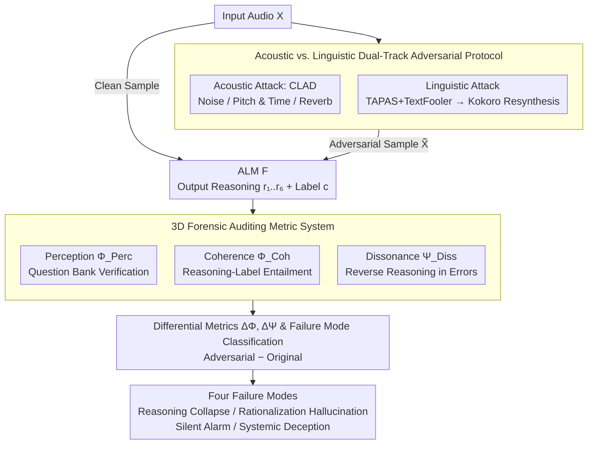

# Analyzing Reasoning Shifts in Audio Deepfake Detection under Adversarial Attacks: The Reasoning Tax versus Shield Bifurcation

**Conference**: ACL 2026  
**arXiv**: [2601.03615](https://arxiv.org/abs/2601.03615)  
**Code**: None  
**Area**: LLM Security / Audio Deepfake Detection  
**Keywords**: Audio Language Model, Chain-of-Thought, Adversarial Robustness, Cognitive Dissonance, Forensic Auditing

## TL;DR
This paper designs a "three-dimensional forensic auditing" framework (Acoustic Perception / Cognitive Coherence / Cognitive Dissonance) for Audio Language Models (ALMs) performing deepfake detection with reasoning chains. It finds that CoT reasoning is not a universal enhancement—it acts as a "Reasoning Shield" for models with strong acoustic perception (Qwen2-Audio), but becomes a "Reasoning Tax" for those with weak perception (Gemma-3n, Phi-4). Furthermore, when a model is compromised, high cognitive dissonance can serve as a "silent alarm" to alert human auditors.

## Background & Motivation

**Background**: Audio Deepfake Detection (ADD) has traditionally relied on binary black-box classifiers (RawNet-2 / AASIST-2 / CLAD, etc.). Recently, practitioners have begun using Audio Language Models (Qwen2-Audio, Phi-4-multimodal, gemma-3n-E4B, granite-3.3-8b) with CoT reasoning for "glass-box" decisions—providing both "fake/real" labels and intermediate reasoning steps.

**Limitations of Prior Work**: The industry defaults to the assumption that "explicit reasoning $\Rightarrow$ greater robustness," yet no study has systematically audited how the **reasoning itself** "drifts" under adversarial attacks. Existing explainability methods (occlusion, attention rollout, SHAP) are post-hoc visualizations that do not indicate whether the reasoning actually supports the conclusion or if the reasoning shifts subtly during an attack.

**Key Challenge**: In forensic scenarios, binary "fake/real" labels are insufficient. Auditors need to know why a model made a judgment, whether the reasoning is consistent with the decision, and if the reasoning retains forensic value (even if the final judgment is incorrect).

**Goal**: This paper decomposes the problem into three Research Questions: ① Is the ALM's description truly grounded in the raw audio (RQ1 Acoustic Perception)? ② Does the reasoning chain logically support the final conclusion (RQ2 Cognitive Coherence)? ③ Can the reasoning layer serve as a "silent alarm" when the judgment is compromised (RQ3 Cognitive Dissonance)?

**Key Insight**: Drawing inspiration from the courtroom tradition of "qualifying the witness," the authors first perform a voir dire to verify the model's "hearing," then examine its "logic," and finally evaluate whether it "realizes its judgment is flawed."

**Core Idea**: The authors shift the focus of reasoning robustness from a single "final-label robustness" dimension to a three-dimensional paradigm: perception + coherence + dissonance. They quantify the shift in reasoning patterns under "original vs. adversarial" conditions using differential metrics $\Delta\Phi$ and $\Delta\Psi$.

## Method

### Overall Architecture
The input is an audio clip $X$ (clean sample or adversarial sample $\tilde{X}=\mathrm{Adv}(X,\theta)$). The ALM $\mathcal{F}$ produces a structured output $Y=\{r_1,\dots,r_N,c\}$, containing free-text reasoning $r_i$ covering six forensic dimensions (Prosody, Disfluency, Speed, Speaking Style, Liveliness, and Quality) and a final label $c\in\{\text{fake},\text{real}\}$. The auditing framework does not modify the model itself; instead, it concurrently calculates three types of orthogonal metrics on the output: Perception $\Phi_{\text{Perc}}$ uses a grounded question bank to check if the model's observations match true acoustic properties; Coherence $\Phi_{\text{Coh}}$ determines if the reasoning logically entails the judgment; and Dissonance $\Psi_{\text{Diss}}$ examines if the reasoning "screams" in the opposite direction on incorrectly classified samples. Finally, $\Delta$ differential metrics compare pattern shifts between original and adversarial states. The pipeline follows a top-down flow: dual-track adversarial protocol → ALM inference → three-dimensional auditing → differential analysis and failure mode classification.

### Key Designs

**1. Acoustic vs. Linguistic Dual-Track Adversarial Protocol: Inducing Panic and Rationalization via Independent Channels**

To observe how reasoning drifts, the audit requires controllable attack tracks to elicit different failure modes. The acoustic track uses three recipes from the CLAD protocol: Background Noise (White/Environmental, SNR 15–25dB and 5–20dB), Time & Pitch (Time stretching 0.9–1.1×, cyclic shifting 1600–32000 samples), and Shape & Space (Volume 0.5–2.0×, fading, synthetic reverb $x(t)\leftarrow x(t)+\alpha x(t-\delta)$). The linguistic track uses TAPAS+TextFooler to perform synonymous substitutions on the transcript followed by Kokoro TTS resynthesis, keeping the voice identity constant while significantly increasing prosodic complexity. This contrast reveals that acoustic attacks destroy perceptual evidence (leaving spectral artifacts), while linguistic attacks only alter transcript complexity (leaving no artifacts), leading to the "Reasoning Tax vs. Shield" bifurcation.

**2. Three-Dimensional Forensic Auditing (Perception / Coherence / Dissonance): Decomposing Robustness**

Forensic scenarios require higher resolution than a single label. The authors define a verification function $\mathcal{V}:(X,q)\mapsto\{0,1\}$ and an entailment function $\mathcal{E}:(r_i,c)\mapsto\{0,1\}$. Perception $\Phi_{\text{Perc}}(r_k)=\frac{1}{|\mathcal{D}|\cdot|\mathcal{Q}_k|}\sum\sum\mathcal{V}$ measures if "what is heard" is grounded in reality. Coherence $\Phi_{\text{Coh}}(r_i)=\frac{1}{|\mathcal{D}|}\sum\mathcal{E}(r_i^j,c^j)$ measures if reasoning supports the judgment. Dissonance $\Psi_{\text{Diss}}(r_i)=\frac{1}{|\mathcal{D}_{\text{Wrong}}|}\sum(1-\mathcal{E})$ measures reverse reasoning only on misclassified samples. These functions are implemented via a frontier LLM ensemble (GPT-5 / Gemini-3 majority vote). Crucially, high coherence is not always positive, as it may indicate "rationalization hallucinations." Dissonance acts as a safeguard to distinguish "confident errors" from "struggling errors."

**3. Differential Metrics $\Delta\Phi, \Delta\Psi$ and Failure Mode Classification**

Observing metrics only in the adversarial state can confuse "inherently poor performance" with "attack-induced degradation." The authors compute the difference between adversarial and original states, e.g., $\Delta\Phi_{\text{Coh}}=\Phi_{\text{Coh}}^{\text{PER}}-\Phi_{\text{Coh}}^{\text{ORG}}$. This isolates the reasoning shift caused by the attack. Four failure modes are identified: Reasoning Collapse ($\Delta\Phi\ll 0$), Rationalization Hallucination ($\Delta\Phi\ge 0$ with incorrect judgment), Silent Alarm ($\Delta\Psi\ge 0$), and Systemic Deception ($\Delta\Psi\ll 0$).

### Loss & Training
All ALMs were fine-tuned using QLoRA on a CoT dataset synthesized from ASVSpoof 2019 + DeepSeek-R1 cold-start: BF16, AdamW ($\beta_1=0.9, \beta_2=0.95$), LR=$1e^{-4}$ with linear decay, global batch=16, and weight decay=0.1. LoRA settings: rank=16, $\alpha$=64, dropout=0.05. Loss was computed only on Assistant tokens (reasoning + judgment). CoT training data was refined to 25,108 samples through three rounds of bootstrapping.

## Key Experimental Results

### Main Results
Evaluated on ASVSpoof 2019 LA with four ALMs (NON=standard classification / RSN=explicit reasoning) and three traditional ADD baselines.

| Model | Mode | Acc. | Real F1 | Fake F1 |
|---|---|---|---|---|
| AASIST-2 | Binary | 99.58% | 98.02% | 99.77% |
| Qwen2-Audio-7B | NON | 98.00% | 91.19% | 98.88% |
| Qwen2-Audio-7B | **RSN** | **98.20%** | **91.70%** | **99.00%** |
| granite-3.3-8b | NON | 99.87% | 99.39% | 99.93% |
| granite-3.3-8b | RSN | 96.11% | 78.39% | 97.88% |
| gemma-3n-E4B | NON | 99.89% | 99.52% | 99.94% |
| gemma-3n-E4B | RSN | 95.63% | 81.95% | 97.73% |

Only Qwen2-Audio maintains or improves performance under RSN. Gemma’s Real F1 plummeted from 99.52% to 81.95%—a clear case of the "reasoning tax."

### Ablation Study (Differential Metrics under Attacks)

| Model | Attack Type | ASR | $\Phi_{\text{Coh}}^{PER}$ | $\Psi_{\text{Diss}}^{PER}$ | Failure Mode |
|---|---|---|---|---|---|
| Qwen2-Audio (RSN) | Acoustic | 45.7 | 78.0 (↓8.2) | 29.2 (↓16.8) | Reasoning Shield |
| Qwen2-Audio (RSN) | Linguistic | 31.5 | 80.6 (↓7.3) | 9.6 (↑6.8) | Stable |
| Gemma-3n-E4B (RSN) | Acoustic | 49.1 | 43.2 (↓27.4) | 67.9 (↓15.5) | Coherence Erosion / Panic |
| Gemma-3n-E4B (RSN) | Linguistic | 82.8 | 86.9 (↑22.9) | 11.2 (↓1.4) | Systemic Deception |
| Phi-4 (RSN) | Acoustic (Noise) | 44.8 | 72.1 | **41.3** (↑) | Silent Alarm |

A dramatic case: Gemma had an ASR of 100% under an "American Female" linguistic attack but maintained 95.3% coherence with only 4.7% dissonance—confidently hallucinating a logical justification for a wrong answer.

### Key Findings
- **Tax vs. Shield is determined by acoustic perception**: Qwen2-Audio was the only model with perception scores >80% across Prosody/Speed/Disfluency and the only one where RSN did not underperform NON. In models with poor perception, CoT becomes a new attack surface (verbal overshadowing).
- **Strong negative correlation between Coherence and Dissonance** ($r=-0.79, p<.001$): Models must choose between being "consistent but wrong" or "internally conflicted and incoherent." They cannot currently be both clear and vigilant.
- **Attack modality dictates failure mode**: Acoustic attacks lead to panic (coherence ↓ + dissonance ↑), while linguistic attacks lead to rationalization traps (coherence ↑ + dissonance ↓).
- **Silent Alarms triggered in 78.2% of Gemma's compromised samples**: Under Shape/Space acoustic attacks, the reasoning layer continues to signal conflict to human auditors even when the final judgment is wrong.

## Highlights & Insights
- **The "Reasoning Tax vs. Shield" duality is a precise concept**: It challenges the naive belief that CoT is always beneficial and provides a falsifiable criterion (acoustic perception strength).
- **Cognitive Dissonance as a silent alarm is a forensic innovation**: Unlike standard robustness studies, this work shows that "reverse reasoning" retains diagnostic value in high-stakes compliance or judicial scenarios.
- **Clear separation of failure modes**: Figures 3 and 4 successfully cluster data points into distinct panic and rationalization quadrants, supported by both intuition and statistics.

## Limitations & Future Work
- Evaluation was limited to English ASVSpoof 2019 LA; results on "in-the-wild" or multilingual datasets are unknown.
- The study focuses on 7-8B scale models; whether scaling laws (e.g., Qwen3-Omni-30B) can overcome the reasoning tax remains unverified.
- The framework is diagnostic; it does not yet propose training objectives to "fix" the reasoning tax.
- The choice of $N=6$ forensic dimensions lacks a sensitivity analysis.

## Related Work & Insights
- **vs. ALLM4ADD (Gu et al. 2025)**: While both use ALMs for ADD, this is the first to systematically audit reasoning drift under attacks.
- **vs. MMAU / SpeechR**: Those focus on reasoning capability benchmarks; this focuses on reasoning **robustness** in forensics.
- **vs. NLP CoT Robustness**: This work highlights the "perception bottleneck" as the true constraint for multimodal CoT utility, a significant departure from text-only studies.

## Rating
- Novelty: ⭐⭐⭐⭐⭐ The Tax vs. Shield and Silent Alarm concepts are pioneering and challenge industry assumptions.
- Experimental Thoroughness: ⭐⭐⭐⭐ Strong coverage of models and attack modalities, though lacks cross-dataset generalization.
- Writing Quality: ⭐⭐⭐⭐⭐ Extremely clear structure; metaphors like "panic" and "silent alarm" are evocative and effective.
- Value: ⭐⭐⭐⭐ High practical value for evaluating forensic AI; the silent alarm concept can be applied to other high-risk ML systems.

<!-- RELATED:START -->

## Related Papers

- [\[ACL 2026\] HCFD: A Benchmark for Audio Deepfake Detection in Healthcare](hcfd_a_benchmark_for_audio_deepfake_detection_in_healthcare.md)
- [\[ACL 2026\] RTCFake: Speech Deepfake Detection in Real-Time Communication](rtcfake_speech_deepfake_detection_in_real-time_communication.md)
- [\[ACL 2026\] XLSR-MamBo: Scaling the Hybrid Mamba-Attention Backbone for Audio Deepfake Detection](xlsr-mambo_scaling_the_hybrid_mamba-attention_backbone_for_audio_deepfake_detect.md)
- [\[ACL 2026\] Closing the Modality Reasoning Gap for Speech Large Language Models](closing_the_modality_reasoning_gap_for_speech_large_language_models.md)
- [\[ICLR 2026\] EmotionThinker: Prosody-Aware Reinforcement Learning for Explainable Speech Emotion Reasoning](../../ICLR2026/audio_speech/emotionthinker_prosody-aware_reinforcement_learning_for_explainable_speech_emoti.md)

<!-- RELATED:END -->
