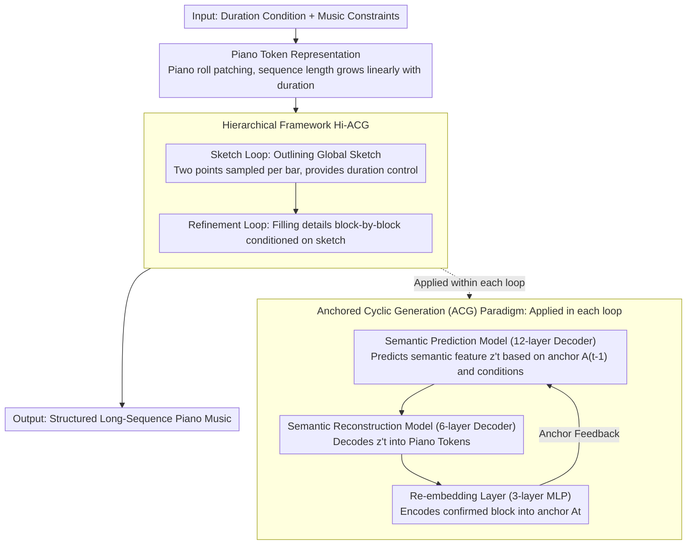

# Anchored Cyclic Generation: A Novel Paradigm for Long-Sequence Symbolic Music Generation

**Conference**: ACL 2026 Findings  
**arXiv**: [2604.05343](https://arxiv.org/abs/2604.05343)  
**Code**: None  
**Area**: Audio & Speech / Sequence Generation  
**Keywords**: Symbolic Music Generation, Error Accumulation, Anchored Cyclic Generation, Hierarchical Framework, Piano Token

## TL;DR
This paper proposes the Anchored Cyclic Generation (ACG) paradigm, which alleviates error accumulation in long-sequence symbolic music generation by using confirmed musical content as anchors to calibrate the generation direction during the autoregressive process. A hierarchical framework, Hi-ACG, is constructed to achieve music generation from global structure to local details.

## Background & Motivation

**Background**: Symbolic music generation is a core branch of music generation. Primary methods include Transformer-based autoregressive models (e.g., Music Transformer, BPE Transformer) and diffusion models (e.g., Cascaded-Diff). While autoregressive methods perform well on short sequences, they suffer from severe quality degradation during long-sequence generation.

**Limitations of Prior Work**: Autoregressive models face inherent error accumulation issues—each prediction step may deviate from the optimal value, and these deviations accumulate over iterations, leading to a significant decline in musical quality and structural integrity in long sequences. Furthermore, the computational complexity of Transformers grows quadratically with sequence length. Although diffusion models provide non-autoregressive alternatives, they struggle to generate complete long-sequence music efficiently.

**Key Challenge**: Long-sequence music generation requires maintaining both local coherence (note-level expressiveness) and global structural integrity (musical form, harmonic progression), which existing methods find difficult to balance.

**Goal**: To design a long-sequence music generation method capable of significantly reducing error accumulation, maintaining global structural consistency, and providing precise duration control.

**Key Insight**: Inspired by the teacher forcing training method—where ground truth history is used instead of model predictions to guide the next step—the authors migrate this concept to the inference stage. After each generation step, the confirmed output is re-encoded into anchor features to guide subsequent generation.

**Core Idea**: Long-sequence generation is decomposed into a two-level cycle: a sketch loop to capture high-level semantics and a refinement loop to generate detailed note content. Within each loop, an anchoring mechanism uses confirmed content to calibrate the generation direction.

## Method

### Overall Architecture
ACG organizes long-sequence music generation into three levels. The bottom layer is the Piano Token representation, which compresses binary piano rolls into discrete tokens, ensuring sequence length grows linearly with duration. The middle layer is the ACG paradigm: at each step, the confirmed output is re-encoded into anchor features, forming a closed loop of "semantic prediction → semantic reconstruction → re-embedding" to calibrate subsequent steps. The top layer is Hi-ACG, which utilizes a Sketch Loop to outline a global sketch followed by a Refinement Loop to fill in details block-by-block. The system takes duration conditions and optional musical constraints as input and outputs structurally complete long-sequence piano pieces.

### Key Designs

**1. Piano Token Representation: Ensuring Linear Correlation between Sequence Length and Duration**

The sequence length encoded by MIDI events has a non-linear relationship with duration; complex passages often require extremely long sequences, amplifying error accumulation and risking the loss of key tokens. This paper patches the $D \times T$ binary piano roll into $d \times t$ patches. Each patch is represented by a single token with a vocabulary size of $2^{d \times t}$. All tokens in the same column form a block $B$, carrying the complete musical information for $t$ time steps. Experiments use $d=2, t=4$, compressing the matrix from $D \times T$ to $44 \times (T/4)$, ensuring a linear relationship where $L \propto T$. Patch sizes can be adjusted to trade off between vocabulary size and sequence length.

**2. Anchored Cyclic Generation (ACG) Paradigm: Step-by-Step Calibration Using Confirmed History**

ACG migrates the teacher forcing concept from training to inference. While training uses ground truth labels to reduce error, ACG inference uses re-embeddings of confirmed outputs to approximate ground truth features, ensuring each prediction is built upon high-quality history. It consists of three cascaded components trained jointly end-to-end: a 12-layer Transformer decoder (Semantic Prediction Model) predicts semantic features $z_t'$ based on anchor features $A_{t-1}$ and input conditions $C$; a 6-layer Transformer decoder (Semantic Reconstruction Model) decodes $z_t'$ into a Piano Token sequence; and a 3-layer MLP (Re-embedding Layer) maps the generated block back to anchor features for the next step.

This closed loop reduces the average cosine distance between predicted and ground truth semantic features by 34.7%, and reduces time complexity from $O(L^2)$ to $O(L_{\text{sem}}^2) + L_{\text{sem}} \times O(L_{\text{rec}}^2)$.

**3. Hierarchical Hierarchical Framework (Hi-ACG): Separating Global Structure and Local Details**

Generating all details of a long sequence at once often leads to structural collapse. Hi-ACG simulates the human composition process of "skeleton first, details later." The Sketch Loop uses resampled real music data (two points per bar) to generate coarse-grained global sketches and provide precise duration control. The Refinement Loop takes the sketch as input and expands it block-by-block into detailed note content. Both loops are trained independently and apply the ACG paradigm, allowing "global consistency" and "local expressiveness" to be optimized without mutual interference.

### Example Walkthrough
To generate a 30-second piano piece: The Sketch Loop first produces a sequence of coarse-grained sketch blocks (two points per bar) under anchor guidance, outlining the harmonic progression and formal skeleton. Then, the Refinement Loop starts from the first block: the Semantic Prediction Model predicts $z_1'$ based on anchor $A_0$ and conditions; the Semantic Reconstruction Model decodes $z_1'$ into the first segment of Piano Tokens; the Re-embedding Layer encodes this confirmed content into anchor $A_1$ for the next step. This process continues block-by-block until the duration specified by the sketch is reached. Finally, the token matrix is converted back to a piano roll.

### Loss & Training
The Sketch Loop and Refinement Loop are trained separately. Models were pre-trained for 30 epochs on MuseScore data (140,000 dual-track piano pieces) using 4 RTX 4090 GPUs, followed by fine-tuning on POP909.

## Key Experimental Results

### Main Results (30-second Short Music Generation)

| Model | Pitch Entropy | Rhythm Entropy | Harmony Consistency | Melody Smoothness | LLM Score |
|-------|---------------|----------------|---------------------|-------------------|-----------|
| Ground Truth | 1.92 | 1.43 | 0.87 | 0.52 | 3.50 |
| Music Transformer | 1.95 | 1.66 | 0.94 | 0.41 | 2.25 |
| BPE Transformer | 3.16 | 1.74 | 0.90 | 0.55 | 2.43 |
| Cascaded-Diff | 3.26 | 2.36 | 0.91 | 0.66 | 3.37 |
| Hi-ACG (Ours) | **1.43** | **1.69** | **0.89** | 0.60 | **3.10** |

### Ablation Study

| Configuration | Pitch Entropy | LLM Score | Description |
|---------------|---------------|-----------|-------------|
| Full (Hi-ACG) | 1.43 | 3.10 | Complete model |
| w/o Sketch Loop & SP | 2.44 | 2.22 | Significant degradation without hierarchy and semantic prediction |
| w/o Sketch Loop | 1.32 | 3.06 | Refinement Loop alone maintains decent quality |

### Key Findings
- The ACG paradigm reduces the average cosine distance between predicted and ground truth semantic features by 34.7%, verifying the effectiveness of the anchoring mechanism.
- Hi-ACG shows a more pronounced advantage in 2-minute long music generation, with pitch entropy and melody smoothness closer to ground truth.
- The Sketch Loop contributes most to global structural consistency; removing it leads to a significant decline in musical quality.
- The framework demonstrates excellent music understanding and continuation capabilities in conditional long-music generation.

## Highlights & Insights
- **Anchoring as Inference-side Adaptation of Teacher Forcing**: While using ground truth during training is standard, using re-embeddings of generated content as anchors during inference to approximate ground truth features is a novel approach applicable to other long-sequence tasks (e.g., text, video).
- **Linear Sequence Length via Piano Tokens**: Controlling patch size allows for a flexible trade-off between vocabulary size and sequence length, making the sequence length strictly linear with duration, which is critical for variable-length music.
- **Decoupled Training of Dual Loops**: Sketching and refinement are trained and optimized independently, preventing interference between global and local objectives typically found in end-to-end training.

## Limitations & Future Work
- Only validated on dual-track piano music; not yet extended to multi-instrument arrangement or complex musical forms.
- Piano Token patch size is fixed at $2 \times 4$; varying musical complexities might benefit from adaptive patch sizes.
- The Re-embedding Layer is a simple MLP and may not fully recover all information within a block.
- direct comparison with the latest large-scale music generation models (e.g., MuPT, ChatMusician) was not conducted.

## Related Work & Insights
- **vs Music Transformer**: Standard autoregressive models suffer from severe error accumulation. ACG corrects deviations at each step via the anchoring mechanism.
- **vs Cascaded-Diff**: While both use hierarchical strategies, diffusion steps are computationally expensive. Hi-ACG uses efficient autoregression in both loops.
- **vs Traditional Hierarchical Methods**: Methods like SymphonyNet often have weak information flow between levels; Hi-ACG maintains strong information transfer via anchoring.

## Rating
- Novelty: ⭐⭐⭐⭐ The ACG paradigm provides a fresh perspective on the error accumulation problem.
- Experimental Thoroughness: ⭐⭐⭐ Covers short, long, and conditional generation, though lacks comparison with the newest large-scale models.
- Writing Quality: ⭐⭐⭐⭐ Logical flow from paradigm to framework to representation.
- Value: ⭐⭐⭐⭐ The anchoring mechanism is generalizable to other long-sequence generation tasks.

<!-- RELATED:START -->

## Related Papers

- [\[NeurIPS 2025\] Segment-Factorized Full-Song Generation on Symbolic Piano Music](../../NeurIPS2025/audio_speech/segment-factorized_full-song_generation_on_symbolic_piano_music.md)
- [\[ACL 2026\] Comprehensive Benchmarking of Long-Form Speech Generation in Diverse Scenarios](comprehensive_benchmarking_of_long-form_speech_generation_in_diverse_scenarios.md)
- [\[ACL 2026\] PlanRAG-Audio: Planning and Retrieval Augmented Generation for Long-form Audio Understanding](planrag-audio_planning_and_retrieval_augmented_generation_for_long-form_audio_un.md)
- [\[ACL 2026\] UniSonate: A Unified Model for Speech, Music, and Sound Effect Generation with Text Instructions](unisonate_a_unified_model_for_speech_music_and_sound_effect_generation_with_text.md)
- [\[ICLR 2026\] Dynamic Parameter Memory: Temporary LoRA-Enhanced LLM for Long-Sequence Emotion Recognition in Conversation](../../ICLR2026/audio_speech/dynamic_parameter_memory_temporary_lora-enhanced_llm_for_long-sequence_emotion_r.md)

<!-- RELATED:END -->
