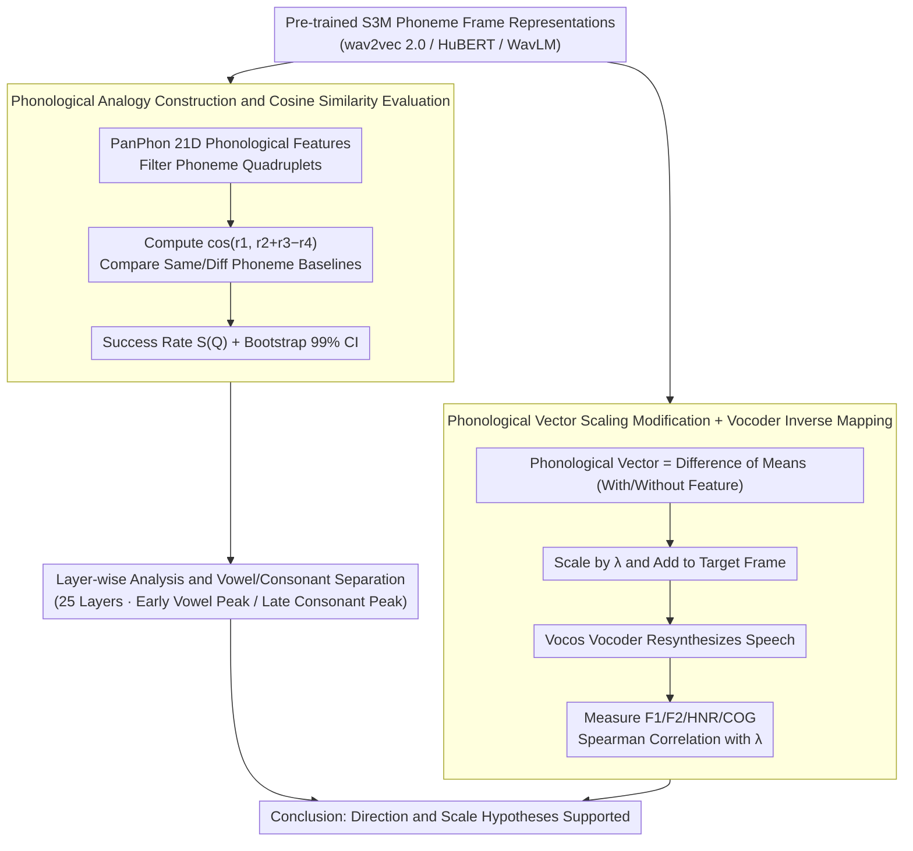

# [b] = [d] − [t] + [p]: Self-supervised Speech Models Discover Phonological Vector Arithmetic

**Conference**: ACL 2026 Findings  
**arXiv**: [2602.18899](https://arxiv.org/abs/2602.18899)  
**Area**: Audio & Speech / Speech Representation Learning  
**Keywords**: Self-supervised speech models, Phonological vector arithmetic, Speech representation structure, Acoustically controllable synthesis, Cross-lingual generalization

## TL;DR

This work systematically demonstrates the existence of linear phonological feature vectors within the representation spaces of self-supervised speech models (S3M). These vectors satisfy word2vec-style vector arithmetic relationships, and their scaling correlates continuously with acoustic measurements.

## Background & Motivation

**Background**: Self-supervised speech models (e.g., wav2vec 2.0, HuBERT, WavLM) have demonstrated powerful performance in downstream tasks such as speech recognition, synthesis, and spoken language understanding. Prior research indicates that S3Ms encode rich phonetic information, where distance relationships in the representation space reflect acoustic similarities and form clusters corresponding to phoneme units.

**Limitations of Prior Work**: While it is known "what" information S3Ms encode, there is a lack of deep understanding regarding "how" this information is structured. By analogy to the classic semantic vector arithmetic in word2vec (king - man + woman ≈ queen), whether similar compositional structures exist for phonological features in speech representation spaces remains unexplored.

**Key Challenge**: Despite the superior performance of S3Ms across various tasks, their internal representation structure—specifically whether phonological features are encoded in a compositional and manipulatable manner—remains unclear.

**Goal**: This study aims to verify two hypotheses: (1) the existence of linear phonological feature vectors in S3M representation spaces (Direction Hypothesis), and (2) a continuous correlation between the scaling factors of these vectors and the degree of acoustic feature realization (Scale Hypothesis).

**Key Insight**: This work adapts the vector analogy testing methodology from word2vec and generalizes it to phonological features in the audio domain.

**Core Idea**: $[b] - [p] + [t] \approx [d]$ (voicing vector), suggesting that compositional phonological vectors exist in the representation space of speech models, and scaling these vectors allows for the continuous control of the degree of corresponding acoustic features.

## Method

### Overall Architecture

The study does not train new speech models but performs post-hoc probing on the representation spaces of existing S3Ms through two sets of experiments. The direction experiment tests "whether linear directions satisfying phonological analogies exist" by filtering phoneme quadruplets using PanPhon features and comparing cosine similarity rankings. The scale experiment tests "whether scaling phonological vectors continuously changes acoustic realization" by training a vocoder to map S3M representations back to speech, followed by re-synthesis and acoustic measurement after vector scaling. The data covers 96 languages from TIMIT (English) and VoxAngeles (95 languages), using phoneme frame representations as input and outputting analogy success rates and scaling-acoustic correlation coefficients.

### Key Designs

**1. Phonological Analogy Construction and Cosine Similarity Evaluation: Testing Linear Directions in Representation Space**

To verify if relationships like $[b]−[p]+[t] \approx [d]$ hold, analogies must be robustly constructed and success criteria quantified. This work uses PanPhon to extract 21-dimensional phonological feature vectors for each phoneme. Phoneme quadruplets are filtered based on consistency in feature differences. The success rate $S(Q)$ is defined as the proportion of quadruplets where $\cos(r_{p_1},\, r_{p_2}+r_{p_3}-r_{p_4})$ satisfies the ranking $\cos^- < \cos < \cos^+$, comparing against same-phoneme $(\cos^+)$ and different-phoneme $(\cos^-)$ baselines. Bootstrap methods are used to construct 99% confidence intervals for statistical reliability.

**2. Phonological Vector Scaling and Vocoder Inverse Mapping: Verifying Correlation Between $\lambda$ and Acoustic Realization**

Beyond proving the existence of directions, it must be shown that these directions are "continuously manipulatable." The phonological vector is defined as the difference between the mean representations of phonemes that possess a feature and those that do not. Scaled vectors are added to target frames to modify S3M representations, and a Vocos-based vocoder is used to resynthesize the modified representations into speech. Spearman rank correlations are then calculated between the scaling factor $\lambda$ and acoustic measures such as F1, F2, HNR, and COG. Vocos is chosen for its robustness to out-of-distribution inputs, making it suitable for analyzing manually modified S3M representations.

**3. Layer-wise Analysis and Vowel/Consonant Separation: Revealing Feature Encoding Across Layers**

Phonological encoding is non-uniform across S3M layers. This study computes success rates for 25 layers and performs fine-grained analysis by grouping analogies into vowels and consonants. WavLM shows three peaks—vowels peak in early middle layers, consonants peak in late middle layers, and the final layer integrates all information. The motivation is that vowels and consonants have different acoustic-temporal characteristics (vowel cues are more localized, while consonant cues span larger windows), leading to prioritized encoding at different depths.

### Loss & Training

The vocoder is trained using the standard Vocos framework on LibriTTS (English) and FLEURS-R (multilingual). The core analysis involves post-hoc probing of existing pre-trained S3M representations without further model training.

## Key Experimental Results

### Main Results

Phonological analogy success rates on TIMIT for different models (at the best layer):

| Model | Best Success Rate | Best Layer |
|-------|-------------------|------------|
| MelSpec | 0% | - |
| MFCC | 19% | - |
| wav2vec 2.0 | 61% | Middle |
| HuBERT | 94% | Final |
| WavLM | 92% | Final |

Success rates on VoxAngeles (95 languages):

| Model | Best Success Rate |
|-------|-------------------|
| MelSpec | 0% |
| MFCC | 19% |
| wav2vec 2.0 | 39% |
| HuBERT | 45% |
| WavLM | 93% |

Cross-lingual Generalization: Among 468 analogies, 316 (68%) included at least one phoneme not present in English, yet WavLM maintained a 93% success rate.

### Ablation Study

Spearman correlation between scaling factor $\lambda$ and acoustic measurements for 8 phonological features (TIMIT, WavLM):

| Phonological Feature | Acoustic Measurement | Correlation $\rho$ | Expected Sign |
|----------------------|----------------------|--------------------|---------------|
| High | F1 | -0.801 | - ✓ |
| Low | F1 | +0.908 | + ✓ |
| Back | F2 | -0.759 | - ✓ |
| Round | F2 | -0.833 | - ✓ |
| Nasal | F1BW | -0.441 | - ✓ |
| Sonorant | HNR | +0.649 | + ✓ |
| Strident | COG | +0.819 | + ✓ |
| Voice | COG | -0.720 | - ✓ |

All 8 feature correlation signs align with theoretical expectations.

### Key Findings

- Phonological analogies in S3M representation spaces hold consistently across 19 features, significantly outperforming spectral feature baselines.
- WavLM maintains a 93% success rate in cross-lingual settings (95 languages), demonstrating strong generalization.
- Vowel-related analogies peak in shallower layers, while consonant analogies peak in deeper layers—consistent with their varying temporal characteristics.
- The scaling factor $\lambda$ is effective not only within the interpolation range ($|\lambda| \le 1$) but also maintains continuous correlation in the extrapolation range ($|\lambda| > 1$).
- S3Ms trained only on English generalize phonological arithmetic to phonemes not found in English.

## Highlights & Insights

- **Elegant Analogy**: Successfully generalizes word2vec's semantic vector arithmetic to phonological features in speech, a simple yet profound conceptual leap.
- **Surprising Cross-lingual Generalization**: Models pre-trained solely on English can encode the phonological structure of 96 languages, suggesting S3Ms learn universal phonetic knowledge rather than language-specific patterns.
- **Large-scale Empirical Evidence**: Comprehensive coverage of 96 languages, 19 phonological features, 3 S3M models, and layer-wise analysis across 25 layers.
- **Potential for Controllable Synthesis**: Continuous control of acoustic features via phonological vector scaling offers new pathways for interpretable speech synthesis.

## Limitations & Future Work

- Only 3 English pre-trained S3Ms (wav2vec 2.0, HuBERT, WavLM) were tested; multilingual pre-trained models were not included.
- Vocoder resynthesis quality may introduce noise, affecting the precision of acoustic measurements.
- Current analysis focus is on the phoneme level; higher-level compositionality (e.g., syllables, prosody) remains unexplored.
- Future work could explore using phonological vectors for controllable voice conversion or speech enhancement applications.

## Related Work & Insights

- **vs. word2vec Analogy Test**: This work uses a statistical confidence interval-based evaluation rather than the 3CosAdd/3CosMul methods of Mikolov et al. (2013b), ensuring higher robustness.
- **vs. Traditional Speech Probing**: While traditional probing focuses on what information is encoded, this work reveals the compositional structure of that information.
- **vs. Choi et al. (2024)**: Building upon prior clustering analyses that found S3Ms form phoneme clusters, this work identifies the linear relationships between those clusters.

## Rating

- Novelty: ⭐⭐⭐⭐⭐ First systematic proof of phonological vector arithmetic in S3Ms; highly novel concept.
- Experimental Thoroughness: ⭐⭐⭐⭐⭐ Extremely comprehensive analysis across 96 languages and 19 features.
- Writing Quality: ⭐⭐⭐⭐⭐ Fluent prose, clear diagrams, and an elegant introduction of analogies.
- Value: ⭐⭐⭐⭐ Deepens the understanding of S3M representation structures with implications for speech synthesis and analysis.

<!-- RELATED:START -->

## Related Papers

- [\[ACL 2026\] An Exploration of Mamba for Speech Self-Supervised Models](an_exploration_of_mamba_for_speech_self-supervised_models.md)
- [\[ACL 2026\] Pseudo2Real: Task Arithmetic for Pseudo-Label Correction in Automatic Speech Recognition](pseudo2real_task_arithmetic_for_pseudo-label_correction_in_automatic_speech_reco.md)
- [\[ACL 2026\] Semi-Supervised Diseased Detection from Speech Dialogues with Multi-Level Data Modeling](semi-supervised_diseased_detection_from_speech_dialogues_with_multi-level_data_m.md)
- [\[ACL 2026\] How Tokenization Limits Phonological Knowledge Representation in Language Models and How to Improve Them](how_tokenization_limits_phonological_knowledge_representation_in_language_models.md)
- [\[ACL 2026\] Speech-Hands: A Self-Reflection Voice Agentic Approach to Speech Recognition and Audio Reasoning with Omni Perception](speech-hands_a_self-reflection_voice_agentic_approach_to_speech_recognition_and_.md)

<!-- RELATED:END -->
