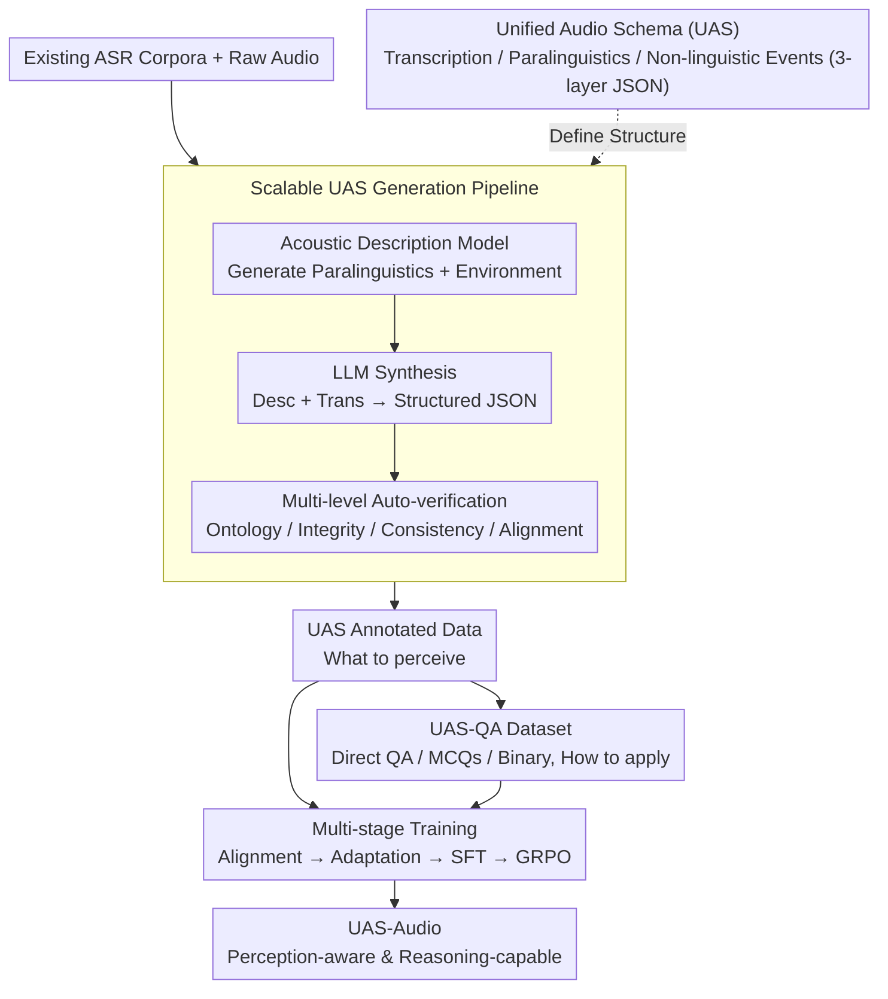

# Beyond Transcription: Unified Audio Schema for Perception-Aware AudioLLMs

**Conference**: ACL 2026 Findings  
**arXiv**: [2604.12506](https://arxiv.org/abs/2604.12506)  
**Code**: [GitHub](https://github.com/Tencent/Unified_Audio_Schema)  
**Area**: Speech Processing  
**Keywords**: Audio Large Language Models, Perception Enhancement, Unified Audio Schema, Paralinguistic Information, ASR

## TL;DR
This paper reveals that the perception weakness of current AudioLLMs stems from the ASR-centric training paradigm, which systematically suppresses paralinguistic and non-linguistic information. It proposes the Unified Audio Schema (UAS) to structure audio information into a JSON format across three dimensions: transcription, paralinguistics, and non-linguistic events. This approach achieves a 10.9% improvement in perception accuracy on the MMSU benchmark while maintaining reasoning capabilities.

## Background & Motivation

**Background**: AudioLLMs exhibit a paradoxical phenomenon: they perform excellently on complex reasoning tasks (~70%) but drop sharply on basic acoustic perception tasks (~40%). For example, a model might correctly transcribe "I'm fine" while completely ignoring the distress implied by a trembling voice or failing to notice a door slamming.

**Limitations of Prior Work**: This perceptual deficit persists across different model scales and architectures, indicating that the problem lies in the training methodology rather than model capacity. The vast majority of AudioLLMs utilize ASR as the core training signal. ASR is inherently selective; to recover canonical text, it deliberately normalizes prosody, speaker identity, emotion, and acoustic context.

**Key Challenge**: ASR training creates a fundamental asymmetry. The model is continuously rewarded for reasoning about "what was said" while being implicitly penalized for attending to "how it was said" and "what other sounds exist." Perception is not undertrained; it is systematically de-emphasized.

**Goal**: To design a training supervision format that explicitly preserves acoustic perception information without sacrificing semantic alignment.

**Key Insight**: Drawing from Laver’s semiotic framework for speech signals, the audio signal is decomposed into three information layers: linguistic, paralinguistic, and extralinguistic.

**Core Idea**: Use a structured JSON schema to explicitly encode the three information layers of audio as training targets, converting the "implicit discard" of ASR into "explicit retention."

## Method

### Overall Architecture

This paper addresses the "can transcribe but cannot hear" perception defect of AudioLLMs. The core idea is to modify the supervision format rather than the architecture. All information to be perceived from an audio clip is defined in a three-layer JSON schema (what was said / how it was said / other sounds). An automated pipeline then converts existing ASR corpora into UAS annotations and generates complementary QA data. Finally, this data is integrated into a standard multi-stage training process, forcing the model to retain acoustic details while learning transcription.

### Key Designs

**1. Unified Audio Schema: Explicitly Encoding Acoustic Information Discarded by ASR**

The fundamental problem with ASR training is that it only rewards "canonical text recovery," leaving prosody, emotion, and environment sounds without a supervision anchor. UAS addresses this by assigning a fixed-structure JSON to each audio segment, splitting information into three layers: Transcription (verbatim text), Paralinguistics (six sub-fields: age, gender, emotion, accent, prosody, timbre), and Non-linguistic Events (environmental descriptions, discrete events like door slams, continuous background sounds). For purely non-speech audio, transcription and paralinguistic fields are set to null. This design decouples "holistic understanding" into explicit sub-tasks, prevents feature confusion, and provides a low-entropy target that is easier for models to learn stably than free-form text.

**2. Scalable UAS Generation Pipeline: Zero-shot Conversion of ASR Corpora**

To make the schema viable, massive labeling is required, yet manual annotation for six paralinguistic dimensions is prohibitively expensive. The pipeline automates annotation in three steps: first, an acoustic description model generates paralinguistic and environmental descriptions from raw audio; second, an LLM synthesizes these with the original transcription into a structured UAS JSON; finally, a multi-level verification check ensures ontology constraints, transcription integrity, logical consistency, and duration-content alignment. Manual auditing of 400 samples showed over 95% accuracy for most attributes.

**3. UAS-QA Supplemental Dataset: Teaching the Application of Acoustic Knowledge**

If only schema annotations are provided, the model learns "what to perceive" but may not invoke this information when queried. UAS-QA automatically generates three types of question-answer pairs based on UAS annotations: Direct QA, Multiple Choice, and Yes/No questions. While annotations define "what to perceive," the QA pairs define "how to apply" it.

### Loss & Training

A standard four-stage workflow is followed, with UAS data injected in the middle stages: (1) Discrete token alignment (vocabulary expansion); (2) Audio-LLM adaptation, where the LLM and encoder are frozen while the projection layer is trained on UAS data; (3) Full-parameter SFT, mixing ASR/TTS + UAS + UAS-QA; (4) GRPO reinforcement learning.

## Key Experimental Results

### Main Results (MMSU / MMAR / MMAU Benchmarks)

| Model | MMSU Perception | MMSU Reasoning | MMSU Overall | MMAR | MMAU | Mean |
|------|----------|----------|----------|------|------|-----------|
| Qwen2.5-Omni | 42.0 | 70.0 | ~56 | 55.8 | 64.2 | ~58.7 |
| Kimi-Audio | ~38 | ~68 | ~53 | 56.3 | 65.0 | ~58.1 |
| Step-Audio2-mini | ~40 | ~69 | ~55 | 57.2 | 63.8 | ~58.7 |
| **UAS-Audio (Ours)** | **52.9** | **70.1** | **~61** | **60.1** | **65.2** | **~62.1** |

### Ablation Study

| Configuration | MMSU Perception | MMSU Reasoning | Note |
|------|----------|----------|------|
| w/o UAS (ASR only) | ~40 | ~70 | Weak perception but normal reasoning |
| UAS Annotation Only | ~48 | ~69 | Partial perception gain |
| UAS-QA Only | ~45 | ~69 | QA alone is insufficient |
| **UAS + UAS-QA** | **52.9** | **70.1** | Best result through complementarity |

### Key Findings
- **UAS-Audio achieves an ~11% absolute gain in MMSU perception** while fully maintaining reasoning performance.
- **UAS is applicable to both continuous and discrete AudioLLM architectures**, proving the issue lies in supervision rather than architecture.
- **UAS annotations and UAS-QA provide complementary supervision**: annotations teach "what to perceive," while QA teaches "how to use" it.
- **SOTA performance on the MMAR reasoning benchmark (60.1%)** demonstrates that perception enhancement does not impair reasoning.
- **High-quality pipeline validation**: Manual auditing confirms >95% accuracy for most attributes.

## Highlights & Insights
- **The diagnosis of the fundamental cause**—that AudioLLM perception weakness is due to "systematic de-emphasis" in ASR-centric training rather than "under-training"—is a vital insight that points the way for the field.
- **The use of a structured JSON schema as a training target** can be generalized to any multi-dimensional perception task by decomposing implicit holistic understanding into explicit structured sub-tasks.
- **The pipeline requires no additional manual labeling**, making the approach highly scalable as it can convert any ASR dataset into perception-enhanced data.

## Limitations & Future Work
- The six paralinguistic sub-fields are manually defined and might miss dimensions like breathing patterns or speech rate variance.
- The pipeline reliability depends on the quality of the acoustic description models and may degrade in low-resource languages.
- Validated only at the 7B scale; effects on larger/smaller models remain to be confirmed.
- Detection accuracy for non-linguistic events might decrease in complex acoustic scenarios.
- Future work could explore allowing the model to decide when to output UAS instead of always generating it.

## Related Work & Insights
- **vs Qwen2.5-Omni**: While a multimodal model, it remains ASR-centric in training and is perception-weak. UAS fixes this by changing the supervision method.
- **vs Caption-based methods**: Unstructured descriptions have high-entropy variability. The UAS JSON format provides low-entropy, consistent targets.
- **vs Specialized perception models**: Specialized models for emotion or speaker ID are precise but narrow. UAS achieves multi-dimensional perception within a unified model.

## Rating
- Novelty: ⭐⭐⭐⭐ The diagnosis (ASR-centricity) is more innovative than the method itself.
- Experimental Thoroughness: ⭐⭐⭐⭐⭐ Three major benchmarks + ablation + manual validation across architectures.
- Writing Quality: ⭐⭐⭐⭐⭐ Clear problem diagnosis and solid theoretical foundation (Laver’s framework).
- Value: ⭐⭐⭐⭐⭐ Provides a clear direction and solution path for the AudioLLM field.

<!-- RELATED:START -->

## Related Papers

- [\[ACL 2026\] Beyond Transcripts: A Renewed Perspective on Audio Chaptering](beyond_transcripts_a_renewed_perspective_on_audio_chaptering.md)
- [\[CVPR 2026\] HAVE-Bench: Hierarchical Audio-Visual Evaluation from Perception to Interaction](../../CVPR2026/audio_speech/have-bench_hierarchical_audio-visual_evaluation_from_perception_to_interaction.md)
- [\[ACL 2026\] Speech-Hands: A Self-Reflection Voice Agentic Approach to Speech Recognition and Audio Reasoning with Omni Perception](speech-hands_a_self-reflection_voice_agentic_approach_to_speech_recognition_and_.md)
- [\[CVPR 2026\] Omni2Sound: Towards Unified Video-Text-to-Audio Generation](../../CVPR2026/audio_speech/omni2sound_towards_unified_video-text-to-audio_generation.md)
- [\[CVPR 2026\] PAVAS: Physics-Aware Video-to-Audio Synthesis](../../CVPR2026/audio_speech/pavas_physics-aware_video-to-audio_synthesis.md)

<!-- RELATED:END -->
