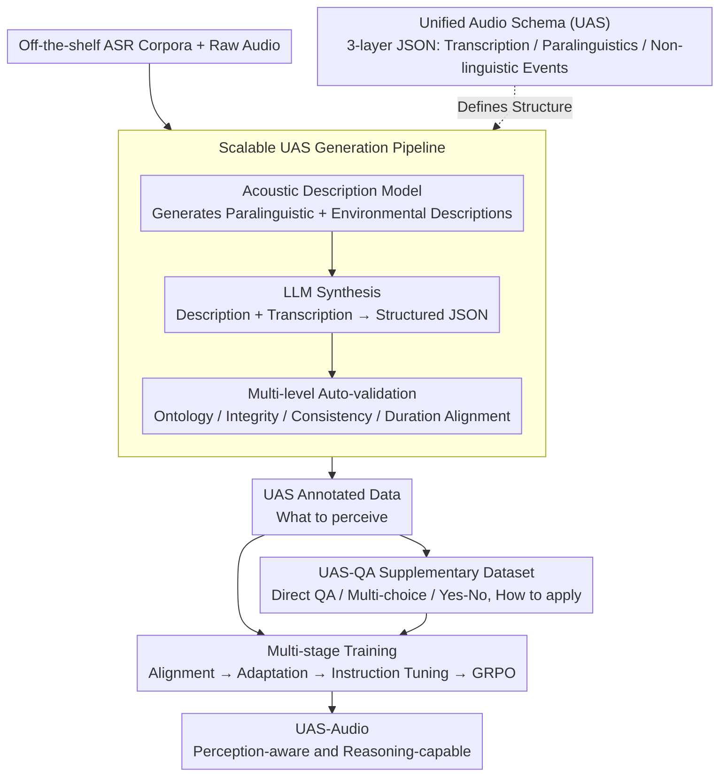

# Beyond Transcription: Unified Audio Schema for Perception-Aware AudioLLMs

**Conference**: ACL 2026 Findings  
**arXiv**: [2604.12506](https://arxiv.org/abs/2604.12506)  
**Code**: [GitHub](https://github.com/Tencent/Unified_Audio_Schema)  
**Area**: Audio Processing  
**Keywords**: AudioLLM, Perception Enhancement, Unified Audio Schema, Paralinguistic Information, ASR

## TL;DR
Reveals that current AudioLLM perception weaknesses stem from ASR-centric training patterns (systemic suppression of paralinguistic and non-linguistic information). Proposes the Unified Audio Schema (UAS) to structure audio information into a JSON format across three dimensions: transcription, paralinguistics, and non-linguistic events. Achieving a 10.9% improvement in perception accuracy on the MMSU benchmark while maintaining reasoning capabilities.

## Background & Motivation

**Background**: AudioLLMs exhibit a paradox—performing excellently on complex reasoning tasks (~70%) but dropping sharply on fundamental acoustic perception tasks (~40%). For instance, a model may correctly transcribe "I'm fine" while completely ignoring the distress implied by a trembling voice or failing to notice a door slamming.

**Limitations of Prior Work**: This perception deficiency persists across model scales and architectures, suggesting the issue lies not in model capacity but in the training methodology. The vast majority of AudioLLMs use ASR as the core training signal, and ASR is inherently selective—deliberately normalizing prosody, speaker identity, emotion, and acoustic context to recover canonical text.

**Key Challenge**: ASR training creates a fundamental asymmetry—models are continuously rewarded for reasoning about "what was said" while being implicitly penalized for focusing on "how it was said" and "what other sounds exist." Perception is not under-trained but rather systematically de-emphasized.

**Goal**: Design a training supervision format that explicitly preserves acoustic perception information without sacrificing semantic alignment.

**Key Insight**: Drawing from Laver’s semiotic framework of speech signals, the audio signal is decomposed into three information layers: linguistic, paralinguistic, and extralinguistic.

**Core Idea**: Use a structured JSON schema to explicitly encode the three information layers of audio as training targets, transforming the "implicit discard" of ASR into "explicit retention."

## Method

### Overall Architecture

This paper addresses the "can transcribe but cannot listen" perception defect of AudioLLMs. The approach modifies the supervision format rather than the architecture: all information that should be perceived in an audio clip is first defined into a three-layer JSON schema (what was said / how it was said / what else was heard). An automated pipeline then rewrites existing ASR corpora into this UAS schema annotation and generates corresponding Q&A data. Finally, this data is integrated into a standard multi-stage training process, forcing the model to retain acoustic details while learning transcription, resulting in a UAS-Audio model capable of both perception and reasoning.

### Key Designs

**1. Unified Audio Schema: Explicitly Encoding Discarded Acoustic Information**

The fundamental problem with ASR training is that it only rewards "recovering canonical text," leaving information like prosody, emotion, and ambient sound without a grounding point, leading to systemic normalization. UAS counters this by providing a fixed-structure JSON for every audio clip, splitting information into three layers: Transcription (verbatim text equivalent to ASR), Paralinguistics (six sub-fields—age, gender, emotion, accent, prosody, timbre), and Non-linguistic Events (environmental descriptions, discrete sound events like door bangs, continuous background sounds like engine drones). For non-speech audio, transcription and paralinguistic fields are set to null. This design offers three advantages: it decouples "holistic understanding" into explicit sub-tasks, avoids mixing features from different dimensions, and uses JSON as a low-entropy, grammatically consistent target that is easier for models to learn stably than free-form text.

**2. Scalable UAS Generation Pipeline: Zero-shot Rewriting of ASR Corpora**

To make the schema viable, massive annotation is required, but hand-labeling six paralinguistic dimensions is cost-prohibitive. The pipeline automates annotation in three steps: first, using an acoustic description model to generate paralinguistic and environmental descriptions from raw audio; second, using an LLM to synthesize these descriptions and the original transcription into a structured UAS JSON; and finally, passing it through multi-level automatic validation checking for ontology constraints, transcription integrity, logical consistency, and duration-content alignment. Human audits of 400 samples showed over 95% accuracy for most attributes, proving the reliability of converting standard ASR datasets into perception-aware supervision.

**3. UAS-QA Supplementary Dataset: Teaching Models to Apply Acoustic Knowledge**

If only schema annotations are provided, the model learns "what to perceive" but may not invoke this information when questioned. UAS-QA automatically generates three types of Q&A pairs based on UAS annotations—Direct QA (querying specific fields), Multiple Choice, and Yes/No questions—covering all schema fields. It complements schema annotations: annotations handle "what to perceive," while QA handles "how to apply." Ablations show that the combination of both pushes perception accuracy to its peak.

### Loss & Training

A standard four-stage pipeline is adopted, with UAS data injected in the middle two stages: (1) Discrete token alignment (vocabulary expansion); (2) Audio-LLM adaptation, freezing the LLM and encoder while training only the projection layer with UAS data; (3) Full-parameter instruction fine-tuning, mixing ASR/TTS + UAS + UAS-QA; (4) GRPO reinforcement.

## Key Experimental Results

### Main Results (MMSU / MMAR / MMAU Benchmarks)

| Model | MMSU Perception | MMSU Reasoning | MMSU Overall | MMAR | MMAU | 3-Bench Mean |
|------|----------|----------|----------|------|------|-----------|
| Qwen2.5-Omni | 42.0 | 70.0 | ~56 | 55.8 | 64.2 | ~58.7 |
| Kimi-Audio | ~38 | ~68 | ~53 | 56.3 | 65.0 | ~58.1 |
| Step-Audio2-mini | ~40 | ~69 | ~55 | 57.2 | 63.8 | ~58.7 |
| **UAS-Audio** | **52.9** | **70.1** | **~61** | **60.1** | **65.2** | **~62.1** |

### Ablation Study

| Configuration | MMSU Perception | MMSU Reasoning | Description |
|------|----------|----------|------|
| W/O UAS (ASR only) | ~40 | ~70 | Weak perception, normal reasoning |
| UAS Annotation only | ~48 | ~69 | Partial perception gain |
| UAS-QA only | ~45 | ~69 | QA alone is insufficient |
| **UAS + UAS-QA** | **52.9** | **70.1** | Best performance via complementarity |

### Key Findings
- **UAS-Audio achieves an absolute gain of ~11% in MMSU perception** while fully maintaining reasoning performance.
- **UAS is applicable to both continuous and discrete AudioLLM architectures**, proving the issue lies in supervision rather than architecture.
- **UAS annotations and UAS-QA provide complementary supervision**: annotations teach "what to perceive," while QA teaches "how to use it."
- **Achieved SOTA on the MMAR reasoning benchmark (60.1%)**, indicating that perception enhancement does not damage reasoning.
- **Data validation confirms high pipeline quality**: Human audits of 400 samples show >95% accuracy for most attributes.

## Highlights & Insights
- **Diagnosing the root cause** of AudioLLM perception weakness as "systemic de-emphasis" in ASR-centric training rather than "under-training" is more valuable than the method itself, providing direction for the field.
- The idea of using a **JSON structured schema as a training target** can be generalized to any multi-dimensional perception task—decomposing implicit "holistic understanding" into explicit structured sub-tasks.
- The **pipeline requiring no additional human annotation** makes the method highly scalable, allowing any ASR dataset to be transformed into perception-enhanced data.

## Limitations & Future Work
- The six paralinguistic sub-fields of UAS are hand-defined and may miss important dimensions (e.g., breathing patterns, speech rate variability).
- The pipeline depends on the quality of the acoustic description model, which may degrade in low-resource languages.
- Validated only at the 7B scale; effects on larger or smaller models remain to be confirmed.
- Non-linguistic event detection accuracy may decrease in complex acoustic scenarios.
- Could explore allowing the model to automatically decide whether to output UAS instead of always generating it.

## Related Work & Insights
- **vs Qwen2.5-Omni**: While Qwen2.5-Omni is multimodal, it remains ASR-centric in training and is perception-weak. UAS solves this by changing the supervision method.
- **vs Caption-based methods**: Unstructured descriptions have high-entropy variability (one sound can be described in many ways). The JSON format of UAS provides a low-entropy, consistent target.
- **vs Dedicated Perception Models**: Specialized models for emotion or speaker recognition have high accuracy but are narrow. UAS achieves all-dimensional perception in a unified model.

## Rating
- Novelty: ⭐⭐⭐⭐ The core insight (ASR-centric training suppresses perception) is more innovative than the method.
- Experimental Thoroughness: ⭐⭐⭐⭐⭐ Three benchmarks + ablation + human validation, verified across architectures.
- Writing Quality: ⭐⭐⭐⭐⭐ Clear problem diagnosis, solid theoretical foundation (Laver’s framework).
- Value: ⭐⭐⭐⭐⭐ Points out a directional problem and a solution path for the AudioLLM field.

<!-- RELATED:START -->

## Related Papers

- [\[ACL 2026\] Beyond Transcripts: A Renewed Perspective on Audio Chaptering](beyond_transcripts_a_renewed_perspective_on_audio_chaptering.md)
- [\[ACL 2026\] Speech-Hands: A Self-Reflection Voice Agentic Approach to Speech Recognition and Audio Reasoning with Omni Perception](speech-hands_a_self-reflection_voice_agentic_approach_to_speech_recognition_and_.md)
- [\[ICLR 2026\] AudioX: A Unified Framework for Anything-to-Audio Generation](../../ICLR2026/audio_speech/audiox_a_unified_framework_for_anything-to-audio_generation.md)
- [\[CVPR 2026\] PAVAS: Physics-Aware Video-to-Audio Synthesis](../../CVPR2026/audio_speech/pavas_physics-aware_video-to-audio_synthesis.md)
- [\[ICLR 2026\] Beyond Instance-Level Alignment: Dual-Level Optimal Transport for Audio-Text Retrieval](../../ICLR2026/audio_speech/beyond_instance-level_alignment_dual-level_optimal_transport_for_audio-text_retr.md)

<!-- RELATED:END -->
