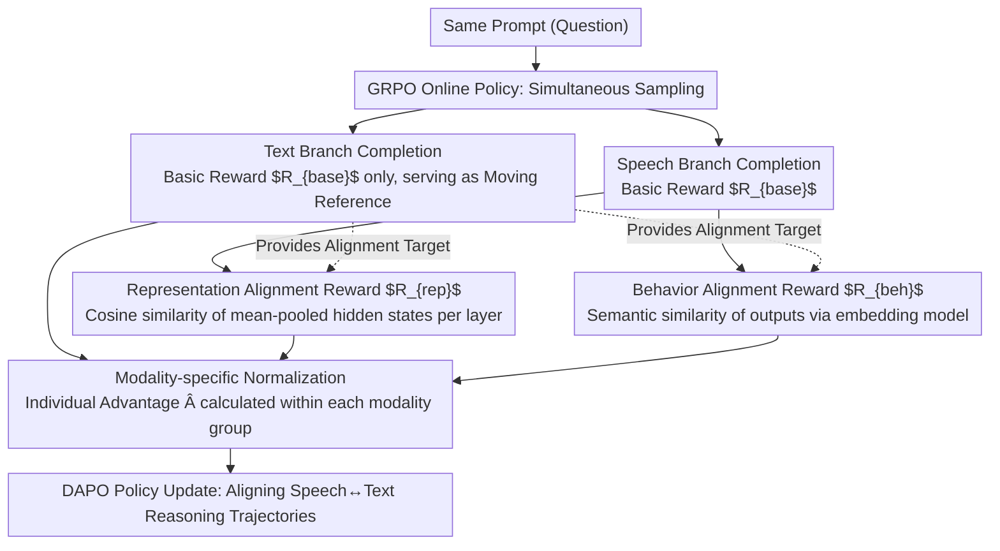

# Closing the Modality Reasoning Gap for Speech Large Language Models

**Conference**: ACL 2026  
**arXiv**: [2601.05543](https://arxiv.org/abs/2601.05543)  
**Code**: [https://github.com/AmphionTeam/TARS](https://github.com/AmphionTeam/TARS)  
**Area**: LLM Evaluation  
**Keywords**: Speech LLM, Modality Reasoning Gap, Reinforcement Learning, Representation Alignment, Trajectory Alignment

## TL;DR

This paper introduces TARS (Trajectory Alignment for Reasoning in Speech), a reinforcement learning-based framework that aligns speech-conditioned reasoning trajectories with text-conditioned trajectories through two dense signals: representation alignment and behavior alignment. It achieves SOTA performance in 7B-scale models, with the Modality Recovery Rate (MRR) approaching or even exceeding 100%.

## Background & Motivation

**Background**: Speech Large Language Models (Speech LLMs) have made significant progress using a three-stage architecture consisting of a speech encoder, an adapter, and a text LLM, enabling speech inputs to leverage the reasoning capabilities of the text LLM.

**Limitations of Prior Work**: Reasoning performance under speech input is significantly weaker than under text input, a phenomenon termed the "modality reasoning gap." (1) Input-side fusion methods (e.g., training adapters with frozen LLMs) only achieve surface-level alignment, and subtle representation differences amplify as they propagate through Transformer layers. (2) Output-side supervision methods (e.g., knowledge distillation) enforce token-level matching offline, but match strictness is unreachable as speech and text conditional distributions differ, and exposure bias remains a concern.

**Key Challenge**: The underlying logical reasoning process should be modality-invariant. However, current methods either only align input representations or enforce output alignment offline, both failing to effectively guide the alignment of the reasoning trajectories themselves.

**Goal**: Design an online policy optimization framework to simultaneously align internal representations and external behaviors under speech and text conditions, thereby eliminating the modality reasoning gap.

**Key Insight**: Utilize the GRPO reinforcement learning framework with the text-conditioned reasoning trajectory as a moving reference. Asymmetric rewards are designed: speech completions are optimized for task accuracy, representation alignment, and behavior alignment, while text completions are optimized for accuracy only.

**Core Idea**: Through online policy exploration and dense alignment rewards, the speech modality co-evolves with the continuously improving text reasoning capability, avoiding the exposure bias issues found in offline supervision.

## Method

### Overall Architecture

TARS aims to eliminate the modality reasoning gap where a model fails on speech input for a prompt it would correctly answer via text. This objective is integrated into the GRPO online reinforcement learning process: for each prompt, both speech-conditioned and text-conditioned completions are sampled. The text branch is optimized with basic rewards and serves as a moving alignment reference for the speech branch. The speech branch receives two additional dense rewards—representation alignment and behavior alignment—alongside basic rewards. As the text branch improves during training, it provides increasingly higher-quality alignment targets for the speech branch, allowing them to co-evolve across internal hidden states and external outputs.

### Key Designs

**1. Representation Alignment Reward: Pulling Speech and Text Hidden States back to the same trajectory within Transformer layers**

A primary source of the modality gap is the layer-wise amplification of subtle input differences. The representation alignment reward provides dense feedback directly on internal states. For each layer $l$, the hidden states of reasoning tokens $\mathbf{H}^{(l)}$ are mean-pooled into a fixed vector $\bar{\mathbf{h}}^{(l)}$. The average cosine similarity across $L$ layers between speech and text completions is calculated: $R_{\text{rep}} = \frac{1}{L}\sum_{l=1}^{L}\text{CosSim}(\bar{\mathbf{h}}_{\text{speech}}^{(l)}, \bar{\mathbf{h}}_{\text{text}}^{(l)})$. This coarse-grained, per-layer supervision suppresses drift before it amplifies.

**2. Behavior Alignment Reward: Allowing diverse reasoning paths if final semantics match**

Aligning hidden states alone may be over-constrained, as forcing a model to replicate text trajectories token-by-token is unrealistic and prone to exposure bias. Behavior alignment applies soft semantic constraints at the output level. An external embedding model (e.g., Qwen3-Embedding-0.6B) is used to compute the semantic cosine similarity between the speech completion $y_{\text{speech}}$ and the text reference $y_{\text{text}}^*$: $R_{\text{beh}} = \text{CosSim}(\mathcal{E}(y_{\text{speech}}), \mathcal{E}(y_{\text{text}}^*))$. This complements representation alignment: the former prevents internal drift, while the latter ensures final behavioral consistency, allowing the model to explore diverse valid reasoning paths.

**3. Modality-specific Normalization: Preventing speech completions from being suppressed by naturally lower scores**

GRPO uses within-group advantages to drive learning. However, if speech and text completions are normalized in the same group, text scores are naturally higher, leaving speech samples consistently below the mean with negative advantages, which suppresses learning signals. The solution is to calculate advantages separately for each modality: $\hat{A}_{i,m} = r_{i,m} - \mu_m$, where $\mu_m$ is the mean reward within the modality $m$ group. Even if task accuracy for certain speech completions is zero, alignment rewards can still differentiate performance within the speech group, providing effective gradients crucial for training stability.

### Loss & Training

A DAPO loss estimator (a Dr. GRPO variant) is used. The total reward is $R_{\text{total}} = R_{\text{base}} + \alpha \cdot R_{\text{rep}} + \beta \cdot R_{\text{beh}}$ ($\alpha = \beta = 1.0$), where $R_{\text{base}} = R_{\text{acc}} + 0.5 \cdot R_{\text{fmt}}$. Training involves LoRA fine-tuning of all linear layers while freezing the audio encoder and projector.

## Key Experimental Results

### Main Results

**7B Model Accuracy on Reasoning Benchmarks (%)**

| Model | MMSU(A) | MMSU(T) | OBQA(A) | OBQA(T) | Avg(A) | MRR |
|------|---------|---------|---------|---------|--------|-----|
| Qwen2.5-Omni | 61.51 | 67.94 | 81.09 | 84.40 | 71.30 | 91.76% |
| TARS(Qwen2.5-Omni) | **67.96** | 68.54 | **85.71** | 88.57 | **76.84** | **98.89%** |
| Phi-4-MM | 54.81 | 72.15 | 71.65 | 84.62 | 63.23 | 79.59% |
| TARS(Phi-4-MM) | **70.14** | 75.76 | **89.45** | 91.87 | **79.80** | **100.45%** |

### Ablation Study

| Training Strategy | MMSU(A) | OBQA(A) | Avg(A) | MRR |
|----------|---------|---------|--------|-----|
| SFT | 60.83 | 81.54 | 71.19 | 89.36% |
| DPO | 59.99 | 79.78 | 69.89 | 89.39% |
| Standard GRPO | 63.73 | 82.86 | 73.30 | 94.04% |
| + Rep. Alignment | 65.91 | 84.40 | 75.16 | 96.43% |
| + Beh. Alignment | 66.20 | 84.84 | 75.52 | 95.57% |
| + Both (TARS) | **67.96** | **85.71** | **76.84** | **98.89%** |

### Key Findings

- TARS increases MRR on Phi-4-MM to 100.45%, meaning speech reasoning performance surpassed text reasoning.
- Representation and behavior alignments are complementary; used individually, they provide ~2% gains each, but perform best when combined.
- Modality-specific normalization is crucial for training stability, as naive normalization suppresses speech learning.
- TARS improves not only speech performance but also text performance (Qwen2.5-Omni: 76.17% $\to$ 78.56%).
- End-to-end models outperform cascaded ASR+LLM systems, indicating that direct speech processing avoids cascaded ASR errors.

## Highlights & Insights

- The asymmetric reward design is clever: it allows the text branch to continue progressing while providing an increasingly stronger alignment target for the speech branch, achieving co-evolution.
- Even in difficult reasoning scenarios where all speech completion task accuracies are zero, alignment rewards still provide effective gradient signals.
- The MRR > 100% result suggests that knowledge learned from speech processing can, in turn, enhance text-based reasoning.

## Limitations & Future Work

- Evaluation was limited to multiple-choice QA benchmarks; effectiveness on free-form generation tasks requires verification.
- Mean-pooling for representation alignment might lose positional information; finer-grained alignment methods may be more effective.
- Reliance on synthetic speech for training poses questions regarding robustness to real-world audio (noise, accents).

## Related Work & Insights

- **vs AlignChat/DeSTA**: These methods freeze the LLM and only train the adapter, resulting in input-side alignment only; TARS aligns the entire reasoning trajectory via RL.
- **vs Knowledge Distillation**: KD enforces token-level matching offline, suffering from exposure bias; TARS avoids this through online exploration.
- **vs SoundMind-RL**: Shipped concurrently, this also uses RL for speech reasoning but relies on sparse rule-based rewards without dense alignment signals.

## Rating

- Novelty: ⭐⭐⭐⭐⭐ First RL framework applying trajectory alignment to close the speech-text reasoning gap.
- Experimental Thoroughness: ⭐⭐⭐⭐ Two base models, multiple baseline comparisons, and detailed ablations, though benchmarks are limited.
- Writing Quality: ⭐⭐⭐⭐⭐ Clear problem definition, intuitive methodology, and concise formulas.
- Value: ⭐⭐⭐⭐⭐ The MRR > 100% result is a significant milestone, opening new directions for multimodal reasoning alignment.

<!-- RELATED:START -->

## Related Papers

- [\[ICLR 2026\] Closing the Gap Between Text and Speech Understanding in LLMs](../../ICLR2026/audio_speech/closing_the_gap_between_text_and_speech_understanding_in_llms.md)
- [\[ACL 2026\] VAPO: End-to-end Slide-Enhanced Speech Recognition with Omni-modal Large Language Models](vapo_end-to-end_slide-enhanced_speech_recognition_with_omni-modal_large_language.md)
- [\[ICLR 2026\] OWL: Geometry-Aware Spatial Reasoning for Audio Large Language Models](../../ICLR2026/audio_speech/owl_geometry-aware_spatial_reasoning_for_audio_large_language_models.md)
- [\[ACL 2026\] SpeakerSleuth: Can Large Audio-Language Models Judge Speaker Consistency across Multi-turn Dialogues?](speakersleuth_can_large_audio-language_models_judge_speaker_consistency_across_m.md)
- [\[ACL 2026\] Do We Need Distinct Representations for Every Speech Token? Unveiling and Exploiting Redundancy in Large Speech Language Models](do_we_need_distinct_representations_for_every_speech_token_unveiling_and_exploit.md)

<!-- RELATED:END -->
