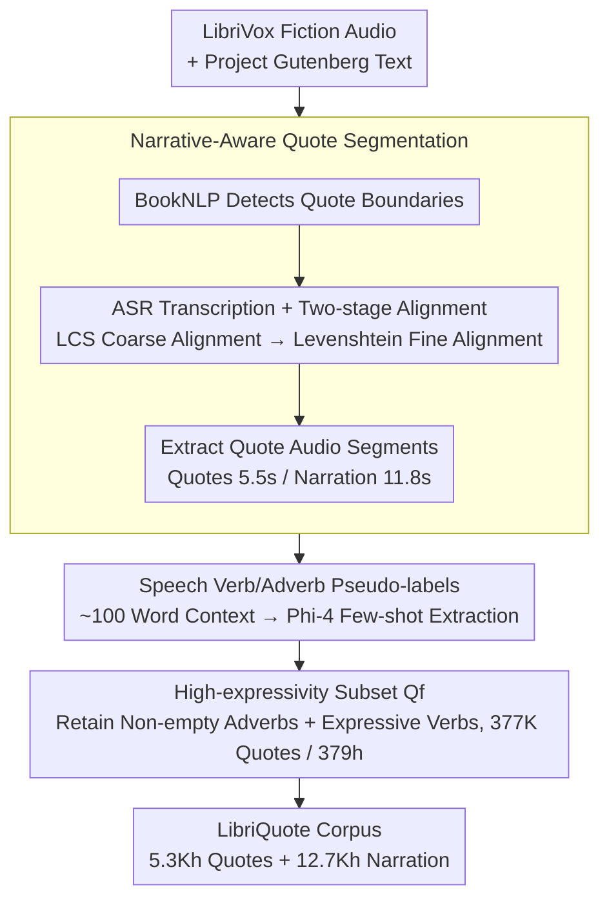

# Computational Narrative Understanding for Expressive Text-to-Speech

**Conference**: ACL 2026 Findings  
**arXiv**: [2509.04072](https://arxiv.org/abs/2509.04072)  
**Code**: [GitHub](https://github.com/deezer/libriquote)  
**Area**: Speech Synthesis / Expressive TTS  
**Keywords**: Audiobooks, Expressive Speech, Narrative Understanding, Character Dialogue, Dataset

## TL;DR

This paper extracts character direct quotes from audiobook fiction to construct LibriQuote, a large-scale expressive speech dataset (5.3K hours of quotes + 12.7K hours of narration). It annotates speaking styles using speech verbs and adverbs as pseudo-labels. Experiments demonstrate that fine-tuning flow-matching models improves both expressiveness and intelligibility, and LibriQuote-test serves as a challenging benchmark for expressive TTS.

## Background & Motivation

**Background**: Recently, TTS systems have achieved significant progress through large-scale multi-domain speech corpora (e.g., Emilia, ~100K hours), demonstrating naturalness and voice-following capabilities. Audiobooks (e.g., LibriSpeech, LibriHeavy) are the most common open-source data sources for TTS.

**Limitations of Prior Work**: (1) Existing audiobook datasets (LibriTTS, LibriHeavy) completely ignore narrative structure during segmentation—either discarding character quotes or mixing quotes with neutral narration in the same 30-second segments, leading to multiple prosodic distributions within a single clip. (2) There is a perception that audiobooks lack expressive diversity, which overlooks the rich prosodic variations inherent in character dialogues within fiction. (3) Existing expressive speech datasets are either small-scale (EXPRESSO is only dozens of hours) or have limited annotation schemes (only discrete emotion labels).

**Key Challenge**: Audiobooks contain rich expressive speech (character dialogue), but current segmentation methods make it difficult for TTS models to utilize these resources. Segments mixing neutral narration and expressive quotes force models to learn the simpler neutral components.

**Goal**: (1) Construct a large-scale expressive speech dataset centered on character quotes. (2) Annotate speaking styles using speech verbs/adverbs from narrative context as pseudo-labels. (3) Verify the effectiveness of this dataset in improving TTS expressiveness and intelligibility.

**Key Insight**: Drawing from narratology (Genette’s narrative discourse theory), this work systematically extracts and labels character quotes from LibriVox fiction using quote detection and text-audio alignment techniques.

**Core Idea**: Character quotes in audiobooks naturally constitute large-scale, diverse expressive speech data. Narrators switch speaking styles based on context when reading dialogue, while surrounding speech verbs/adverbs (e.g., "he whispered softly") provide natural style pseudo-labels.

## Method

### Overall Architecture

The core of this paper is the data rather than the model: it isolates the naturally expressive "character dialogue" from massive audiobooks and assigns style labels. The pipeline starts with LibriVox fiction audio, downloads the corresponding Project Gutenberg text, and uses BookNLP to locate quote boundaries. Simultaneously, it performs ASR transcription and aligns it with the original text to extract precise audio segments for each quote. Returning to the original context, an LLM extracts speech verbs and adverbs describing the manner of speaking as pseudo-labels. Finally, a high-expressivity subset $\mathbf{Q}_f$ is filtered based on expressiveness. The final product is LibriQuote, a large-scale expressive TTS corpus with style labels.

### Key Designs

**1. Narrative-Aware Quote Segmentation: Separating Expressive Character Dialogue from Neutral Narration**

Existing audiobook datasets slice segments randomly based on sentence boundaries; 75% of segments contain only narration, while 25% mix 1-12 quotes. More quotes correlate with higher standard deviation in prosody (Spearman $\rho=0.218$). Mixing expressive and neutral speech in one 30-second segment encourages models to prioritize the easier neutral parts. This design uses BookNLP to detect quote boundaries in text and maps them to audio via two-stage alignment: Longest Common Subsequence (LCS) for coarse alignment and Levenshtein for fine alignment. This maps each quote to a precise audio segment. Quotes average 5.5s and narration 11.8s, resulting in clean expressive samples.

**2. Speech Verb/Adverb Pseudo-labels: Using Contextual Cues as Free Style Annotations**

Narrators change their tone based on context, and speech verbs or adverbs like "he whispered softly" in the text are the basis for these shifts. These serve as natural style labels. The extraction uses a window of ~100 words around each quote, replaces all quotes with special tokens to focus on narrative structure, and uses an LLM (Phi-4) with few-shot prompting to extract speech verbs (e.g., whispered, shouted) and adverbs (e.g., softly, angrily). The LLM also provides confidence scores to filter uncertain predictions and increase precision. Human verification yielded a Cohen's $\kappa=0.87$, indicating high consistency that is much finer-grained than discrete emotion labels at zero cost.

**3. High-Expressivity Subset $\mathbf{Q}_f$: Using Less but More "Performative" Data for Stronger Expressiveness**

The full quote set contains many neutral verbs like "said," which dilutes expressiveness gains. The $\mathbf{Q}_f$ filtering rule retains all quotes with non-empty adverb pseudo-labels and quotes where the speech verb belongs to a manually defined expressive list. This results in 377,776 quotes (11% of the total), totaling 379 hours. Subsequent experiments confirm that this small but high-quality subset brings significant expressive improvements in data-efficient settings.

### Loss & Training

SparkTTS (Autoregressive) fine-tunes the LLM backbone (Qwen2-0.5B) using standard language modeling loss on semantic tokens. F5-TTS (Flow-matching) follows official fine-tuning scripts. Training includes both fine-tuning on different data subsets and training from scratch.

## Key Experimental Results

### Main Results

**TTS Evaluation on LibriQuote-test**

| Model Configuration | WER ↓ | SIM-O ↑ | CtxMOS ↑ |
|:---|:---:|:---:|:---:|
| GT (Ground Truth) | 6.5 | - | 3.55 |
| SparkTTS (Baseline) | 4.8 | 0.46 | 2.94 |
| SparkTTS FT($\mathbf{Q}_f$) | 4.6 | 0.47 | 2.97 |
| SparkTTS Scratch($\mathbf{Q}$) | 9.5 | 0.40 | 3.09 |
| SparkTTS Full($\mathbf{N} \cup \mathbf{Q}$) | 5.1 | 0.41 | 3.30 |
| F5-TTS (Baseline) | 6.9 | 0.53 | 2.95 |
| F5-TTS FT($\mathbf{Q}_f$) | **6.6** | **0.54** | **3.33** |

### Ablation Study

**Out-of-Domain Evaluation (LibriSpeech-PC / SeedTTS)**

| Configuration | LibriSpeech WER ↓ | SeedTTS WER ↓ |
|:---|:---:|:---:|
| SparkTTS | 3.06 | 2.64 |
| FT($\mathbf{Q}_f$) | **2.10** | **2.07** |
| FT($\mathbf{Q}$) | **2.00** | **1.90** |

### Key Findings

- F5-TTS fine-tuning increased CtxMOS from 2.95 to 3.33 (significant) while decreasing WER—flow-matching models can simultaneously improve expressiveness and intelligibility.
- SparkTTS fine-tuning primarily improved intelligibility (OOD WER dropped from 3.06 to 2.10), with limited gains in expressiveness.
- Training from scratch improved expressiveness (CtxMOS 3.09) but sacrificed intelligibility (WER 9.5).
- Training from scratch on the full dataset (narration + quotes) yielded better results (CtxMOS 3.30), showing complementarity.
- In LibriQuote-test, 67% of quotes were predicted as non-neutral, compared to only 9% in LibriHeavy.

## Highlights & Insights

- Addresses TTS data issues from the perspective of narratology—audiobooks do not lack expressiveness; they lack correct data segmentation.
- Speech verb/adverb pseudo-labels provide an extremely natural and low-cost expressive annotation method without manual effort.
- The high-expressivity subset $\mathbf{Q}_f$ (only 379 hours) achieves significant results, proving that data quality > data quantity.

## Limitations & Future Work

- LibriVox narrators are volunteers, leading to varied recording quality and performance levels.
- Currently covers only English fiction; not yet extended to other languages or genres.
- Does not explore how to utilize contextual speech verbs/adverbs to control synthesis style during inference.

## Related Work & Insights

- **vs LibriHeavy**: LibriHeavy does not distinguish between quotes and narration; this paper's narrative-aware segmentation reveals neglected expressive signals.
- **vs EXPRESSO**: EXPRESSO is high-quality but only dozens of hours with 26 predefined styles; LibriQuote offers 5.3K hours of natural expressive diversity.
- **vs Emotion Speech Datasets**: Discrete emotion labels are too coarse; speech verbs/adverbs provide finer-grained style descriptions.

## Rating

- Novelty: ⭐⭐⭐⭐ Innovative data construction paradigm with narrative-aware segmentation and pseudo-labels.
- Experimental Thoroughness: ⭐⭐⭐⭐ Multi-model and multi-config experiments including OOD and human evaluations.
- Writing Quality: ⭐⭐⭐⭐ Clear motivation and detailed data construction process.
- Value: ⭐⭐⭐⭐ Dataset and methodology offer direct value to the expressive TTS community.

<!-- RELATED:START -->

## Related Papers

- [\[ICLR 2026\] MambaVoiceCloning: Efficient and Expressive Text-to-Speech via State-Space Modeling and Diffusion Control](../../ICLR2026/audio_speech/mambavoicecloning_efficient_and_expressive_text-to-speech_via_state-space_modeli.md)
- [\[ICLR 2026\] Closing the Gap Between Text and Speech Understanding in LLMs](../../ICLR2026/audio_speech/closing_the_gap_between_text_and_speech_understanding_in_llms.md)
- [\[ICLR 2026\] UniSS: Unified Expressive Speech-to-Speech Translation with Your Voice](../../ICLR2026/audio_speech/uniss_unified_expressive_speech-to-speech_translation_with_your_voice.md)
- [\[CVPR 2026\] AudioStory: Generating Long-Form Narrative Audio with Large Language Models](../../CVPR2026/audio_speech/audiostory_generating_long-form_narrative_audio_with_large_language_models.md)
- [\[ACL 2026\] Phun-Bench: Evaluating LLMs on Phonological Understanding in Chinese](phun-bench_evaluating_llms_on_phonological_understanding_in_chinese.md)

<!-- RELATED:END -->
