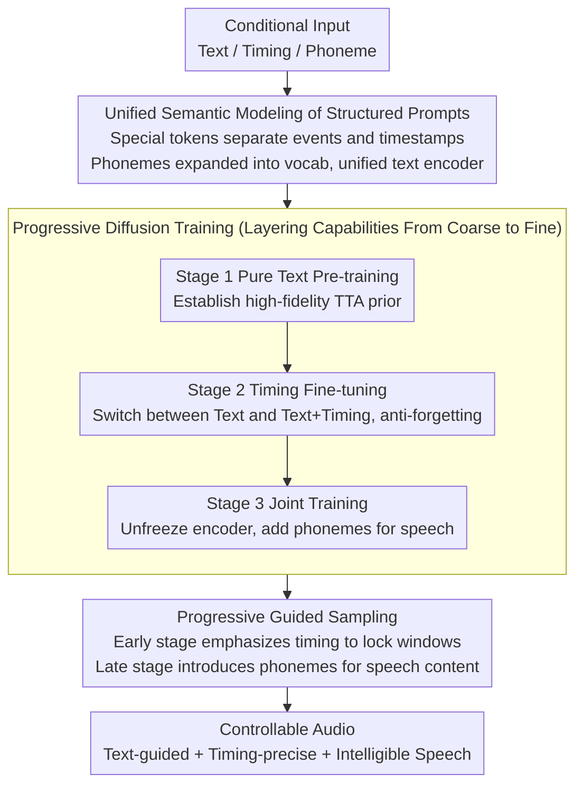

# ControlAudio: Tackling Text-Guided, Timing-Indicated and Intelligible Audio Generation via Progressive Diffusion Modeling

**Conference**: ACL 2026  
**arXiv**: [2510.08878](https://arxiv.org/abs/2510.08878)  
**Code**: [Project Page](https://control-audio.github.io/Control-Audio/)  
**Area**: Image Generation  
**Keywords**: Text-to-Audio, Temporal Control, Intelligible Speech, Progressive Diffusion, DiT

## TL;DR

This paper proposes ControlAudio, a unified progressive diffusion modeling framework. Through a three-stage progressive training strategy (TTA pre-training → timing control fine-tuning → joint timing and intelligible speech training) and progressive guided sampling, it achieves text-guided, timing-precise, and intelligible speech generation within a single diffusion model. It significantly outperforms existing methods in timing accuracy and speech clarity.

## Background & Motivation

**Background**: Text-to-audio (TTA) generation has made significant progress through large-scale diffusion models. Recent research has begun to explore fine-grained control: one line of work achieves precise temporal control (e.g., "bird chirps, 2-5 seconds"), while another achieves intelligible speech generation (containing clear and recognizable vocal content).

**Limitations of Prior Work**: (1) Controllable TTA performance remains limited when scaled due to the scarcity of large-scale labeled data (data containing both timing annotations and speech transcripts is extremely rare); (2) No prior work has simultaneously achieved both temporal control and intelligible speech generation in a unified framework; (3) Adding fine-grained control signals often sacrifices generation quality under pure text conditions (catastrophic forgetting); (4) Natural language descriptions of complex multi-event scenes are often ambiguous.

**Key Challenge**: Controllable TTA needs to handle multiple granularities of conditional signals (text → timing → phonemes) simultaneously, but the scale of training data for different granularities varies vastly (millions of text-audio pairs vs. tens of thousands of timing-annotated data), making direct joint training ineffective.

**Goal**: To achieve text-guided, timing-indicated, and intelligible speech capabilities in a single diffusion model without sacrificing any individual capability.

**Key Insight**: Modeling controllable TTA as a multi-task learning problem using progressive diffusion modeling—employing a coarse-to-fine progressive strategy across data construction, model training, and guided sampling.

**Core Idea**: Progressive modeling naturally matches the hierarchy of control granularity (text → timing → phoneme) and the coarse-to-fine nature of diffusion sampling—emphasizing coarse-grained temporal structures in the early stages of the diffusion trajectory and introducing fine-grained phoneme content in the later stages.

## Method

### Overall Architecture

ControlAudio aims to integrate three control capabilities—text guidance, precise timing, and intelligible speech—into a single diffusion model. The challenge lies in the two-order-of-magnitude difference in training data scale (millions vs. tens of thousands). The solution is to apply the "progressive" concept across three layers: data, training, and inference. First, a high-fidelity DiT is pre-trained on large-scale text-audio pairs to obtain a TTA prior, followed by fine-tuning on timing-annotated data to add temporal control. Finally, all modules are unfrozen for joint training on multi-source data to incorporate speech. During inference, a coarse-to-fine approach is also used: early diffusion stages use timing conditions to lock event time windows, while later stages introduce phoneme conditions to fill in speech content.

### Key Designs

**1. Unified Semantic Modeling of Structured Prompts: Handling text, timing, and phonemes with a single text encoder**

Natural language descriptions of complex multi-event scenes are inherently ambiguous—"from 2 to 5" could refer to pitch sliding or a time range. ControlAudio replaces free-form text with a structured format using special tokens to explicitly separate event descriptions from precise start/end times (e.g., `<event>bird chirps<start>2.0<end>5.0`). Speech duration is directly defined by these timing windows, and phoneme tokens are added to the text encoder's vocabulary. Consequently, conditions of all three granularities are encoded by the same unified encoder, eliminating ambiguity and ensuring scalability without needing separate modules for each condition.

**2. Progressive Diffusion Training: Layering capabilities in three stages without degrading prior performance**

Directly training with all conditions simultaneously would lead to performance collapse due to data imbalance and task complexity. Thus, training is split into three stages. Stage 1 performs pre-training using only text conditions to establish a high-fidelity TTA prior. Stage 2 involves fine-tuning on timing-annotated data while randomly switching between "pure text" and "text+timing" to prevent the model from forgetting its text-to-audio capability. Stage 3 unfreezes the text encoder for joint optimization, switching among text, text+timing, and text+timing+phoneme conditions. This allows the model to establish control capabilities in a layered, coarse-to-fine manner.

**3. Progressive Guided Sampling: Aligning condition granularity with diffusion stages**

Diffusion sampling is inherently a coarse-to-fine process—early steps determine large-scale structures, while later steps carve out details. Fixed guidance signals struggle to match the requirements of different stages. Progressive guided sampling aligns condition granularity with sampling steps: early steps emphasize timing conditions to fix the temporal windows for each event, while later steps introduce phoneme conditions to fill those windows with specific speech content. Experiments show this design significantly outperforms fixed guidance.

### Loss & Training

Standard conditional diffusion training objective (noise prediction). Data construction: Annotated data is extracted from AudioSet-SL containing speech segments transcribed via Gemini 2.5 Pro; simulated data is synthesized from LibriTTS-R by combining single/multi-speaker scenarios with non-speech backgrounds (SNR 2-10 dB), generating 171,246 complex audio scenes.

## Key Experimental Results

### Main Results

**Evaluation of Temporal Control on AudioCondition Test Set**

| Method | Eb ↑ | At ↑ | FAD ↓ | CLAP ↑ | Temporal (Subj.) ↑ | OVL (Subj.) ↑ |
|------|------|------|-------|--------|----------------|------------|
| Ground Truth | 43.37 | 67.53 | - | 0.377 | 4.52 | 4.48 |
| Stable Audio | 11.28 | 51.67 | 1.93 | 0.318 | 1.94 | 3.44 |
| PicoAudio | 29.96 | 57.70 | 3.43 | 0.296 | 2.70 | 2.44 |
| **ControlAudio** | **38.50** | **67.87** | **0.98** | **0.347** | **4.01** | **3.74** |

### Ablation Study

**Ablation of Training Strategies**

| Configuration | At ↑ | FAD ↓ | Speech WER ↓ |
|------|------|-------|----------|
| Stage 1 Only | Baseline | Baseline | No speech capability |
| + Stage 2 (Timing) | Significant Improvement | Slight Decrease | No speech capability |
| + Stage 3 (Timing + Speech) | Best | Best | **Best** |
| Without Progressive Guidance (Fixed) | Decrease | Increase | Increase |

### Key Findings

- ControlAudio approaches Ground Truth in temporal accuracy (At 67.87 vs. 67.53), far exceeding other methods.
- Stage 3 joint training not only unlocks speech capabilities but also further improves temporal accuracy—likely because timing-annotated speech data provides richer time-content alignment signals.
- Unfreezing the text encoder for joint optimization is crucial—allowing condition encoding and the generation backbone to adapt collaboratively to complex multi-objective tasks.
- Progressive guided sampling significantly outperforms fixed guidance—aligning condition granularity with sampling granularity improves generation quality.
- CoT LLM planning can convert free-form text into structured prompts, extending practical use cases.

## Highlights & Insights

- The progressive design permeates data, training, and inference, forming a consistent coarse-to-fine paradigm.
- Structured prompts and phoneme expansion enable a single text encoder to process three types of conditions, avoiding the complexity of multiple modules.
- The discovery that Stage 3 joint training improves temporal accuracy is counter-intuitive and suggests positive transfer in multi-task learning.

## Limitations & Future Work

- The SNR range of simulated data (2-10 dB) might not cover all real-world scenarios.
- Control over speaker identity in speech generation has not yet been explored.
- Generation of long audio exceeding 10 seconds has not been evaluated.
- Reliance on external LLMs to convert free-form text into structured prompts.

## Related Work & Insights

- **vs. PicoAudio/AudioComposer**: These only implement temporal control without speech capabilities; ControlAudio unifies both for the first time.
- **vs. VoiceLDM/VoiceDiT**: These focus on speech synthesis but do not support temporal control of general audio events.
- **vs. Progressive Modeling in Video Generation**: ControlAudio is the first to introduce progressive modeling into the controllable TTA field.

## Rating

- Novelty: ⭐⭐⭐⭐ The framework design of progressive diffusion modeling and unified semantic encoding is novel.
- Experimental Thoroughness: ⭐⭐⭐⭐⭐ Comprehensive subjective and objective evaluations with thorough ablation studies.
- Writing Quality: ⭐⭐⭐⭐ Systematic and clear method descriptions with well-articulated motivations for the progressive design.
- Value: ⭐⭐⭐⭐ First to unify temporal control and intelligible speech generation, advancing controllable audio generation.

<!-- RELATED:START -->

## Related Papers

- [\[ICML 2025\] IMPACT: Iterative Mask-based Parallel Decoding for Text-to-Audio Generation with Diffusion Modeling](../../ICML2025/audio_speech/impact_iterative_mask-based_parallel_decoding_for_text-to-audio_generation_with_.md)
- [\[ICLR 2026\] MambaVoiceCloning: Efficient and Expressive Text-to-Speech via State-Space Modeling and Diffusion Control](../../ICLR2026/audio_speech/mambavoicecloning_efficient_and_expressive_text-to-speech_via_state-space_modeli.md)
- [\[ICLR 2026\] Aurelius: Relation Aware Text-to-Audio Generation At Scale](../../ICLR2026/audio_speech/aurelius_relation_aware_text-to-audio_generation_at_scale.md)
- [\[AAAI 2026\] Diff-V2M: A Hierarchical Conditional Diffusion Model with Explicit Rhythmic Modeling for Video-to-Music Generation](../../AAAI2026/audio_speech/diff-v2m_a_hierarchical_conditional_diffusion_model_with_explicit_rhythmic_model.md)
- [\[ACL 2026\] Omni-Embed-Audio: Leveraging Multimodal LLMs for Robust Audio-Text Retrieval](omni-embed-audio_leveraging_multimodal_llms_for_robust_audio-text_retrieval.md)

<!-- RELATED:END -->
