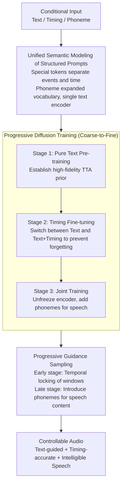

# ControlAudio: Tackling Text-Guided, Timing-Indicated and Intelligible Audio Generation via Progressive Diffusion Modeling

**Conference**: ACL 2026  
**arXiv**: [2510.08878](https://arxiv.org/abs/2510.08878)  
**Code**: [Project Page](https://control-audio.github.io/Control-Audio/)  
**Area**: Audio Generation  
**Keywords**: Text-to-audio, temporal control, intelligible speech, progressive diffusion, DiT  

## TL;DR

This paper proposes ControlAudio, a unified progressive diffusion modeling framework. Through a three-stage progressive training strategy (TTA pre-training → temporal control fine-tuning → joint timing and intelligible speech training) and progressive guidance sampling, it achieves text-guided, timing-indicated, and intelligible speech generation within a single diffusion model, significantly outperforming existing methods in temporal precision and speech clarity.

## Background & Motivation

**Background**: Text-to-Audio (TTA) generation has made significant progress using large-scale diffusion models. Recent research has begun exploring fine-grained control: one direction focuses on precise temporal control (e.g., "bird chirping, 2-5s"), while another focuses on intelligible speech generation (containing clear speech content within the audio).

**Limitations of Prior Work**: (1) Controllable TTA performance remains limited at scale due to the scarcity of large-scale annotated data containing both temporal markers and speech transcripts; (2) Prior work has not realized both temporal control and intelligible speech generation within a unified framework; (3) Adding fine-grained control signals often compromises generation quality under pure text conditions (catastrophic forgetting); (4) Natural language descriptions of complex multi-event scenes are often ambiguous.

**Key Challenge**: Controllable TTA must process conditional signals of multiple granularities (text → timing → phoneme), but the scale of training data varies significantly across these levels (millions of text-audio pairs vs. tens of thousands of timing-annotated samples). Direct joint training yields poor results.

**Goal**: To uniformly achieve text-guided, timing-indicated, and intelligible speech capabilities in a single diffusion model without sacrificing individual task performance.

**Key Insight**: Modeling controllable TTA as a multi-task learning problem using progressive diffusion modeling—adopting a coarse-to-fine progressive strategy across data construction, model training, and guided sampling.

**Core Idea**: Progressive modeling naturally aligns with the hierarchy of control granularity (text → timing → phoneme) and the coarse-to-fine nature of diffusion sampling—emphasizing coarse-grained temporal structure in early diffusion stages and introducing fine-grained phonemic content in later stages.

## Method

### Overall Architecture

ControlAudio integrates three control capabilities—text guidance, precise timing, and intelligible speech—into a single diffusion model. The primary challenge is the two-order-of-magnitude difference in training data scales. The solution embeds the "progressive" philosophy across three layers: first, pre-training a high-fidelity DiT on large-scale text-audio pairs to obtain a TTA prior; second, fine-tuning on timing-annotated data to add temporal control; and finally, unfreezing all modules for joint training on multi-source data to incorporate speech. During inference, coarse-to-fine sampling is employed: early diffusion stages use temporal conditions to lock time windows, while later stages introduce phoneme conditions to fill in speech content.

### Key Designs

**1. Unified Semantic Modeling for Structured Prompts: Handling Three Conditions with One Encoder**

Natural language descriptions of multi-event scenes are inherently ambiguous—"from 2 to 5" could refer to pitch or time. ControlAudio moves away from free-form text to a structured format with special tokens, explicitly separating event descriptions from precise timestamps (e.g., `<event>bird chirping<start>2.0<end>5.0`). Speech duration is defined by timing windows, and phoneme tokens are added to the text encoder's vocabulary. All granularities are unified in a single encoder, eliminating ambiguity and ensuring scalability without separate modules.

**2. Progressive Diffusion Training: Multi-stage Capability Stacking Without Degradation**

Direct joint training on all conditions fails due to data imbalance and task complexity. Training is thus split into three stages. Stage 1 uses text only to build a high-fidelity prior. Stage 2 fine-tunes on timing-annotated data while randomly switching between "pure text" and "text+timing" to prevent catastrophic forgetting. Stage 3 unfreezes the text encoder for joint optimization across text, timing, and phoneme conditions. This allows the model to establish control capabilities from coarse to fine systematically.

**3. Progressive Guidance Sampling: Aligning Condition Granularity with Diffusion Stages**

Diffusion sampling is a coarse-to-fine process—early steps determine macro structures while later steps refine details. Progressive Guidance Sampling aligns condition granularity with sampling stages: emphasizing temporal conditions early to lock windows, and introducing phonemes later to fill those windows with specific speech content. This design significantly outperforms fixed guidance strategies.

### Loss & Training

Standard conditional diffusion training objective (noise prediction). Data construction: Annotated data extracted from AudioSet-SL with speech segments transcribed via Gemini 2.5 Pro; simulated data combined from LibriTTS-R single/multi-speaker scenes mixed with non-speech backgrounds (SNR 2-10 dB), generating 171,246 complex audio scenes.

## Key Experimental Results

### Main Results

**Evaluation of Temporal Control on AudioCondition Test Set**

| Method | Eb ↑ | At ↑ | FAD ↓ | CLAP ↑ | Temporal (Subj) ↑ | OVL (Subj) ↑ |
|:---|:---:|:---:|:---:|:---:|:---:|:---:|
| Ground Truth | 43.37 | 67.53 | - | 0.377 | 4.52 | 4.48 |
| Stable Audio | 11.28 | 51.67 | 1.93 | 0.318 | 1.94 | 3.44 |
| PicoAudio | 29.96 | 57.70 | 3.43 | 0.296 | 2.70 | 2.44 |
| **Ours (ControlAudio)** | **38.50** | **67.87** | **0.98** | **0.347** | **4.01** | **3.74** |

### Ablation Study

**Ablation of Training Strategies**

| Configuration | At ↑ | FAD ↓ | Speech WER ↓ |
|:---|:---:|:---:|:---:|
| Stage 1 Only | Baseline | Baseline | N/A |
| + Stage 2 (Timing) | Significant Gain | Slight Drop | N/A |
| + Stage 3 (Timing+Speech) | Best | Best | **Best** |
| No Progressive Guidance | Drop | Increase | Increase |

### Key Findings

- ControlAudio approaches Ground Truth in temporal accuracy (At 67.87 vs 67.53), far exceeding other methods.
- Stage 3 joint training not only unlocks speech capabilities but also further improves temporal accuracy—likely due to timing-annotated speech data providing richer time-content alignment signals.
- Unfreezing the text encoder during joint optimization is critical for adapting conditional encoding to complex multi-objective tasks.
- Progressive Guidance Sampling significantly outperforms fixed guidance, as aligning condition granularity with sampling stages improves generation quality.
- CoT LLM planning can convert free-form text into structured prompts, extending practical use cases.

## Highlights & Insights

- The progressive design spans data → training → inference, forming a consistent coarse-to-fine paradigm.
- Structured prompts and phoneme expansion enable a single text encoder to handle three distinct conditions, avoiding multi-module complexity.
- The discovery that Stage 3 joint training improves timing accuracy is counter-intuitive and demonstrates positive transfer in multi-task learning.

## Limitations & Future Work

- The SNR range of simulated data (2-10 dB) may not cover all real-world scenarios.
- Control over speaker identity in speech generation has not yet been explored.
- Generation of long audio exceeding 10 seconds was not evaluated.
- Reliance on external LLMs to convert free text into structured prompts.

## Related Work & Insights

- **vs. PicoAudio/AudioComposer**: These focus only on temporal control without speech capabilities; ControlAudio is the first to unify both.
- **vs. VoiceLDM/VoiceDiT**: These focus on speech synthesis but lack temporal control for general audio events.
- **vs. Progressive Modeling in Video Gen**: ControlAudio is the first to introduce progressive modeling into the controllable TTA domain.

## Rating

- Novelty: ⭐⭐⭐⭐ Progressive diffusion modeling + Unified semantic encoding is a novel framework design.
- Experimental Thoroughness: ⭐⭐⭐⭐⭐ Comprehensive objective and subjective evaluations with thorough ablations.
- Writing Quality: ⭐⭐⭐⭐ Method is systematically described with sound motivation for the progressive design.
- Value: ⭐⭐⭐⭐ First to unify temporal control and intelligible speech, advancing controllable audio generation.

<!-- RELATED:START -->

## Related Papers

- [\[ICML 2025\] IMPACT: Iterative Mask-based Parallel Decoding for Text-to-Audio Generation with Diffusion Modeling](../../ICML2025/audio_speech/impact_iterative_mask-based_parallel_decoding_for_text-to-audio_generation_with_.md)
- [\[ACL 2026\] Omni-Embed-Audio: Leveraging Multimodal LLMs for Robust Audio-Text Retrieval](omni-embed-audio_leveraging_multimodal_llms_for_robust_audio-text_retrieval.md)
- [\[AAAI 2026\] Diff-V2M: A Hierarchical Conditional Diffusion Model with Explicit Rhythmic Modeling for Video-to-Music Generation](../../AAAI2026/audio_speech/diff-v2m_a_hierarchical_conditional_diffusion_model_with_explicit_rhythmic_model.md)
- [\[ICML 2026\] Towards Streaming Synchronized Spatial Audio Generation via Autoregressive Diffusion Transformer](../../ICML2026/audio_speech/towards_streaming_synchronized_spatial_audio_generation_via_autoregressive_diffu.md)
- [\[CVPR 2026\] Omni2Sound: Towards Unified Video-Text-to-Audio Generation](../../CVPR2026/audio_speech/omni2sound_towards_unified_video-text-to-audio_generation.md)

<!-- RELATED:END -->
