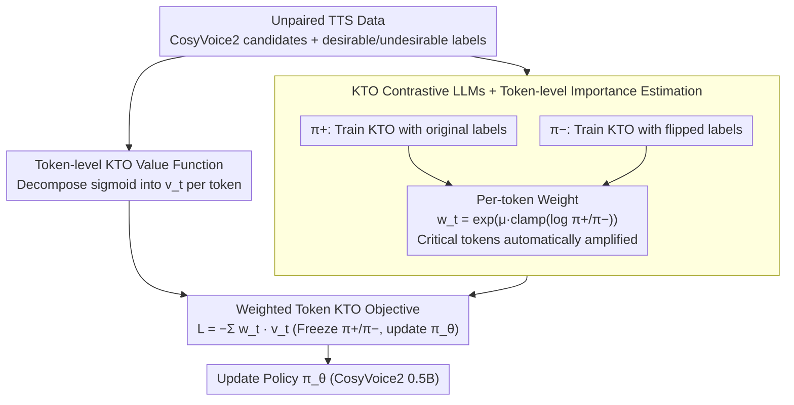

# Data-efficient Targeted Token-level Preference Optimization for LLM-based Text-to-Speech

**Conference**: ACL 2026  
**arXiv**: [2510.05799](https://arxiv.org/abs/2510.05799)  
**Code**: Not publicly disclosed in the paper (no repository link in the cache)  
**Area**: LLM Alignment / TTS / Preference Optimization  
**Keywords**: TKTO, KTO, Unpaired Preference, Token-level Reward, Japanese Ambiguous Pronunciation

## TL;DR
To address alignment challenges of ambiguous pronunciations in LLM-based TTS (e.g., the Japanese word "辛い" can be read as both "karai" and "tsurai"), the authors propose TKTO. This method first estimates the importance weight $w_t$ for each token using two contrastive KTO models trained with flipped labels, then decomposes the utterance-level KTO value function into token-level components for weighted aggregation. This achieves "no paired data required + automatic target token localization," improving Japanese pronunciation accuracy from 0.668 to 0.958 (+39%) and reducing CER by 54%.

## Background & Motivation
**Background**: LLM-based TTS systems (e.g., CosyVoice2, F5-TTS) increasingly adopt DPO-style preference optimization (Zhang et al. 2025, Tian et al. 2025) to improve intelligibility and speaker similarity, bypassing the rigid rules of traditional G2P converters.

**Limitations of Prior Work**: Two major bottlenecks exist for ambiguous pronunciation scenarios (Japanese "辛い," heteronyms, proper nouns): (i) **Requirement for paired data**: DPO requires pairs of "correct vs. incorrect" samples for the same sentence, but actual TTS outputs are often either "all correct" or "all incorrect." Statistics show 89.5% of sentences have only single-sided samples, while only 10.5% have complete pairs. (ii) **Utterance-level optimization**: Pronunciation issues are inherently char/token-level, yet DPO treats the entire utterance as a single label, diluting the target signal across hundreds of tokens.

**Key Challenge**: Fine-grained signals (should be token-level and support unpaired data) vs. existing preference optimization (utterance-level and mandatory pairing). The latter limits sample efficiency and alignment precision.

**Goal**: (i) Eliminate the paired data constraint to utilize more data; (ii) automatically identify "pronunciation-critical" tokens without token-level annotations and increase their weights.

**Key Insight**: The authors leverage KTO (Kahneman-Tversky Optimization), which natively supports unpaired data. By training two KTO models with flipped labels on the same data, the implicit reward of each token is differenced—a classic technique for token-level reward estimation using DPO/KTO formulations (Rafailov et al. 2024), here applied to "pre-estimate weights, then apply weighted KTO."

**Core Idea**: Estimate token-level rewards using a contrastive KTO pair ($\pi^+ / \pi^-$) $\to$ use the exponentiated reward as the token weight $\to$ apply this to a token-level KTO loss, concentrating alignment pressure on critical tokens end-to-end.

## Method

### Overall Architecture
LLM-based TTS struggle with alignment for ambiguous pronunciations because errors are token-level, yet 89.5% of real-world data consists of unpaired "all-correct" or "all-incorrect" samples. TKTO solves these points in two steps: Step 1 trains two contrastive KTO models $\pi^+$ (original labels) and $\pi^-$ (flipped desirable ↔ undesirable labels) on the same unpaired data to estimate importance weights $w_t$ via log-ratios, automatically localizing "pronunciation-deciding" tokens. Step 2 decomposes the global sigmoid value of KTO into token-level $v_t$ and uses $w_t$ for weighted summation to calculate the loss. The backbone is CosyVoice2 (0.5B), where only the preference optimization layer is trained while the vocoder remains frozen.

### Key Designs

**1. KTO Contrastive LLMs + Token-level Importance Estimation: Automatic identification of critical tokens without token-level labels**

Human annotation for token-level preferences is expensive, and paired data is scarce. TKTO trains two non-sharing models on the same data with flipped labels: $\pi^+$ uses original desirable/undesirable labels, while $\pi^-$ swaps them. For each generated token, the weight is calculated as $w_t = \exp\left(\mu\cdot \text{clamp}\left(\log\frac{\pi^+(y_t\mid x, y_{<t})}{\pi^-(y_t\mid x, y_{<t})}, L, U\right)\right)$, where $\mu>0$ for desirable samples and $\mu<0$ for undesirable samples. Intuitively, if a token has high probability under the positive model and low probability under the negative model, it is critical for distinguishing quality, and its weight is amplified. This distills a token-level reward from unpaired data without extra annotation. Empirically, for the character "辛", the desirable token reward is 0.22 (vs. sentence average 0.12), and the undesirable token reward is -1.54, resulting in a $12.8\times$ amplification.

**2. Token-level KTO Value Function: Decomposing sigmoid values from utterance to token level**

Original KTO applies a sigmoid after summing rewards across the utterance, which "averages then non-linearizes," potentially drowning critical token contributions. TKTO decomposes this: the reward for each token $y_t$ is $r_{\theta,t}(x,y)=\log\frac{\pi_\theta(y_t\mid x, y_{<t})}{\pi_{\text{ref}}(y_t\mid x, y_{<t})}$, with a reference baseline $z_{0,t}=\mathrm{KL}(\pi_\theta(\cdot\mid x,y_{<t})\|\pi_{\text{ref}}(\cdot\mid x,y_{<t}))$. The token-level value is $v_t = \lambda_D\sigma(\beta(r_{\theta,t}-z_{0,t}))$ for desirable samples and $v_t = \lambda_U\sigma(\beta(z_{0,t}-r_{\theta,t}))$ for undesirable samples. This allows the sigmoid to saturate independently at each position, preventing weak signals from diluting strong ones.

**3. Weighted Token KTO Objective: Integrating weights and values into a unified loss**

The final objective combines the steps: $\mathcal{L}_{\text{TKTO}} = \mathbb{E}_{(x,y)}\left[-\sum_{t=1}^{|y|} w_t \cdot v_t(x,y)\right]$. During forward passes, the contrastive LLMs are frozen to compute $w_t$, and only the policy $\pi_\theta$ is updated. This decouples importance estimation from preference optimization. Importance weights can be pre-cached (taking roughly 10 minutes on 8×A100), making the training a standard KTO variant with positional weighting.

### Loss & Training
Contrastive LLMs are trained using standard KTO. During the TKTO phase, contrastive models are frozen, and $w_t$ is pre-computed. The base model is CosyVoice2 (0.5B), pre-aligned on 20K hours of Japanese TTS. Data construction involves generating 10 candidates per text (5 male / 5 female), selecting the best (desirable) and worst (undesirable) based on pronunciation accuracy and CER (calculated via whisper-v3-large).

## Key Experimental Results

### Main Results
On a test set of 5,000 Japanese sentences containing "辛い", Acc (Target character accuracy), CER, and Bad (CER > 0.3) were reported for female and male speakers. Selected from Table 1:

| Model / Data Type | Female Acc ↑ | Female CER ↓ | Male Acc ↑ | Male CER ↓ |
|------------------|-----------:|----------:|-----------:|----------:|
| Base CosyVoice2 (Du et al. 2024) | 0.683 | 0.128 | 0.668 | 0.138 |
| SFT (desirable only) | 0.674 | 0.119 | 0.654 | 0.130 |
| DPO (paired) | 0.706 | 0.120 | 0.693 | 0.130 |
| KTO (paired) | 0.654 | 0.066 | 0.651 | 0.074 |
| KTO (unpaired) | 0.933 | 0.079 | 0.952 | 0.087 |
| **TKTO (paired)** | 0.681 | 0.059 | 0.701 | 0.066 |
| **TKTO (unpaired)** | **0.949** | **0.075** | **0.958** | 0.085 |
| F5-TTS / F5-TTS+G2P (Ref) | 0.498–0.500 | 0.136–0.177 | 0.500 | 0.146–0.177 |
| gpt-4o-mini-tts (Strong Baseline) | 0.900 | 0.109 | 0.939 | 0.111 |

TKTO (unpaired) achieves the highest Acc and competitive CER, outperforming closed-source industrial models like gpt-4o-mini-tts and gemini-2.5-pro-preview-tts.

### Ablation Study

| Configuration | Acc / CER Trend | Description |
|------|----------------|------|
| TKTO (unpaired) | 0.949 / 0.075 (F), 0.958 / 0.085 (M) | Full method |
| TKTO (paired, 10.5% data) | 0.681 / 0.059, 0.701 / 0.066 | Matches DPO Acc despite 6× less data |
| KTO (unpaired, no weights) | 0.933 / 0.079, 0.952 / 0.087 | Token weighting adds +1.6 / +0.6 pt Acc |
| KTO (paired) | 0.654 / 0.066, 0.651 / 0.074 | Data scarcity leads to lower Acc than base |
| SFT desirable-only | 0.674 / 0.119, 0.654 / 0.130 | No improvement in CER without contrast |

Subjective NMOS (Table 2): Base 4.09 < KTO 4.17 < TKTO 4.21. ABX preference tests also favor TKTO.

### Key Findings
- **Token weighting is more valuable than data volume**: Adding token weights to the same unpaired data improves Acc by 0.6–1.6 pt over vanilla KTO. Directing gradients to "pronunciation-deciding tokens" provides stable gains.
- **Training dynamics**: TKTO only increases the log-likelihood of desirable tokens (Figure 3), whereas SFT unintentionally increases the likelihood of undesirable tokens as well. TKTO gradients are more focused and safer.
- **Automatic localization**: Without explicit labeling of the target character "辛", the attribution system reached $12.8\times$ average weight at that position. Case studies show other characters remain near $1.0$, proving $\pi^+/\pi^-$ differences provide implicit token attribution.
- **Paired data bottleneck**: DPO is restricted to 1.5K paired samples, whereas KTO/TKTO (unpaired) utilizes 9K samples. This $6\times$ data dividend manifests as a jump from 0.668 to 0.958 in Acc.

## Highlights & Insights
- The "flipped-label second model for log-ratio token rewards" trick is elegantly simple: it requires no manual token preferences or external reward models, fully exploiting KTO's implicit reward properties.
- Decoupling "importance estimation" from "preference optimization" makes the method orthogonal to downstream PO algorithms; $w_t$ could potentially be combined with DPO, IPO, or ORPO.
- In TTS, where G2P has long dominated, this method allows the LLM to learn which characters are error-prone and weight them accordingly. This self-attributed curriculum has potential in other "local-determines-global" tasks like OCR or code generation.

## Limitations & Future Work
- Evaluation is limited to Japanese, one target character ("辛"), 5,000 sentences, and three annotators; multilingual and multi-ambiguity generalization is needed.
- The contrastive assumption relies on distinguishable desirable/undesirable boundaries; if candidates are too similar, $\pi^-$ might not learn a stable signal. Hyperparameters like $clamp$ and $\mu$ require manual tuning.
- Only the TTS decoder is tuned; vocoder and text G2P are not part of the end-to-end optimization, potentially leaving G2P biases.
- Subjective blind tests (NMOS/ABX) did not include gpt-4o-mini-tts.

## Related Work & Insights
- **vs. DPO (Tian et al. 2025)**: Also performs TTS preference optimization but requires pairing, resulting in 1/6 the data efficiency. TKTO performs similarly or better in paired settings and far exceeds DPO in unpaired settings.
- **vs. vanilla KTO (Ethayarajh et al. 2024)**: Only operates at the utterance level. TKTO improves Acc by 1–2 pt using the same unpaired data by introducing token-level decomposition and weights.
- **vs. G2P-based Hard Rules (Oura et al. 2010 + F5-TTS)**: Even with G2P, F5-TTS Acc remains at 0.500 (dictionaries cannot disambiguate polysemic Kanji); TKTO learns disambiguation within the LLM context.
- **vs. Liu et al. 2025 (Token-level importance sampling)**: Similar log-ratio reward idea, but TKTO utilizes the KTO framework which fits the unpaired reality of TTS data better.

## Rating
- Novelty: ⭐⭐⭐⭐ Contrastive KTO for token attribution + two-stage weighted KTO is a simple yet systematic first for TTS.
- Experimental Thoroughness: ⭐⭐⭐ Objective and subjective metrics used, though multilingual extension is missing. Ablations cover key variables.
- Writing Quality: ⭐⭐⭐⭐ Clear derivations and intuitive case studies.
- Value: ⭐⭐⭐⭐ 6× data dividend and 39% accuracy improvement offer direct industrial utility for TTS alignment.

<!-- RELATED:START -->

## Related Papers

- [\[ACL 2026\] Semi-Supervised Diseased Detection from Speech Dialogues with Multi-Level Data Modeling](semi-supervised_diseased_detection_from_speech_dialogues_with_multi-level_data_m.md)
- [\[ICLR 2026\] AVERE: Improving Audiovisual Emotion Reasoning with Preference Optimization](../../ICLR2026/audio_speech/avere_improving_audiovisual_emotion_reasoning_with_preference_optimization.md)
- [\[ACL 2025\] Spark-TTS: An Efficient LLM-Based Text-to-Speech Model with Single-Stream Decoupled Speech Tokens](../../ACL2025/audio_speech/spark-tts_an_efficient_llm-based_text-to-speech_model_with_single-stream_decoupl.md)
- [\[ICML 2026\] Sparse Tokens Suffice: Jailbreaking Audio Language Models via Token-Aware Gradient Optimization](../../ICML2026/audio_speech/sparse_tokens_suffice_jailbreaking_audio_language_models_via_token-aware_gradien.md)
- [\[ICLR 2026\] VowelPrompt: Hearing Speech Emotions from Text via Vowel-level Prosodic Augmentation](../../ICLR2026/audio_speech/vowelprompt_hearing_speech_emotions_from_text_via_vowel-level_prosodic_augmentat.md)

<!-- RELATED:END -->
