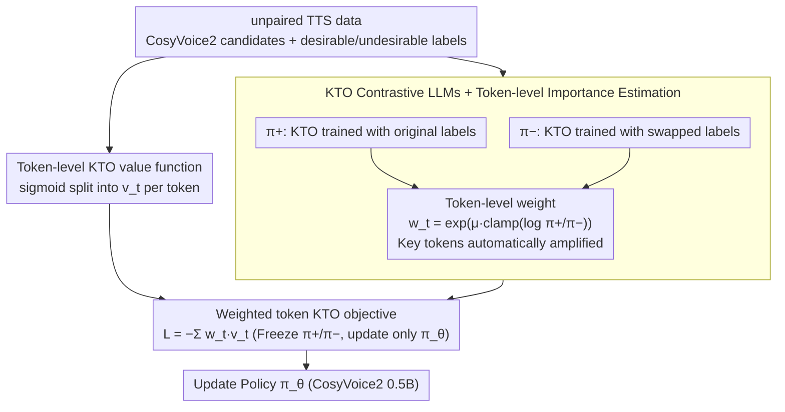

# Data-efficient Targeted Token-level Preference Optimization for LLM-based Text-to-Speech

**Conference**: ACL 2026  
**arXiv**: [2510.05799](https://arxiv.org/abs/2510.05799)  
**Code**: No public disclosure in the paper (no repository link provided in cache)  
**Area**: LLM Alignment / TTS / Preference Optimization  
**Keywords**: TKTO, KTO, Unpaired Preference, token-level reward, Japanese ambiguous pronunciation

## TL;DR
To address the challenge of aligning ambiguous pronunciations in LLM-based TTS (e.g., the Japanese word "karai/tsurai" can be read as both *karai* and *tsurai*), the authors propose TKTO. This method first estimates the importance weight $w_t$ for each token using two contrastive KTO models trained with swapped labels. It then decomposes the utterance-level value function of KTO into token-level components and aggregates them with weights. This achieves both "no paired data required" and "automatic targeting of objective tokens," increasing Japanese pronunciation accuracy from 0.668 to 0.958 (+39%) and reducing CER by 54%.

## Background & Motivation
**Background**: LLM-based TTS (e.g., CosyVoice2, F5-TTS) has widely adopted DPO-series preference optimization (Zhang et al. 2025, Tian et al. 2025) to improve intelligibility and speaker similarity, bypassing the rigid rules of traditional G2P converters.

**Limitations of Prior Work**: There are two major bottlenecks for ambiguous pronunciation scenarios (e.g., Japanese *karai/tsurai*, kanji heteronyms, names of people and places): (i) **Requirement for paired data**: DPO requires the simultaneous existence of "correct pronunciation + incorrect pronunciation" samples for the same sentence. However, actual TTS outputs are often "entirely correct" or "entirely incorrect." Paper statistics show that 89.5% of sentences have only single-sided samples, while only 10.5% have complete pairs; (ii) **Utterance-level optimization**: Pronunciation issues are inherently char/token-level, but DPO treats the entire utterance as a single label, diluting the target signal across hundreds of tokens.

**Key Challenge**: Fine-grained signals (should be at the token level and usable with unpaired data) vs. existing preference optimizations (utterance-level + mandatory pairing). The latter directly limits sample efficiency and alignment precision.

**Goal**: (i) Eliminate pairing constraints to utilize more data; (ii) Automatically identify tokens that "truly determine pronunciation correctness" without token labeling and increase their weights.

**Key Insight**: The authors leverage KTO (Kahneman-Tversky Optimization), which naturally supports unpaired data. They then use the difference between "two KTO models trained on the same data with opposite labels" to estimate implicit token-level rewards—a classic approach for token-level reward estimation using DPO/KTO formulas (Rafailov et al. 2024), but applied here to "estimate weights first, then apply weighted KTO."

**Core Idea**: Estimate token-level rewards using a KTO contrastive pair ($\pi^+ / \pi^-$) → Use the exponentiated rewards as token weights → Apply them to a token-level KTO loss to concentrate alignment pressure on critical tokens end-to-end.

## Method

### Overall Architecture
LLM-based TTS systems struggle with alignment when encountering ambiguous pronunciations (e.g., *karai/tsurai* can be *karai* or *tsurai*). This is due to two factors: pronunciation errors are token-level, yet 89.5% of real-world data consists of single-sided "all-correct" or "all-incorrect" samples that cannot be paired. TKTO solves these pain points in two steps: Step 1 trains two contrastive KTO models, $\pi^+$ (original labels) and $\pi^-$ (desirable ↔ undesirable swapped), on the same unpaired data. The log-ratio of the two is used to estimate the importance weight $w_t$ for each token, automatically locating tokens that "truly decide pronunciation correctness." Step 2 decomposes the original utterance-level sigmoid value of KTO into token-level $v_t$, which are then weighted by $w_t$ and summed as the loss. The base model is CosyVoice2 (0.5B), with only the preference optimization layer trained, leaving the vocoder untouched.

### Key Designs

**1. KTO Contrastive LLM + Token-level Importance Estimation: Automatically identifying critical tokens deciding quality without token labeling**

Manual token-level preference labeling is extremely costly, and paired data is scarce. TKTO's solution is to train two models with non-shared parameters on the "same data with flipped labels": $\pi^+$ uses the original desirable/undesirable labels, while $\pi^-$ swaps them. For each generated token, the weight is calculated as $w_t = \exp\left(\mu\cdot \text{clamp}\left(\log\frac{\pi^+(y_t\mid x, y_{<t})}{\pi^-(y_t\mid x, y_{<t})}, L, U\right)\right)$, where $\mu>0$ for desirable samples and $\mu<0$ for undesirable samples, and $[L,U]$ is the clipping range. The intuition is clear: if a token has a high probability under the positive model and a low probability under the negative model, it is critical for distinguishing quality, and its weight is amplified. If probabilities are similar, it is irrelevant to preference and the weight approaches 1. This effectively distills a token-level reward using contrastive KTO in an unpaired setting without additional labeling. Tests show that for the target character "karai/tsurai", the reward for desirable tokens is 0.22 (higher than the sentence average of 0.12), and -1.54 for undesirable tokens, resulting in a 12.8× automatic amplification.

**2. Token-level KTO Value Function: Splitting sigmoid values from the utterance level to each token**

Original KTO applies sigmoid after summing rewards at the utterance level, which is equivalent to "averaging before non-linearity." This drowns out the contribution of critical tokens among hundreds of irrelevant ones. TKTO decomposes this: the reward for each token $y_t$ is $r_{\theta,t}(x,y)=\log\frac{\pi_\theta(y_t\mid x, y_{<t})}{\pi_{\text{ref}}(y_t\mid x, y_{<t})}$, with the reference baseline $z_{0,t}=\mathrm{KL}(\pi_\theta(\cdot\mid x,y_{<t})\|\pi_{\text{ref}}(\cdot\mid x,y_{<t}))$ (estimated per microbatch without backpropagation). The token-level value is $v_t = \lambda_D\sigma(\beta(r_{\theta,t}-z_{0,t}))$ for desirable samples and $v_t = \lambda_U\sigma(\beta(z_{0,t}-r_{\theta,t}))$ for undesirable samples. This allows the sigmoid to saturate independently at each position, preventing strong signals from being smoothed out by weak ones.

**3. Weighted Token KTO Objective: Combining weights and values into a unified summation loss for end-to-end training**

The final objective combines the previous steps: $\mathcal{L}_{\text{TKTO}} = \mathbb{E}_{(x,y)}\left[-\sum_{t=1}^{|y|} w_t \cdot v_t(x,y)\right]$. During the forward pass, the two contrastive LLMs are frozen and used only to calculate $w_t$; in the backward pass, only the policy $\pi_\theta$ is updated. This completely decouples "importance estimation" from "preference optimization"—the former is pre-calculated once (taking 10 minutes on 8×A100), while the latter is a standard KTO with an additional positional weight. This minimal change accurately concentrates alignment pressure on key tokens.

### Loss & Training
Standard KTO is used for training contrastive LLMs. In the TKTO stage, contrastive models are frozen, and $w_t$ is pre-cached. The base model is CosyVoice2 (0.5B), fine-tuned on 20K hours of Japanese TTS. For data construction, 5 male and 5 female candidates are generated per text. Desirable and undesirable samples are selected based on pronunciation accuracy and CER (calculated using whisper-v3-large).

## Key Experimental Results

### Main Results
A test set of 5,000 Japanese sentences containing the ambiguous word *karai/tsurai* was used. Acc (accuracy of the target character pronunciation), CER, and Bad (ratio of CER > 0.3) are reported for female and male speakers. Selected from Table 1:

| Model / Data Setup | Female Acc ↑ | Female CER ↓ | Male Acc ↑ | Male CER ↓ |
|------------------|-----------:|----------:|-----------:|----------:|
| Base CosyVoice2 (Du et al. 2024) | 0.683 | 0.128 | 0.668 | 0.138 |
| SFT (desirable only) | 0.674 | 0.119 | 0.654 | 0.130 |
| DPO (paired) | 0.706 | 0.120 | 0.693 | 0.130 |
| KTO (paired) | 0.654 | 0.066 | 0.651 | 0.074 |
| KTO (unpaired) | 0.933 | 0.079 | 0.952 | 0.087 |
| **TKTO (paired)** | 0.681 | 0.059 | 0.701 | 0.066 |
| **TKTO (unpaired)** | **0.949** | **0.075** | **0.958** | 0.085 |
| F5-TTS / F5-TTS+G2P (non-LLM ref) | 0.498–0.500 | 0.136–0.177 | 0.500 | 0.146–0.177 |
| gpt-4o-mini-tts (strong industry baseline) | 0.900 | 0.109 | 0.939 | 0.111 |

TKTO unpaired achieves a new state-of-the-art in both Acc and CER, outperforming closed-source industrial models like gpt-4o-mini-tts and gemini-2.5-pro-preview-tts on both metrics.

### Ablation Study

| Configuration | Acc / CER Trend | Description |
|------|----------------|------|
| TKTO (unpaired) | 0.949 / 0.075 (F), 0.958 / 0.085 (M) | Full method |
| TKTO (paired, 10.5% data) | 0.681 / 0.059, 0.701 / 0.066 | Matches DPO Acc despite 6× less data |
| KTO (unpaired, no token weighting) | 0.933 / 0.079, 0.952 / 0.087 | Token-level weighting contributes +1.6 / +0.6 pt Acc |
| KTO (paired) | 0.654 / 0.066, 0.651 / 0.074 | Scarcity of paired data leads to lower Acc than base |
| SFT desirable-only | 0.674 / 0.119, 0.654 / 0.130 | No improvement in CER without contrastive signals |

NMOS subjective scores (Table 2): Base 4.09 < KTO 4.17 < TKTO 4.21. ABX preference tests (Figure 6) also favor TKTO.

### Key Findings
- **Token-level weighting is more valuable than changing data**: Under identical unpaired data, adding token weights improves Acc by 0.6–1.6 pt over vanilla KTO and reduces CER. Directing weights to "decisive tokens" consistently improves performance even at the same data scale.
- **Training dynamics**: TKTO only increases the log-likelihood of desirable tokens (Figure 3), whereas SFT increases the likelihood for undesirable tokens as well. This indicates that TKTO gradients are more focused and safer.
- **Token weights automatically locate target characters**: Without being told that the target kanji is critical, the model assigns an average weight at that position 12.8× the sentence average. Case studies show weights for other kanji near 1, proving $\pi^+/\pi^-$ effectively performs implicit token attribution.
- **Paired data as a bottleneck**: DPO can only use 1.5K pairs, whereas KTO/TKTO unpaired can utilize 9K. This 6× data dividend is directly reflected in the Acc jump from 0.668 to 0.958.

## Highlights & Insights
- "Training a second model with flipped labels and using the log-ratio as token reward" is a simple and elegant trick: it requires no manual token labels or external reward models, fully exploiting KTO's implicit reward properties.
- Decoupling "weight estimation" from "preference optimization" makes the method orthogonal to downstream PO algorithms. $w_t$ can potentially be applied to DPO, IPO, or ORPO for similar token-level extensions.
- In TTS, where G2P has long dominated, this method "lets the LLM learn which characters are most prone to error and weights them in training." This self-attributed curriculum concept has transfer potential in any task where local outputs determine global quality (e.g., speech, OCR, code).

## Limitations & Future Work
- Evaluation is limited to Japanese, one target character (*karai/tsurai*), 5,000 sentences, and three annotators; it lacks generalization testing across multiple languages or ambiguous characters.
- Contrastive LLM training assumes "same data, flipped labels"; when desirable/undesirable boundaries are blurred (e.g., candidates are similar), $\pi^-$ may fail to learn stable signals. Calibration of clamp $[L,U]$ and $\mu$ relies on manual tuning.
- The full process only tunes the TTS decoder without end-to-end optimization of the vocoder or text G2P, possibly leaving residual biases from upstream G2P.
- NMOS and ABX only compared Base/KTO/TKTO, lacking subjective blind tests against gpt-4o-mini-tts and other closed-source models.

## Related Work & Insights
- **vs DPO (Tian et al. 2025)**: Also performs TTS preference optimization but requires pairing, resulting in only 1/6 the data efficiency of TKTO. TKTO matches/slightly exceeds DPO in paired settings and significantly leads in unpaired settings.
- **vs vanilla KTO (Ethayarajh et al. 2024)**: Only calculates value at the utterance level. TKTO improves Acc by 1–2 pt on the same unpaired data through token-level decomposition and learned weights.
- **vs G2P rule-based solutions (Oura et al. 2010 + F5-TTS)**: Even with G2P, F5-TTS Acc is only 0.500, indicating dictionaries cannot disambiguate polysemic kanji. TKTO learns disambiguation within the LLM context.
- **vs Liu et al. 2025 (token-level importance sampling)**: Similar log-ratio approach for token rewards, but this paper uses the KTO framework with $\pi^\pm$, fitting the unpaired reality of TTS data better.

## Rating
- Novelty: ⭐⭐⭐⭐ Contrastive KTO for token attribution combined with two-stage weighted KTO is simple but systematically applied to TTS for the first time.
- Experimental Thoroughness: ⭐⭐⭐ Includes objective and subjective evaluations, though lacks multi-lingual expansion. Ablations cover key variables.
- Writing Quality: ⭐⭐⭐⭐ Clear formula derivations and intuitive case studies.
- Value: ⭐⭐⭐⭐ 6× data advancement and 39% accuracy improvement provide direct reference value for industrial TTS alignment.

<!-- RELATED:START -->

## Related Papers

- [\[ACL 2026\] Semi-Supervised Diseased Detection from Speech Dialogues with Multi-Level Data Modeling](semi-supervised_diseased_detection_from_speech_dialogues_with_multi-level_data_m.md)
- [\[ICLR 2026\] AVERE: Improving Audiovisual Emotion Reasoning with Preference Optimization](../../ICLR2026/audio_speech/avere_improving_audiovisual_emotion_reasoning_with_preference_optimization.md)
- [\[ICLR 2026\] TangoFlux: Super-Fast and Faithful Text-to-Audio Generation with Flow Matching and CLAP-Ranked Preference Optimization](../../ICLR2026/audio_speech/tangoflux_super_fast_and_faithful_text_to_audio_generation_with_flow_matching_an.md)
- [\[ACL 2025\] Spark-TTS: An Efficient LLM-Based Text-to-Speech Model with Single-Stream Decoupled Speech Tokens](../../ACL2025/audio_speech/spark-tts_an_efficient_llm-based_text-to-speech_model_with_single-stream_decoupl.md)
- [\[ICML 2026\] Sparse Tokens Suffice: Jailbreaking Audio Language Models via Token-Aware Gradient Optimization](../../ICML2026/audio_speech/sparse_tokens_suffice_jailbreaking_audio_language_models_via_token-aware_gradien.md)

<!-- RELATED:END -->
