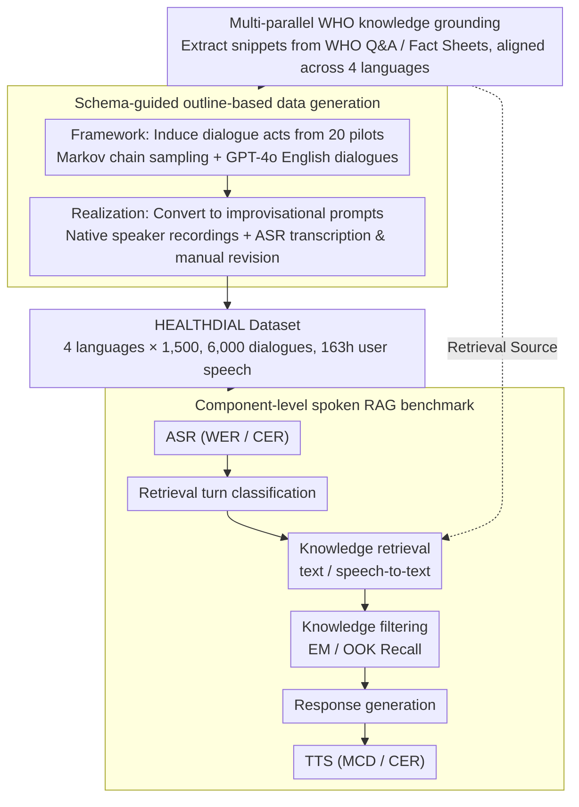

# Dial HEALTHDIAL for Advice: A Multilingual and Multi-Parallel Spoken Dialogue Dataset for Knowledge-Grounded Information Seeking

**Conference**: ACL2026 Findings  
**arXiv**: [2605.30107](https://arxiv.org/abs/2605.30107)  
**Code**: https://github.com/cambridgeltl/healthdial  
**Area**: Spoken Dialogue / Multilingual RAG  
**Keywords**: spoken dialogue, multilingual benchmark, health RAG, WHO knowledge, ASR

## TL;DR
HEALTHDIAL constructs a dataset comprising 6,000 multi-parallel health information-seeking dialogues in 4 official WHO languages and 163 hours of real user speech. It establishes a multilingual spoken RAG benchmark based on ASR, TTS, retrieval, knowledge filtering, and user studies.

## Background & Motivation
**Background**: Most dialogue system research remains text-centric. Even when speech is supported, modular pipelines (ASR → Text Dialogue Model → TTS) are typically adopted. Existing multilingual dialogue datasets usually cover tourism, daily conversation, or task-oriented text, but lack support for real speech, knowledge grounding, multi-parallel structures, and speaker metadata.

**Limitations of Prior Work**: While speech is the most natural form of human communication, constructing speech-first dialogue datasets involves high costs, privacy risks, and difficulties in naturally collecting cross-lingual parallel data. The health domain is particularly sensitive: consulting real patients involves personal health information (PHI), making direct collection risky. Without high-quality spoken dialogue data, it is difficult to evaluate future speech-native or multilingual RAG systems.

**Key Challenge**: The research community requires realistic and natural multilingual spoken dialogue data, but real health consultation data cannot be easily publicized. Fully machine-generated dialogues tend to be repetitive and lack natural oral variation, while pure translation results in "translationese," undermining the naturalness of each language.

**Goal**: The authors aim to construct a dataset that is multilingual, multi-parallel, and knowledge-grounded, while including real user speech and sociolinguistic variables of speakers. They also provide baselines, a prototype system, and a reusable data collection toolkit.

**Key Insight**: The paper adopts a bottom-up, outline-based approach for data collection. It first uses WHO knowledge to build a controlled knowledge base, then uses pilot dialogues and Markov chains to generate dialogue schemas. Native speakers then naturally realize user utterances based on improvisational prompts rather than simply reading or translating LLM outputs.

**Core Idea**: Differentiate content control from linguistic naturalness: use LLMs and schemas to control dialogue structure and knowledge grounding, while employing native speakers for natural oral expression and recording.

## Method

### Overall Architecture
HEALTHDIAL serves as both a dataset and a benchmark. To address the privacy concerns of real health consultations and the lack of naturalness in LLM-generated speech, the system separates "content control" from "linguistic naturalness." It first controls structure and grounding via WHO knowledge and dialogue schemas, and then native speakers realize and record these frameworks into their native dialects. Data collection follows four steps: extracting knowledge snippets from WHO Q&A and Fact Sheets with parallel tagging; inducing dialogue acts from 20 pilot text consultations; sampling dialogue frameworks via Markov chains and filling them with hypothetical English dialogues using GPT-4o; and finally converting these into improvisational prompts for native speakers of four languages to perform recording and transcription. The final dataset covers Arabic, Chinese, English, and Spanish (1,500 dialogues each), totaling 6,000 dialogues, 41,988 turns, ~163 hours of user speech, and 208 hours of system speech. Each system turn is explicitly linked to a WHO knowledge snippet with retrieval labels. For the benchmark, current user speech with history passes through six components: ASR, retrieval turn classification, knowledge retrieval, knowledge filtering, response generation, and TTS.

### Key Designs

**1. Multi-parallel WHO knowledge grounding: Locking responses to traceable authoritative knowledge**
In health dialogues, unconstrained parametric knowledge in models risks producing unverifiable or dangerous suggestions. HEALTHDIAL constrains all system responses to a controlled knowledge base: all snippets originate from WHO Q&A and Fact Sheets, totaling 12,045 entries. Among these, 1,618 snippets are fully parallel across four languages, aligned via parallel identifiers. This design provides an operational definition of hallucination—any response unsupported by the knowledge base is an extrinsic hallucination—and allows for explicit evaluation of out-of-knowledge (OOK) scenarios.

**2. Schema-guided outline-based data generation: Building the skeleton before adding the flesh**
End-to-end LLM generation often lacks variety, and machine translation introduces translationese. The authors use a bottom-up outline method: 11 categories of dialogue acts are induced from 20 pilot dialogues; a first-order Markov chain samples 1,500 act sequences as frameworks; GPT-4o generates hypothetical English dialogues based on WHO snippets. Crucially, user utterances are converted into improvisational prompts for native speakers to speak naturally, record, and transcribe, rather than reading a script.

**3. Component-level spoken RAG benchmark: Diagnosing failures module by module**
Since current speech-native models are not yet stable, end-to-end scores are difficult to interpret. HEALTHDIAL customizes metrics for each stage: WER/CER for ASR, MCD and ASR-based CER for TTS, and accuracy for retrieval turn classification. Knowledge retrieval includes both text-to-text and speech-to-text, while knowledge filtering uses Exact Match (EM) and OOK Recall to judge which of the top-5 retrieved snippets actually support the response.

### Loss & Training
The paper focuses on the dataset and benchmark rather than new loss functions. It provides baseline comparisons for each component. Retrieval turn classification compares fine-tuned XLM-R_large and LLaMA3.1-8B-Inst (10-shot). Knowledge retrieval evaluates text-embedding-3L, gte-multilingual-B, MiniLM-L12-v2, NV-Embed-v2, BM25, and speech-to-text encoders like CLAP and SpeechT5. Knowledge filtering compares fixed thresholds, GPT-4.1-nano, LLaMA3.1-8B-Inst, and OpenAI GPT models. TTS uses gpt-4o-mini-tts, conditioned on speaker variables such as age, primary language, and education level.

## Key Experimental Results

### Main Results

| Language | ASR WER ↓ | ASR CER ↓ | TTS MCD ↓ | TTS CER ↓ | Turn Cls. Acc. ↑ | R@10 (Text) ↑ | R@10 (Speech) ↑ | Filtering EM ↑ | OOK Recall ↑ |
|--------|------|------|------|------|------|------|------|------|------|
| Arabic | 0.23 | 0.07 | 12.08 | 0.10 | 95.39 | 65.88 | 0.20 | 34.27 | 0.00 |
| Chinese | 0.24 | 0.14 | 11.46 | 0.17 | 95.23 | 70.63 | 0.23 | 39.19 | 14.29 |
| English | 0.03 | 0.01 | 11.44 | 0.06 | 96.30 | 75.72 | 0.52 | 44.29 | 42.86 |
| Spanish | 0.02 | 0.01 | 10.84 | 0.07 | 95.93 | 71.82 | 0.42 | 39.54 | 14.29 |
| Average | 0.13 | 0.06 | 11.46 | 0.10 | 95.71 | 71.01 | 0.34 | 39.32 | 17.36 |

### Ablation Study

| Knowledge Filtering Method | Arabic EM | Chinese EM | English EM | Spanish EM | Average EM | Description |
|------|---------|------|------|------|------|------|
| Threshold | 6.26 | 6.61 | 6.88 | 6.46 | 6.55 | Fixed similarity threshold; very low performance |
| LLM @ Top-5 | 19.96 | 19.86 | 23.02 | 21.09 | 21.05 | GPT-4.1-nano filtering from Top-5; best on average |
| LLM @ Top-10 | 12.58 | 17.15 | 23.33 | 19.55 | 18.15 | Increased candidates lead to more distraction |
| LLM @ Top-50 | 10.85 | 12.28 | 18.72 | 11.03 | 13.72 | Long candidate lists significantly hurt accuracy |

### Key Findings
- ASR is strong for English and Spanish, but significantly more difficult for Arabic and Chinese (WER: Arabic 0.23, Chinese 0.24 vs. English 0.03, Spanish 0.02).
- Text-to-text retrieval far outperforms speech-to-text retrieval. Average R@10(Text) is 71.01, while R@10(Speech) is only 0.34, suggesting cross-modal speech-text retrieval is currently nearly unusable.
- Retrieval turn classification is relatively simple, with accuracy around 95% across all languages, partly because 75.5% of turns require retrieval.
- Knowledge filtering is a high-value bottleneck. Even with GPT-4.1-nano on top-5 candidates, average EM is only 21.05; expanding to top-50 drops EM to 13.72.
- English performs best across multiple components while Arabic reflects the weakest performance, even in a fully parallel setting, indicating systematic performance gaps in model capabilities.

## Highlights & Insights
- HEALTHDIAL's data design is meticulous, simultaneously addressing multilingualism, parallel structure, knowledge grounding, real speech, and OOK scenarios.
- Skeleton-based collection is a methodological highlight, bypassing patient privacy while avoiding the robotic nature of pure LLM generation.
- Component-level benchmarking is practical, acknowledging that current speech-native models are unstable and diagnosing failures across ASR, retrieval, filtering, and TTS.
- A critical insight from the knowledge filtering experiment is that "more is not always better": providing too many retrieved snippets (top-50) significantly degrades LLM filtering accuracy due to distraction.

## Limitations & Future Work
- HEALTHDIAL content is assisted by LLMs and not verified by medical experts; it should be used for linguistics and RAG research, not clinical advice.
- While WHO knowledge ensures authority, it lacks local cultural adaptation. Future work should involve medical and cultural experts to supplement regional health practices.
- The benchmark currently relies on a pipeline architecture. While useful for diagnosis, it does not fully represent future speech-native end-to-end systems.
- User studies were limited to 25 English-proficient participants; large-scale multilingual assessment of usability, trust, and satisfaction remains future work.

## Related Work & Insights
- **vs MultiWOZ / Multi3WOZ**: These focus on text; HEALTHDIAL adds real user speech, health knowledge grounding, and sociolinguistic variables.
- **vs MedDialog / Medical Forum Data**: Real forum data is noisier and has privacy issues. HEALTHDIAL sacrifices clinical "realism" for public availability, parallelism, and controlled grounding.
- **vs Common Voice / Switchboard**: While these have speaker metadata, they lack knowledge-grounded multi-turn health dialogues.
- **vs RAG benchmarks**: Traditional benchmarks are text-based; HEALTHDIAL integrates spoken input, turn classification, and knowledge filtering into the evaluation system.

## Rating
- Novelty: ⭐⭐⭐⭐⭐ 
- Experimental Thoroughness: ⭐⭐⭐⭐☆ 
- Writing Quality: ⭐⭐⭐⭐⭐ 
- Value: ⭐⭐⭐⭐⭐ 

<!-- RELATED:START -->

## Related Papers

- [\[ACL 2026\] VoxMind: An End-to-End Agentic Spoken Dialogue System](voxmind_an_end-to-end_agentic_spoken_dialogue_system.md)
- [\[ACL 2026\] SDiaReward: Modeling and Benchmarking Spoken Dialogue Rewards with Modality and Colloquialness](sdiareward_modeling_and_benchmarking_spoken_dialogue_rewards_with_modality_and_c.md)
- [\[ACL 2026\] ZipVoice-Dialog: Non-Autoregressive Spoken Dialogue Generation with Flow Matching](zipvoice-dialog_non-autoregressive_spoken_dialogue_generation_with_flow_matching.md)
- [\[ICML 2025\] Aligning Spoken Dialogue Models from User Interactions](../../ICML2025/audio_speech/aligning_spoken_dialogue_models_from_user_interactions.md)
- [\[ACL 2025\] WavRAG: Audio-Integrated Retrieval Augmented Generation for Spoken Dialogue Models](../../ACL2025/audio_speech/wavrag_audio-integrated_retrieval_augmented_generation_for_spoken_dialogue_model.md)

<!-- RELATED:END -->
